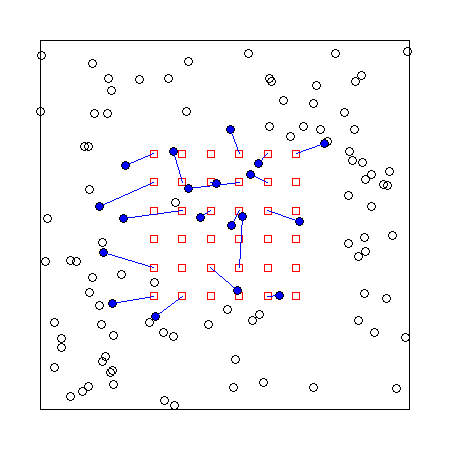

# (PART\*) Introduction to SECR {-}

# Concepts and terminology {#Basics}

```{r, file = "commoncode.R", echo = FALSE, warning=FALSE, message = FALSE, results="hide"}
# startup code, including library(secr) etc.
```

This chapter briefly introduces the concepts and terminology of SECR. The following chapter provides a [simple example](#Example), and the [Theory] chapter provides technical details. 

## Spatial population

An animal population in SECR is a spatial point pattern, where each point 
represents the location of an animal's activity centre\index{Activity centre}[^footnote2a]. 
Density is a property of the spatial point process of which the pattern is one instance. The usual process model is a 2-dimensional Poisson process\index{Poisson process (2-D)} (Fig.  \@ref(fig:example)). By fitting the SECR model we can estimate the intensity surface of the Poisson process that we represent by $D(\vec x)$ where $\vec x$ stands for the x,y coordinates of a point. The surface may be *homogeneous* (flat, with constant $D(\vec x)$) or *inhomogeneous* (varying). 

The intensity surface is better represented as depending on a vector of parameters $\phi$, hence $D(\vec x; \phi)$. For constant density $\phi$ is a single value.

[^footnote2a]: 'Activity centre' is often used in preference to 'home range centre' because it appears more neutral: 'home range' implies a particular pattern of behaviour and spatial familiarity. In reality, SECR relies on the very pattern of behaviour (persistent use) that distinguishes a home range, so it is safe to use the terms interchangeably in this context.

## Detectors
\index{Detectors}
SECR uses sampling devices placed at known locations. We need to recognise individuals whenever they are detected. The accumulated detections of each known individual are its 'detection history'. Device types differ according to how they affect animal behaviour and the data they collect; each type corresponds to a probability model, as covered later.

Detection may be entirely passive and non-invasive when individuals carry unique natural marks (e.g., pelage patterns) or their DNA can be sampled. We call such devices "proximity detectors". Proximity detectors may be split according to the distribution of the number of detections per animal per occasion (binary, Poisson, or binomial), with binary the most common.

Animals without natural marks must be marked individually on their first detection. This implies capture and handling. Only devices that hold an animal until it is released can truly be called 'traps'. The probability model for trapping must allow for exclusivity: an animal can be found at only one trap on any occasion, and some traps ('single-catch' traps) also exclude other individuals after the first.

Confusingly, **secr** uses 'traps' as a generic name for R objects holding detector coordinates and other information. This software-specific jargon should be avoided in publications.

Table: (\#tab:deviceexamples) Examples of SECR sampling

| Device | Marks | Type | Example | 
|:-------|:------------|:----------|:------------------|
| Automatic camera | natural marks: stripes and spot patterns | proximity detector | tiger, @Royle2009 |
| Hair snag | microsatellite DNA | proximity detector | grizzly bear, @ms00 |
| Cage trap | numbered ear tag | single-catch trap | brushtail possum, @ewcb05 |
| Ugglan trap | numbered ear tag | multi-catch trap | field vole, @Ergon2013 |
| Mist net | numbered leg band | multi-catch trap | red-eyed vireo, @be08 |

## Sampling across time

For most vertebrates we expect population turnover (births, deaths, AC movement) to happen on time scales of months or years. A population sampled over shorter intervals (days or weeks) can therefore be considered closed. A 'session' in **secr** parlance is a set of samples from a closed population on one or more 'occasions' (possibly consecutive days). 

Distinguishing occasions within a session is necessary for trap-type detectors (there would otherwise be no recaptures). For proximity-type detectors the role of 'occasions' is more subtle, and data may usually be collapsed to animal- and detector-specific counts. The spatial pattern of binary detections alone is sufficient to obtain an estimate of density [@edb09].

It is not necessary for all detectors to be used on all occasions. Incomplete usage [and other variation in effort per occasion -- @ebm13] may be recorded for each detector as an attribute of 'traps' objects.

Data collected across multiple sessions potentially include losses of some individuals and gains of others. An open population model is the natural way to go, e.g., @es20. However, the complexity of open-population models can be avoided if sessions are treated as independent in a 'multi-session' closed population analysis.

## Data structure
\index{Data entry}
Data for a single SECR session comprise a 3-dimensional rectangular array with dimensions corresponding to known animals, sampling occasions, and detectors. Data in each cell of the array are usually binary (0/1) but may be integer counts > 1 (e.g., if binary data have been collapsed by occasion). In **secr**, an R Object of class 'capthist' holds data in this form, along with the coordinates of the detectors in its 'traps' attribute. The user constructs a capthist object from text or spreadsheet input using data entry functions described [here](https://cran.r-project.org/web/packages/secr/vignettes/secr-datainput.pdf).

## Model fitting

A SECR model combines a model for the point process (the state model) and a 
model for distance-dependent detection (the observation model). Unbiased estimates
of population density (and other parameters) by jointly fitting the state and observation models.

### Distance-dependent detection

In order to estimate density from a sample we must account for the sampling process. The process is inherently spatial: each animal is more likely to be detected near its AC, and less likely to be detected far away. Sampling filters the geographic locations of animals as indicated in Fig.  \@ref(fig:example).

```{r example, eval = TRUE, echo = FALSE, out.width = "70%", fig.cap = "Distance-dependent detection of uniformly distributed activity centres (open circles; filled if captured)"}

```

The true locations of animals are not known, and therefore the distance-dependent probabilities cannot be calculated directly. The model is fitted by marginalising (integrating over) animal locations.

Distance-dependent detection is represented by a 'detection function' with intercept, scale, and possibly shape, determined by parameters to be estimated[^footnote2b].
```{r detectionfunctions, echo = FALSE, message = FALSE, fig.width=6, fig.height=4.5, out.width="75%", fig.cap = "Some detection functions"}
par(mar=c(6,4,4,4), mgp=c(2.6,0.7, 0))
par(lwd = 1.5, bty = 'l', mar = c(4,4,2,6))
detectfnplot (detectfn = 0, c(0.7, 80), ylim=c(0,0.75), ylab = 'Probability', col = 'black',
              yaxs = "i", xlab = "Distance from AC (m)")
detectfnplot (detectfn = 2, c(0.7, 80), add = TRUE, col = 'blue')
detectfnplot (detectfn = 1, c(0.7, 80, 4 ), add = TRUE, col = 'orange')
legend (140, 0.7, legend = c('halfnormal','exponential','hazard rate'), lty=rep(1,3),
        col = c('black','blue','orange'), xpd = TRUE)
```

[^footnote2b]: All detection functions have intercept ($g_0$, $\lambda_0$) and scale ($\sigma$) parameters; some such as the hazard rate function have a further parameter that controls some aspect of shape.

### Habitat

SECR models include a map of potential habitat near the detectors. Here 'potential' means 'feasible locations for the AC of detected animals'. Excluded are sites that are known *a priori* to be unoccupied, and sites that are so distant that an animal centred there has negligible chance of detection. 

The habitat map is called a 'habitat mask' in **secr** and a 'state space' in the various Bayesian implementations. It is commonly formed by adding a constant-width buffer around the detectors. For computational convenience the map is discretized as many small pixels. Spatial covariates (vegetation type, elevation, etc.) may be attached to each pixel for use in density models. The choice of buffer width and pixel size are considered later.

### Link functions {#link}
\index{Link function}
\index{Link function!detection}
\index{Link function!density}
A simple SECR model has three parameters: density $D$, and the intercept $g_0$ and spatial scale $\sigma$ of the detection function. Valid values of each parameter are restricted to part of the number line (positive values for $D$ and $\sigma$, values between zero and one for $g_0$). A straightforward way to constrain estimates to valid values is to conduct maximization of the likelihood on a transformed ('link') scale: at each evaluation the parameter value is back transformed to the natural scale. The link function for all commonly used parameters defaults to 'log' (for positive values) except for g0 which defaults to 'logit' (for values between zero and one).

Table: (\#tab:links) Link functions.

| Name | Function | Inverse |
|:------|:---------|:----------|
| log | $y = \log(x)$ | $\exp(y)$ | 
| logit | $y = \log[p/(1-p)]$ | $1 / [1 + \exp(-y)]$ |
| identity | $y=x$ | $y$ |
| cloglog | $y = \log(-\log(1-p))$ | $1 -\exp(-\exp(y))$ |

Working on a link scale is especially useful when the parameter is itself a function of covariates. For example, $\log (D) = \beta_0 + \beta_1 c \;$ for a log-linear function of a spatially varying covariate $c$. The coefficients $\beta_0$ and $\beta_1$ are estimated in place of $D$ per se.

We sometimes follow MARK [e.g., @cw] and use 'beta parameters' for coefficients on the link scale and 'real parameters' for the core parameters ($D, g_0, \lambda_0, \sigma$) on the natural scale.

(ref:Tip) Using the 'complementary log-log' link function cloglog for a hazard detection function such as $\lambda(d) = \lambda_0 \exp[-d^2/(2\sigma^2)]$ is equivalent to modelling $\lambda$ with a log link, as $p = 1 - \exp(-\lambda)$ and $\lambda = -\log(1-p)$. For a halfnormal function, the quantity $y$ on the cloglog scale is then a linear function of $\exp(-d^2)$ with intercept $\alpha_0 = \log(\lambda_0)$ and slope $\alpha_1 = -1/(2\sigma^2)$ [e.g., @Royle2013].

### Estimation
\index{Likelihood!maximization}

There are several ways to estimate the parameters of the SECR probability model, all of them computer-intensive. We focus on numerical maximization of the log likelihood (@be08 and Chapter \@ref(Theory)). The likelihood integrates over the unknown locations of the animals' activity centres. This is achieved in practice by summing over cells in a discretized map of the [habitat](#Habitat).

In outline, a function to compute the log likelihood from a vector of beta parameters is passed, along with the data, to an optimization function. Optimization is iterative. For illustration, Fig. \@ref(fig:MLE) shows the sequence of likelihood evaluations with two maximization algorithms when the parameter vector consists of only the intercept and spatial scale of detection. Optimization returns the maximized log likelihood, a vector of parameter values at the maximum, and the Hessian matrix from which the variance-covariance matrix of the estimates may be obtained.

```{r MLE, cache = TRUE, message = FALSE, echo = FALSE, warning = FALSE, fig.width=7, fig.height = 3.5, out.width = "100%", fig.cap = "Numerical maximization of conditional likelihood by two methods; triangle -- initial values; filled circle -- estimates. Both converge on the same estimates (dashed lines). Newton-Raphson is the default method in **secr**."}
getL <- function(start = list(g0 = 0.2, sigma = 20), method = 'Newton-Raphson', 
                 skip = 3, ...) {
 tf <- tempfile()
 capture.output(fit <- secr.fit(captdata, CL = TRUE, start = start, method = method), file = tf)
 output <- readLines(tf)
 writeLines(output[(skip+1):(length(output)-1)], con = tf)  # drop lines
 df <- read.table(tf, header = TRUE)
 ne <- nrow(df)
 contour(x = x, y = y, z = LL, col = 'grey', nlevels = 20, add = TRUE, drawlabels = FALSE)
 g0 <- invlogit(df$g0)
 sigma <- exp(df$sigma)
 points(g0, sigma, type = 'o', pch = 21, bg = 'white', col = 'blue', cex = 1.3)
 points(g0[1], sigma[1], pch = 24, bg = 'white', col = 'blue', cex = 1.5)
 points(g0[ne], sigma[ne], pch = 16, col = 'blue', cex = 1.5)
 segments(g0[ne], 1, g0[ne], sigma[ne], lty = 2)
 segments(0.01, sigma[ne], g0[ne], sigma[ne], lty = 2)
 mtext(side = 3, line = 0.5, method)
 invisible(df)
}
x <- seq(0.15,0.40,0.01)
y <- seq(16,80,2)
LL <- LLsurface(secr.fit(captdata, CL = TRUE, trace = FALSE), 
                xval = x, yval = y, nlevels = 20, plot = FALSE)
par(mfrow = c(1,2), pty = 's', mar = c(4,4,2,2), mgp=c(2.4,0.7,0))
plot (1,1, type='n', xlim=c(0.15,0.4), ylim=c(16,80), log='xy', xlab = 'g0', ylab = 'sigma')
df <- getL(method = 'Newton-Raphson')
plot (1,1, type='n', xlim=c(0.15,0.4), ylim=c(16,80), log='xy', xlab = 'g0', ylab = 'sigma')
getL(method = 'Nelder-Mead')
```

Bayesian methods make use of algorithms that sample from a Markov chain (MCMC) to approximate the posterior distribution of the parameters. MCMC for abundance estimation faces the special problem that an unknown number of individuals, at unknown locations, remain undetected. The issue is addressed by data augmentation [@ry08] or using a semi-complete data likelihood [@Zhang2022]. 
\index{Bayesian methods}

Early anxiety about the suitability of MLE and asymptotic variances for SECR with small samples appears to have been mistaken. @Royle2009 believed that "... the practical validity of these procedures cannot be asserted in most situations involving small samples". This has not been borne out by subsequent simulations. The concluding discussion of @Gerber2015 is pertinent. @Palmero2023 reported that Bayesian methods provide more precise estimates of density, but this appears to be an artefact: it is a mistake to compare estimates from MLE models with random $N(A)$ with estimates from Bayesian models with fixed $N(A)$, and Bayesian priors may be informative.

<!-- : "Based on 20 studies that applied both frameworks, the performance of Bayesian methods was significantly better than MLE (P < 0.001)." -->
<!-- "Our results indicated that Bayesian methods performed better than MLE. This finding is consistent with Royle et al. (2009), who demonstrated that Bayesian methods cope better with small sample sizes." -->

The choice between Bayesian and frequentist (MLE) methods is now an issue of convenience for most users. MLE provides fast and repeatable results for established models with a small to medium number of parameters. Bayesian methods have an advantage for novel models and those with many parameters, although the crossover point has not been demonstrated. 

<!-- "As the underlying point process model is made more complex (e.g., containing interactions and conditional dependencies) the integration required for inference by integrated likelihood may become computationally prohibitive. [...] we feel that the biggest practical advantage apparent at this time has to do with the validity of inferences achieved by Bayesian analysis. In particular, classical inference procedures are asymptotic and as such their relevance to small sample situations is questionable. Conversely, Bayesian inferences do not rely on asymptotic arguments and are valid regardless of the sample size. There seems to be a prevailing view in statistical ecology that classical likelihood-based procedures are virtuous because of the availability of simple formulas and procedures for carrying out inference, such as calculating standard errors, doing model selection by AIC, and assessing goodness of fit. In large samples, this is an important practical benefit of classical likelihood-based inference. However, the practical validity of these procedures cannot be asserted in most situations involving small samples." -->

A further method, simulation and inverse prediction, has a niche use for data from single-catch traps [@edr04; @Efford2023].
