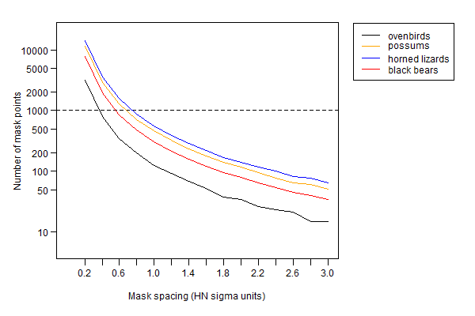
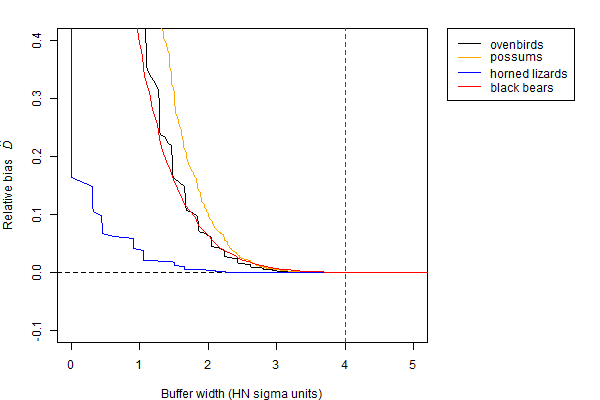

# Habitat mask {#Habitat}

\index{Habitat mask}

A mask represents habitat in the vicinity of detectors that is potentially occupied by the species of interest. Understanding habitat masks and how to define and manipulate them is central to spatially explicit capture--recapture. This chapter summarises what users need to know about masks in **secr**. Early sections apply regardless of software. 

## Background

We start with an intuitive explanation of the need for habitat masks. Devices such as traps or cameras record animals moving in a general region. If the devices span a patch of habitat with a known boundary then we use a mask to define that geographical unit. More commonly, detectors are placed in continuous habitat and the boundary of the region sampled is ill-defined. This is because the probability of detecting an animal tapers off gradually with distance. 

Vagueness regarding the region sampled is addressed in spatially explicit capture--recapture by considering a larger and more inclusive region, the habitat mask. Its extent is not critical, except that it should be at least large enough to account for all detected animals.

Next we refine this intuitive explanation for each of the dominant methods for fitting SECR models: maximum likelihood and Markov-chain Monte Carlo (MCMC) sampling. Each grapples in a slightly different way with the awkward fact that, although we wish to model detection as a function of distance from the activity centre, the activity centre of each animal is at an unknown location.

### Maximum likelihood and the area of integration

The likelihood developed for SECR by @be08 allows for the unknown centres by numerically integrating them out of the likelihood (crudely, by summing over all possible locations of detected animals, weighting each by a detection probability). Although the integration might, in principle, have infinite spatial bounds, it is practical to restrict attention to a smaller region, the 'area of integration'. As long as the probability weights get close to zero before we reach the boundary, we don't need to worry too much about the size of the region.

In **secr** the habitat mask equates to the area of integration: the likelihood is evaluated by summing values across a fine mesh of points. This is the primary function of the habitat mask; we consider other functions [later](#maskwhatfor).

### MCMC and the Bayesian 'state space'

\index{Habitat mask!vs state space}

MCMC methods for spatial capture--recapture developed by Royle and coworkers [@rcsg14] take a slightly different tack. The activity centres are treated as a large number of unobserved (latent) variables. The MCMC algorithm 'samples' from the posterior distribution of location for each animal, whether detected or not. The term 'state space' is used for the set of permitted locations; usually this is a continuous (not discretized) rectangular region. 

\index{Habitat mask!uses}

## What is a mask for? {#maskwhatfor}

Masks serve multiple purposes in addition to the basic one we have just introduced. We distinguish five functions of a habitat mask and there may be more:

1. To define the outer limit of the area of integration. Habitat beyond the mask may be occupied, but animals centred there have negligible chance of being detected.

2. To facilitate computation. By defining the area of integration as a list of discrete points (the centres of grid cells, each with notionally uniform density) we transform the relatively messy task of numerical integration into the much simpler one of summation.

3. To distinguish habitat sites from non-habitat sites within the outer limit. Habitat cells have the potential to be occupied. Treating non-habitat as if it is habitat can cause habitat-specific density to be underestimated.

4. To store habitat covariates for spatial models of density. Covariates for modelling a density surface are provided for each point on the mask. 

5. To define a region for which a post-hoc estimate of population size is required. This may differ from the mask used to fit the model.

The first point raises the question of where the outer limit should lie (i.e., the buffer width), and the second raises the question of how coarse the discretization (i.e., the cell size) can be without damaging the estimates. Later sections address each of the five points in turn, after an introductory section describing the particular implementation of habitat masks in the R package **secr**.

## Masks in **secr**

A habitat mask is represented in **secr** by a set of *square* grid cells. Their combined area may be almost any shape and may include holes. An object of class 'mask' is a 2-column dataframe with additional attributes (cell area etc.); each row gives the x- and y-coordinates of the centre of one cell. 

### Masks generated automatically by `secr.fit`

A mask is used whenever a model is fitted with the function `secr.fit`, even if none is specified in the 'mask' argument. When no mask is provided, one is constructed automatically using the value of the 'buffer' argument. For example

```{r habitatfit1, cache = TRUE, warning = FALSE}
library(secr)
fit <- secr.fit(captdata, buffer = 80, trace = FALSE)
```

The mask is saved as a component of the fitted model ('secr' object); we can plot it and overlay the traps:
```{r bufferplot, fig.width = 3.5, fig.height = 3.5, fig.align = "center", fig.cap = " Mask (grey grid) generated automatically in `secr.fit` by buffering around the detectors (red dots) (80-m buffer, 30-m detector spacing)"}
par(mar = c(1,1,1,1))
plot(fit$mask, dots = FALSE, mesh = "grey", col = "white")
plot(traps(captdata), detpar = list(pch = 16, cex = 1), add = TRUE)
```

The mask is generated by forming a grid that extends 'buffer' metres north, south, east and west of the detectors and dropping centroids that are more than 'buffer' metres from the nearest detector (hence the rounded corners). The obvious question "How wide should the buffer be?" is addressed in a later section. The spacing of mask points (i.e. width of grid cells) is set arbitrarily to 1/64th of the east-west dimension - in this example the spacing is `r round(spacing(fit$mask),1)` metres.

### Masks constructed with `make.mask`

A mask may also be prepared in advance and provided to `secr.fit` in the 'mask' argument. This overrides the automatic process of the preceding section, and the value of 'buffer' is discarded. The function `make.mask` provides precise control over the the size of the cells, the extent of the mask, and much more. We introduce `make.mask` here with a simple example based on a 'hollow grid':

```{r}
hollowgrid <- make.grid(nx = 10, ny = 10, spacing = 30, hollow = TRUE)
hollowmask <- make.mask(hollowgrid, buffer = 80, spacing = 15, type = "trapbuffer")
```

```{r simplemakemask, fig.width = 3.5, fig.height = 3.5, fig.align = "center", fig.cap="Mask (grey grid) generated with `make.mask` (80-m buffer, 30-m trap spacing, 15-m mask spacing). Grid cells in the centre were dropped because they were more than 80 m from any trap."}
par(mar = c(1,1,1,1))
plot(hollowmask, dots = FALSE, mesh = "grey", col = "white")
plot(hollowgrid, detpar = list(pch = 16, cex = 1), add = TRUE)
```

We chose a coarser grid (spacing 15 metres) relative to the trap spacing. This, combined with the hole in the centre, results in a mask with many fewer rows (`r nrow(hollowmask)` rows compared to `r nrow(fit$mask)`). Setting the type to "trapbuffer" trims a few grid cells from the corners,

If we collected data `hollowCH` with the hollow grid we could fit a SECR model using `hollowmask`. For illustration we simulate some data using default settings in `sim.capthist` (5 occasions, D = 5/ha, g0 = 0.2, sigma = 25 m).
```{r habitatfit2, cache = TRUE}
hollowCH <- sim.capthist(hollowgrid, seed = 123)
fit2 <- secr.fit(hollowCH, mask = hollowmask, trace = FALSE)
predict(fit2)
```
Fitting is fast because there are few traps and few mask points. As before, the mask is retained in the output, so --
```{r checkhollowrows}
cat("Number of rows in hollow mask =", nrow(fit2$mask), "\n")
```


## How wide should the buffer be?  {#bufferwidth}

\index{Habitat mask!buffer width}

The general answer is 'Wide enough that any bias in estimated densities is negligible'. Excessive truncation of the mask results in positive bias that depends on the sampling regime (detector layout and sampling duration) and the detection function, particularly its spatial scale and shape. 

The penalty for using an over-wide buffer is that fitting will be slower for a given mask spacing. It is usually smart to accept this penalty rather than search for the narrowest acceptable buffer. We therefore avoid detailed investigation of mask truncation bias[^bias].

Two factors are critical when selecting a buffer width --

1. The spatial scale of detection, which is usually a function of home-range movements.
2. The shape of the detection function, particularly the length of its tail.

These must be considered together. The following comments assume the default half-normal detection function, which has a short tail and spatial scale parameter $\sigma_{HN}$, unless stated otherwise.

### A rule of thumb for buffer width

As a rule of thumb, a buffer of $4\sigma_{HN}$ is likely to be adequate (result in truncation bias of less than 0.1%). A pilot estimate of $\sigma_{HN}$ may be found for a particular dataset (capthist object) with the function `RPSV` with the argument 'CC' set to TRUE:

```{r RPSV}
RPSV(captdata, CC = TRUE)
```

This is an approximation based on a circular bivariate normal distribution that ignores the truncation of recaptures due to the finite extent of the detector array [@cc58].

### Buffer width for heavy-tailed detection functions

Heavy-tailed detection functions such as the hazard-rate (HR, HHR) can be problematic because they require an unreasonably large buffer for stable density estimates. They are better avoided unless there is a natural boundary.

### Hands-free buffer selection: `suggest.buffer`

The `suggest.buffer` function is an alternative to the $4\sigma_{HN}$ rule of thumb for data from point detectors (not polygon or transect detectors). It has the advantage of allowing for the geometry of the detector array (specifically, the length of edge) and the duration of sampling. The algorithm is obscure and undocumented (this is only a suggestion!); it uses an approximation to the bias computed by function `bias.D`. The first argument of `suggest.buffer` may be a capthist object or a fitted model. With a capthist object as input:
```{r suggestbuffer}
suggest.buffer(captdata, detectfn = 'HN', RBtarget = 0.001)
```
When the input is only a capthist object, the suggested buffer width relies on an estimate of $\sigma_{HN}$ that is itself biased  (RPSV(captdata, CC=TRUE)). We see [later](#suggest) how the suggested changes given an unbiased estimate of $\sigma_{HN}$. Actual bias due to mask truncation will also exceed the target (RB = 0.1%) because of the limitations of the *ad hoc* algorithm, so that is not to be taken too literally. 

### Retrospective buffer checks {#suggest}

Once a model has been fitted with a particular buffer width or mask, the estimated detection parameters may be used to check whether the buffer width is likely to have resulted in mask truncation bias. We highlight two of these:

\index{Bias check!automatic}

1. `secr.fit` automatically checks a mask generated from its 'buffer' argument (i.e. when the 'mask' argument is missing), using `bias.D` as in `suggest.buffer`. A warning is given when the predicted truncation bias exceeds a threshold. The threshold is controlled by the 'biasLimit' argument (default 0.01). To suppress the check set 'biasLimit = NA', or provide a pre-defined mask.

The check is performed by a cunning custom algorithm in function `bias.D`. This uses one-dimensional numerical integration of a polar approximation to site-specific detection probability, coupled to a 3-part linear approximation for the length of contours of distance-to-nearest-detector. The check cannot be performed for some detector types, and the embedded integration can give rise to cryptic error messages.

\index{Bias check!`esaPlot`}

2. `esaPlot` provides a quick visualisation of the change in estimated density as buffer width changes. It is a handy 
check on any fitted model, and may also be used with pilot parameter values. The name of the function derives from its reliance on calculation of the [effective sampling area](#esa) (esa or $a(\hat \theta)$).

```{r habitatfit3, cache = TRUE, warning = FALSE}
fit <- secr.fit(captdata, buffer = 100, trace = FALSE)
```
```{r habitatesaplot, fig.height = 3.5, fig.width = 3.5, fig.align = "center", fig.cap="Effect of varying buffer width on estimated density (y-axis). Vertical line indicates rule-of-thumb buffer width"}
par(pty = "s", mar = c(4,4,2,2), mgp = c(2.5,0.8,0), las = 1)
esaPlot(fit, ylim = c(0,10))
abline(v = 4 * 25.6, col = "red", lty = 2)
```

The esa plot supports the prediction that increasing buffer width beyond the rule-of-thumb value has no discernable effect on the estimated density (Fig. \@ref(fig:habitatesaplot)).

The function `mask.check` examines the effect of buffer width and mask spacing (cell size) by computing the likelihood or re-fitting an entire model. The function generates either the log likelihood or the estimated density for each cell in a matrix where rows correspond to different buffer widths and columns correspond to different mask spacings. The function is limited to single-session models and is slow compared to `esaPlot`. See `?mask.check` for more.

Note also that `suggest.buffer` may be used retrospectively (with a fitted model as input), and
```{r suggestbuffer2, cache = TRUE, fig.capt=""}
suggest.buffer(fit)
```
which is coincidental, but encouraging!

### Buffer using non-euclidean distances

If you intend to use a non-Euclidean distance metric then it makes sense to use this also when defining the mask, specifically to drop mask points that are distant from any detector according to the metric. See Appendix \@ref(Noneuclidean) for an example. Modelling with non-Euclidean distances also requires the user to provide `secr.fit` with a matrix of user-computed distances between detectors and mask points.

## Grid cell size and the effects of discretization {#maskspacing}

\index{Habitat mask!discretization}

Using a set of discrete locations (mask points) to represent the locations of animals is numerically convenient, and by making grid cells small enough we can certainly eliminate any effect of discretization. However, reducing cell size increases the number of cells and slows down model fitting. Trials with varying cell size (mask spacing) provide reassurance that discretization has not distorted the analysis. 

In this section we report results from trials with four very different datasets. Three of these are datasets from **secr** (Maryland ovenbirds, ovenCH; Waitarere possums, possumCH; Arizona horned lizards, hornedlizardCH) for which details are given in the **secr** documentation. A fourth dataset is from a 2003 black bear (*Ursus americanus*) study by Jared Laufenberg, Frank van Manen and Joe Clark in the Great Smoky Mountains of Tennessee using hair snares and DNA microsatellites. 

The reference scale was $\sigma$ estimated earlier by fitting a half-normal detection model. In each case masks were constructed with constant buffer width $4\sigma$ and different spacings in the range $0.2\sigma$ to $3\sigma$. This resulted in widely varying numbers of mask points (Fig. \@ref(fig:maskpoints)).

```{r maskpoints, eval = TRUE, echo = FALSE, out.width = '60%', fig.cap="Effect of mask spacing on number of mask points for four test datasets. Detector configurations varied: a single searched square (horned lizards), a single elongated hollow grid of mistnets (ovenbirds), multiple hollow grids of cage traps (Waitarere possums), hair snares along a dense irregular network of trails (black bears)"}

```

```{r maskspacing, eval = TRUE, echo = FALSE, out.width = '90%', fig.cap="Effect of mask spacing on estimates of density from null model. Bias is relative to the estimate using the narrowest spacing. The Arizona horned lizard data appeared especially robust to mask spacing, which may be due to the method (search of a large contiguous area) or duration (14 sampling occasions) [@ry08]"}
knitr::include_graphics('figures/maskspacing.png')
```

The results in Fig. \@ref(fig:maskspacing) suggest that, for a uniform density model, any mask spacing less than $\sigma$ is adequate; $0.6\sigma$ provides a considerable safety margin. The effect of detector spacing on the relationship has not been examined. Referring back to Fig. \@ref(fig:maskpoints), a mask of about 1000 points will usually be adequate with a $4\sigma$ buffer.

The default spacing in `secr.fit` and `make.mask` is determined by dividing the x-dimension of the buffered area by 64. The resulting mask typically has about 4000 points, which is overkill. Substantial improvements in speed can be obtained with coarser masks, obtained by reducing 'nx' or 'spacing' arguments of `make.mask`.

For completeness, we revisit the question of buffer width using the `esaPlot` function with each of the four test datasets (Fig. \@ref(fig:bufferbias)).

```{r bufferbias, eval = TRUE, echo = FALSE, out.width = '75%', fig.cap="Approximate relative bias due to mask truncation for four datasets. Bias is relative to the estimate using the widest buffer"}

```

## Excluding areas of non-habitat

\index{Habitat mask!excluding non-habitat}

Our focus so far has been on choosing a buffer width to set the outer boundary of a habitat mask, assuming that the actual boundary is arbitrary. We can call these 'masks of convenience' (Fig. \@ref(fig:masktypes) a); numerical accuracy and computation speed are the only constraints. At the other extreme, a mask may represent a natural island of habitat surrounded by non-habitat (Fig. \@ref(fig:masktypes) c). A geographical map, possibly in the form of an ESRI shapefile, is then sufficient to define the mask. Between these extremes there are may be a habitat mosaic including both some non-habitat near the detectors and some habitat further away, so neither the buffered mask of convenience nor the habitat island is a good match (Fig. \@ref(fig:masktypes) b). 

```{r masktypes, eval = TRUE, echo = FALSE, out.width = '100%', fig.cap="Types of habitat mask (grey mesh) defined in relation to habitat (green) and detectors (red dots). (a) mask of convenience defined by a buffer around detectors in continuous habitat, (b) mask of convenience excluding non-habitat (c) fully sampled habitat island"}
knitr::include_graphics('figures/masktypes.png')
```

Exclusion of non-habitat (Fig. \@ref(fig:masktypes) b,c) is achieved by providing `make.mask` with a digital map of the habitat in the 'poly' argument. The digital map may be an R object defining spatial polygons as described in Appendix \@ref(Spatialdata), or simply a 2-column matrix or dataframe of coordinates. This simple example uses the coordinates in `possumarea`:

```{r possummask}
clippedmask <- make.mask(traps(possumCH), type = 'trapbuffer', buffer = 400, 
                        poly = possumarea)
```

(ref:Tip) By default, data for the 'poly' argument are retained as an attribute of the mask. With some data sources this grossly inflates the size of the mask, and it is better to discard the attribute with `keep.poly = FALSE`.

```{r plotpossummask, echo = TRUE, fig.width = 4, fig.height=4, fig.align = "center", fig.cap="Mask computed by clipping to a polygon -- the shoreline of the 'peninsula' at Waitarere separating the Tasman Sea (left) from the estuary of the Manawatu River (right)"}
par(mfrow = c(1,1), mar = c(1,1,1,1))
plot(clippedmask, border = 100, ppoly = FALSE)
polygon(possumarea, col = 'lightgreen', border = NA)
plot(clippedmask, dots = FALSE, mesh = grey(0.4), col = NA, 
    add = TRUE, polycol = 'blue')
plot(traps(possumCH), detpar = list(pch = 16, cex = 0.8), 
    add = TRUE)
```

The virtue of clipping non-habitat is that the estimate of density then relates to the area of habitat rather than the sum of habitat and non-habitat. For most uses habitat-based density would seem the more meaningful parameter.

## Mask covariates

\index{Habitat mask!covariates}

Masks may have a 'covariates' attribute that is a dataframe just like the 'covariates' attributes of traps and capthist objects. The data frame has one row for each row (point) on the mask, and one column for each covariate. Covariates may be categorical (factor-valued) or continuous[^footnote7a]. Mask covariates are used for modelling [density surfaces] (D), not for modelling detection parameters (g0, lambda0, sigma)[^footnote7b]. The dataframe may include unused covariates.

[^footnote7a]:Character-valued covariates will be coerced to factors in `secr.fit`.
[^footnote7b]:As an aside - covariates used in detection models should have a small number of discrete values, even when they represent a continuous quantity, because covariates with many values slow down computation and demand extra memory. There is no such constraint with mask covariates.

### Adding covariates

Mask covariates are always added after a mask is first constructed. Extending the earlier example, we can add a covariate for the computed distance to shore:
```{r distancetoshore}
covariates(clippedmask) <- data.frame(d.to.shore = 
    distancetotrap(clippedmask, possumarea))
```

The function `addCovariates` makes it easy to extract data for each mask cell from a spatial data source. Its usage is
```{r, eval = FALSE}
addCovariates (object, spatialdata, columns = NULL, 
    strict = FALSE, replace = FALSE)
```
Values are extracted for the point in the data source corresponding to the centre point of each grid cell. The spatial data source (`spatialdata`) should be one of 

* ESRI polygon shapefile name (excluding .shp)
* sf spatial object, package **sf** [@R-sf]
* RasterLayer, package **raster** [@R-raster]
* SpatRaster,,package **terra** [@R-terra]
* SpatialPolygonsDataFrame, package **sp** [@R-sp]
* SpatialGridDataFrame, package **sp**
* another mask with covariates
* a traps object with covariates

One or more input columns may be selected by name. The argument 'strict' generates a warning if points lie outside a mask used as a spatial data source. 

### Repairing missing values

Covariate values become NA for points not in the data source for addCovariates. Modelling will fail until a valid value is provided for every mask point (ignoring covariates not used in models). If only a few values are missing at only a few points it is usually acceptable to interpolate them from surrounding non-missing values. For continuous covariates we suggest linear interpolation with the function `interp` in the **akima** package [@R-akima]. The following short function provides an interface:

```{r fillinpoints, cache = TRUE}
repair <- function (mask, covariate, ...) {
    NAcov <- is.na(covariates(mask)[,covariate])
    OK <- subset(mask, !NAcov)
    require(akima)
    irect <- akima::interp (x = OK$x, y = OK$y, z = 
        covariates(OK)[,covariate],...)
    irectxy <- expand.grid(x = irect$x, y = irect$y)
    i <- nearesttrap(mask[NAcov,], irectxy)
    covariates(mask)[,covariate][NAcov] <- irect[[3]][i]
    mask
}
```

To demonstrate `repair` we deliberately remove a swathe of covariate values from a copy of our clippedmask and then attempt to interpolate them (Fig. \@ref(fig:fillindemo)):
```{r, cache = TRUE, warning = FALSE, message = FALSE}
damagedmask <- clippedmask
covariates(damagedmask)$d.to.shore[500:1000] <- NA
repaired <- repair(damagedmask, 'd.to.shore', nx=60, ny=50)
```

The interpolation may potentially be improved by varying the `interp` arguments nx and ny (passed via the ... argument of `repair`). Although extrapolation is available (with linear = FALSE, extrap = TRUE) it did not work in this case, and there remain some unfilled cells (Fig. \@ref(fig:fillindemo)c).

Categorical covariates pose a larger problem. Simply copying the closest valid value may suffice to allow modelling to proceed, and this is a good solution for the few NA cells in Fig. \@ref(fig:fillindemo)c. The result should always be checked visually by plotting the covariate: strange patterns may result.

```{r closest, cache = TRUE}
copynearest <- function (mask, cov) {
    NAcov <- is.na(covariates(mask)[,cov])
    OK <- subset(mask, !NAcov)
    i <- nearesttrap(mask, OK)
    covariates(mask)[,cov][NAcov] <- covariates(OK)[i[NAcov],cov]
    mask
}
completed <- copynearest(repaired, 'd.to.shore')
```

```{r fillindemo, echo = FALSE, fig.width = 6.5, fig.height = 5, fig.align = "center", cache = TRUE, fig.cap="Interpolation of missing values in mask covariate (artificial example). (a) True coverage, (b) Swathe of missing values, (c) Repaired by linear interpolation. Cells in the west and east that lie outside the convex hull of non-missing points are not interpolated and remain missing, (d) repair completed by filling remaining NA cells with value from nearest non-missing cell"}
par(mfrow=c(2,2), mar=c(1,2,1,2), xpd=TRUE)
plot(clippedmask, covariate = 'd.to.shore', dots = FALSE, border=80, polycol = 'blue', legend = FALSE)
plotMaskEdge(clippedmask, add = TRUE)
text (2697500, 6078700, 'a.', cex = 1.4)
plot(damagedmask, covariate = 'd.to.shore', dots = FALSE, border=80, polycol = 'blue', legend = FALSE)
plotMaskEdge(damagedmask, add = TRUE)
text (2697500, 6078700, 'b.', cex = 1.4)
plot(repaired, covariate = 'd.to.shore', dots = FALSE, border=80, polycol = 'blue', legend = FALSE)
plotMaskEdge(repaired, add = TRUE)
text (2697500, 6078700, 'c.', cex = 1.4)
plot(completed, covariate = 'd.to.shore', dots = FALSE, border=80, polycol = 'blue', legend = FALSE)
plotMaskEdge(completed, add = TRUE)
text (2697500, 6078700, 'd.', cex = 1.4)
```

See Chapter \@ref(Density) for more on the use of mask covariates.

## Regional population size

\index{Population size $N(A)$}

Population density $D$ is the primary parameter in this implementation of spatially explicit capture--recapture (SECR). The number of individuals (population size $N(A)$) is treated as a derived parameter. The rationale for this is that population size is ill-defined in many classical sampling scenarios in continuous habitat (Figs. 7a,b). Population size is well-defined for a habitat island (Fig. \@ref(fig:masktypes) c). Population size may also be well-defined for a persistent swarm, colony, herd, pack or flock, although group living is incompatible with the usual SECR assumption of independence e.g. @Bischof2020.

Population size on a habitat island $A$ may be derived from an SECR model by the simple calculation $\hat N = \hat D|A|$ if density is uniform. The same calculation yields the expected population in any area $A^\prime$. Calculations get more tricky if density is not uniform as then $\hat N = \int_{A^\prime} D(\vec x) \, d\vec x$ (computing the volume under the density surface) [@ef13].

Function `region.N` calculates $\hat N$ for a previously fitted SECR model (secr object) and region $A^\prime$, along with standard errors and confidence intervals [@ef13]. The default region is the mask used to fit the model, but this is generally arbitrary, as we have seen, and users would be wise to specify the 'region' argument explicitly. That may be a new mask with different extent[^footnote7d] and cell size. Any covariates used to fit the model must also be present in the new 'region' mask.

[^footnote7d]: Care is needed: the estimates of realised population size (but not expected population size) are meaningless if the new region does not cover all $n$ detected animals. See @ef13 for more on realised and expected population size.

## Plotting masks

The default plot of a mask shows each point as a grey dot. We have used `dots = FALSE` throughout this document to emphasise the gridcell structure. That is especially handy when we use the plot method to display mask covariates:
```{r plotmask, fig.width=6.5, fig.height=3, fig.align='center', fig.cap="Plot of a computed continuous covariate across a clipped mask, with outer margin"}
par(mar=c(1,1,2,6), xpd=TRUE)
plot(clippedmask, covariate = 'd.to.shore', dots = FALSE, 
    border=100, title = 'Distance to shore m', polycol = 'blue')
plotMaskEdge(clippedmask, add = TRUE)
```

The legend may be suppressed with `legend = FALSE`. See `?plot.mask` for details. We used `plotMaskEdge` to add a line around the perimeter.

## More on creating and manipulating masks

### Arguments of `make.mask`

The usage statement for `make.mask` is included as a reminder of various options and defaults that have not been covered in this vignette. See `?make.mask` for details.

```{r, eval=FALSE}
make.mask (traps, buffer = 100, spacing = NULL, nx = 64, ny = 64,
    type = c("traprect", "trapbuffer", "pdot", "polygon", 
    "clusterrect", "clusterbuffer", "rectangular", "polybuffer"),
    poly = NULL, poly.habitat = TRUE, cell.overlap = c("centre",
    "any", "all"), keep.poly = TRUE, check.poly = TRUE, 
    pdotmin = 0.001, random.origin = FALSE, ...)
```
### Mask attributes saved by `make.mask`

Mask objects generated by `make.mask` include several attributes not usually on view. Use `str` to reveal them. Three are simply saved copies of the arguments 'polygon', 'poly.habitat' and 'type', and 'covariates' has been discussed already.

The attribute 'spacing' is the distance in metres between adjacent grid cell centres in either x- or y- directions. 

The attribute 'area' is the area of a single grid cell in hectares (1 ha = 10000 m^2^, so area = spacing^2^ / 10000; retrieve with `attr(mask, 'area')`). Use the function `maskarea` to find the total area of all mask cells; for example, here is the area in hectares of the clipped Waitarere possum mask.
```{r maskarea}
maskarea(clippedmask)
```

The attribute 'boundingbox' is a 2-column dataframe with the x- and y-coordinates of the corners of the smallest rectangle containing all grid cells.

The attribute 'meanSD' is a 2-column dataframe with the means and standard deviations of the x- and y-coordinates. These are used to standardize the coordinates if they appear directly in a model formula (e.g., D ~ x + y).

### Linear habitat

Models for data from linear habitats analysed in the package **secrlinear** [@R-secrlinear] use the class 'linearmask' that inherits from 'mask'. Linear masks have additional attributes 'SLDF' and 'graph' to describe linear habitat networks. See [secrlinear-vignette.pdf] for details.

### Dropping points from a mask

If the mask you want cannot be obtained directly with `make.mask` then use either `subset` (batch) or `deleteMaskPoints` (interactive; unreliable in RStudio). This ensures that the attributes are updated properly. Do not simply extract the required points from the mask dataframe by subscripting (`[`).

### Multi-session masks

Fitting a SECR model to a multi-session capthist requires a mask for each session. If a single mask is passed to `secr.fit` then it will be replicated and must be appropriate for all sessions. The alternative is to provide a list of masks, one per session, in the correct order; `make.mask` generates such a list from a list of traps objects. See Chapter \@ref(Multisession) for details.

### Artificial habitat maps

Function `randomHabitat` generates somewhat realistic maps of habitat that may be used in simulations. It assigns mask pixels to 'habitat' and 'non-habitat' according to an algorithm that clusters habitat cells together. The classification is saved as a covariate in the output mask, from which non-habitat cells may be dropped entirely (this was used to generate the green habitat background in Fig. \@ref(fig:masktypes) b).

### Mask vs raster

Mask objects have a lot in common with objects of the RasterLayer S4 class defined in the package **raster** [@R-raster]. However, they are much simpler: no projection is specified and grid cells must be square.

A mask object may be exported as a RasterLayer using the `raster` method defined in **secr** for mask objects. This allows you to nominate a covariate to provide values for the RasterLayer, and to specify a projection.

## Warnings

Use of an inappropriate mask spacing is a common source of problems. Model fitting can be painfully slow if the mask has too many cells. Choose the spacing (cell size) as described in [Grid cell size...](#maskspacing). A single mask for widely scattered clusters of traps should drop cells from wide inter-cluster spaces  (set 'type = trapbuffer').

[snowshoehare]: snowshoeharefromotisetal1978.pdf 
[otisetal]: otisetal.png
[secr-datainput.pdf]: https://www.otago.ac.nz/density/pdfs/secr-datainput.pdf
[secr-overview.pdf]: https://www.otago.ac.nz/density/pdfs/secr-overview.pdf
[secr-tutorial.pdf]: https://www.otago.ac.nz/density/pdfs/secr-tutorial.pdf
