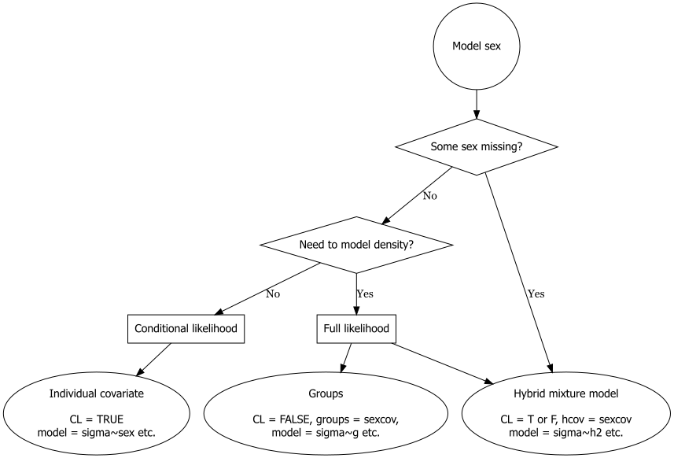

# Sex differences {#sex}

```{r, file = "commoncode.R", echo = FALSE, warning=FALSE, message = FALSE, results="hide"}
# startup code, including library(secr) etc.
```

It is common for males and females to differ in their behaviour in relation to detectors. Sex is commonly recorded for trapped animals or those detected with automatic cameras, and hair samples used to identify individuals by their DNA can also reveal sex given suitable sex-specific markers. SECR models that allow for sex differences are therefore of particular interest.

There are many ways to model sex differences in **secr**, and each of these has already been mentioned in a general context. Here we enumerate the possibilities and comment on their usefulness.

Unlike some effects, the relevance of sex may be obvious from the beginning. You may therefore be happy to structure other aspects of the model around your chosen way to include sex. Alternately, other desiderata may constrain the treatment of sex. The example below shows that several different ways of including sex lead to the same estimates.

## Models 

We list the possible models in order of usefulness (your mileage may vary; see also the [decision chart](#decisionchart) below):

1. Hybrid mixture model
2. Conditional likelihood with individual covariate
3. Separate sessions
4. Full likelihood with groups

### Hybrid mixtures

This accommodates occasional missing values and estimates the sex ratio as a parameter (pmix). The method works for both conditional and full likelihood. If estimated (`CL = FALSE`) density $D$ is common to the two classes.

### Individual covariate

Including an individual covariate in the model directly requires conditional likelihood (`CL = TRUE`). Spatial variation in density cannot be modelled. include a categorical (factor) covariate in model formulae (e.g., g0 $\sim$
  sex). To get sex-specific densities then specify `groups = "sex"` in `derived`.

### Sex as session

It is possible to model data for the two sexes as different sessions (most easily, by coding 'female' or 'male' in the first column of the capture file read with `read.capthist`). Sex differences are then modelled by including a 'session' term in relevant model formulae (e.g., g0 $\sim$ session).

### Groups

[Groups](#groups) were described earlier. Use full likelihood (`CL = FALSE`), define `groups = "sex"` or similar, and include a group term 'g' in relevant formulae (e.g., g0 $\sim$ g).

'CL' and 'groups' are arguments of `secr.fit`. 

## Demonstration {#demonstration}

We re-analyse the morning house mouse data already analysed in Chapter \@ref(individual-heterogeneity). For all methods except 'hybrid mixtures we have to discard one individual of unknown sex (hence capthist marked with 'x'). Close inspection of the results shows that the methods are equivalent.

```{r sexdata}
morning <- subset(housemouse, occ = c(1,3,5,7,9)) # includes one mouse with sex unknown
morningx <- subset(housemouse, !is.na(covariates(housemouse)$sex), occ = c(1,3,5,7,9))
morningxs <- split(morningx, covariates(morningx)$sex)  # split into two sessions
```

```{r sexmodels1, cache = TRUE, warning = FALSE}
# conditional likelihood
hybridxCL  <- secr.fit(morningx, model = list(lambda0~h2, sigma~h2),
                CL = TRUE, buffer = 25, detectfn = 'HEX', 
                trace = FALSE,  hcov = 'sex')
xCL        <- secr.fit(morningx, model = list(lambda0~sex, 
                sigma~sex), CL = TRUE, buffer = 25, detectfn = 'HEX', 
                trace = FALSE)
sessionxCL <- secr.fit(morningxs, model = list(lambda0~session, 
                sigma~session), CL = TRUE, buffer = 25, 
                detectfn = 'HEX', trace = FALSE)
```

```{r sexmodelcomparison1, cache = TRUE, warning = FALSE}
fitsCL <- secrlist(hybridxCL,xCL,sessionxCL)
predict(fitsCL, all.levels = TRUE)
```

```{r sexmodels2, cache = TRUE, warning = FALSE}
# full likelihood
hybridx  <- secr.fit(morningx, model = list(lambda0~h2, sigma~h2), 
              hcov = 'sex', CL = FALSE, buffer = 25, detectfn = 'HEX', 
              trace = FALSE)
sessionx <- secr.fit(morningxs, model = list(D ~ session, 
              lambda0~session, sigma~session), CL = FALSE, buffer = 25,
              detectfn = 'HEX', trace = FALSE)
groupx   <- secr.fit(morningx, model = list(D ~ g, lambda0~g, sigma~g), 
              groups = 'sex', CL = FALSE, buffer = 25, detectfn = 'HEX', 
              trace = FALSE)
```

```{r sexmodelcomparison2, cache = TRUE, warning = FALSE}
fits <- secrlist(hybridx,sessionx, groupx)
predict(fits, all.levels = TRUE)
```

Execution time varies considerably:

```{r sexmodelcomparison3, echo = FALSE}
cat("Timing, conditional likelihood\n")
sapply(fitsCL, '[[', 'proctime')
cat("Timing, full likelihood\n")
sapply(fits, '[[', 'proctime')
```

## Choosing a model {#decisionchart}

### Sex-specific detection

We suggest the decision chart in Fig. \@ref(fig:chart). This omits 'session' approaches that we previously included for [comparison](#demonstration), because they are rather slow and clunky and group models are equivalent.

```{r makechart, echo = FALSE}
# see https://graphviz.org/documentation/
# also https://stackoverflow.com/questions/42737645/how-to-export-images-of-diagrammer-in-r
# assumes DiagrammeR, DiagrammeRsvg, rsvg
chart <- DiagrammeR::grViz("digraph {
  graph [layout = dot, rankdir = TB, center=true]  # TB=top to bottom
  start [label = 'Model sex', shape = circle,fontname='Helvetica']
  missingsex [label = 'Some sex missing?', shape = diamond, height = 1,fontname='Helvetica']
  density [label = 'Need to model density?', shape = diamond, height = 1,fontname='Helvetica']
  CL [label = 'Conditional likelihood', shape = box,fontname='Helvetica']
  full [label = 'Full likelihood', shape = box,fontname='Helvetica']
  
  hybrid [label = 'Hybrid mixture model\n\n CL = T or F, hcov = sexcov\n model = sigma~h2 etc.', shape = oval, width=3,fontname='Helvetica']
  covariate [label = 'Individual covariate\n\n  CL = TRUE\n model = sigma~sex etc.', shape = oval, width=3,fontname='Helvetica']
  groups [label = 'Groups\n\n  CL = FALSE, groups = sexcov, \n model = sigma~g etc.', shape = oval, width=3,fontname='Helvetica']
  
  # edge definitions with the node IDs
  start -> missingsex
  missingsex -> hybrid [label = 'Yes']
  missingsex -> density [label = 'No']
  
  density -> CL  [label = 'No'] # , tailport=sw, headport=n]
  density -> full [label='Yes']
  full -> groups
  full -> hybrid
  CL -> covariate
  
  }",
  height = 500)

chartsvg <- charToRaw(DiagrammeRsvg::export_svg(chart))
rsvg::rsvg_png(chartsvg, "figures/chart.png")
rsvg::rsvg_pdf(chartsvg, "figures/chart.pdf")  
```

```{r chart, echo = FALSE, out.width='95%', include = TRUE, fig.cap="Decision chart for including sex in detection model. 'sexcov' is a character value naming a 2-level character or factor individual covariate"}
# after some trial and error with out.width units etc.

```

### Sex-specific density

Fig. \@ref(fig:chart) is concerned solely with the detection model. Code for estimating sex-specific densities is available for each option as shown in Table \@ref(tab:sexdensity). Sex ratio (pmix) is estimated directly only from hybrid mixture models. Post-hoc specification of 'groups' in `derived` works for both conditional and full likelihood models when density is constant. It is a common mistake to omit `D~g` or `D~session` from full-likelihood sex models -- this forces a 1:1 sex ratio.

Table: (\#tab:sexdensity) Sex-specific estimates of density from various models. Any detection parameter may precede '~'.

| Fitting method | Model | Sex-specific density |
|:-----------|:---------------|:---------------------|
| Conditional likelihood | `~sex`^1^ | `derived(fit, groups = sexcov)` |
|                        | `~h2, hcov = sexcov` | `derived(fit, groups = sexcov)` | 
|                        | `~session` | `derived(fit)` | 
| Full likelihood        | `D~g, ~g, groups = sexcov` | `predict(fit)`)
|                        | `~h2, hcov = sexcov` | `derived(fit, groups = sexcov)`^2^ | 
|                        | `D~session, ~session` | `predict(fit)` | 

## Final comments

We note

* Only hybrid mixtures can cope with missing values.
* The implementation of groups is less comprehensive and may not be available for extensions in the Appendices.
* Options should not be mixed for comparing AIC.

Sex differences in home-range size (and hence $\sigma$) may be mitigated by compensatory variation in $g_0$ or $\lambda_0$ [@em14] (see also [Mitigating factors](#mitigation) in Chapter \@ref(individual-heterogeneity)).

<!-- cf Greg Distiller post -->