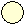
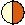
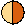
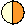

# (PART\*) Study design {-} 

# Assumptions and robustness {#Performance}

This chapter covers topics related to the performance of SECR methods when the minimum data requirements are met. It is the foundation for Chapter \@ref(Studydesign) on study design where we also address minimum data requirements. 

## Assumptions of SECR {#assumptions}

The SECR probability models of Chapter \@ref(Theory) that underlie the methods in this book incorporate certain assumptions. The validity and reliability of the methods therefore depends to an extent on how well the field data meet the assumptions. We list these before assessing their impact in practice - the topic of [Robustness](#robustness). 

1. The population is closed (no animals die, emigrate or recruit during sampling)
2. Individuals are identified without error
3. The probability of detecting an animal at a particular detector declines radially from a fixed point, its activity centre AC 
4. The probability of detection is constant across individuals, detectors and times, conditional on the AC. 
5. Detections of different individuals are independent, as are sequential detections of a single individual.

Restrictive assumptions often may be relaxed under specific extensions to the SECR model, including the various 'submodels' of Chapter \@ref(Detection). We omit one further assumption: that the probability of detection declines to zero for AC at the edge of the habitat mask where the mask is naturally bounded. This is addressed in the analysis by correct choice of [detection function](#detectfn) and the [buffer or mask](#Habitat) as covered in Chapter \@ref(Habitat).

## Robustness {#robustness}

For assumptions that cannot be met by better design or customized modelling, we rely on the robustness of SECR estimators. A robust estimator gives estimates that are close to the truth even when assumptions have been breached. We saw this with the choice of [detection function](#detectfn) in Chapter \@ref(Detection) Fig. \@ref(fig:choicedfparmplot). We care most about estimates of population density, which may be robust even when estimates of other parameters are not. 

Another approach is to test specifically for compliance with each assumption. This was popular in the past [@obwa78], but has lost ground along with the declining credibility of null hypothesis testing, the growth of modelling frameworks, and reliance on the inherent robustness of the spatial methods. 


<!-- Several authors have found SECR estimates of density to be generally robust [@Royle2015, @Sollmann2024].   -->
<!-- > Similar to traditional closed CMR models (Otis et al., 1978; Williams et al., 2002), ignoring temporal variation in p0 in SCR models had little effect on estimates of abundance, the density-covariate relationship, or space use (σ). As such, this study provides yet more evidence that density estimates from SCR models are robust to various forms of mis-specification of the detection model. They have been shown to be robust to unmodeled spatial heterogeneity in detection probability, so long as that heterogeneity is not spatially autocorrelated (Efford et al., 2013; Bischof et al., 2017; Moqanaki et al., 2021), and to a range of misspecifications of the detection function (Efford, 2004; Royle et al., 2014; Dey et al., 2022). In the latter case, though, inference about σ can be strongly affected by choosing the wrong detection function (Dey et al., 2022). In contrast, I found that estimates of σ were robust to ignoring temporal variation in detection. As σ in most applications relates to a stationary activity center and is modeled as constant across occasions, it appears sufficient to take into account spatial variation in p0 to obtain unbiased estimates of σ. It is conceivable that in closed SCR models where activity centers are allowed to move (Royle et al., 2016), not accounting for temporal variation in p0 may affect estimates of σ. Exploring this was beyond the scope of this study. -->

Robustness to the failure of a specific assumption is easily assessed by simulation. There have now been several simulation studies that we review below. We supplement these with new simulations that we outline next and describe in full [elsewhere]. Simulations cannot span the full range of scenarios, so the results are only indicative. 

#### New simulations {#newsimulations .unnumbered}

Our base scenario uses a square grid of 64 binary proximity detectors operated for 10 occasions; detector spacing is $2\sigma$ for a hazard half-normal detection function with $\lambda_0 = 0.1$. A population with density $0.5\sigma^{-2}$ is distributed uniformly at random in a region extending $4\sigma$ beyond the detectors. We report relative bias of density estimates and detection parameters under a null model -- one with uniform density and no additional effects on detection -- except where stated. The range |RB| < 10% is shaded on the graphs, and bars indicate 95\% confidence limits, although these are often obscured by the plotted points. Off-scale values are flagged with an asterisk (*).

### Assumption 1: Population closed  {#popnclosed .unnumbered}

Births, deaths and dispersal result in population turnover. Over an extended period of turnover, more animals may be observed than were present at any instant, and density estimates will be biased upwards. Studies using automatic cameras often accumulate data slowly over many days, and study duration has triggered much angst e.g., @Harihar2017. How much does a little turnover matter? Conversely, How long can the sampling period be? Results for non-spatial models [@Kendall1999] cannot be transferred. We distinguish turnover due to movement of AC from *in situ* births and deaths, and consider it separately under [Assumption 3d](#hrstationary).

@Dupont2019 investigated the effect of increasing study duration on the precision and bias of population size estimates. Their results are complicated by an artifact that caused their Bayesian estimator to be positively biased for short durations [@Dupont2019, p. 669].

<!-- Terrible! Unclear net population change during sampling. Use initial population as reference for RB. -->

Additional simulations are shown in Fig. \@ref(fig:CLOfigure). Turnover in a constant population resulted in positive bias equal to about 70\% of the mortality over the duration of the sampling. Thus 50\% annual mortality (~16\% over 3 months) resulted in about +11\% relative bias in a 3-month study, and coverage of nominal 95\% confidence intervals dropped to about 82\%. The new results are broadly consistent with those from the more complex scenarios of @Dupont2019 for 'slow' and 'intermediate' life histories.

(ref:CLOcap) Simulated effect of study duration on relative bias of density estimates for three levels of annual survival $\phi$ in a population with constant density. $\phi = 1$ corresponds to a closed population.

```{r CLOfigure, echo = FALSE, cache = TRUE, fig.width= 6, fig.height = 6, out.width = "70%", fig.cap="(ref:CLOcap)"}
sims <- readRDS("data/CLOsims.RDS")
source (file = 'figures/setup.R')
estD <- estimateSummary(sims)
nocc <- seq(4,24,4)
phi <- split(1:18, rep(1:3,each=6))   # indices of phi groups
model0 <- lm(I(estD$RB[phi[[1]]]) ~ I(nocc*7))
model1 <- lm(I(estD$RB[phi[[2]]]) ~ I(nocc*7))
model2 <- lm(I(estD$RB[phi[[3]]]) ~ I(nocc*7))
par(mar=c(4,4,4,5), bty = "l", cex = 1.1)
plot(0,0, type = "n", ylim = c(-0.05,0.3), xlim = c(0,365/2), 
     xlab = "Duration (days)", ylab="RB", xaxs = "i", xpd = FALSE)
shade(0.1)
abline(model0, col="grey")
abline(model1, col="grey")
abline(model2, col="grey")
abline(h=0, lty=2, col="grey")
addRB(nocc*7, estD[phi[[1]],], pch = 21, bg = yob5[4], cex = 1.2)
addRB(nocc*7, estD[phi[[2]],], pch = 21, bg = yob5[3], cex = 1.2)
addRB(nocc*7, estD[phi[[3]],], pch = 21, bg = yob5[2], cex = 1.2)
par(adj=0, xpd = TRUE)
text (200, 0, expression(paste(phi,~ '=' ~ 1.0)), cex = 1.1, xpd = TRUE)
text (200, 0.1, expression(paste(phi,~ '=' ~ 0.75)), cex = 1.1, xpd = TRUE)
text (200, 0.25, expression(paste(phi,~ '=' ~ 0.5)), cex = 1.1, xpd = TRUE)
```

#### Assumption 1b: Population closed to immigration and emigration {#noemimm .unnumbered}

This overlaps with Assumption 3 and is covered [later](#hrstationary).

### Assumption 2: Identification without error {#noIDerror .unnumbered}

We can generally assume accurate identification on recapture of animals trapped and marked by conventional methods such as numbered leg bands or ear tags. However, identification may be unreliable with modern methods for passive sampling using natural marks (DNA from hair or faecal samples, and images from motion-sensitive cameras). This is a major limitation.

In genetic sampling there are two possible reasons for mis-identification: there may be too little variation at the chosen
<!-- microsatellite or SNP  -->
loci to distinguish all individuals in the sampled population, and genotyping is subject to error. @Mills2000, @Lukacs2005, @Waits2005, and @Lampa2013 reviewed the early literature, and citations of those reviews are a good entry point to the voluminous recent literature. @Sethi2014 provide technical advice. @Augustine2020 provide a useful summary and a model framework that encompasses the various errors.

Natural marks such as coat patterns are prone to identification problems that parallel those from genotyping: individuals may not be distinguishable, leading to shadow effects, or some may be mis-recorded, leading to spurious ghost individuals. The robustness of estimates will depend on the likely magnitude of each effect. We address the bias for varying frequencies of shadow and ghost effects below, with particular reference to genotyping. 

A single camera may photograph only the left or right flank of a passing animal. Owing to the asymmetry of patterns, identity cannot be inferred conclusively from a single photograph. This identification problem can be addressed in the field by using paired cameras, so that both flanks are recorded [Karanth1998]. There may still be a minority of single-sided photographs, and probabilistic models have been suggested to incorporate these [@Augustine2018].

#### Assumption 2a. Natural marks sufficiently diverse {#shadow .unnumbered}

The ability to distinguish individuals is measured by the probability of identity (PI). This is the probability that two individuals drawn at random from the population will appear the same, i.e. have the same genotype at the loci examined. Identity of genotypes was considered by @Mills2000 to cause a "shadow effect", as the existence of some individuals is concealed. The problem for SECR is even greater than in non-spatial capture--recapture. A group of two or more indistinguishable individuals becomes a 'super individual' whose detections spread over a larger area than each occupies individually.

Simulations in Figs. \@ref(fig:MID3figure) and \@ref(fig:MID4figure) illustrate the potential impact of shadow effects on SECR estimates. In a scenario with about 110 detected individuals, PI = $10^{-3}$ resulted in relative bias of --20\% in density estimates. This is largely due to the inflated spatial footprint of each super individual, which causes positive bias in estimates of the spatial scale of detection $\sigma$.

(ref:MID3cap) Relative bias of parameter estimates from null model when some individuals cannot be distinguished ("shadow effects").

```{r MID3figure, echo = FALSE, message = FALSE, warning = FALSE, fig.width= 5, fig.height = 5, out.width = "60%", fig.cap="(ref:MID3cap)"}
source("figures/MID3figure.R")
```

(ref:MID4cap) Relative bias of density estimates as function of PI for varying density. At low density few individuals are detected, reducing the chance of mis-identification for given PI. 

```{r MID4figure, echo = FALSE, message = FALSE, warning = FALSE, fig.width= 5, fig.height = 5, out.width = "70%", fig.cap="(ref:MID4cap)"}
source("figures/MID4figure.R")
```

(ref:MID4acap) Threshold of PI at which absolute relative bias of density estimates exceeded the threshold shown, as a function of the expected number of individuals detected.

```{r MID4afigure, echo = FALSE, message = FALSE, warning = FALSE, fig.width= 5, fig.height = 5, out.width = "60%", fig.cap="(ref:MID4acap)"}
source("figures/MID4afigure.R")
```

#### Assumption 2b. Natural marks not corrupted {#ghost .unnumbered}

DNA samples degrade over time exposed to heat, moisture and UV light [e.g., @Woodruff2014]. This results in both a lower rate of successful DNA amplification, and increasing frequency of genotyping errors. A key genotyping error is the phenomenon of allelic dropout, when one allele at a heterozygous locus fails to amplify, resulting in an apparent homozygote. False alleles may also appear in the laboratory and give the appearance of a distinct genotype and individual. Either error is likely to result in a spurious 'ghost' individual that is never recaptured. 

We measure the ghost effect by the probability a detection results in a 'ghost' individual. Unlike shadow effects, ghost individuals have almost no effect on $\hat \sigma$. However, they do cause negative bias in $\hat \lambda_0$ and a reciprocal (positive) bias in density estimates $\hat D$ (Fig. \@ref(fig:MID2figure)). 

(ref:MID2cap) Relative bias of parameter estimates from null model when genotyping errors generate 'ghost' individuals.

```{r MID2figure, echo = FALSE, message = FALSE, warning = FALSE, fig.width= 5, fig.height = 5, out.width = "60%", fig.cap="(ref:MID2cap)"}
source("figures/MID2figure.R")
```

<!-- @ebm13 suggested modelling decline in DNA amplification success with duration of interval and environmental conditions, but that belongs elsewhere -->

<!-- (Faecal samples appear to give more trouble?) -->
<!-- @Kubo2023 raccoon dog -->
<!-- @De2022 Asian elephant faecal samples -->

<!-- wolverines, Dusit Ngoprasert sunbears, abb, salamanders -->

<!-- #### Unknown identity {-} -->

Given sufficient diversity at the chosen loci, culling of inadequate samples and intensive checking of doubtful genotypes is generally sufficient to ensure adequate data [@Paetkau2003]. @Lukacs2005 raised doubts about possible biases due to sample culling, but these have not been confirmed. Elimination of poor samples for which identity is uncertain tends to reduce sample size and precision. Precision can be improved by judiciously including samples with fewer loci in models that allow for uncertain identity [@Augustine2020].

Unknown identity can be handled in SECR-like probability models. These generally lack power unless supplemented by detections of known individuals or telemetry (references in Appendix \@ref(Telemetry)).
<!-- [@cr13; @rcr15; @vanDamBates2024; @Ruprecht2021] -->

### Assumption 3: Detection declines radially from randomly located, fixed AC {-}

The spatial component of spatially explicit capture--recapture rests on quite specific spatial models for the population (a 2-D distribution of activity centres AC) and for detection (a declining function of distance from the AC). These follow from a  biological model in which detection hazard is proportional to each animal's utilisation distribution i.e., its home range conceived as a stationary 2-dimensional probability density function [@Winkle1975][^nonprop].

[^nonprop]: The SECR model is slightly more flexible, in that it allows the radial pattern of detection to deviate from strict proportionality to utilisation.

#### Assumption 3a: AC locations independent {#ACindependent .unnumbered}

The SECR model of @be08 treats activity centres as distributed independently according to an inhomogeneous Poisson point process. This allows local density to vary according to habitat or other persistent effects. It does not allow for the spacing behaviour of the animals themselves, which can lead either to contagion or repulsion of AC. Several authors have ventured into this area [@Russell2012; @Reich2014; @LopezBao2018; @Bischof2020; @McLaughlin2020; @Efford2024]. The general conclusion is that point estimates of density from SECR are robust to clustering of AC due to social behaviour, but the implied overdispersion leads to confidence limits that are too narrow. Non-independence of detection is a distinct issue ([Assumption 4](#independentindividuals)).

#### Assumption 3b: Home ranges circular {#hrcircular .unnumbered}

Concerns were expressed by @Ivan2013 about the effect of non-circularity of home ranges. Simulations by @Efford2019 generally defused those concerns, with an important caveat: estimates of the spatial scale of detection $\sigma$ and density are unreliable when elongated home ranges are sampled with a linear array of detectors. Simulations of randomly oriented elliptical ranges with an aspect ratio of 3:1 resulted in bias on the order of +13\% for a linear array [@Efford2019: Fig. 2]. Bias is extreme [often >50\%, @Efford2019: Table 1] when home ranges are both elongated and have a common alignment to the array (Fig. \@ref(fig:alignment)c). Modelling the anisotropy can be beneficial when the alignment is predictable from the landscape [@Murphy2016; @Efford2019] and the array is not exactly linear, but the method is not universally applicable.

(ref:align) SECR models typically assume that home ranges are circular (a). Noncircularity of home ranges causes limited bias in density estimates when ranges are oriented at random with respect to a linear detector array (b). Systematic alignment of ranges to the array (c) causes large bias in $\hat \sigma$ and $\hat D$.

```{r alignment, eval = TRUE, echo = FALSE, out.width = "70%", fig.cap="(ref:align)"}
knitr::include_graphics("figures/alignment.png")
```

#### Assumption 3c: Locations independent within home range {#independentwithinhr .unnumbered}

It is entirely likely that animals use their home ranges in a nested fashion (i.e., activity during any sub-interval localised in part of the range) or that some AC move during sampling. This may be viewed as a subset of Assumption 6 because if AC are not fixed during sampling then successive locations of an individual will be autocorrelated.

@Royle2015 modelled movement patterns they called "transience" (a Gaussian random walk) and "dispersal" (discrete shift of AC). They concluded

> ... while estimators of density are extremely robust, even to pathological levels of movement (e.g., complete transience), the estimator of the spatial scale parameter of the encounter probability model is confounded with the dispersal/transience scale parameter. 

We extend their simulations by considering a model in which the overall home range is stationary but locations within the home range are autocorrelated. The bivariate Ornstein-Uhlenbeck (OU) distribution is a convenient model with these properties [@Dunn1977; @Johnson2008; @Hooten2017]. The home range as a whole is bivariate normal; we simulate the uncorrelated, circular case with equal variance on both axes. R code and details of the simulations are provided [elsewhere].

Fig. \@ref(fig:demoOU1) illustrates OU movement tracks for individuals with increasing autocorrelation parameter $\tau$. Detection is assumed here to happen when an individual is within some small threshold distance $\epsilon$ of a detector at the end of a time step. Other detection models are possible.

```{r OU, echo = FALSE}
# OU algorithm adapted from Supplements of Ben Stevenson 2021 Biometrics paper
simOU.capthist <- function (
        traps,
        popn,
        detectpar = list(),
        noccasions = 100,    # effective "duration"
        epsilon = 10,        # proximity threshold for detection
        output = c('capthist', 'locations'),
        ...)
{
    sim.ou <- function(mu, tau, sigma, n.steps){
        mu <- as.numeric(mu)   # dodge issue with dataframe
        start <- mvtnorm::rmvnorm(1, mu, sigma^2*diag(2))
        b <- -1/tau
        v <- sigma^2
        out <- matrix(0, nrow = n.steps, ncol = 2)
        out[1, ] <- start
        for (i in 2:n.steps){
            out[i, ] <- mvtnorm::rmvnorm(1, mu + exp(b)*(out[i - 1, ] - mu),
                                         v*(1 - exp(2*b))*diag(2))
        }
        out
    }
    captfn <- function (xy) {
        loc.capt <- secr::edist(xy,traps) <= epsilon
        apply(loc.capt, 2, sum)
    }   
    output <- match.arg(output)
    N <- nrow(popn)
    tau <- detectpar$lambda0
    sigma <- detectpar$sigma
    n.steps <- noccasions
    locs <- apply(popn, 1, sim.ou, tau, sigma, n.steps, simplify = FALSE)
    if (output == 'locations') {
        return(locs)
    }
    else {
        capt <- t(sapply(locs, captfn))
        capt <- capt[apply(capt, 1, sum) > 0, ]   # drop null histories
        n <- nrow(capt)
        ch <- array(capt, dim = c(n,1,ncol(capt)), dimnames = list(1:n,NULL,NULL))
        class(ch) <- 'capthist'
        traps(ch) <- traps
        return(ch)
    }
}
```

(ref:demoOU) Examples of correlated movement paths over 100 time steps ($t = 100$). Parameter 'tau' ($\tau$) controls autocorrelation. Red dot indicates activity centre; grey circle is 95\% probability contour of distribution as $t \to \infty$ or $\tau \to 0$.

```{r demoOU1, echo = FALSE, eval = TRUE, cache = TRUE, results = "hide", fig.width=7, fig.height=7, out.width="80%", fig.cap = "(ref:demoOU)"}
par(mfrow=c(2,2), mar = c(1,1,2,1), pty='s')
set.seed(123)
for (tau in c(1,10,50,100)) {
    locs <- simOU.capthist(grid, matrix(c(0,0), nrow=1), detectpar = list(lambda0 = tau, sigma = 100), 
                           noccasions = 100, epsilon=10, output = 'locations')
    plot (locs[[1]], type='o', xlim=c(-350,350), ylim = c(-350,350), axes=F, xlab='', ylab='')
    mtext(side = 3, paste('tau = ', tau))
    points(0,0, pch = 16, col='red', cex = 1.2)
    box()
    symbols(0,0,circles=245,inches=FALSE, add = TRUE, fg = grey(0.8))
}
```

One consequence of autocorrelated movement is that the overall spatial scale increases with the duration and decreases with autocorrelation. With respect to telemetry, @Otis1999 concluded that autocorrelation *per se* did not bias inference so long as summary statistics were not generalized beyond the temporal sampling frame: 

> Sampling designs that predefine a time frame of interest, and that generate representative samples of an animal's movement during this time frame, should not be affected by length of the sampling interval and autocorrelation.

The analogy with SECR is close: we are concerned with unbiased estimation of the detection parameters $\lambda_0, \sigma$ that describe the detection process *over the time frame of sampling*. Extrapolation to other time frames would require knowledge of the correlation structure of the data, expressed in a model such as the bivariate Ornstein-Uhlenbeck distribution [e.g., @Dunn1977; @Hooten2017], but that is not relevant to inference for the chosen time frame.

(ref:OUcap) Relative bias RB of null-model density estimates of density $D$ and spatial scale $\sigma$ from Ornstein-Uhlenbeck model with autocorrelation parameter $\tau$.

```{r OUfigure, echo = FALSE, message = FALSE, fig.height = 4, fig.width=4, out.width = "50%", fig.cap = "(ref:OUcap)"}
source (file = 'figures/setup.R')
OUsims <- readRDS(file = 'data/OUsims.RDS')
estD <- estimateSummary(OUsims)[,-1]
estS <- estimateSummary(OUsims, 'sigma')[,-1]
taulevels <- c(0.1, 1, 5, 10, 20, 50, 100)[-1]
par(mfrow=c(1,1), mar=c(4,4,1,1), mgp=c(2.4,0.7,0), bty = 'o', pty='s')
plot(0.1,0,type='n', xlim=c(1,100), log='x', ylim=c(-0.6,0.3), xlab = expression(tau), ylab='RB')
shade(0.1)
abline(h=0, lty=2)
addRB(taulevels, estD[-1,], type='o', pch=21, bg = yob5[3], cex=1.1)
addRB(taulevels, estS[-1,], type='o', pch=21, cex = 1.1, bg = 'white')
legend(1.2, -0.39, legend=c('D','sigma'), pch=c(21,21), pt.bg= c(yob5[3],'white'),  pt.cex=1.1)
```

Fig. \@ref(fig:OUfigure) confirms the robustness of SECR null-model density estimates to serial correlation of location over a broad range of values ($0 \le \tau \le 50$). Bias is apparent in estimates of the global $\sigma$, as expected from the reduced extent of movements in a given time frame. Note here that autocorrelation induces negative bias in $\hat \sigma$. There is no direct analogue of $\lambda_0$ in the OU generating model, so we cannot determine the bias in $\hat \lambda_0$.

#### Assumption 3d. Home ranges stationary {#hrstationary .unnumbered}

Robustness of SECR to movement of home ranges (dispersal) was demonstrated by @Royle2015. [@Harihar2017] expressed a further concern that movement over a long sampling duration would breaches Assumption 1 (closure). 

We simulated detections over 100 'days' during which each AC underwent a random walk governed by a Gaussian kernel with scale $\sigma_m$. Details are given [elsewhere].

```{r DNC results1, echo = FALSE, results = "hold"} 
source (file = 'figures/setup.R')
DNCsims <- readRDS('data/DNCsims.RDS')
moves <- sapply(DNCsims$pop.args, function(x) x$details$move.a)/1000
estD <- estimateSummary(DNCsims)
estL <- estimateSummary(DNCsims, 'lambda0')
estS <- estimateSummary(DNCsims, 'sigma')
```

(ref:DNCcap) Relative bias RB, relative standard error RSE, and coverage of 95% confidence intervals COV for density estimates from studies with varying between-occasion movement.

```{r DNCfigure, echo = FALSE, fig.height = 4, fig.width = 4, out.width="50%", fig.cap = "(ref:DNCcap)"}
par(mfrow = c(1,1), mar = c(4,4,2,2), pty = 's', yaxs='i', mgp=c(2.4,0.6,0))
leg <- c('D', 'lambda0', 'sigma')
plot(0,0, type = 'n', ylim = c(-0.9, 1.2), xlim = c(0,1), 
     xlab = 'Daily HR shift sigma (km)', ylab = 'RB')
shade(0.1)
abline (h = 0, lty = 2)
addRB(moves, estD, pch = 21, bg = yob5[3], type = 'o', cex = 1.1)
addRB(moves, estL, pch = 21, bg = 'white', type = 'o', cex=1.1)
addRB(moves, estS, pch = 24, bg = 'white', type = 'o')
legend(0, 1.1, legend=leg, pch=c(21,21,24), pt.bg = c(yob5[3],'white','white'), pt.cex=c(1.1,1.1,1))
```

### Assumption 4: Probability of detection constant {-}

@obwa78 classified non-spatial capture--recapture models according to three possible sources of variation in detection probability: time (t -- sampling occasion), behaviour (b -- learned response to capture) and heterogeneity (h -- persistent individual differences). Models may accommodate any one of these sources (t, b, h) or their combinations (tb, th, bh, tbh). Space adds other sources of variation -- most simply, detection probability may also vary between detectors (d) -- and more complex potential interactions. 

For SECR we have at least two parameters that control detection ($g_0$ or $\lambda_0$, and $\sigma$).

Detection parameters may also be considered a function of AC location, but for (relative) simplicity we stick to t, b, h, and d.

#### 4a. Temporal variation {#temporalvariation .unnumbered}

@Sollmann2024 reached the conclusion from simulations that temporal variation in the baseline detection probability $g_0$ may safely be ignored when fitting SECR models. Comparison of null and temporal models seldom results in different estimates of density. 

Further [simulations] confirm the lack of bias in $\hat D$, but show that temporal variation in $\sigma$ causes significant bias in estimates of both $\lambda_0$ and $\sigma$ under the null model (Fig. \@ref(fig:Mtfigure)).

(ref:Mtcap) Relative bias of parameter estimates from null model given for temporal variation on lambda0 or sigma.

```{r Mtfigure, eval = TRUE, echo = FALSE, message=FALSE,  fig.width = 8, fig.height = 4, out.width="90%", fig.cap = "(ref:Mtcap)" }
source (file = 'figures/setup.R')
Mtsims <- readRDS(file = 'data/Mtsims.RDS')
estD <- estimateSummary(Mtsims)[,-1]
estL <- estimateSummary(Mtsims, 'lambda0')[,-1]
estS <- estimateSummary(Mtsims, 'sigma')[,-1]

x <- seq(0,0.4,0.1)
leg <- c('D', 'lambda0', 'sigma')
cvltext <- expression(paste("CV( ", lambda[0], " )"))
cvstext <- expression(paste("CV( ", sigma, " )"))    

par(mfrow=c(1,2), mar=c(4,4,1,1), mgp=c(2.4,0.7,0), bty = 'o', bg = 'white')
plot(0,0,type='n', xlim=c(0,0.4), ylim=c(-0.4,0.4), xlab = cvltext, ylab='RB')
shade(0.1)
abline(h=0, lty=2)
addRB(x, estL[1:5,], type='o', pch=21, bg = 'white', cex=1.1)
addRB(x, estS[1:5,], type='o', pch=24, bg = 'white')
addRB(x, estD[1:5,], type='o', pch=21, bg = yob5[3], cex=1.1)
legend(0.01, 0.39, legend = leg, pch=c(21,21,24), pt.bg = c(yob5[3], 'white','white'), pt.cex=c(1.2,1.2,1))

plot(0,0,type='n', xlim=c(0,0.4), ylim=c(-0.4,0.4), xlab = cvstext, ylab='RB')
shade(0.1)
abline(h=0, lty=2)
addRB(x, estD[c(1,6:9),], type='o', pch=21, bg = yob5[3], cex=1.1)
addRB(x, estL[c(1,6:9),], type='o', pch=21, bg = 'white', cex=1.1)
addRB(x, estS[c(1,6:9),], type='o', pch=24, bg = 'white')
legend(0.01, 0.39, legend = leg, pch=c(21,21,24), pt.bg = c(yob5[3],'white','white'), pt.cex=c(1.2,1.2,1))
```

#### 4b. Behavioural responses {#behaviour .unnumbered}

We introduced behavioural responses in Chapter \@ref(Detection). Behavioural responses may also be treated as a breach of the [assumption of serial independence](#serialindependence), but we keep them here for consistency with the non-spatial literature.

The discovery of a detector and experience of capture may result in either a positive (trap-happy) or negative (trap-shy) change in detection probability. The response may persist for the duration of sampling or be transient (Markovian) and apply only at the next sampling occasion. In SECR there is the further complication that the response may be general, applying across all detectors, or localised to the initial detector.  

Each of these responses is readily modelled if the sequence of detections is known. This is generally not the case with proximity detectors, for which an animal may visit multiple detectors on one sampling occasion. We therefore restrict consideration of learned responses to trapping data (single-catch and multi-catch traps). This is not a great loss, as proximity detectors are typically non-invasive and less likely than traps to affect behaviour.

If a behavioural response is not modelled then it may cause a heavy bias in density estimates, positive for trap shyness and negative for trap happiness (Fig. \@ref(fig:Mbfigure)). In [simulations] we describe the magnitude of the behavioural response by a 'recapture factor' by which the initial (naive) hazard is multiplied after first capture. We simulated recapture factors between 0.25 and 2.0, where 1.0 represents no behavioural response.  The bias is much reduced if the effect is detector-specific, but then $\hat \sigma$ is also biased. For the scenario used in these [simulations], the relative bias of density estimates fell between -10\% and +10\% for recapture factors between 0.5 and 2. In Chapter \@ref(Detection) we estimated a much larger response by [deermice](#behaviouralresponse) (about 10-fold, but with poor precision), although there was only a small difference in estimated density between the null and bk models. Behavioural responses are potentially important for SECR and deserve closer investigation.

(ref:Mbcap) Relative bias of parameter estimates from null model given behavioural variation in lambda0. Relative bias of density was off-scale (+1.41) for recapture factor 0.25 with a general behavioural response.

```{r Mbfigure, eval = TRUE, echo = FALSE, fig.width = 8, fig.height = 4, out.width="90%", fig.cap = "(ref:Mbcap)" }
source (file = 'figures/setup.R')
Mbsims <- readRDS(file = 'data/Mbsims.RDS')
estD <- estimateSummary(Mbsims)[,-1]
estL <- estimateSummary(Mbsims, 'lambda0')[,-1]
estS <- estimateSummary(Mbsims, 'sigma')[,-1]

par(mfrow=c(1,2), mar=c(4,4,2.5,1), mgp=c(2.4,0.7,0), bty = 'o')
x <- c(0.25,0.5,1,1.5,2)
leg <- c('D','lambda0','sigma')

plot(0,0,type='n', xlim=c(0,2), ylim=c(-0.8,1), xlab = 'Recapture factor', ylab='RB')
shade(0.1)
abline(h=0, lty=2)
addRB(x, estL[1:5,], type='o', pch=21, bg = 'white')
addRB(x, estS[1:5,], type='o', pch=24, bg = 'white')
addRB(x, estD[1:5,], type='o', pch=21, bg = yob5[3])
legend(1.33, -0.3, legend = leg, pch=c(21,21,24), pt.bg = c(yob5[3],'white','white'), cex=0.9, pt.cex=c(1.1,1.1,1))
mtext(side=3, line=0.5, 'General behavioural response (b)', cex = 0.9)

plot(0,0,type='n', xlim=c(0,2), ylim=c(-0.8,1), xlab = 'Recapture factor', ylab='RB')
shade(0.1)
abline(h=0, lty=2)
addRB(x, estL[6:10,], type='o', pch=21, bg = 'white')
addRB(x, estS[6:10,], type='o', pch=24, bg = 'white')
addRB(x, estD[6:10,], type='o', pch=21, bg = yob5[3])
legend(1.33, -0.3, legend = leg, pch = c(21,21,24), pt.bg = c(yob5[3],'white','white'), cex = 0.9, pt.cex=c(1.1,1.1,1))
mtext(side=3, line=0.5, 'Trap-specific behavioural response (bk)', cex = 0.9)
```

#### 4c. Individual heterogeneity {#individualheterogeneity .unnumbered}

Individual heterogeneity has long been the bane of capture--recapture. Some of the variation is due to proximity to detectors, and does not bias SECR estimates because it is included in the model. A modest level of additional variation has little effect on null-model estimates: @em14 found that the relative bias of $\hat D$ did not exceed -0.05 when $\mbox{CV}(a_0) < 0.3$ for $a_0 = 2\pi\lambda_0\sigma^2$ (based on hazard halfnormal or exponential detection function). We confirmed this in [simulations] that varied each of the components $\lambda_0$ and  $\sigma^2$ separately (Fig. \@ref(fig:Mhfigure)). Biologically we expect an inverse relationship between $\lambda_0$ and $\sigma^2$, so in general $\mbox{CV}(a_0)$ will be less than either $\mbox{CV}(\lambda_0)$ or $\mbox{CV}(\sigma^2)$ on its own [@em14].

Despite these appeals to robustness, Fig. \@ref(fig:Mhfigure) indicates a risk of significant bias in estimates of both density and detection parameters when individual heterogeneity is large.

(ref:Mhcap) Relative bias of parameter estimates from null model given individual variation in $\lambda_0$ and $\sigma^2$. 

```{r Mhfigure, eval = TRUE, echo = FALSE, fig.width = 8, fig.height = 4, out.width="90%", fig.cap = "(ref:Mhcap)" }
Mhsims <- readRDS(file = 'data/Mhsims.RDS')
estD <- estimateSummary(Mhsims)[,-1]
estL <- estimateSummary(Mhsims, 'lambda0')[,-1]
estS <- estimateSummary(Mhsims, 'sigma')[,-1]
x <- seq(0,0.8,0.20)
leg <- c('D', 'lambda0', 'sigma')
cvltext <- expression(paste("CV( ", lambda[0], " )"))
cvstext <- expression(paste("CV( ", sigma^2, " )"))    

par(mfrow=c(1,2), mar=c(4,4,1,1), mgp=c(2.4,0.7,0), bty = 'o')
plot(0,0,type='n', xlim=c(0,0.8), ylim=c(-0.4,0.5), xlab = cvltext, ylab='RB')
shade(0.1)
abline(h=0, lty=2)
addRB(x, estD[1:5,], type='o', pch=21, bg = yob5[3])
addRB(x, estL[1:5,], type='o', pch=21, bg = 'white')
addRB(x, estS[1:5,], type='o', pch=24, bg = 'white')
legend(0.03, 0.48, legend=leg, pch=c(21,21,24), pt.bg=c(yob5[3],'white','white'), cex = 0.9, pt.cex=c(1.1,1.1,1))

plot(0,0,type='n', xlim=c(0,0.8), ylim=c(-0.4,0.5), xlab = cvstext, ylab='RB')
shade(0.1)
abline(h=0, lty=2)
addRB(x, estD[c(1,6:9),], type='o', pch=21, bg = yob5[3])
addRB(x, estL[c(1,6:9),], type='o', pch=21, bg = 'white')
addRB(x, estS[c(1,6:9),], type='o', pch=24, bg = 'white')
legend(0.03, 0.48, legend=leg, pch=c(21,21,24), pt.bg=c(yob5[3],'white','white'), cex = 0.9, pt.cex=c(1.1,1.1,1))
```

#### 4d. Homogeneity across detectors {#homogeneityofdetectors .unnumbered}

Spatial (detector-specific) variation in detection parameters is conceptually linked to individual heterogeneity. The location of each individual determines its detection probability via a particular set of AC-to-detector distances, as modelled automatically in SECR. Variation among detectors in efficiency ($\lambda_{0_k}$) adds between-animal heterogeneity because the detectors near a particular AC differ in efficiency from the average (Fig. \@ref(fig:inducedhfigure)), and the variation is not modelled automatically. 

(ref:inducedhcap) Variation in detector efficiency induces individual heterogeneity in overall detection probability $p_\cdot(\vec x)$. AC 1--3 have similar exposure to detectors but experience respectively high, low and medium detection probability because of the neighbourhoods in which they are located.

```{r inducedhfigure, eval = TRUE, echo = FALSE, fig.width = 6, fig.height = 6, out.width="50%", fig.cap = "(ref:inducedhcap)" }
source("figures/inducedheterogeneity.R")
```

The individual heterogeneity induced by between-detector variation is increased by spatial autocorrelation on the scale of home ranges, because this makes it more likely that all detectors in the neighborhood of an AC will be above average or below average. Variable $\lambda_{0_k}$ may also affect null-model estimates indirectly owing to bias in $\hat \sigma$ and perhaps $\hat \lambda_0$, but these interactions are poorly understood and we do not consider them further.

A Gaussian random field (GRF) is a convenient source of random spatial variation. Spatial structure of a GRF is controlled by its covariance function, which is typically exponential with a single scale parameter. Several authors have used a GRF to generate detector-specific variation in detection probability on the link scale (logit or cloglog). Reported bias in null-model density estimates from these simulations was typically in the range 0 to 20\% [@Royle2013, @Moqanaki2021, @Dey2023].

Detector-level variation has several possible origins --

1. Habitat-determined variation in detector efficiency,
2. Selective use of habitats (third-order selection of @j80), or
3. Unrecorded variation in sampling intensity [@Dey2023].

Selective use implies a modification to each animal's utilisation distribution. Time spent in preferred habitats allows less time in other habitats, and the time spent near any detector depends on the mix of habitats in the neighbourhood. Thus (1) and (2) imply different models of detector-level variation that we characterise as 'unnormalised' and 'normalised' [@e14].

<!-- local variation in density (second-order selection of Johnson (1980)), -->

We illustrate the effect of (1) and (2) with the scenarios simulated by @Royle2013 and @e14. The magnitude of detector-level variation was controlled by parameter $\alpha_2$; bias in density estimates was small ($\mbox{RB}(\hat D) < 5\%)$) for $\alpha_2 <0.5$, but could become worrying for large $\alpha_2$ (Fig. \@ref(fig:dethetfigure)a). But what value of $\alpha_2$ is realistic? @Royle2013 estimated $\alpha_2 = 0.2$ for black bear data from DNA hair snares, or $\alpha_2 = -0.3$ for a combined hair-snare and telemetry model.

(ref:dethetcap) Relative bias of parameter estimates from null model when $\lambda_0$ varies among detectors. 

```{r dethetfigure, eval = TRUE, echo = FALSE, fig.width = 8, fig.height = 4, out.width="90%", fig.cap = "(ref:dethetcap)" }
source('figures/dethet.R')
```

The original model specified the hazard of detection as $\lambda_k(\vec x) = \exp(\alpha_0 -\alpha_1 d^2 + \alpha_2 X_k)$, where $d$ is the distance between $\vec x$ and detector $k$, $\alpha_0 = \log(\lambda_0)$, $\alpha_1 = 1/(2\sigma^2)$, and $X_k$ is a spatially autocorrelated variable with marginal distribution $N(0,1)$, evaluated at detector $k$. The spatial scale parameter of the exponential covariance function was fixed at $2.5\sigma$, the spacing of a 7 x 7 grid of binary proximity detectors.

Normalisation, as implied by third-order habitat selection, attenuates the effect on the bias of density estimates  (Fig. \@ref(fig:dethetfigure)b). We note also that detector-level covariate effects measured at each detector are readily included in the model; estimates are then nearly unbiased (e.g. @e14).

Large bias can arise when the sample is assumed to come from a detector array larger than that actually sampled  [@Moqanaki2021, @Dey2023]. This would seem to come under the heading [data requirements](#datarequirements) rather than model robustness.

Further complexity is possible. @Stevenson2021 suggested modelling a latent Gaussian random field for each individual and showed how the parameters of the GRF could be estimated, assuming these to be shared across individuals. It is unclear how the latent GRF should be interpreted biologically. Activity is not normalised, so the combination of detection function and latent GRF does not describe a utilisation distribution.

IN PROGRESS:

Correlated variation in density and detection is a headache. @McLellan2023 simulated covariation with density.

The phenomenon causes bias in density estimates from single-catch traps...

cf @Moqanaki2021
<!-- "Highly-autocorrelated spatial heterogeneity in detection probability (Moran’s I = 0.85–0.96), -->
<!-- modulated by the magnitude of the unmodeled heterogeneity, can lead to pronounced negative bias -->
<!-- (up to 65%, or about 44-fold decrease compared to the reference scenario), reduction in precision (249% or 2.5-fold) and coverage probability of the 95% credible intervals associated with abundance estimates to 0. Conversely, at low levels of spatial autocorrelation (median Moran’s I = 0), even severe unmodeled -->
<!-- heterogeneity in detection probability did not lead to pronounced bias and only caused slight reductions in precision and coverage of abundance estimates." -->

<!-- @Stevenson2021 proposed that for each individual there is a latent log-Gaussian random field that modifies its frequency of detection at a particular detector; spatial autocorrelation in the field induces spatial correlation in the rate of detection at adjacent detectors (detection events themselves occur independently). They presented a method for estimating parameters of the latent random field (variance $\sigma_u^2$ and scale of autocorrelation $\rho$) along with the usual SECR parameters. Under their model the detection probability of an AC at a particular location $p_\cdot(\vec x; \theta)$ is a random variable with CV that increases towards the periphery. This individual heterogeneity causes negative bias in estimates of $\lambda_0$ and $\sigma$ (and hence density) when a null SECR model is fitted. For their simulation scenario, the absolute relative bias of $\hat D$ is negligible ($<3\%$) when $\sigma_u < 0.5$ and reaches 10\% when $\sigma_u \approx 0.8$. A log-normal distribution with mean-log 0 and sd-log 0.83 has CV $\approx 100\%$, so the latent random field must add substantial variance before the effect is felt strongly. The authors present an example with CV $\approx x$ and $-18\%$ bias in $\hat D$. -->

<!-- claim spatial covariance analogous to temporal covariance (i.e. learned or behavioural effects) in non-spatial capture--recapture. -->

### Assumption 5: Independence {#independence .unnumbered}

#### 5a. Individuals are detected independently {#independentindividuals .unnumbered}

Animals that move in groups are unlikely to be detected independently. @Bischof2020 labelled the phenomenon "cohesion". The primary result is overdispersion and underestimation of the sampling variance. Confidence intervals will be too narrow, resulting in less-than-nominal coverage. Earlier optimism [@Bischof2020] that a measure of overdispersion would correct for the underestimation appears to be unwarranted [@Efford2024].

@McLaughlin2020 modelled random associations between adjacent neighbours; the method has yet to find general application.

Animals are not detected independently in single-catch traps. Maximizing the multi-catch likelihood provides unbiased estimates of density and spatial scale in most cases (see @Distiller2015 for an exception), but estimates of the intercept of the detection function ($g_0$, $\lambda_0$) may be strongly biased. The coverage of confidence intervals based on the multi-catch likelihood has yet to be assessed. An algorithm combining simulation and inverse prediction allows unbiased estimation of all parameters [@e04; @Efford2023], but lacks the flexibility of MLE.

#### 5b. Detections of an individual are independent {#serialindependence .unnumbered}

Trapping by definition causes non-independence of detection events: an animal that is captured cannot be caught anywhere else until released. The non-independence of detections in multi-catch traps is readily modelled as competing risk, as we saw in Chapter \@ref(Theory). 

A more problematic form of dependence arises when a single visit to a passive detector results in multiple observations. This can happen when DNA is amplified from multiple hair samples left at a hair snag, or when a camera takes multiple photographs of an animal on a single visit. Analysing such data as if they were independent events results in overdispersion and accompanying underestimation of sampling variance. A simple solution is to collapse counts to binary observations.

In the basic SECR model of Chapter \@ref(Theory) the next detection of an individual may happen anywhere in its home range, regardless of where it was last detected. More biologically realistic patterns of movement lead to sequential dependence of locations.

## Summary of robustness {#robustnesssummary}

| Breach of assumption | | Effect | Mitigating models |
|:-----------------------|:-|:-----------------|:--------------------|
1. Closure |||
&nbsp;&nbsp;&nbsp;[1a. Births and deaths](#popnclosed)    || Proportional | Open population |
&nbsp;&nbsp;&nbsp;[1b. Dispersal](#popnclosed)            || | Open population |
2. Identification |||
&nbsp;&nbsp;&nbsp;[2a. Inadequate marks](#shadow) || | @Augustine2020 |
&nbsp;&nbsp;&nbsp;[2b. Marks corrupted](#ghost)   ||  | |
3. Home range HR |||
&nbsp;&nbsp;&nbsp;[3a. AC not independent](#ACindependent)   |||
&nbsp;&nbsp;&nbsp;[3b. HR non-circular](#hrcircular)          |||
&nbsp;&nbsp;&nbsp;[3c. Location autocorrelated](#independentwithinhr)  |||
&nbsp;&nbsp;&nbsp;[3d. HR non-stationary](#hrstationary)      ||||
4. Constant parameters |||
&nbsp;&nbsp;&nbsp;[4a. Temporal variation](#temporalvariation)             || | covariate, time-specific |
&nbsp;&nbsp;&nbsp;[4b. Behavioural responses](#behaviour)                  || | learned response models |
&nbsp;&nbsp;&nbsp;[4c. Individual heterogeneity](#individualheterogeneity) || | covariate, finite mixture | 
&nbsp;&nbsp;&nbsp;[4d. Detector heterogeneity](#homogeneityofdetectors)    || | covariate, GRF |
5. Independence ||
&nbsp;&nbsp;&nbsp;[5a. Individuals interact](#independentindividuals)  || | **ipsecr** |
&nbsp;&nbsp;&nbsp;[5b. Serial dependence](#serialindependence)         | | ||

 ignorable &nbsp;&nbsp;  minor &nbsp;&nbsp;  major &nbsp;&nbsp;  severe. &nbsp;&nbsp;Split colours indicate that while the effect is generally be weak or ignorable, in some circumstances the effect is damaging if not modelled.

---

Particular problems are

* global behavioural response (vs detector-specific) 
* super individuals due to mis-identification (shadow effect)
* large individual heterogeneity
* correlated variation in detection and density
* alignment of home ranges with detector array

Several breaches lead to underestimation of sampling variance and impaired coverage of confidence intervals.

Particular detection parameters may be estimated poorly even when density estimates are robust. A common example arises when a multi-catch model is used for single-catch data: the estimated intercept of the detection function is strongly biased while density estimates are OK.

Simulation is only part of the answer: we also need to know the real-life magnitude of the breach. The magnitude of some breaches may be assessed from external evidence (e.g. telemetry), or from a more general model that incorporates the effect (e.g., finite mixtures for individual heterogeneity; spatial random effect models @Dey2023). More work is needed on particular sampling systems and species.

## General challenges

Not everyone has fallen over themselves to endorse the robustness of SECR density estimates. 

@Theng2022 general robustness; mechanistic simulation

Field tests

@Gerber2015 known population

@DespresEinspenner2017 chimpanzees

@McLellan2023: not robust when variation in density and detection are correlated

@Smith2020 "caution against the casual repurposing of non-spatial capture-recapture data using SCR"

## Goodness-of-fit

Why bother?

`secr.test`

<!-- new simulation paper MEE-23-11-662 -->
<!-- "A foundational development in frequentist methods for diagnosing fit in spatial capture-recapture" -->

## Speed

### Multi-threading

### Scaling with mask points etc.

### Restricted mask

<!-- @Milleret -->

@Turek2021

[simulations]: https://github.com/MurrayEfford/secr-simulations
[elsewhere]: https://github.com/MurrayEfford/secr-simulations
<!-- [Github]: https://htmlpreview.github.io/?https://github.com/MurrayEfford/secr-simulations/blob/main/MID/secr-simulations-MID.html -->