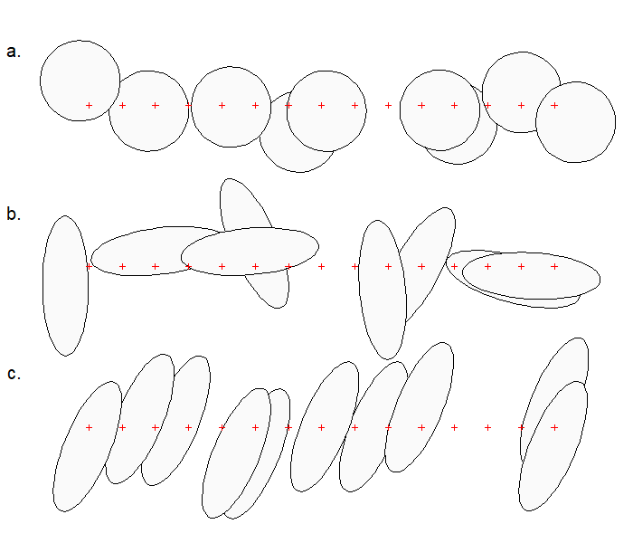

# (PART\*) Study design {-} 

# Performance {#Performance}

This chapter covers topics related to the performance of SECR methods. It is the foundation for Chapter \@ref(Studydesign) on study design. 

## Data requirements for SECR {#datarequirements}

We list here some minimum data requirements that might be labelled "assumptions" but are more fundamental:

1. Sampling is representative of the area of interest 
2. Data are recorded accurately
3. Many individuals are detected more than once
4. Detectors span at least the scale of detection
5. Some individuals are detected at more than one detector

Spatial representativeness (1) is often overlooked. This requirement should be addressed by appropriate study design (Chapter \@ref(Studydesign)). 

Capture--recapture methods do require recaptures (3). The quantitative question (How many is enough?) is addressed in Chapter \@ref(Studydesign).

Requirements 4 and 5 relate to the need for spatial information to estimate the scale of detection ($\sigma$). Deficiencies may be addressed, at least in principle, by combining SECR and [telemetry](#Telemetry), but improved study design is a better solution, and we defer consideration to Chapter \@ref(Studydesign). 

Requirement 5 refers to what are often called 'spatial recaptures'. These are a *sine qua non* of SECR, but their role in determining precision can be overstated. Spatial recaptures are a consequence of (3) and (4), not an independent effect. An animal detected multiple times in an area search is almost inevitably detected at multiple locations, and (5) then follows from (3).

## Assumptions of SECR {#assumptions}

The SECR probability models of Chapter \@ref(Theory) that underlie the methods in this book incorporate certain assumptions. The validity of the methods therefore depends to an extent on how well the field data meet these assumptions. We list these before assessing their impact in practice - the topic of [Robustness](#robustness). 

1. No animals die, emigrate or recruit during sampling
3. Individuals are identified without error
2. The probability of detecting an animal at a particular detector declines radially from a fixed point, its activity centre AC 
6. Probability of detection is constant across individuals, detectors and times, conditional on the AC. 
4. Individuals are detected independently of each other
5. Each detection of an individual is independent of other detections

Restrictive assumptions often may be relaxed under specific extensions to the model. We omit one further assumption: that the probability of detection declines to zero for AC at the edge of the habitat mask where the mask is naturally bounded. This is addressed in the analysis by correct choice of [detection function](#detectfn) and [buffer or mask](#Habitat) as covered in Chapter \@ref(Habitat).

<!-- | | Assumption | Exceptions | -->
<!-- |-|:--------------------------------------------------|:-------------------------------| -->
<!-- |1. | [Population closed (no animals die or recruit during sampling)](#populationclosed) | open population models | -->
<!-- |2. | Probability of detecting each animal declines radially from a fixed point, its activity centre AC || -->
<!-- | | a. [AC distributed uniformly and independently (not clustered or spaced)](#ACindependent)| density models| -->
<!-- | | b. [Home ranges circular (detection function isotropic)](#homerangescircular)|HR oriented randomly wrt detector array; detection model anisotropic | -->
<!-- | | c. [Locations independent within home range](#uncorrelatedlocation) | movement models | -->
<!-- | | d. [Home ranges stationary](#homerangesstationary) | open population and movement models | -->
<!-- |3. | [Individuals are identified without error](#correctidentification) | partial identity models; 'marked, ID uncertain' category of sightings| -->
<!-- |4. | [Individuals are detected independently of each other](#independentindividuals) | simulation-based methods for single-catch traps | -->
<!-- |  | a. Social cohesion || -->
<!-- |  | b. Device effect (single-catch trap) || -->
<!-- |5. | [Each detection of an individual is independent of others](#serialindependence) || -->
<!-- | | a. Device effect | multi-catch traps | -->
<!-- | | b. Behavioural response| model | -->
<!-- |6. | Probability of detection is constant across individuals, detectors and times || -->
<!-- ||a. [All individuals the same, conditional on AC](#individualssame) | covariate effects; random effects e.g., finite mixture | -->
<!-- ||b. [Detectors equally effective](#homogeneousdetectors) | known effort; covariate effects; random effects | -->
<!-- ||c. [No variation over occasions](#notimevariation) | covariate effects, occasion fixed effect | -->

<!--  partial identity models [@Augustine2018] -->

<!-- except as modelled cf @Efford2019 and option of Augustine in @Murphy2016. -->

## Robustness {#robustness}

For assumptions that cannot be met by better design or customized modelling, we fall back on the robustness of SECR estimators. We saw this with the choice of [detection function](#detectfn) in Chapter \@ref(Detection) Fig. \@ref(fig:choicedfparmplot). We care most about estimates of population density, which may be robust even when estimates of other parameters are not. The following treatment concerns density estimates under a null model -- one with uniform density and no additional effects on detection -- except where stated.

Robustness to the failure of a specific assumption is easily assessed by simulation, and there have now been several studies as we review below. Simulation is only part of the answer: we also need to know the real-life magnitude of the breach. The magnitude of some breaches may be assessed from external evidence (e.g. telemetry), but we commonly rely on a more general model that incorporates the effect (e.g., finite mixtures for individual heterogeneity). Ideally, the more general model approaches a naive model when the effect is small.

Another approach is to test specifically for compliance with each assumption. This was popular in the past [@obwa78], but has lost ground along with the declining credibility of null hypothesis testing, the growth of modelling frameworks, and reliance on the inherent robustness of the methods.

### Assumption 1: Population closed  {-}

Births, deaths and dispersal result in population turnover. Over an extended period of turnover, more animals may be observed than were present at any instant, and density estimates will be biased upwards. Studies using automatic cameras often accumulate data slowly over many days, and study duration has triggered much angst e.g., @Harihar2017. How much does a little turnover matter? Conversely, How long can the sampling period be? Results for non-spatial models [@Kendall1999] cannot be transferred. We distinguish turnover due to movement of AC (considered separately under Assumption 7) from *in situ* births and deaths.

@Dupont2019 investigated the effect of increasing study duration on the precision and bias of population size estimates. Their results are complicated by an artefact that caused their Bayesian estimator to be positively biased for short durations [@Dupont2019, p. 669].

<!-- Terrible! Unclear net population change during sampling. Use initial population as reference for RB. -->

We provide some additional [simulations] in an associated document and Fig. \@ref(fig:closure). Turnover in a constant population resulted in positive bias equal to roughly 70\% of the mortality over the duration of the sampling. Thus 50\% annual mortality (~16\% over 3 months) resulted in about +11\% relative bias in a 3-month study, and coverage of nominal 95\% confidence intervals dropped to about 82\%. The new results are broadly consistent with those from the more complex scenarios of @Dupont2019 for 'slow' and 'intermediate' life histories.

(ref:closurecap) Simulated effect of study duration on relative bias (RB) for three levels of annual survival $\phi$. Population constant. $\phi = 1$ corresponds to a closed population.

```{r closure, echo = FALSE, cache = TRUE, out.width = "70%", fig.cap="(ref:closurecap)"}
sims <- readRDS("data/CLOsims.RDS")
RB <- sapply(summary(sims)$OUTPUT, "[", "RB","mean")
nocc <- seq(4,24,4)
phi <- split(1:18, rep(1:3,each=6))   # indices of phi groups
model0 <- lm(I(RB[phi[[1]]]) ~ I(nocc*7))
model1 <- lm(I(RB[phi[[2]]]) ~ I(nocc*7))
model2 <- lm(I(RB[phi[[3]]]) ~ I(nocc*7))
par(pty = "s", mar=c(4,4,4,4), bty = "l")
plot(0,0,type="n", ylim=c(-0.05,0.3), xlim=c(0,365/2), xlab = "Duration (days)", ylab="RB", xaxs = "i")
abline(model0, col="grey")
abline(model1, col="grey")
abline(model2, col="grey")
points(nocc*7, RB[phi[[1]]])
points(nocc*7, RB[phi[[2]]], pch = 16)
points(nocc*7, RB[phi[[3]]], pch = 2)
abline(h=0, lty=2, col="grey")
par(adj=0)
text (200, 0, expression(paste(phi,~ '=' ~ 1.0)), cex = 1.1, xpd = TRUE)
text (200, 0.1, expression(paste(phi,~ '=' ~ 0.75)), cex = 1.1, xpd = TRUE)
text (200, 0.25, expression(paste(phi,~ '=' ~ 0.5)), cex = 1.1, xpd = TRUE)
```

### Assumption 2: Identification without error {-}

We can reasonably assume accurate identification on recapture of animals trapped and marked by conventional methods such as numbered leg bands or ear tags. However, identification may be unreliable with modern methods for passive sampling using natural marks (DNA from hair or faecal samples, and images from motion-sensitive cameras). This is a major limitation.

We briefly acknowledge the issues without attempting to provide solutions.

#### DNA sampling and lab issues {-}

DNA samples degrade over time exposed to heat, moisture and UV light [e.g., @Woodruff2014]. This results in both a lower rate of successful DNA amplification, and increasing frequency of genotyping errors. @Lukacs2005 and @Lampa2013 reviewed the early literature, and citations of those reviews are a good entry point to the voluminous recent literature. @Sethi2014 provide technical advice. A key genotyping error is the phenomenon of allelic dropout, when one allele of a heterozygote fails to amplify, resulting in an apparently homozygous 'ghost' individual. The approach of @Paetkau2003 is based on intensive checking and culling of inadequate samples. @Lukacs2005 raised doubts about possible biases due to sample culling, but these have not been confirmed. 

<!-- Depends on genetic diversity and level of inbreeding in population PID~sib~ -->

<!-- @ebm13 suggested modelling decline in DNA amplification success with duration of interval and environmental conditions, but that belongs elsewhere -->

<!-- (Faecal samples appear to give more trouble?) -->
<!-- @Kubo2023 raccoon dog -->
<!-- @De2022 Asian elephant faecal samples -->

#### Pelage patterns {-}

A single camera may photograph only the left or right flank of a passing animal. Owing to the asymmetry of patterns, identity cannot be inferred conclusively from a single photograph. This can be addressed in the field by using paired cameras, so that both flanks are recorded (tigers). There may still be a minority of single-sided photographs, and probabilistic models have been suggested to incorporate these [@Augustine2018].

<!-- wolverines, Dusit Ngoprasert sunbears, abb, salamanders -->

#### Unknown identity {-}

Unknown identity can be handled in SECR-like probability models. These generally lack power unless supplemented by detections of known individuals or telemetry (references in Appendix \@ref(Telemetry)).
<!-- [@cr13; @rcr15; @vanDamBates2024; @Ruprecht2021] -->


### Assumption 3: Detection declines radially from AC {-}

#### Assumption 3a: AC locations independent {-}

In the original SECR model of @be08 activity centres are considered to be distributed independently according to an inhomogeneous Poisson point process. This allows local density to vary according to habitat or other persistent effects. It does not allow for the spacing behaviour of the animals themselves, leading either to contagion or repulsion of AC. Several authors have ventured into this area [@Russell2012; @Reich2014; @LopezBao2018; @Bischof2020; @McLaughlin2020; @Efford2024]. The general conclusion is that point estimates of density from SECR are robust to clustering of AC due to social behaviour, but the implied overdispersion leads to confidence limits that are too narrow. Non-independence of detection is a distinct issue ([Assumption 4](#independentindividuals)).

#### Assumption 3b: Home ranges circular {-} 

Concerns were expressed by @Ivan2013 about the effect of non-circularity of home ranges. Simulations by @Efford2019 generally defused those concerns, with an important caveat: estimates of the spatial scale of detection $\sigma$ and density are unreliable when elongated home ranges are sampled with a linear array of detectors. Simulations of randomly oriented elliptical ranges with an aspect ratio of 3:1 resulted in bias on the order of +13\% for a linear array [@Efford2019: Fig. 2]. Bias is extreme [often >50\%, @Efford2019: Table 1] when home ranges are both elongated and have a common alignment to the array (Fig. \@ref(fig:alignment)c). Modelling the anisotropy can be beneficial when the alignment is predictable from the landscape [@Murphy2016; @Efford2019] and the array is not exactly linear, but the method is not universally applicable.

(ref:align) SECR models typically assume that home ranges are circular (a). Noncircularity of home ranges causes limited bias in density estimates when ranges are oriented at random with respect to a linear detector array (b). Systematic alignment of ranges to the array (c) causes large bias in $\hat \sigma$ and $\hat D$.

```{r alignment, eval = TRUE, echo = FALSE, out.width = "80%", fig.cap="(ref:align)"}

```

#### Assumption 3c: Locations independent within home range {-}

It is entirely likely that animals use their home ranges in a nested fashion (activity localised within a subinterval) or that some disperse. 
<!-- This may be viewed as a subset of Assumption 6 because if AC are not fixed then successive locations of an individual will be autocorrelated.  -->
The bivariate Ornstein-Uhlenbeck (OU) distribution is a simple autocorrelated model for animal movement within a home range [@Dunn1977; @Johnson2008; @Hooten2017].

```{r OU, echo = FALSE}
# OU algorithm adapted from Supplements of Ben Stevenson 2021 Biometrics paper
simOU.capthist <- function (
        traps,
        popn,
        detectpar = list(),
        noccasions = 100,    # effective "duration"
        epsilon = 10,        # proximity threshold for detection
        output = c('capthist', 'locations'),
        ...)
{
    sim.ou <- function(mu, tau, sigma, n.steps){
        mu <- as.numeric(mu)   # dodge issue with dataframe
        start <- mvtnorm::rmvnorm(1, mu, sigma^2*diag(2))
        b <- -1/tau
        v <- sigma^2
        out <- matrix(0, nrow = n.steps, ncol = 2)
        out[1, ] <- start
        for (i in 2:n.steps){
            out[i, ] <- mvtnorm::rmvnorm(1, mu + exp(b)*(out[i - 1, ] - mu),
                                         v*(1 - exp(2*b))*diag(2))
        }
        out
    }
    captfn <- function (xy) {
        loc.capt <- secr::edist(xy,traps) <= epsilon
        apply(loc.capt, 2, sum)
    }   
    output <- match.arg(output)
    N <- nrow(popn)
    tau <- detectpar$lambda0
    sigma <- detectpar$sigma
    n.steps <- noccasions
    locs <- apply(popn, 1, sim.ou, tau, sigma, n.steps, simplify = FALSE)
    if (output == 'locations') {
        return(locs)
    }
    else {
        capt <- t(sapply(locs, captfn))
        capt <- capt[apply(capt, 1, sum) > 0, ]   # drop null histories
        n <- nrow(capt)
        ch <- array(capt, dim = c(n,1,ncol(capt)), dimnames = list(1:n,NULL,NULL))
        class(ch) <- 'capthist'
        traps(ch) <- traps
        return(ch)
    }
}
```

(ref:demoOU) Examples of correlated movement paths over 100 time steps ($t = 100$). Parameter 'tau' ($\tau$) controls autocorrelation. Red dot indicates activity centre; grey circle is 95\% probability contour of distribution as $t \to \infty$ or $\tau \to 0$.

```{r demoOU1, echo = FALSE, eval = TRUE, cache = TRUE, results = "hide", fig.width=6, fig.height=6, out.width="80%", fig.cap = "(ref:demoOU)"}
par(mfrow=c(2,2), mar = c(1,1,2,1), pty='s')
set.seed(123)
for (tau in c(0.1,1,10,100)) {
    locs <- simOU.capthist(grid, matrix(c(0,0), nrow=1), detectpar = list(lambda0 = tau, sigma = 100), 
                           noccasions = 100, epsilon=10, output = 'locations')
    plot (locs[[1]], type='o', xlim=c(-350,350), ylim = c(-350,350), axes=F, xlab='', ylab='')
    mtext(side = 3, paste('tau = ', tau))
    points(0,0, pch = 16, col='red', cex = 1.2)
    box()
    symbols(0,0,circles=245,inches=FALSE, add = TRUE, fg = grey(0.8))
}
```

(ref:rpsvOU) Bivariate normal distribution fitted to samples from various Ornstein-Uhlenbeck distributions; scale parameter $\sigma$ averaged over $\approx 200$ tracks.

```{r rpsvOU, cache = TRUE, echo = FALSE, fig.width=6, fig.height=6, out.width="80%", fig.cap = "(ref:rpsvOU)", eval = TRUE}
RPSVxy <- function(xy) {
    n <- nrow(xy)
    ss <- function (x) sum(x^2) - (sum(x))^2/n
    sqrt(sum(apply(xy,2,ss))/(2 * (n-2)))
}
grid <- make.grid(nx = 8, ny = 8, spacing = 100, detector = "count")
set.seed(12345)
popn <- sim.popn(D = 1, core = grid, buffer = 500)  # a set of AC
onetau <- function (tau, n.steps) {
    locs <- simOU.capthist(grid, popn, detectpar = list(lambda0 = tau, sigma = 100), 
                           noccasions = n.steps, epsilon=10, output = 'locations')
    mean(sapply(locs, RPSVxy))
}
tauval <- 10^seq(-0.5,4,0.5)
steps <- c(20, 100, 500)
par(mfrow = c(1,1), mar = c(5,4,4,4))
plot(1,1,type='n', xlim=range(tauval), log='x', ylim=c(0,120), xlab = 'tau', ylab = 'RPSV')
for (i in 1:3) {
    out <- sapply(tauval, onetau, steps[i])
    lines(tauval, out, pch = 15+i, type='b')
}
legend(800, 110, legend = steps, lty=1, pch=16:18, title = 'n.steps')
```

One consequence of autocorrelation is that the overall spatial scale increases with the duration and decreases with autocorrelation (Fig. \@ref(fig:rpsvOU)). With respect to telemetry, @Otis1999 concluded that autocorrelation *per se* did not bias inference for so long as summary statistics were not generalized beyond the sampling frame. 

> Sampling designs that predefine a time frame of interest, and that generate representative samples of an animal's movement during this time frame, should not be affected by length of the sampling interval and autocorrelation.

The analogy with SECR is close: we are concerned with unbiased estimation of the detection parameters $\lambda_0, \sigma$ that describe the detection process *over the time frame of sampling*. Extrapolation to other time frames would require knowledge of the correlation structure of the data, expressed in a model such as the bivariate Ornstein-Uhlenbeck distribution [e.g., @Dunn1977; @Hooten2017], but that is not relevant to inference for the chosen time frame.

@Royle2015 modelled movement patterns they called "transience" (a Gaussian random walk) and "dispersal" (discrete shift of AC). They concluded

> ... while estimators of density are extremely robust, even to pathological levels of movement (e.g., complete transience), the estimator of the spatial scale parameter of the encounter probability model is confounded with the dispersal/transience scale parameter. 

Why does spatial scale matter if temporal scale doesn't?

#### Assumption 3d. Home ranges stationary {-}

There remains a concern that movement over long durations breaches the closure assumption (1) [@Harihar2017].

@Royle2015 "dispersal"

### Assumption 4: Probability of detection constant {-}

@obwa78 classified non-spatial capture--recapture models according to three possible sources of variation in detection probability: time (t -- sampling occasion), behaviour (b -- learned response to capture) and heterogeneity (h -- persistent individual differences). Models may accommodate any one of these sources (t, b, h) or their combinations (tb, th, bh, tbh). Space adds other sources of variation -- most simply, detection probability may also vary between detectors (d) -- and more complex potential interactions. 

For SECR we have at least two parameters that control detection ($g_0$ or $\lambda_0$, and $\sigma$).

Detection parameters may also be considered a function of AC location, but for (relative) simplicity we stick to t, b, h, and d.

#### Temporal variation {#temporalvariation .unnumbered}

@Sollmann2024 reached the conclusion from simulations that temporal variation in the baseline detection probability $g_0$ may safely be ignored when fitting SECR models. Comparison of null and temporal models seldom results in different estimates of density. 

Further [simulations] confirm the lack of bias in $\hat D$, but show that temporal variation in $\sigma$ causes significant bias in estimates of both $\lambda_0$ and $\sigma$ under the null model (Fig. \@ref(fig:Mtfigure)).

(ref:Mtcap) Relative bias of parameter estimates from null model given for temporal variation on lambda0 or sigma.

```{r Mtfigure, eval = TRUE, echo = FALSE, message=FALSE,  fig.width = 8, fig.height = 4, out.width="90%", fig.cap = "(ref:Mtcap)" }
library(secrdesign)
Mtsims <- readRDS(file = 'data/Mtsims.RDS')
estD <- estimateSummary(Mtsims)[,-1]
estL <- estimateSummary(Mtsims, 'lambda0')[,-1]
estS <- estimateSummary(Mtsims, 'sigma')[,-1]
par(mfrow=c(1,2), mar=c(4,4,1,1), mgp=c(2.4,0.7,0), bty = 'o')
x <- seq(0,0.4,0.1)
plot(0,0,type='n', xlim=c(0,0.4), ylim=c(-0.4,0.4), xlab = 'CV(lambda0)', ylab='RB')
abline(h=0, lty=2)
points(x, estD$RB[1:5], type='o', pch=16)
points(x, estL$RB[1:5], type='o', pch=1)
points(x, estS$RB[1:5], type='o', pch=2)
legend(0.01, 0.39, legend=c('D','lambda0','sigma'), pch=c(16,1,2))
plot(0,0,type='n', xlim=c(0,0.4), ylim=c(-0.4,0.4), xlab = 'CV(sigma)', ylab='RB')
abline(h=0, lty=2)
points(x, estD$RB[c(1,6:9)], type='o', pch=16)
points(x, estL$RB[c(1,6:9)], type='o', pch=1)
points(x, estS$RB[c(1,6:9)], type='o', pch=2)
legend(0.01, 0.39, legend=c('D','lambda0','sigma'), pch=c(16,1,2))
```

#### Behavioural responses {#behaviour .unnumbered}

We introduced behavioural responses in Chapter \@ref(Detection). Behavioural responses may also be treated as a breach of the [assumption of serial independence](#serialindependence), but we keep them here for consistency with the non-spatial literature.

The discovery of a detector and experience of capture may result in either a positive (trap-happy) or negative (trap-shy) change in detection probability. The response may persist for the duration of sampling or be transient (Markovian) and apply only at the next sampling occasion. In SECR there is the further complication that the response may be general, applying across all detectors, or localised to the initial detector.  

Each of these responses is readily modelled if the sequence of detections is known. This is generally not the case with proximity detectors, for which an animal may visit multiple detectors on one sampling occasion. We therefore restrict consideration of learned responses to trapping data (single-catch and multi-catch traps). This is not a great loss, as proximity detectors are typically non-invasive and less likely than traps to affect behaviour.

If a behavioural response is not modelled then it may cause a heavy bias in density estimates, positive for trap shyness and negative for trap happiness (Fig. \@ref(fig:Mbfigure)). In [simulations] we describe the magnitude of the behavioural response by a 'recapture factor' by which the initial (naive) hazard is multiplied after first capture. We simulated recapture factors between 0.25 and 2.0, where 1.0 represents no behavioural response.  The bias is much reduced if the effect is detector-specific, but then $\hat \sigma$ is also biased. For the scenario used in these [simulations], the relative bias of density estimates fell between -10\% and +10\% for recapture factors between 0.5 and 2. In Chapter \@ref(Detection) we estimated a much larger response by [deermice](#behaviouralresponse) (about 10-fold, but with poor precision), although there was only a small difference in estimated density between the null and bk models. Behavioural responses are potentially important for SECR and deserve closer investigation.

(ref:Mbcap) Relative bias of parameter estimates from null model given behavioural variation in lambda0. Relative bias of density was off-scale (+1.41) for recapture factor 0.25 with a general behavioural response.

```{r Mbfigure, eval = TRUE, echo = FALSE, fig.width = 8, fig.height = 4, out.width="90%", fig.cap = "(ref:Mbcap)" }
Mbsims <- readRDS(file = 'data/Mbsims.RDS')
estD <- estimateSummary(Mbsims)[,-1]
estL <- estimateSummary(Mbsims, 'lambda0')[,-1]
estS <- estimateSummary(Mbsims, 'sigma')[,-1]
par(mfrow=c(1,2), mar=c(4,4,2.5,1), mgp=c(2.4,0.7,0), bty = 'o')
x <- c(0.25,0.5,1,1.5,2)

plot(0,0,type='n', xlim=c(0,2), ylim=c(-0.8,1), xlab = 'Recapture factor', ylab='RB')
abline(h=0, lty=2)
points(x, estD$RB[1:5], type='o', pch=16)
points(x, estL$RB[1:5], type='o', pch=1)
points(x, estS$RB[1:5], type='o', pch=2)
legend(1.33, -0.3, legend=c('D','lambda0','sigma'), pch=c(16,1,2), cex=0.9)
mtext(side=3, line=0.5, 'General behavioural response (b)', cex = 0.9)

plot(0,0,type='n', xlim=c(0,2), ylim=c(-0.8,1), xlab = 'Recapture factor', ylab='RB')
abline(h=0, lty=2)
points(x, estD$RB[6:10], type='o', pch=16)
points(x, estL$RB[6:10], type='o', pch=1)
points(x, estS$RB[6:10], type='o', pch=2)
legend(1.33, -0.3, legend=c('D','lambda0','sigma'), pch=c(16,1,2), cex = 0.9)
mtext(side=3, line=0.5, 'Trap-specific behavioural response (bk)', cex = 0.9)
```


#### Homogeneity across detectors {#homogeneityofdetectors .unnumbered}

Spatial (detector-specific) variation in detection parameters is conceptually linked to individual heterogeneity. The location of each individual determines its detection probability via a particular set of AC-detector distances, as modelled automatically in SECR. Variation among detectors in efficiency adds between-animal heterogeneity that is not modelled automatically.


Spatial variation in detection probability is the probably the most worrying source of difficulty for SECR. Key papers are @Royle2013, @e14, @Moqanaki2021, @Stevenson2021, @Dey2023 and @McLellan2023.

Unstructured heterogeneity


Structured heterogeneity
- shared across animals
- animal x detector interaction (specified by Gaussian random field in @Stevenson2021)

vs density (single-catch traps)

cf @Royle2013 vs @e14

cf @Moqanaki2021
<!-- "Highly-autocorrelated spatial heterogeneity in detection probability (Moran’s I = 0.85–0.96), -->
<!-- modulated by the magnitude of the unmodeled heterogeneity, can lead to pronounced negative bias -->
<!-- (up to 65%, or about 44-fold decrease compared to the reference scenario), reduction in precision (249% or 2.5-fold) and coverage probability of the 95% credible intervals associated with abundance estimates to 0. Conversely, at low levels of spatial autocorrelation (median Moran’s I = 0), even severe unmodeled -->
<!-- heterogeneity in detection probability did not lead to pronounced bias and only caused slight reductions in precision and coverage of abundance estimates." -->

@Stevenson2021 proposed that for each individual there is a latent log-Gaussian random field that modifies its frequency of detection at a particular detector; spatial autocorrelation in the field induces spatial correlation in the rate of detection at adjacent detectors (detection events themselves occur independently). They presented a method for estimating parameters of the latent random field (variance $\sigma_u^2$ and scale of autocorrelation $\rho$) along with the usual SECR parameters. Under their model the detection probability of an AC at a particular location $p_\cdot(\vec x; \theta)$ is a random variable with CV that increases towards the periphery. This individual heterogeneity causes negative bias in estimates of $\lambda_0$ and $\sigma$ (and hence density) when a null SECR model is fitted. For their simulation scenario, the absolute relative bias of $\hat D$ is negligible ($<3\%$) when $\sigma_u < 0.5$ and reaches 10\% when $\sigma_u \approx 0.8$. A log-normal distribution with mean-log 0 and sd-log 0.83 has CV $\approx 100\%$, so the latent random field must add substantial variance before the effect is felt strongly. The authors present an example with CV $\approx x$ and $-18\%$ bias in $\hat D$.

<!-- claim spatial covariance analogous to temporal covariance (i.e. learned or behavioural effects) in non-spatial capture--recapture. -->

SIMULATE EFFECTS on lambda0, sigma, a(theta)

#### Individual heterogeneity {#individualheterogeneity .unnumbered}

### Assumption 5: Individuals are detected independently {#independentindividuals .unnumbered}

Animals that move in groups are unlikely to be detected independently. @Bischof2020 labelled the phenomenon "cohesion". The primary result is overdispersion and underestimation of the sampling variance. Confidence intervals will be too narrow, resulting in less-than-nominal coverage. Earlier optimism [@Bischof2020] that a measure of overdispersion would correct for the underestimation appears to be unwarranted [@Efford2024].

@McLaughlin2020 modelled random associations between adjacent neighbours; the method has yet to find general application.

Animals are not detected independently in single-catch traps. Maximizing the multi-catch likelihood provides unbiased estimates of density and spatial scale in most cases (see @Distiller2015 for an exception), but estimates of the intercept of the detection function ($g_0$, $\lambda_0$) may be strongly biased. The coverage of confidence intervals based on the multi-catch likelihood has yet to be assessed. An algorithm combining simulation and inverse prediction allows unbiased estimation of all parameters [@e04; @Efford2023], but lacks the flexibility of MLE.

### Assumption 6: Detections of an individual are independent {#serialindependence .unnumbered}

Trapping by definition causes non-independence of detection events: an animal that is captured cannot be caught anywhere else until released. Models exist for non-independence with multi-catch traps as we saw in Chapter \@ref(Theory). These may be used for single-catch traps, with certain caveats, although simulation-based methods may be preferable [@Efford2023].

A more problematic form of dependence arises when a single visit to a passive detector results in multiple observations. This can happen when DNA is amplified from multiple hair samples left at a hair snag, or when a camera takes multiple photographs of an animal on a single visit. Analysing such data as if they were independent events results in overdispersion and accompanying underestimation of sampling variance. A simple solution is to collapse counts to binary observations.

In the basic SECR model of Chapter \@ref(Theory) the next detection of an individual may happen anywhere in its home range, regardless of where it was last detected. More biologically realistic patterns of movement lead to sequential dependence of locations. This...

### Summary of robustness to breaches of assumptions

General satisfaction with SECR

@Sollmann2024 -

> Similar to traditional closed CMR models (Otis et al., 1978; Williams et al., 2002), ignoring temporal variation in p0 in SCR models had little effect on estimates of abundance, the density-covariate relationship, or space use (σ). As such, this study provides yet more evidence that density estimates from SCR models are robust to various forms of mis-specification of the detection model. They have been shown to be robust to unmodeled spatial heterogeneity in detection probability, so long as that heterogeneity is not spatially autocorrelated (Efford et al., 2013; Bischof et al., 2017; Moqanaki et al., 2021), and to a range of misspecifications of the detection function (Efford, 2004; Royle et al., 2014; Dey et al., 2022). In the latter case, though, inference about σ can be strongly affected by choosing the wrong detection function (Dey et al., 2022). In contrast, I found that estimates of σ were robust to ignoring temporal variation in detection. As σ in most applications relates to a stationary activity center and is modeled as constant across occasions, it appears sufficient to take into account spatial variation in p0 to obtain unbiased estimates of σ. It is conceivable that in closed SCR models where activity centers are allowed to move (Royle et al., 2016), not accounting for temporal variation in p0 may affect estimates of σ. Exploring this was beyond the scope of this study.

Estimates are generally robust or the magnitude of bias is predictable once the effect is known ($\phi$, CV(a))

Particular problems are

* global behavioural response (vs detector-specific) 
* large heterogeneity
* correlated variation in detection and density
* alignment of home ranges with detector array

Several breaches lead to underestimation of sampling variance and impaired coverage of confidence intervals.

Particular detection parameters may be estimated poorly even when density estimates are robust. The commonest example is the intercept of the detection function when a multi-catch model is used for single-catch data.

## General challenges

Not everyone has fallen over themselves to endorse the robustness of SECR density estimates. 

@Theng2022 general robustness; mechanistic simulation

Field tests

@Gerber2015 known population

@DespresEinspenner2017 chimpanzees

@McLellan2023: not robust when variation in density and detection are correlated

@Smith2020 "caution against the casual repurposing of non-spatial capture-recapture data using SCR"

## Goodness-of-fit

Why bother?

`secr.test`

<!-- new simulation paper MEE-23-11-662 -->
<!-- "A foundational development in frequentist methods for diagnosing fit in spatial capture-recapture" -->

## Speed

### Multi-threading

### Scaling with mask points etc.

### Restricted mask

<!-- @Milleret -->

@Turek2021

[simulations]: https://www.otago.ac.nz/density/simulations/secr-simulations.html