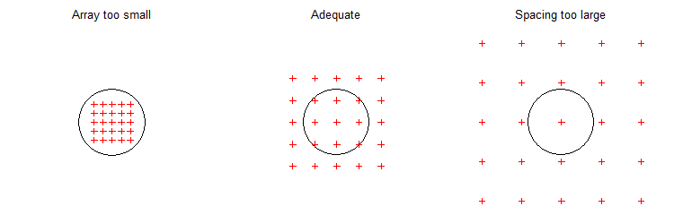
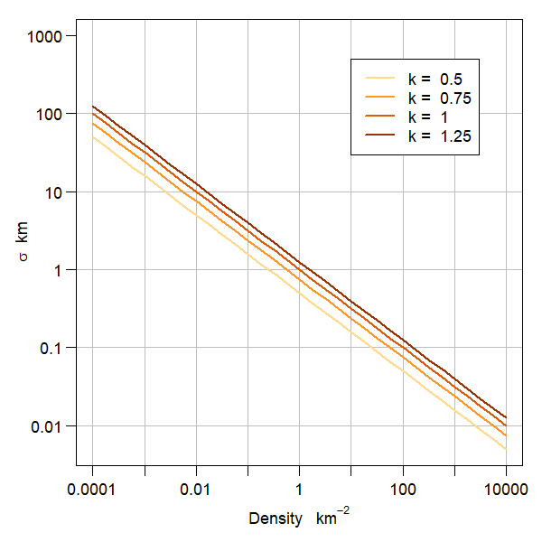
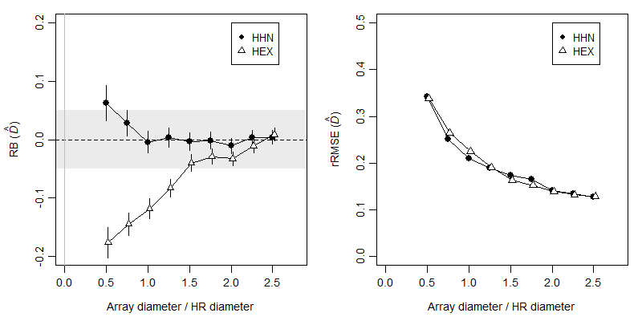

# Study design {#Studydesign}

## Data requirements for SECR {#datarequirements}

We list here some minimum data requirements that might be labelled "assumptions" but are more fundamental. They should be addressed by appropriate study design.

1. **Sampling representative of the area of interest** 

This requirement is important and easy to overlook. The problem takes care of itself when detectors are placed throughout the area of interest, exposing all individuals to a similar probability of detection. This is usually too costly when the area of interest is large. Sub-sampling is then called for, and we consider the options later.

2. **Many individuals detected more than once **

This is common to all capture--recapture methods. Estimation of detection parameters conditions on the first detection, and detections after the first are needed to estimate a non-zero detection rate. The quantitative question (How many is enough?) is addressed later. 

3. **Spread adequate to estimate spatial scale of detection**

By 'spread' we mean the spatial extent of the *detections* of each individual. The spread of detections may be inadequate in two respects:

* individuals are detected at only one detector, or
* an individual may be detected at all detectors.

Adequate spread is achieved by matching the size and spacing of a detector array to the scale of movement, as shown schematically in Fig. \@ref(fig:goldilocks3).
 
(ref:goldilockscap) Three scenarios for array size in relation to home range size. For intuition we use a circle to  indicate a hard-edged uniform home range. When the array is too small, recaptures are equally likely anywhere in the array.  When the spacing is too large, recaptures must be at the same detector. In either case, the recaptures carry almost no information on the spatial scale of detection $\sigma$.

```{r goldilocks3, eval = TRUE, echo = FALSE, out.width = "80%", fig.cap = "(ref:goldilockscap)"}

```

Some qualification is needed here. We require only that *some* individuals are detected at more than one detector, and that the detector array is large enough to differentiate points in the middle and edge of *some* home ranges. Failure to meet the 'spread' requirement may be addressed, at least in principle, by combining SECR and [telemetry](#Telemetry), but improved study design is a better solution. 

A poorly designed detector array may give data that cannot be analysed by SECR, or provide highly biased estimates of low precision. Such designs were described by @eb19 as 'pathological'. We seek a non-pathological and representative design that gives the most precise estimates possible for a given cost. 

## Tools for design

**secrdesign** and [secrdesignapp](https://www.stats.otago.ac.nz/secrdesignapp/)

## Design flowchart?

Pilot values

Area of interest = scope of inference

Logistical and cost constraints: capital outlay (number of detectors), number of occasions, travel time, person-days

Candidate designs (discrete, continuous)

Characterise designs wrt n, r, m

## Pilot parameter values

To evaluate a potential study design we must know something about the target population. Here we describe the population and the behaviour of individuals by a simple SECR model and its parameters: uniform density $D$ and the parameters $\lambda_0$ and $\sigma$ of a hazard half-normal [detection function](#detectfn). Predictions regarding the suitability and performance of any design then depend on the values of $D, \lambda_0$ and $\sigma$. This seems like a catch-22 -- impossible until we have estimates -- but for design purposes we can call on approximate values from multiple sources

* published estimates from studies of similar species,
* a low-precision pilot study, or
* indirect inference.

Indirect inference is a murky option, but better than nothing, and there are some constraints. The quantity $k = \sigma \sqrt D$ (loosely described by @edjq16 as an index of home range overlap) usually falls in the range 0.3--1.3 for solitary species (M. Efford unpubl.). The intercept and spatial scale parameters of the *hazard* detection functions ($\lambda_0, \sigma$) may be substituted for design purposes by the parameters of the corresponding *probability* detection function ($g_0, \sigma$)[^dfcast].

[^dfcast]: The internal function `dfcast` of **secrdesign** provdes a more precise match e.g., `secrdesign:::dfcast(detectfn = 'HN', detectpar=list(g0 = 0.2, sigma = 25))` 

(ref:kplotcap) Relationship between density and the spatial scale parameter $\sigma$ for different values of the overlap index $k$.

```{r kplot, eval = TRUE, echo = FALSE, out.width = "50%", fig.cap = "(ref:kplotcap)"}

```

Reviews of SECR studies are a useful source of pilot estimates [e.g., @Palmero2023]. The hardest parameter to pin down is $\lambda_0$, as this is very study-specific. The good news is that it has only a secondary effect on the relative merits of different array designs. 

We can use the close analogy between the detection function and a home-range utilisation distribution to extract a pilot value of $\sigma$ from home range data. Most directly, a circular bivariate normal (BVN) model can be fitted to telemetry data; we then use the dispersion parameter directly as a pilot value of $\sigma$ for hazard half-normal detection. If the home range data have been summarised as the area $a$ within a notional 95\% activity contour then the spatial scale parameter of the hazard half-normal is close to $\sigma = \sqrt \frac{a}{6 \pi}$ [@Jennrich1969 Eq. 13][^jennrich]. 

[^jennrich]: More generally, $\sigma = \sqrt \frac{a}{\pi \log [(1-p)^{-2}]}$ where $p$ is the probability contour e.g., $p = 0.95$.  [@Jennrich1969 Eq. 12].

### Statistics to characterise a design

Given some pilot parameter values, we might proceed directly to simulating data from different designs and computing the resulting SECR estimates. This is effective, but slow. A useful preliminary step is to calculate the expected values of these count statistics:

* $n$ &nbsp; the number of distinct individuals detected at least once,
* $r$ &nbsp; the total number of re-detections (any detection after an individual is first detected), and
* $m$ &nbsp; the total number of movements (re-detections at a detector different to the preceding one)[^spatialrecaptures].

[^spatialrecaptures]: The term 'spatial recaptures' has been used. These are a *sine qua non* of SECR, but their role in determining precision can be overstated. Spatial recaptures are a consequence of requirements (2) and (3), not an independent effect. Furthermore, 'spatial recaptures' are ill-defined when detections are aggregated by time, as then we cannot distinguish the capture histories ABABA and AAABB at detectors A and B (both are 3A, 2B).

The counts depend also on the detector configuration, the extent of habitat (buffer width), and the type of detector (trap, proximity detector etc.). Formulae are given [here](https://www.otago.ac.nz/density/pdfs/secrdesign-Enrm.pdf). Calculation is fast and the counts give insight on whether the data generated by a design are likely to be adequate. $\mbox E(r)$ is a direct measure of Requirement 2 above. $\mbox E(m)$ addresses the first part of Requirement 3 ('Spacing too large' in Fig. \@ref(fig:goldilocks3)). 

@eb19 found that $\mbox E(n)$ and $\mbox E(r)$ alone were often sufficient to predict the precision of SECR density estimates, and maximum precision was achieved when $\mbox E(n) \approx \mbox E(r)$. 

### Array size

We lack a count statistic matching the second part of Requirement 3 ('Array too small' in Fig. \@ref(fig:goldilocks3)). An *ad hoc* measure is the diameter of the array (the distance between the most extreme detectors) divided by the nominal diameter of a 95\% home range. The 95\% home-range radius is $R_{0.95} \approx 2.45 \sigma$ for a BVN utilisation distribution (from the previous formula).

<!-- Efford 2011 polygon simulations Table 3 -->

(ref:ARRplotcap) Effect of array size on relative bias (RB) and relative root-mean-square error (rRMSE) of density estimates. Simulations of a square array with size (diagonal length) divided by the diameter of a 95\% BVN home range. Density was estimated either with the detection function used to generate the data (HHN) or a mis-specified detection function (HEX).

```{r ARRplot, eval = TRUE, echo = FALSE, out.width = "80%", fig.cap = "(ref:ARRplotcap)"}

```


### Detector spacing

## How many detections? How many re-detections?


## Representative sampling

region of interest  

Uniform coverage of region

random placement; GRTS

clustered detectors

novel designs  
  lacework
  coverage sampling (edge effects)

stratified designs?

## Optimization


The questions When does scale become an issue? and How many spatial detections are needed?


@Efford2019

Guidance from @Palmero2023 camera trapping: Their workflow Fig. 4 does not mention representativeness. Advocate "...increasing detection probability by focussing camera deployments at highly used sites (Sollmann et al. 2012, Green et al. 2020, Harmsen et al. 2020)"

## Pilot values of detection parameters

### literature
### ad hoc
#### sigma from home range area
#### lambda0 from n

## Region of interest

Designs giving representative spatial coverage

* SRS
* systematic random
* clustered
* lacework

## Data requirements

Minimally, avoid pathology

<!-- ## Detector clusters -->

<!-- For surveying large areas it is efficient to use groups of detectors: within a group the detectors are close enough that animals may be re-detected at multiple points, while groups of detectors may be distributed across a region according to a probability design to sample possible spatial variation in density. **secr** allows for detector groups with the 'cluster' data structure. This is an attribute of a traps object that records which detectors belong to which cluster[^3]. -->

<!-- [^3]:Clusters are assumed to share the same geometry (number of detectors, -->
<!-- within-cluster spacing etc.). -->

<!-- Functions are provided to generate detector arrays with a clustered -->
<!-- structure (`trap.builder`, `make.systematic`), to extract or replace -->
<!-- the cluster attribute (`clusterID`), to compute the geometric centres -->
<!-- and numbers of detections per cluster (`cluster.centres`, -->
<!-- `cluster.counts`), etc. -->

<!-- A lacework design (Efford in prep.) is an alternative to a clustered design that is suitable when the region is intermediate size. Lacework designs may be constructed with `make.lacework`. -->

(ref:Tip) Data from a large, clustered design may often be analysed more quickly if the 'capthist' object is first collapsed into one using the geometry of a single cluster (the object retains a memory of the number of individuals from each original cluster in the attribute 'n.mash'). Use the function `mash` for this. Functions `derived`, `derivedMash` and the method `predict.secr` use 'n.mash' to adjust their output density, SE, and confidence limits.

[expected counts]: https://www.otago.ac.nz/density/pdfs/secrdesign-Enrm.pdf
[Github](https://htmlpreview.github.io/?https://github.com/MurrayEfford/secr-simulations/blob/main/ARR/secr-simulations-ARR.html)