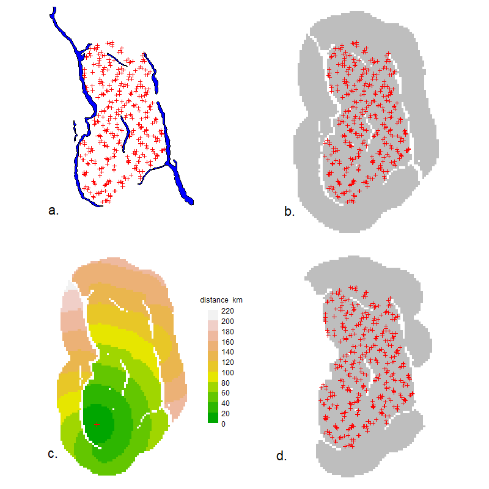
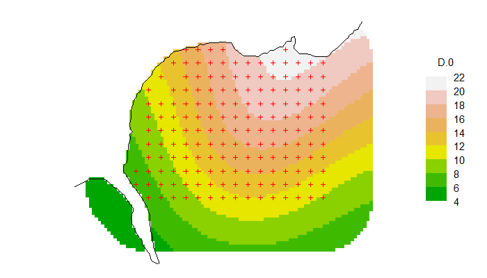
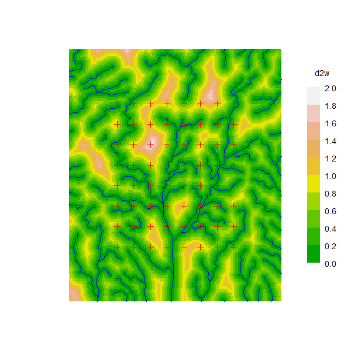
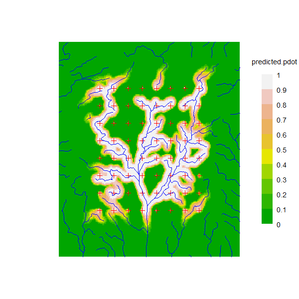

# Non-Euclidean distances {#Noneuclidean}
\index{Non-euclidean distances}

```{r, file = "commoncode.R", echo = FALSE, warning=FALSE, message = FALSE, results="hide"}
# startup code, including library(secr) etc.
```

<!-- More content in secr-noneuclidean.rmd -->

<!-- ## Non-Euclidean distances -->
 
 <!-- 'Distance' in SECR models usually, and by default, means the -->
 <!-- Euclidean distance $d = \sqrt{(x_1-x_2)^2 + (y_1 - y_2)^2}$. The -->
  <!-- observation model can be customised by replacing the Euclidean -->
  <!-- distance with one that 'warps' space in some ecologically meaningful -->
  <!-- way. There are innumerable ways to do this. Royle et al. (2013) -->
  <!-- envisioned an 'ecological distance' that is a function of landscape covariates. Redefining distance is a way to model spatial variation in the size of home ranges, and hence the spatial scale of movement $\sigma$; @edjq16 use this to model inverse covariation between density and home range size. Distances measured along a linear habitat network such as a river system are also non-Euclidean (see package **secrlinear**). -->
  
<!-- **secr** provides general tools for specifying and modelling non-Euclidean distance, via the `secr.fit` details component 'userdist'. This may be a user-specified function or a pre-computed matrix. -->

Spatially explicit capture--recapture (SECR) entails a distance-dependent observation model: the expected number of
detections ($\lambda$) or the probability of detection (g) declines with increasing distance between a detector and the home-range centre of a focal animal. 'Distance' here usually, and by default, means the Euclidean distance $d = \sqrt{(x_1-x_2)^2 + (y_1 - y_2)^2}$. The observation model can be customised by replacing the Euclidean distance with one that 'warps' space in some ecologically meaningful way. There are innumerable ways to do this. One is the a non-Euclidean 
'ecological distance' envisioned by @rcgg13.

This document shows how to define and use non-Euclidean distances in **secr** 4.6. An appendix gives example **secr** code for the non-Euclidean SECR analysis of @sfr15.

## Basics

Non-Euclidean distances are defined in **secr** by setting the 'userdist' component of the 'details' argument of `secr.fit`. The options are (i) to provide a static $K \times M$ matrix containing the distances between the $K$ detectors and each of the $M$ mask points, or (ii) to provide a function that computes the distances dynamically. A static distance matrix can allow for barriers to movement. Providing a function is more flexible and allows the estimation of a parameter
for the distance model, but evaluating the function for each likelihood slows down model fitting.

## Static userdist

\index{Non-euclidean distances ! static}
```{r setup, echo = FALSE, message = FALSE, results = 'hide'}
library(sp)
workdir <- "d:/density secr 4.6/knitr/secr-noneuclidean/"
```

```{r static0, echo = FALSE, eval = TRUE, cache = TRUE, message = FALSE, results="hide"}
# code for nefig
load(paste0(workdir, "CS.Rdata"))
load(paste0(workdir, "BLKS_BC.RData"))
png(file = paste0(workdir, "nefig.png"), width=800, height=800)

par(mfrow=c(2,2), mar=c(1,4,1,4), cex=1.8, col="black")
plot(CStraps, gridl=F, border = 30000)
selectedlakes <- c(1730, 2513, 2514, 2769, 2686, 2749)
plot(BLKS_BC[selectedlakes,], col="blue", add=T)
text(1546000, 510000, "a.", xpd=T, col="black")

CSmask2000 <- make.mask (CStraps, buffer = 30000, type = 
    "trapbuffer", spacing = 2000, poly = BLKS_BC, poly.habitat = 
     FALSE, keep.poly = FALSE)
plot(CStraps, gridl = FALSE, border = 30000, hidetr = TRUE)
plot(CSmask2000, dots = FALSE, add = TRUE)
plot(CStraps, add = TRUE); par(col="black", cex=1.8)
text(1537000, 510000, "b.", xpd = TRUE)

CSmask500 <- make.mask (CStraps, buffer = 30000, type = "trapbuffer", 
    spacing = 500, poly = BLKS_BC, poly.habitat = F, keep.poly = F)
userd <- nedist(CStraps, CSmask2000, CSmask500)

dmap <- function (traps, mask, userd, i = 1, ...) {
    if (is.na(i)) i <- nearesttrap(unlist(locator(1)), traps)
    covariates(mask) <- data.frame(d = userd[i,])
    covariates(mask)$d[!is.finite(covariates(mask)$d)] <- NA  
    plot(mask, covariate = "d", ...)  
    points(traps[i,], pch = 3, col = "red")
}
par(cex=1.1, col = "black")
dmap(CStraps, CSmask2000, userd, dots = F, scale = 0.001, title = "distance  km")
par(cex = 1.8)
text(1537000, 510000, "c.", xpd=T, col="black")

OK <- apply(userd, 2, min) < 30000
CSmask2000b <- subset(CSmask2000, OK)
plot(CStraps, gridl=F, border = 30000, hidetr=T)
plot(CSmask2000b, dots = F, add=T)
plot(CStraps, add = T); par(col="black", cex=1.8)
text(1537000, 510000, "d.", xpd=T, col="black")

dev.off()
```

A pre-computed non-Euclidean distance matrix may incorporate constraints on movement, particularly mapped barriers to movement, and this is the most obvious reason to employ a static userdist. The function `nedist` builds a suitable matrix.

As an example, take the 1996 DNA survey of the grizzly bear population in the Central Selkirk mountains of British Columbia by @ms00. Their study area was partly bounded by lakes and reservoirs that we assume are rarely crossed by bears. To treat the lakes as barriers in a SECR model we need a matrix of hair snag -- mask point distances for the terrestrial (non-Euclidean) distance between each pair of points.

We start with the hair snag locations `CStraps` and a SpatialPolygonsDataFrame object `BLKS_BC` representing the large lakes (Fig. \@ref(fig:nefig)a). Buffering 30 km around the detectors gives a naive mask (Fig. \@ref(fig:nefig)b); we use a 2-km pixel size and reject points centred in a lake. The shortest dry path from many points on the naive mask to the nearest detector is much longer than the straight line distance.
```{r static1, eval = TRUE, cache = TRUE}
CSmask2000 <- make.mask (CStraps, buffer = 30000, type = "trapbuffer", 
      spacing = 2000, poly = BLKS_BC, poly.habitat = F, keep.poly = F)
```

```{r nefig, echo = FALSE, out.width = "95%", fig.cap = "(a) Central Selkirk grizzly bear hair snag locations, (b) Mask using naive 30-km buffer around hair snags, (c) Example map of dry-path distances from an arbitrary point, and (d) Efficient mask rejecting dry-path distances >30km."}

```

We next calculate the matrix of all dry detector--mask distances by calling `nedist` that in turn uses functions from the R package **gdistance** [@R-gdistance]. Missing pixels in the mask represent barriers to movement when their combined width exceeds a threshold determined by the adjacency rule in **gdistance**. 

What do we mean by an adjacency rule? **gdistance** finds least-cost distances through a graph formed by joining 'adjacent' pixels. Adjacent pixels are defined by the argument 'directions', which may be 4 (rook's case), 8 (queen's case) or 16 (knight and one-cell queen moves) as in the **raster** function `adjacent`. The default in `nedist` is 'directions = 16' because that gives the best approximation to Euclidean distances when there are no barriers. The knight's moves are $\sqrt 5 \approx 2.24$ $\times$ cell width ('spacing'), so the width of a polygon intended to map a barrier should be at least 2.24 $\times$ cell width.

Some of the BC lakes are narrow and less than 4.48 km wide. To ensure these act as barriers we could simply reduce the spacing of our mask, but that would slow down model fitting. The alternative is to retain the 2-km mask for model fitting and to define a finer (0.5-km) mask purely for the purpose of computing distances[^droppedcells]:

```{r static2, eval = TRUE, cache = TRUE}
CSmask500 <- make.mask (CStraps, buffer = 30000, type = 
    "trapbuffer", spacing = 500, poly = BLKS_BC, poly.habitat =
     FALSE, keep.poly = FALSE)
userd <- nedist(CStraps, CSmask2000, CSmask500)
```
The first argument of `nedist` provides the rows of the distance matrix and the second argument the columns; the third (if present) defines an alternative mask on which to base the calculations. To verify the computation, map the distance from a chosen detector $i$ to every point in a mask. Here is a short function to do that; see Fig. \@ref(fig:nefig)c for an example. 

[^droppedcells]:Mixing 2-km and 0.5-km cells carries a slight penalty: the centres of a few 2-km cells (<1\%) do not lie in valid 0.5-km cells; these become inaccessible (infinite distance from all detectors) and are silently dropped in a later step.

```{r dmap, eval = FALSE, cache = TRUE}
dmap <- function (traps, mask, userd, i = 1, ...) {
    if (is.na(i)) i <- nearesttrap(unlist(locator(1)), traps)
    covariates(mask) <- data.frame(d = userd[i,])
    covariates(mask)$d[!is.finite(covariates(mask)$d)] <- NA  
    plot(mask, covariate = "d", ...)  
    points(traps[i,], pch = 3, col = "red")
}
dmap(CStraps, CSmask2000, userd, dots = F, scale = 0.001, 
    title = "distance  km")
```

At this point we could simply use 'userd' as our userdist matrix. However, `CSmask2000` now includes a lot of points that are further than 30 km from any detector. It is better to drop these points and the associated columns of 'userd' (Fig. 1d):
```{r static3, eval = FALSE, cache = TRUE}
OK <- apply(userd, 2, min) < 30000
CSmask2000b <- subset(CSmask2000, OK)
userd <- userd[,OK]
```

Finally, we can fit a model using the non-Euclidean distance matrix:
```{r static4, eval = FALSE, cache = TRUE}
CSa <- secr.fit(CS_sexcov_all, mask = CSmask2000b, 
    details = list(userdist = userd))
predict(CSa)                
```

For completeness, note that Euclidean distances may also be pre-calculated, using the function `edist`. By default, `secr.fit` uses that function internally, and there is usually little speed improvement when the calculation is done separately.

## Dynamic userdist
\index{Non-euclidean distances ! dynamic}

The userdist function takes three arguments. The first two are simply 2-column matrices with the coordinates of the detectors and animal locations (mask points) respectively. The third is a habitat mask (this may be the same as xy2). The function has this form:
```{r userdist, eval = FALSE}
mydistfn <- function (xy1, xy2, mask) {
  if (missing(xy1)) return(charactervector)  
  ...
  distmat  # return nrow(xy1) x nrow(xy2) matrix
}
```
Computation of the distances is entirely under the control of the user -- here we indicate that by '...'. The calculations may use cell-specific values of two 'real' parameters 'D' and 'noneuc' that as needed are passed by `secr.fit` as covariates of the mask. 'D' is the usual cell-specific expected density in animals per hectare. 'noneuc'
is a special cell-specific 'real' parameter used only here: it means whatever the user wants it to mean.

Whether 'noneuc', 'D' or other mask covariates are needed by mydistfn is indicated by the character vector returned by mydistfn when it is called with no arguments. Thus, charactervector may be either a zero-length character vector or a vector of one or more parameter names ("noneuc", "D", c("noneuc", "D")).

'noneuc' has its own link scale (default 'log') on which it may be modelled as a linear function of any of the predictors available for density (x, y, x2, y2, xy, session, Session, g, or any mask covariate -- see Chapter \@ref(Density). It may also, in principle, be modelled using regression splines [@bk14], but this is untested. When the model is fitted by `secr.fit`, the beta parameters for the 'noneuc' submodel are estimated along with all the others. To make noneuc available to userdist, ensure that it appears in the 'model' argument. Use the formula noneuc ~ 1 if noneuc is constant.

The function may compute least-cost paths via intervening mask cells using the powerful **igraph** package [@cn06]. This
is most easily accessed with package **gdistance**, which in turn uses the RasterLayer S4 object class from the package **raster**. To facilitate this we include code in **secr** to treat the 'mask' S3 class as a virtual S4 class, and provide a method for the function 'raster' to convert a mask to a RasterLayer.

If the function generates any bad distances (negative, infinite or missing) these will be replaced by 1e10, with a warning.

## Examples

We use annotated examples to show how the userdist function may be used to define different models. For illustration we use the Orongorongo Valley brushtail possum dataset from February 1996 (see OVpossum in [secr-manual.pdf]). The data are captures of possums over 5 nights in single-catch traps at 30-m spacing. We start by extracting the data, defining a habitat mask, and fitting a null model: 
```{r OVsetup, echo = TRUE, eval = TRUE, message = FALSE, cache = TRUE}
datadir <- system.file("extdata", package = "secr")
ovforest <- sf::st_read (paste0(datadir, "/OVforest.shp"), 
    quiet = TRUE)
ovposs <- OVpossumCH[[1]]  # select February 1996
ovmask <- make.mask(traps(ovposs), buffer = 120, type = "trapbuffer", 
    poly = ovforest[1:2,], spacing = 7.5, keep.poly = FALSE)
# for plotting only
leftbank <- read.table(paste0(datadir,"/leftbank.txt"))[21:195,]
```
```{r fit0, echo = TRUE, eval = TRUE, cache = TRUE}
fit0 <- secr.fit(ovposs, mask = ovmask, detectfn = "HHN", 
    trace = FALSE)
```
The warning is routine: we will suppress it in later examples. The distance functions below are not specific to a particular study: each may be applied to other datasets. 

### 1. Scale of movement $\sigma$ depends on location of home-range centre

In this simple case we use the non-Euclidean distance function to model continuous spatial variation in $\sigma$. This cannot be done directly in **secr** because sigma is treated as part of the detection model, which does not allow for continuous spatial variation in its parameters. Instead we model spatial variation in 'noneuc' as a stand-in for 'sigma'
```{r fit1, eval = TRUE, cache = TRUE, warning = FALSE}
fn1 <- function (xy1, xy2, mask) {
  if (missing(xy1)) return("noneuc")
  sig <- covariates(mask)$noneuc   # sigma(x,y) at mask points
  sig <- matrix(sig, byrow = TRUE, nrow = nrow(xy1), 
                ncol = nrow(xy2))
  euc <- edist(xy1, xy2) 
  euc / sig
}
fit1 <- secr.fit(ovposs, mask = ovmask, detectfn = "HHN", 
    details = list(userdist = fn1), model = noneuc ~ x + y + 
     x2 + y2 + xy, fixed = list(sigma = 1), trace = FALSE)
```
```{r predictfit1, eval = TRUE, cache = TRUE}
predict(fit1)
```
We can take the values of noneuc directly from the mask covariates because we know xy2 and mask are the same points. We may sometimes want to use fn1 in context where this does not hold, e.g., when simulating data.

```{r fit1a, eval = TRUE, cache = TRUE, warning = FALSE}
fn1a <- function (xy1, xy2, mask) {
  if(missing(xy1)) return("noneuc")
  xy1 <- addCovariates(xy1, mask)
  sig <- covariates(xy1)$noneuc   # sigma(x,y) at detectors
  sig <- matrix(sig, nrow = nrow(xy1), ncol = nrow(xy2))
  euc <- edist(xy1, xy2) 
  euc / sig
}
fit1a <- secr.fit(ovposs, mask = ovmask, detectfn = "HHN", trace = FALSE,
                 details = list(userdist = fn1a), model = noneuc ~ x + y + x2 + y2 + xy,
                 fixed = list(sigma = 1))
```
```{r predictfit1a, eval = TRUE, cache = TRUE}
predict(fit1a)
```

We can verify the use of 'noneuc' in fn1 by using it to re-fit the null model:
```{r fit0a, eval = TRUE, cache = TRUE, warning = FALSE}
fit0a <- secr.fit(ovposs, mask = ovmask, detectfn = "HHN", 
    details = list(userdist = fn1), model = noneuc ~ 1, 
    fixed = list(sigma = 1), trace = FALSE)
```
```{r predictfit0a, eval = TRUE, cache = TRUE}
predict(fit0)
predict(fit0a)
```
Here, fitting noneuc as a constant while holding sigma fixed is exactly the same as fitting sigma alone.

### 2. Scale of movement $\sigma$ depends on locations of both home-range centre and detector

Hypothetically, detections at xy1 of an animal centred at xy2 may depend on both locations (this may also be seen as a approximation to the following case of continuous variation along the path between xy1 and xy2). To model this we need to retrieve the value of noneuc for both locations. Within fn2 we use `addCovariates` to extract the covariates of the mask (and hence noneuc) for each point in xy1 and xy2. The call to `secr.fit` is identical except that it uses fn2 instead of fn1:

```{r fit2, eval = TRUE, cache = TRUE, warning = FALSE}
fn2 <- function (xy1, xy2, mask) {
  if (missing(xy1)) return("noneuc")
  xy1 <- addCovariates(xy1, mask)
  xy2 <- addCovariates(xy2, mask)
  sig1 <- as.numeric(covariates(xy1)$noneuc) # sigma at detector
  sig2 <- as.numeric(covariates(xy2)$noneuc) # sigma at mask pt
  euc <- edist(xy1, xy2) 
  sig <- outer (sig1, sig2, FUN = function(s1, s2) (s1 + s2)/2)
  euc / sig
}
fit2 <- secr.fit(ovposs, mask = ovmask, detectfn = "HHN", 
    details = list(userdist = fn2), model = noneuc ~ x + y + 
     x2 + y2 + xy, fixed = list(sigma = 1), trace = FALSE)
```
```{r predictfit2, eval = TRUE, cache = TRUE}
predict(fit2)
```

`r colorize("Tip:","green")` The value of noneuc reported by `predict.secr` is the predicted value at the centroid of the mask, because the model uses standardised mask coordinates.

### 3. Continuously varying $\sigma$ using **gdistance**

A more elegant but slower approach is to find the least-cost path across the network of cells between xy1 and xy2, using noneuc (i.e. sigma ) as the cell-specific cost weighting (large cell-specific sigma equates with greater 'conductance', the inverse of friction or cost). For this we use functions from the package **gdistance**, which in turn uses **igraph**.

```{r fit3, eval = TRUE, cache = TRUE, message = FALSE, warning = FALSE}
fn3 <- function (xy1, xy2, mask) {
  if (missing(xy1)) return("noneuc")
  # warp distances to be \propto \int_along path sigma(x,y) dp
  # where p is path distance  
  if (!require(gdistance))
    stop ("install package gdistance to use this function")
  # make raster from mask
  Sraster <- raster(mask, "noneuc")
  # Assume animals can traverse gaps: bridge gaps using mean
  Sraster[is.na(Sraster[])] <- mean(Sraster[], na.rm = TRUE)
  # TransitionLayer
  tr <- transition(Sraster, transitionFunction = mean, 
                   directions = 16)
  tr <- geoCorrection(tr, type = "c", multpl = FALSE)
  # costDistance
  costDistance(tr, as.matrix(xy1), as.matrix(xy2))
}
fit3 <- secr.fit(ovposs, mask = ovmask, detectfn = "HHN",
    details = list(userdist = fn3), model = noneuc ~ x + y + 
     x2 + y2 + xy, fixed = list(sigma = 1), trace = FALSE)
```
```{r predictfit3, eval = TRUE, cache = TRUE}
predict(fit3)
```

The **gdistance** function `costDistance` uses a TransitionLayer object that essentially describes the connections between cells in a RasterLayer. In `transition` adjacent cells are assigned a positive value for 'conductance' and all other cells a zero value. Adjacency is defined by the directions argument as 4 (rook's case), 8 (queen's case), 16 (knight and one-cell queen moves) and possibly other values (see ?adjacent in **gdistance**). Values < 16 can considerably distort distances even if conductance is homogeneous. `geoCorrection` is needed to allow for the greater separation ($\times \sqrt 2$) of cell centres measured along diagonals.

In `ovmask` there are two forest blocks separated by a shingle stream bed and low scrub that is easily crossed by possums but does not count as 'habitat'. Habitat gaps are assumed in **secr** to be traversible. The opposite is assumed by **gdistance**. To coerce **gdistance** to behave like **secr** we here temporarily fill in the gaps. 

The argument 'transitionFunction' determines how the conductance values of adjacent cells are combined to weight travel between them. Here we simply average them, but any other single-valued function of 2 inputs can be used.

Integrating along the path (fn3) takes about 3.6 times as long as the approximation (fn2) and gives quite similar results.

### 4. Density-dependent $\sigma$

A more interesting variation makes sigma a function of the cell-specific density, which may vary independently across space [@edjq16]. Specifically, $\sigma(x,y) = k / \sqrt{D(x,y)}$, where $k$ is the fitted parameter (noneuc).

```{r fit4, eval = TRUE, cache = TRUE, warning = FALSE}
fn4 <- function (xy1, xy2, mask) {
  if(missing(xy1)) return(c("D", "noneuc"))
  if (!require(gdistance))
    stop ("install package gdistance to use this function")
  # make raster from mask
  D <- covariates(mask)$D
  k <- covariates(mask)$noneuc  
  Sraster <- raster(mask, values = k / D^0.5)
  # Assume animals can traverse gaps: bridge gaps using mean
  Sraster[is.na(Sraster[])] <- mean(Sraster[], na.rm = TRUE)
  # TransitionLayer
  tr <- transition(Sraster, transitionFunction = mean, 
                   directions = 16)
  tr <- geoCorrection(tr, type = "c", multpl = FALSE)
  # costDistance
  costDistance(tr, as.matrix(xy1), as.matrix(xy2))
}
fit4 <- secr.fit(ovposs, mask = ovmask, detectfn = "HHN", trace = FALSE,
                 details = list(userdist = fn4), fixed = list(sigma = 1),
                 model = list(noneuc ~ 1, D ~ x + y + x2 + y2 + xy))
```
```{r predictfit4, eval = TRUE, cache = TRUE}
predict(fit4)
```

```{r fit4a, eval = TRUE, cache = TRUE, warning = FALSE}
# or using regression splines with same df
fit4a <- secr.fit(ovposs, mask = ovmask, detectfn = "HHN",
    details = list(userdist = fn4), fixed = list(sigma = 1),
    model = list(noneuc~1, D ~ s(x,y, k = 6)), trace = FALSE)
```
```{r predictfit4a, eval=TRUE, cache = TRUE}
predict(fit4a)
```
```{r pngfit4a, eval = FALSE, echo = FALSE, cache = TRUE}
png(file = paste0(workdir, "surface4a.png"), width=700, height=400)
par(mar = c(1,4,1,6), cex=1.4)
plot(predictDsurface(fit4a))
plot(traps(ovposs), add=T)
lines(leftbank)
dev.off()
```

```{r plotfit4a, eval = FALSE, cache = TRUE}
plot(predictDsurface(fit4a))
plot(traps(ovposs), add=T)
lines(leftbank)
```

```{r surface4a, out.width = "90%", fig.cap = "Surface 4a."}

```

### 5. Habitat model for connectivity

Yet another possibility, in the spirit of @rcgg13, is to model conductance as a function of habitat covariates. As usual in **secr** these are stored as one or more mask covariates. It is easy to add a covariate for forest type (*Nothofagus*-dominant 'beech' vs 'nonbeech') to our mask:

```{r fit5, eval = TRUE, cache = TRUE, warning = FALSE}
ovmask <- addCovariates(ovmask, ovforest[1:2,])
fit5 <- secr.fit(ovposs, mask = ovmask, detectfn = "HHN",
    details = list(userdist = fn2), model = list(D ~ forest, 
     noneuc ~ forest), fixed = list(sigma = 1), trace = FALSE)
```
```{r predictfit5, eval = TRUE, cache = TRUE}
predict(fit5, newdata = 
    data.frame(forest = c("beech", "nonbeech")))
```
Note that we have re-used the userdist function fn2, and allowed both density and noneuc (sigma) to vary by forest type. Strictly, we should have identified "forest" as a required covariate in the (re)definition of fn2, but this is obviously not critical.

A full analysis should also consider models with variation in lambda0. There is no simple way in **secr** to model continuous spatial variation in lambda0 as a function of home-range location (cf sigma in Example 1 above). However, variation in lambda0 at the point of detection may be modelled with detector-level covariates([secr-overview.pdf]). 

## And the winner is...

Now that we have a bunch of fitted models, let's see which does the best:
```{r neAIC, eval = TRUE, cache = TRUE}
fits <- secrlist(fit0, fit0a, fit1, fit1a, fit2, fit3, fit4, 
                 fit4a, fit5)
AIC(fits, criterion = "AIC")[, -c(2,4,6)]
```
...the model with a quadratic or spline trend in density and density-dependent sigma.

## Notes

The 'real' parameter for spatial scale ($\sigma$) is lurking in the background as part of the detection model. User-defined non-Euclidean distances are used in the detection function just like ordinary Euclidean distances. This means in practice that they are (almost) always divided by ($\sigma$). Formally: the distance $d_{ij}$ between an animal $i$ and a detector $j$ appears in all commonly used detection functions as the ratio $r_{ij} = d_{ij}/\sigma$ (e.g., halfnormal $\lambda = \lambda_0 \exp(-0.5r_{ij}^2)$ and exponential $\lambda = \lambda_0 \exp(-r_{ij})$).

What if we want non-Euclidean distances, but do not want to estimate noneuc? This is a perfectly reasonable request if sigma is constant across space and the distance computation is determined entirely by the habitat geometry, with no need for an additional parameter. If 'noneuc' is not included in the character vector returned by your userdist function when it is called with no arguments then noneuc is not modelled at all. (This is the default in **secrlinear**).

Providing a suitable initial value for 'noneuc' can be a problem. The argument 'start' of `secr.fit` may be a named, and possibly incomplete, list of real parameter values, so a call such as this is valid:
```{r startexample, eval = TRUE, cache = TRUE, warning = FALSE}
secr.fit (captdata, model = noneuc~1, details = list(userdist=fn2), trace = FALSE, 
          start = list(noneuc = 25), fixed = list(sigma = 1))
```

We have ignored the parameter $\lambda_0$. This is almost certainly a mistake, as large variation in $\sigma$ without compensatory or normalising variation in $\lambda_0$ is biologically implausible and can lead to improbable results [@em14, @e14].

It is intended that non-Euclidean distances should work with all relevant functions in **secr**.

You may be tempted to model 'noneuc' as a function of group - after all, D~g is permitted, right? Unfortunately, this will not work. There is only one pre-computed distance matrix, not one matrix per group.

## Simulation after Sutherland et al. (2015)
\index{Non-euclidean distances ! simulation}

@sfr15 simulated SECR data from a population of animals whose movement was channeled to varying extents along a dendritic network (river system). Their model treated the habitat as 2-dimensional and shrank distances for pixels close to water and expanded them for pixels further away. The authors kindly provided data for the network map and detector layout which we use here to emulate their simulations in **secr**. We assume an existing SpatialLinesDataFrame `sample.water` for the network, and a matrix of x-y coordinates for detector locations `gridTrapsXY`. `rivers` is a version of `sample.water` clipped to the habitat mask and used only for plotting.

```{r Chris0, eval = TRUE, echo = FALSE}
load('d:/density communication/linear habitat/chris/connectivitySpace.RData')
```

```{r Chris1, message = FALSE, strip.white=TRUE}
# use package secrlinear to create a discretised version of the network,
# as a handy way to get distance to water 
# loading this package also loads secr
library(secrlinear)
library(gdistance)
```
```{r Chris2, echo = TRUE, eval = TRUE, strip.white=TRUE, cache=TRUE}
swlinearmask <- read.linearmask(data = sample.water, spacing = 100)
```
```{r Chris3, eval = TRUE, strip.white=TRUE}
# generate secr traps object from detector locations
tr <- data.frame(gridTrapsXY*1000)  # convert to metres
names(tr) <- c("x","y")             
tr <- read.traps(data=tr, detector = "count")

# generate 2-D habitat mask
sw2Dmask <- make.mask(tr, buffer = 3950, spacing = 100)
d2w <- distancetotrap(sw2Dmask, swlinearmask)
covariates(sw2Dmask) <- data.frame(d2w = d2w/1000) # km to water
```
```{r Chris4, eval = TRUE, echo = FALSE, cache=TRUE}
# clip sample.water to mask
bb <- attr(sw2Dmask, "boundingbox")
b_poly <- as(extent(bb), "SpatialPolygons")
b_poly@proj4string <- sample.water@proj4string
rivers <- sf::st_intersection(sf::st_as_sf(b_poly), 
                              sf::st_as_sf(sample.water))
```
```{r Chris5a, eval=FALSE, echo=FALSE}
png(file = paste0(workdir, "d2w.png"), width=600, height=600)
par(mar=c(0,6,0,6), cex=1.3)
plot(sw2Dmask, covariate = "d2w", dots = FALSE)
plot(tr, add = TRUE, detpar=list(cex=1.3))
plot(rivers, add = TRUE, col = "blue")
dev.off()
```
```{r Chris5b, eval=FALSE, strip.white=TRUE}
# plot distance to water
par(mar = c(1,6,1,6))
plot(sw2Dmask, covariate = "d2w", dots = FALSE)
plot(tr, add = TRUE)
plot(rivers, add = TRUE, col = "blue")
```

```{r A1fig, out.width = "95%", fig.cap = "Shaded plot of distance to water (d2w in km) with detector sites (red crosses) and rivers superimposed. Detector spacing 1.5 km N-S."}

```

The distance function requires a value of the friction parameter 'noneuc' for each mask pixel. Distances are approximated using **gdistance** functions as before, except that we interpret the distance-to-water scale as 'friction' and invert that for **gdistance**.
```{r Chris6}
dfn <- function (xy1, xy2, mask) {
    if (missing(xy1)) return("noneuc")
    require(gdistance)
    Sraster <- raster(mask, "noneuc")
    # conductance is inverse of friction
    trans <- transition(Sraster, transitionFunction = 
        function(x) 1/mean(x), directions = 16)
    trans <- geoCorrection(trans)
    costDistance(trans, as.matrix(xy1), as.matrix(xy2))
}    
```

The @rcgg13 and @sfr15 models use an ($\alpha_0$, $\alpha_1$) parameterisation instead of ($\lambda_0$, $\sigma$). Their $\alpha_2$ translates directly to a coefficient in the **secr** model, as we'll see. We consider just one realisation of one scenario (the package **secrdesign** @R-secrdesign manages replicated simulations of multiple scenarios).
```{r Chris7}
# parameter values from Sutherland et al. 2014
alpha0 <- -1   # implies lambda0 = invlogit(-1) = 0.2689414
sigma <- 1400
alpha1 <- 1 / (2 * sigma^2)
alpha2 <- 5    # just one scenario from the range 0..10
K  <- 10       # sampling over 10 occasions, collapsed to 1 occ
```
Now we are ready to build a simulated dataset. 
```{r Chris8, eval = TRUE}
# simulate fixed population of 200 animals in masked area
pop <- sim.popn (D = 200/nrow(sw2Dmask), core = tr, 
                 buffer = 3950, Ndist = "fixed")  
# to simulate non-Euclidean detection we attach a mask with 
# the pixel-specific friction to the simulated popn object
covariates(sw2Dmask)$noneuc <- exp(alpha2 * 
                                    covariates(sw2Dmask)$d2w)
attr(pop, "mask") <- sw2Dmask
# simulate detections, specifying non-Euclidean distance function
CH <- sim.capthist(tr, pop = pop, userdist = dfn, 
    noccasions = 1, binomN = K, detectpar = list(lambda0 = 
    invlogit(alpha0), sigma = sigma), detectfn = "HHN")
```
```{r Chris9}
summary(CH, moves = TRUE)
```
Model fitting is simple, but the default starting value for noneuc is not suitable and is overridden:
```{r Chris10, cache = TRUE, echo = TRUE, eval = TRUE}
fitne1 <- secr.fit (CH, mask = sw2Dmask, detectfn = "HHN", 
    binomN = 10, model = noneuc ~ d2w -1, details = list(
    userdist = dfn), start = list(D = 0.005, lambda0 = 0.3,
    sigma = 1000, noneuc = 100), trace = FALSE)
```
The warning from nlm indicates a potential problem, but the standard errors and confidence limits below look plausible (they could be checked by running again with method = "none"). Fitting is slow (`r round(fitne1$proctime/60)` minutes on an aging PC). This is partly because the mask is large (32384 pixels) in order to maintain resolution in relation to the stream network. 

```{r Chris11, eval=TRUE, cache = TRUE, strip.white=TRUE}
coef(fitne1)
predict(fitne1)
region.N(fitne1)
```
The coefficient noneuc.d2w corresponds to alpha2. Estimates of predicted ('real') parameters D and lambda0, and the coefficient noneuc.d2w, and are comfortably close to the true values, and all true values are covered by the 95\% CI. 

We fit the 'noneuc' (friction) parameter through the origin (zero intercept; $-1$ in formula). The predicted value of 'noneuc' relates to the covariate value for the first pixel in the mask (d2w = 1.133 km), but in this zero-intercept model the meaning of 'noneuc' itself is obscure. In effect, the parameter alpha1 (or sigma) serves as the intercept; the same model may be fitted by fixing sigma (`fixed = list(sigma = 1)`) and estimating an intercept for noneuc (`model = noneuc ~ d2w`). In this case, 'noneuc' may be interpreted as the site-specific sigma (see also examples in the main text).

It is interesting to plot the predicted detection probability under the simulated model. For plotting we add the pdot value as an extra covariate of the mask. Note that pdot here uses the 'noneuc' value previously added as a covariate to `sw2Dmask`.
```{r Chris12, echo = TRUE, eval = TRUE}
covariates(sw2Dmask)$predicted.pdot <- pdot(sw2Dmask, tr, 
    noccasions = 1, binomN = 10, detectfn = "HHN", detectpar = 
    list(lambda0 = invlogit(-1), sigma = sigma), userdist = dfn)
```
```{r Chris13a, eval=FALSE, echo=FALSE}
png(file = paste0(workdir,"predictedpdot.png"), width = 600, height = 600)
par(mar=c(0,6,0,6), cex=1.3)
plot(sw2Dmask, covariate = "predicted.pdot", dots = FALSE)
plot(tr, add = TRUE, detpar=list(cex=1.3))
plot(rivers, add = TRUE, col = "blue")
dev.off()
```
```{r Chris13b, eval=FALSE, strip.white=TRUE}
par(mar = c(1,6,1,6))
plot(sw2Dmask, covariate = "predicted.pdot", dots = FALSE)
plot(tr, add = TRUE)
plot(rivers, add = TRUE, col = "blue")
```

```{r predictedpdot, out.width = "95%", fig.cap = "Shaded plot of probability animal is detected at least once. Animals living within the detector array and away from a river (about half the population within the array) stand very little chance of being detected because the model confines them to a small home range and lambda0 is constant."}

```

```{r savefits, echo = FALSE, eval = TRUE}
save (fit0, fit0a, fit1, fit1a, fit2, fit3, fit4, fit4a, fit5, 
      swlinearmask, sw2Dmask, pop, tr, CH, fitne1, rivers, 
      file = paste0(workdir, "fits.RData"))
```

[secr-manual.pdf]: https://www.otago.ac.nz/density/pdfs/secr-manual.pdf
[secr-overview.pdf]: https://www.otago.ac.nz/density/pdfs/secr-overview.pdf
[secr-spatialdata.pdf]: https://www.otago.ac.nz/density/pdfs/secr-spatialdata.pdf
[abstract]: https://www.otago.ac.nz/density/pdfs/Density-dependent%20home-range%20size%20Abstract.pdf