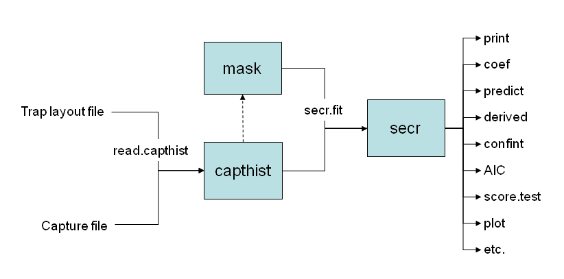
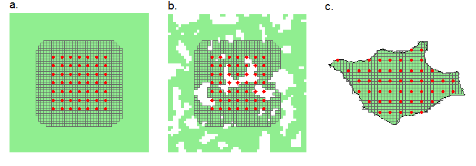
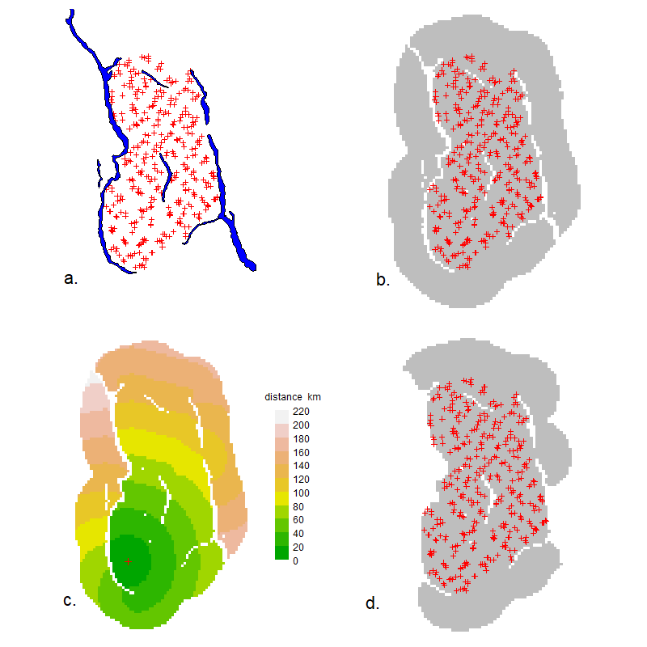
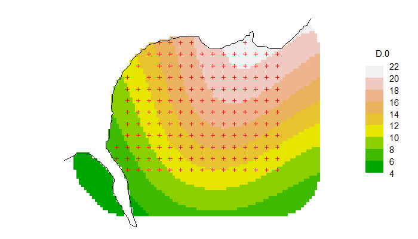
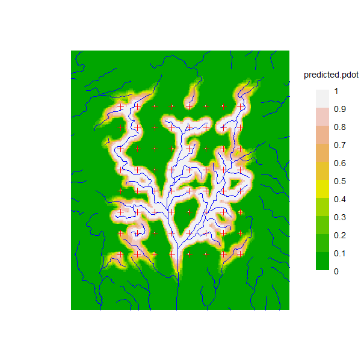

--- 
title: "Spatially Explicit Capture--Recapture"
author: "Murray Efford"
date: "2024-02-28"
site: bookdown::bookdown_site
output: bookdown::gitbook
documentclass: book
bibliography: [d:/jabref/SECR.bib]
biblio-style: apalike
link-citations: yes
description: "A handbook of SECR methods."
---

# Preface {-}

This book is about the methods for describing animal populations that have
come to be called 'spatially explicit capture--recapture' or simply 'spatial 
capture--recapture'. We use 'SECR' as a general label for these data and models.

SECR data are observations of marked animals at known locations. The observations are from a well-defined regime of spatial sampling, most commonly with traps, cameras, or some other type of passive detector. SECR models are used to estimate parameters of the animal population, 
particularly the population density. 


## Why SECR? {-}

Non-spatial capture--recapture methods are highly developed and powerful [@obwa78; @wnc02; @cw]. SECR plugs some gaps in non-spatial methods (particularly with respect to density estimation), and has some unexpected benefits:

1. *Freedom from edge effects*  
Estimation of density with non-spatial capture--recapture is dogged by uncertain edge effects. SECR explicitly accounts for edge effects so density estimates are unbiased. 
2. *Reduced individual heterogeneity*  
Unmodelled individual heterogeneity of detection is a universal source of bias in capture--recapture [e.g., @lc24]. Spatial sampling is a potent source of heterogeneity, due to differential access to detectors. SECR models this component of heterogeneity, which then ceases to be a problem.
3. *Scaleable detection model*  
The core detection model in SECR describes the interaction between a single individual and a single detector. Parameter estimates can therefore be used to simulate sampling with novel detector configurations.
4. *Coherent adjustment for effort*  
Known variation in effort, including incomplete use of a detector array, can be modelled without ad hoc covariates.
5. *Spatial pattern (covariates)*  
SECR allows density to be modelled as a function of continuous spatial covariates.

## Why this book? {-}

The literature of SECR has grown beyond the attention spans and time budgets of most users. Major SECR publications are @e04, @be08, @rcsg14, @bf16, @srl19 and @Turek2021.

This book provides both a gentle introduction, in the spirit of [@cw], and more in-depth treatment of important topics. It is software oriented and therefore unashamedly partial and incomplete. Much of the content is drawn from earlier papers and the documentation of R [@R-base] packages. Some topics are yet to be included (e.g., acoustic data) but documentation may be found on the [DENSITY](https://www.otago.ac.nz/density/SECRinR.html) website. Others such as partial identity models [@Augustine2018] have yet to be considered at all.

Part II is mostly independent of software. Other chapters lean heavily on the R package **secr**.

## Software {-}

\index{R packages}
The R package **secr** [@R-secr] provides most of the functionality we will need. 
It performs maximum likelihood estimation for a range of closed-population SECR models[^footnote1]. The Windows application [DENSITY](https://www.otago.ac.nz/density/) [@edr04] has been superceded, although its graphical interface can still come in handy.

[^footnote1]:A closed population is one in which the composition of the population and the activity distributions of individuals can be assumed fixed for the duration of sampling.

Bayesian approaches using Markov chain Monte Carlo (MCMC) methods are a flexible alternative to maximum likelihood. The R package [nimbleSCR](https://CRAN.R-project.org/package=nimbleSCR) promises to make these methods more accessible[^footnote2]. 
 
[^footnote2]: The earlier Bayesian SECR package **SPACECAP** [@SPACECAP] is no longer maintained and has been archived from CRAN.
 
Add-on packages extend the capability of **secr**:

* **secrlinear** enables the estimation of linear density (e.g., animals per km) for populations in linear habitats such as stream networks ([secrlinear-vignette.pdf](https://CRAN.R-project.org/package=secrlinear/vignettes/secrlinear-vignette.pdf)). 
* **ipsecr** fits models by simulation and inverse prediction, rather than maximum likelihood; this is a rigorous way to analyse data from single-catch traps ([ipsecr-vignette.pdf](https://CRAN.R-project.org/package=ipsecr/vignettes/ipsecr-vignette.pdf)). 
* **secrdesign** enables the assessment of alternative study designs by  Monte Carlo simulation; scenarios may differ in detector (trap) layout, sampling intensity, and other characteristics ([secrdesign-vignette.pdf](https://www.otago.ac.nz/density/pdfs/secrdesign-vignette.pdf])).
* **openCR**  [@es20] implements open-population models. 

These packages are available from the [CRAN](https://cran.r-project.org/) repository -- just open R and type `install.packages('xxxx')` where xxxx is the package name.

Other R packages for SECR may be found outside CRAN. A distinct maximum-likelihood implementation by @srl19 is available on GitHub (https://github.com/jaroyle/oSCR). Open-population packages by Ben Augustine and Richard Glennie are also available on GitHub (https://github.com/benaug/OpenPopSCR; https://github.com/r-glennie/openpopscr). 

## Acknowledgments  {-}

Joanne Potts and Gurutzeta Guillera-Arroita gave helpful comments on an early version of the habitat chapter.

Thanks for data - 

* Ken Burnham snowshoe hares Chapter \@ref(Example)
* Jared Laufenburg black bears Chapter \@ref(Habitat)
* Kevin Young horned lizards Appendix \@ref(Areaandtransectsearches) 
* Garth Mowat Selkirk grizzly bears Appendix \@ref(Noneuclidean) 
* Chris Sutherland non-euclidean simulation Appendix \@ref(Noneuclidean)


The online version of this book is licensed under the [Creative Commons Attribution-NonCommercial-ShareAlike 4.0 International License](https://creativecommons.org/licenses/by-nc-sa/4.0/).


<!--chapter:end:index.Rmd-->

# (PART\*) Introduction to SECR {-}

# Concepts and terminology {#Basics}


This chapter briefly introduces the concepts and terminology of SECR. The following chapter provides a [simple example](#Example), and the [Theory] chapter provides technical details. 

## Spatial population

An animal population in SECR is a spatial point pattern, where each point 
represents the location of an animal's activity centre\index{Activity centre}[^footnote2a]. 
Density is a property of the spatial point process of which the pattern is one instance. The usual process model is a 2-dimensional Poisson process\index{Poisson process (2-D)} (Fig.  \@ref(fig:example)). By fitting the SECR model we can estimate the intensity surface of the Poisson process that we represent by $D(\vec x)$ where $\vec x$ stands for the x,y coordinates of a point. The surface may be *homogeneous* (flat, with constant $D(\vec x)$) or *inhomogeneous* (varying). 

The intensity surface is better represented as depending on a vector of parameters $\phi$, hence $D(\vec x; \phi)$. For constant density $\phi$ is a single value.

[^footnote2a]: 'Activity centre' is often used in preference to 'home range centre' because it appears more neutral: 'home range' implies a particular pattern of behaviour and spatial familiarity. In reality, SECR relies on the very pattern of behaviour (persistent use) that distinguishes a home range, so it is safe to use the terms interchangeably in this context.

## Detectors
\index{Detectors}
SECR uses sampling devices placed at known locations. We need to recognise individuals whenever they are detected. The accumulated detections of each known individual are its 'detection history'. Device types differ according to how they affect animal behaviour and the data they collect; each type corresponds to a probability model, as covered later.

Detection may be entirely passive and non-invasive when individuals carry unique natural marks (e.g., pelage patterns) or their DNA can be sampled. We call such devices "proximity detectors". Proximity detectors may be split according to the distribution of the number of detections per animal per occasion (binary, Poisson, or binomial), with binary the most common.

Animals without natural marks must be marked individually on their first detection. This implies capture and handling. Only devices that hold an animal until it is released can truly be called 'traps'. The probability model for trapping must allow for exclusivity: an animal can be found at only one trap on any occasion, and some traps ('single-catch' traps) also exclude other individuals after the first.

Confusingly, **secr** uses 'traps' as a generic name for R objects holding detector coordinates and other information. This software-specific jargon should be avoided in publications.

Table: (\#tab:deviceexamples) Examples of SECR sampling

| Device | Marks | Type | Example | 
|:-------|:------------|:----------|:------------------|
| Automatic camera | natural marks: stripes and spot patterns | proximity detector | tiger, @Royle2009 |
| Hair snag | microsatellite DNA | proximity detector | grizzly bear, @ms00 |
| Cage trap | numbered ear tag | single-catch trap | brushtail possum, @ewcb05 |
| Ugglan trap | numbered ear tag | multi-catch trap | field vole, @Ergon2013 |
| Mist net | numbered leg band | multi-catch trap | red-eyed vireo, @be08 |

## Sampling across time

For most vertebrates we expect population turnover (births, deaths, AC movement) to happen on time scales of months or years. A population sampled over shorter intervals (days or weeks) can therefore be considered closed. A 'session' in **secr** parlance is a set of samples from a closed population on one or more 'occasions' (possibly consecutive days). 

Distinguishing occasions within a session is necessary for trap-type detectors (there would otherwise be no recaptures). For proximity-type detectors the role of 'occasions' is more subtle, and data may usually be collapsed to animal- and detector-specific counts. The spatial pattern of binary detections alone is sufficient to obtain an estimate of density [@edb09].

It is not necessary for all detectors to be used on all occasions. Incomplete usage [and other variation in effort per occasion -- @ebm13] may be recorded for each detector as an attribute of 'traps' objects.

Data collected across multiple sessions potentially include losses of some individuals and gains of others. An open population model is the natural way to go, e.g., @es20. However, the complexity of open-population models can be avoided if sessions are treated as independent in a 'multi-session' closed population analysis.

## Data structure
\index{Data entry}
Data for a single SECR session comprise a 3-dimensional rectangular array with dimensions corresponding to known animals, sampling occasions, and detectors. Data in each cell of the array are usually binary (0/1) but may be integer counts > 1 (e.g., if binary data have been collapsed by occasion). In **secr**, an R Object of class 'capthist' holds data in this form, along with the coordinates of the detectors in its 'traps' attribute. The user constructs a capthist object from text or spreadsheet input using data entry functions described [here](https://cran.r-project.org/web/packages/secr/vignettes/secr-datainput.pdf).

## Model fitting

A SECR model combines a model for the point process (the state model) and a 
model for distance-dependent detection (the observation model). Unbiased estimates
of population density (and other parameters) by jointly fitting the state and observation models.

### Distance-dependent detection

In order to estimate density from a sample we must account for the sampling process. The process is inherently spatial: each animal is more likely to be detected near its AC, and less likely to be detected far away. Sampling filters the geographic locations of animals as indicated in Fig.  \@ref(fig:example).

<div class="figure">

<p class="caption">(\#fig:example)Distance-dependent detection of uniformly distributed activity centres (open circles; filled if captured)</p>
</div>

The true locations of animals are not known, and therefore the distance-dependent probabilities cannot be calculated directly. The model is fitted by marginalising (integrating over) animal locations.

Distance-dependent detection is represented by a 'detection function' with intercept, scale, and possibly shape, determined by parameters to be estimated[^footnote2b].
<div class="figure">

<p class="caption">(\#fig:detectionfunctions)Some detection functions</p>
</div>

[^footnote2b]: All detection functions have intercept ($g_0$, $\lambda_0$) and scale ($\sigma$) parameters; some such as the hazard rate function have a further parameter that controls some aspect of shape.

### Habitat

SECR models include a map of potential habitat near the detectors. Here 'potential' means 'feasible locations for the AC of detected animals'. Excluded are sites that are known *a priori* to be unoccupied, and sites that are so distant that an animal centred there has negligible chance of detection. 

The habitat map is called a 'habitat mask' in **secr** and a 'state space' in the various Bayesian implementations. It is commonly formed by adding a constant-width buffer around the detectors. For computational convenience the map is discretized as many small pixels. Spatial covariates (vegetation type, elevation, etc.) may be attached to each pixel for use in density models. The choice of buffer width and pixel size are considered later.

### Link functions {#link}
\index{Link function}
\index{Link function!detection}
\index{Link function!density}
A simple SECR model has three parameters: density $D$, and the intercept $g_0$ and spatial scale $\sigma$ of the detection function. Valid values of each parameter are restricted to part of the number line (positive values for $D$ and $\sigma$, values between zero and one for $g_0$). A straightforward way to constrain estimates to valid values is to conduct maximization of the likelihood on a transformed ('link') scale: at each evaluation the parameter value is back transformed to the natural scale. The link function for all commonly used parameters defaults to 'log' (for positive values) except for g0 which defaults to 'logit' (for values between zero and one).

Table: (\#tab:links) Link functions.

| Name | Function | Inverse |
|:------|:---------|:----------|
| log | $y = \log(x)$ | $\exp(y)$ | 
| logit | $y = \log[p/(1-p)]$ | $1 / [1 + \exp(-y)]$ |
| identity | $y=x$ | y |

Working on a link scale is especially useful when the parameter is itself a function of covariates. For example, $\log (D) = \beta_0 + \beta_1 c \;$ for a log-linear function of a spatially varying covariate $c$. The coefficients $\beta_0$ and $\beta_1$ are estimated in place of $D$ per se.

We sometimes use the terminology of 'beta' parameters (coefficients on the link scale) and 'real' parameters (on the natural scale) that is derived from MARK [@cw].

<!-- cloglog -->

### Estimation
\index{Likelihood!maximization}
\index{Bayesian methods}

There are several ways to estimate the parameters of the SECR probability model, all of them computer-intensive. We focus on numerical maximization of the log likelihood (@be08 and Chapter \@ref(Theory)). The likelihood integrates over the unknown locations of the animals' activity centres. This is achieved in practice by summing over cells in a discretized map of the [habitat](#Habitat).

In outline, a function to compute the log likelihood from a vector of beta parameters is passed, along with the data, to an optimization function. Optimization is iterative. For illustration, Fig. \@ref(fig:MLE) shows the sequence of likelihood evaluations with two maximization algorithms when the parameter vector consists of only the intercept and spatial scale of detection. Optimization returns the maximized log likelihood, a vector of parameter values at the maximum, and the Hessian matrix from which the variance-covariance matrix of the estimates may be obtained.

<div class="figure">

<p class="caption">(\#fig:MLE)Numerical maximization of conditional likelihood by two methods; triangle -- initial values; filled circle -- estimates. Both converge on the same estimates (dashed lines). Newton-Raphson is the default method in **secr**.</p>
</div>

Bayesian methods make use of algorithms that sample from a Markov chain (MCMC) to approximate the posterior distribution of the parameters. MCMC for abundance estimation faces the special problem that an unknown number of individuals, at unknown locations, remain undetected. The issue is addressed by data augmentation [@ry08] or using a semi-complete data likelihood [@Zhang2022]. 

Early anxiety about the suitability of MLE and asymptotic variances for SECR with small samples appears to have been mistaken. @Royle2009 believed that "... the practical validity of these procedures cannot be asserted in most situations involving small samples". This has not been borne out by subsequent simulations. The choice between Bayesian and frequentist (MLE) methods is now an issue of convenience for most users. MLE provides fast and repeatable results for established models with a small to medium number of parameters. Bayesian methods have an advantage for novel models and those with many parameters, although the crossover point has not been demonstrated. 

<!-- "As the underlying point process model is made more complex (e.g., containing interactions and conditional dependencies) the integration required for inference by integrated likelihood may become computationally prohibitive. [...] we feel that the biggest practical advantage apparent at this time has to do with the validity of inferences achieved by Bayesian analysis. In particular, classical inference procedures are asymptotic and as such their relevance to small sample situations is questionable. Conversely, Bayesian inferences do not rely on asymptotic arguments and are valid regardless of the sample size. There seems to be a prevailing view in statistical ecology that classical likelihood-based procedures are virtuous because of the availability of simple formulas and procedures for carrying out inference, such as calculating standard errors, doing model selection by AIC, and assessing goodness of fit. In large samples, this is an important practical benefit of classical likelihood-based inference. However, the practical validity of these procedures cannot be asserted in most situations involving small samples." -->

A further method, simulation and inverse prediction, has a niche use for data from single-catch traps [@edr04; @Efford2023].

<!--chapter:end:01-basics.Rmd-->

# Simple example {#Example}
\index{Snowshoe hare}


We use the Alaskan snowshoe hare data of Burnham and Cushwa [@obwa78][^footnote3a].

[^footnote3a]: This is a shortened version of the tutorial in [secr-tutorial.pdf].


\vspace{20pt}

>"In 1972, Burnham and Cushwa (pers. comm.) laid out a livetrapping grid in a black spruce forest 30 miles (48.3 km) north of Fairbanks, Alaska. The basic grid was 10 x 10, with traps spaced 200 feet (61 m) apart. Trapping for snowshoe hares \textit{Lepus americanus} was carried out for 9 consecutive days in early winter. Traps were not baited for the first 3 days, and therefore we have chosen to analyze the data from the last 6 days of trapping."
>
> @obwa78[p. 36]

## Input data

The raw data are in two text files, the capture file and the trap layout file. Data from @obwa78 have been transformed for **secr** (code in [secr-tutorial.pdf]). The files may be downloaded to the current directory with

```r
fnames <- c("hareCH6capt.txt", "hareCH6trap.txt")
url <- paste0('https://www.otago.ac.nz/density/examples/', fnames)
download.file(url, fnames, method = "libcurl")
```

The capture file "hareCH6capt.txt" has one line per capture and four columns (header lines are commented out and are not needed). Here we display the first 6 lines. The first column is a session label derived from the original study name; here there is only one session.


```
# Burnham and Cushwa snowshoe hare captures
# Session ID Occasion Detector 
wickershamunburne  1 2 0201
wickershamunburne 19 1 0501
wickershamunburne 72 5 0601
wickershamunburne 73 6 0601
... 
```
 
\vspace{12pt}

The trap layout file "hareCH6trap.txt" has one row per trap and columns for the detector label and x- and y-coordinates. We display the first 6 lines. The detector label is used to link captures to trap sites. Coordinates can relate to any rectangular coordinate system; **secr** will assume distances are in metres. These coordinates simply describe a 10 $\times$ 10 square grid with spacing 60.96 m. Do not use unprojected geographic coordinates (latitude and longitude)[^footnote3b]. 

[^footnote3b]: See Appendix \@ref(Spatialdata).


```
# Burnham and Cushwa snowshoe hare trap layout
# Detector  x  y 
0101 0 0
0201 60.96 0
0301 121.92 0
0401 182.88 0
... 
```

\vspace{12pt}

We load **secr** and read the data files to construct a capthist object. The detectors are single-catch traps (maximum of one capture per animal per occasion and one capture per trap per occasion).


```r
library(secr)
hareCH6 <- read.capthist("hareCH6capt.txt", "hareCH6trap.txt", 
                         detector = "single")
```

```
## No errors found :-)
```


```
## [1] TRUE TRUE
```

The capthist object `hareCH6` now contains almost all the information needed to fit a model. 

## Check data

Type `summary(hareCH6)` for a summary of the data. These are *spatial* data so we learn a lot by mapping them. The `plot` method for capthist objects has additional arguments; set `tracks = TRUE` to join consecutive captures of each individual.


```r
par(mar = c(1,1,3,1))  # reduce margins
plot (hareCH6, tracks = TRUE)
```

<div class="figure" style="text-align: center">

<p class="caption">(\#fig:cap)Snowshoe hare spatial capture data. Trap sites (red crosses) are 61 m apart. Grid lines (grey) are 100 m apart (use arguments `gridl` and `gridsp` to suppress the grid or vary its spacing). Colours help distinguish individuals, but some are recycled.</p>
</div>

The most important insight is that individuals tend to be recaptured near their site of first capture. This is expected when the individuals of a species occupy home ranges. In SECR models the tendency for detections to be localised is reflected in the spatial scale parameter $\sigma$. Good estimation of $\sigma$ and density $D$ requires spatial recaptures (i.e. captures at sites other than the site of first capture).

Successive trap-revealed movements can be extracted with the `moves` function and summarised with `hist`:

```r
m <- unlist(moves(hareCH6))
par(mar = c(3.2,4,2,1), mgp = c(2.1,0.6,0))  # reduce margins
hist(m, breaks = seq(0,500,61), xlab = "Movement  m", main = "")
```

<div class="figure" style="text-align: center">

<p class="caption">(\#fig:moves)Trap-revealed movements of snowshoe hares</p>
</div>

About 30% of trap-revealed movements were of $>$ 100 m (Fig. \@ref(fig:moves); try also `plot(ecdf(m))`), so we can be sure that peripheral hares stood a good chance of being trapped even if their home ranges were centred well outside the area plotted in Fig. \@ref(fig:cap).

## Fit a simple model

Next we fit the simplest possible SECR model with function `secr.fit`. The `buffer` argument determines the habitat extent - we take a stab at this and check it later. Setting `trace = FALSE` suppresses printing of intermediate likelihood evaluations; it doesn't hurt to leave it out. We save the fitted model with the name 'fit'. Fitting is much faster if we use parallel processing in multiple threads - the number will depend on your machine, but 7 is OK for Windows with a quad-core processor.


```r
fit <- secr.fit (hareCH6, buffer = 250, trace = FALSE, ncores = 7)
```

```
## Warning: multi-catch likelihood used for single-catch traps
```
A warning is generated. The data are from single-catch traps, but there is no usable theory for likelihood-based estimation from single-catch traps. This is not the obstacle it might seem, because simulations seem to show that the alternative likelihood for multi-catch traps may be used without damaging the density estimates [@ebb09]. It is safe to ignore the warning for now[^footnote3c]. 
<!-- We could avoid the warning by resetting the detector type to "multi". -->
<!-- ```{r multi} -->
<!-- detector(traps(hareCH6)) <- "multi" -->
<!-- ``` -->

[^footnote3c]: While noting that estimates of the detection parameter g0 are biased. For unbiased estimates see **[ipsecr](https://CRAN.R-project.org/package=ipsecr)** and @Efford2023.

## Output

The output from `secr.fit` is an object of class 'secr'. If you investigate the structure of `fit` with `str(fit)` it will seem to be a mess: it is a list with more than 25 components, none of which contains the final estimates you are looking for. 

To examine model output or extract particular results you should use one of the functions defined for the purpose. Technically, these are S3 methods for the class 'secr'. The key methods are `print,` `plot,` `AIC,` `coef,` `vcov,` and `predict.` Append '.secr' when seeking help e.g. `?print.secr`.

Typing the name of the fitted model at the R prompt invokes the print method for `secr` objects and displays a more useful report.

```r
fit
```

```
## 
## secr.fit(capthist = hareCH6, buffer = 250, trace = FALSE, ncores = 7)
## secr 4.6.6, 13:59:46 22 Feb 2024
## 
## Detector type      single 
## Detector number    100 
## Average spacing    60.96 m 
## x-range            0 548.64 m 
## y-range            0 548.64 m 
## 
## N animals       :  68  
## N detections    :  145 
## N occasions     :  6 
## Mask area       :  104.595 ha 
## 
## Model           :  D~1 g0~1 sigma~1 
## Fixed (real)    :  none 
## Detection fn    :  halfnormal
## Distribution    :  poisson 
## N parameters    :  3 
## Log likelihood  :  -607.988 
## AIC             :  1221.98 
## AICc            :  1222.35 
## 
## Beta parameters (coefficients) 
##            beta  SE.beta       lcl       ucl
## D      0.382528 0.129950  0.127831  0.637226
## g0    -2.723792 0.160932 -3.039212 -2.408371
## sigma  4.224580 0.065323  4.096549  4.352610
## 
## Variance-covariance matrix of beta parameters 
##                 D          g0       sigma
## D      0.01688706 -0.00173068 -0.00162336
## g0    -0.00173068  0.02589902 -0.00737561
## sigma -0.00162336 -0.00737561  0.00426709
## 
## Fitted (real) parameters evaluated at base levels of covariates 
##        link  estimate SE.estimate        lcl        ucl
## D       log  1.465986  0.19131237  1.1363604  1.8912274
## g0    logit  0.061584  0.00930047  0.0456855  0.0825366
## sigma   log 68.345782  4.46931584 60.1324236 77.6809846
```

\vspace{12pt}
The report comprises these sections:

* function call and time stamp
* summary of the data
* description of the model, including the maximized log likelihood, Akaike's Information Criterion AIC
* estimates of model coefficients ('beta' parameters)
* estimates of variance-covariance matrix of the coefficients
* estimates of the 'real' parameters

The last three items are generated by the `coef`, `vcov` and `predict` methods respectively. The final table of estimates is the most interesting, but it is derived from the other two. For our simple model there is one beta parameter for each real parameter[^footnote3d]. The estimated density is 1.47 hares per hectare, 95% confidence interval 1.14--1.89 hares per hectare[^footnote3e].

[^footnote3d]: We can get from beta parameter estimates to real parameter estimates by applying the inverse of the link function e.g. $\hat D = \exp(\hat \beta_D)$, and similarly for confidence limits; standard errors require a delta-method approximation (Lebreton et al. 1992).

[^footnote3e]: One hectare (ha) is 10000 m^2^ or 0.01 km^2^.

The other two real parameters jointly determine the detection function that you can easily plot with 95% confidence limits:

```r
par(mar = c(5,4,2,1))  # adjust white margins
plot(fit, limits = TRUE)
```

<div class="figure" style="text-align: center">

<p class="caption">(\#fig:plotfit)Fitted halfnormal detection function, with 95% confidence limits</p>
</div>

## Revisiting buffer width

Choosing a buffer width is a common stumbling block. We used `buffer = 250` without any explanation. Here it is. As far as we know, the snowshoe hare traps were surrounded by suitable habitat. We limit our attention to the area immediately around the traps by specifying a habitat buffer. The `buffer` argument is a short-cut for defining the potential habitat (area of integration); the alternative is to provide a habitat mask in the `mask` argument. Buffers and habitat masks are covered at length in Chapter \@ref(Habitat).

Buffer width is not critical as long as it is wide enough that animals at the edge have effectively zero chance of appearing in our sample, so that increasing the buffer has negligible effect on estimates. For half-normal detection (the default) a buffer of $4\sigma$ is usually enough[^footnote3f]. We check the present model with the function `esa.plot`. The estimated density[^footnote3g] has easily reached a plateau at the chosen buffer width (dashed red line):

[^footnote3f]: This is not just the tail probability of a normal deviate; think about how the probability of an individual being detected at least once changes with (i) the duration of sampling (ii) the density of detector array.

[^footnote3g]: These are Horvitz-Thompson-like estimates of density obtained by dividing the observed number of individuals $n$ by effective sampling areas (Borchers and Efford 2008) computed as the cumulative sum over mask cells ordered by distance from the traps. The algorithm treats the detection parameters as known and fixed.


```r
par(mar = c(5,4,2,1))  # adjust white margins
esa.plot(fit)
abline(v = 250, lty = 2, col = 'red')
```

<div class="figure" style="text-align: center">

<p class="caption">(\#fig:esaplot)Post hoc evaluation of buffer width using `esa.plot()` </p>
</div>

## Overall probability of detection

As a final flourish, we plot contours of the overall probability of detection $p_\cdot(\vec x; \theta)$ as a function of AC location $\vec x$, given the fitted model. The white line is the outer edge of the automatic mask generated by `secr.fit` with a 250-m buffer.


```r
tr <- traps(hareCH6)   # just the traps
dp <- detectpar(fit)   # extract detection parameters from simple model
mask300 <- make.mask(tr, nx = 128, buffer = 300)  
covariates(mask300)$pd <- pdot(mask300, tr, detectpar = dp, 
     noccasions = 6)
par(mar = c(1,1,1,5))  # adjust white margin
plot(mask300, cov = 'pd', dots = FALSE, border = 1, inset = 0.1, 
     title = 'p.(x)')
plot(tr, add = TRUE)   # over plot trap locations
pdot.contour(tr, nx = 128, detectfn = 'HN', detectpar = dp, 
     noccasions = 6, add = TRUE)
plotMaskEdge(make.mask(tr, 250, type = 'trapbuffer'), add = TRUE, 
     col = 'white')
```

<div class="figure">

<p class="caption">(\#fig:pdot)Contour plot of overall detection probability.</p>
</div>

<div class="figure">

<p class="caption">(\#fig:pdotdist)Distribution of overall detection probability for AC locations at varying distance from traps.</p>
</div>

<!-- Pdot fig \@ref(fig:pdot) -->

[secr-datainput.pdf]: https://www.otago.ac.nz/density/pdfs/secr-datainput.pdf
[secr-tutorial.pdf]: https://www.otago.ac.nz/density/pdfs/secr-tutorial.pdf

<!--chapter:end:02-example.Rmd-->

# (PART\*) Theory {-} 

# Likelihood {#Theory}

\renewcommand{\vec}[1]{\mathbf{#1}}

The chapters in Part II provide background mostly for reference. They aim to be independent of any particular implementation of SECR, although some cross-references to **secr** creep in. The notation and terminology originated with @be08, extensions from @ebb09, @e11 and elsewhere. 

## Notation
\index{Notation}

| Category | Symbol |  Meaning           |
|:---|:---|:----------------------------|
| General ||
|| AC         | activity centre |
|| $\vec x$   | point $(x,y)$ in the plane |
| Data ||
|| $n$        | number of individuals detected |
|| $S$        | number of sampling occasions |
|| $K$        | number of detectors |
|| $\omega_i$ | spatial detection history of the $i$-th animal |
|| $\Omega$   | set of all detection histories $\omega_i, i = 1..n$ |
| Parameters  ||
|| $D(\vec x; \phi)$[^footnote4a] | intensity surface of AC Poisson point process at $\vec x$ |
|| $\phi$     | parameter vector for AC point process (scalar density if surface flat) |
|| $\theta$   | vector of detection parameters (minimally $(g_0, \sigma)$ or $(\lambda_0,\sigma)$)|
|| $g_0$      | intercept of distance-probability-of-detection function |   
|| $\lambda_0$ | intercept of distance-hazard-of-detection function |   
|| $\sigma$   | spatial scale parameter of distance-detection function |   
| Model ||
|| $d_k(\vec x)$ | distance of point $\vec x$ from detector $k$ |
|| $\lambda(d)$  | hazard of detection at distance $d$ (distance-hazard-of-detection function) |
|| $g(d)$  | probability of detection at distance $d$ (distance-probability-of-detection function)|
|| $p_\cdot(\vec x; \theta)$ | probability that an individual with AC at $\vec x$ is detected at least once |
|| $h_{isk}(\vec x; \theta)$ | hazard of detection at detector $k$ for animal $i$ on occasion $s$ |
|| $p_{isk}(\vec x; \theta)$ | probability of detection corresponding to $h_{isk}(\vec x; \theta)$|
|| $p_{k}(\vec x; \theta)$ | $p_{isk}(\vec x; \theta)$ constant across individuals $i$ and occasions $s$|
| Habitat ||
|| $A$        | potential habitat ('habitat mask', 'state space') $A \subset R^2$ |
|| $|A|$      | area of $A$ |
|| $N(A)$     | number of AC in $A$ |

[^footnote4a]: We use $D(\vec x)$ in preference to $\lambda(\vec x)$ because $\lambda$ has multiple meanings.

## Likelihood {#Likelihood}
\index{Likelihood!SECR}

This formulation of the likelihood is based on @be08 with minor changes in notation:
\begin{equation}
L(\phi, \theta | \Omega ) = \mbox{Pr}(n| \phi, \theta) \; \mbox{Pr}(\Omega | n, \phi, \theta).
(\#eq:L)
\end{equation}

Parameters of the state model ($\phi$) and the detection model ($\theta$) are estimated jointly by maximizing the logarithm of the likelihood. When density is constant across space, $\phi$ drops out of the rightmost term, which then relates to the detection (observation) model alone, and maximization of this component gives unbiased estimates of $\theta$ (see [Conditional likelihood](#conditional)).

### Number of individuals {#Pr-n}
\index{Poisson process (2-D)}
If AC follow an inhomogeneous Poisson process then $n$ has a Poisson distribution with parameter 
\begin{equation}
\lambda = \int_{R^2} D(\vec x; \phi) \, p_\cdot(\vec x;\theta) \, d\vec x, 
(\#eq:n)
\end{equation}
where $D(\vec x; \phi)$ is the density at $\vec x$ and $p_\cdot(\vec x|\theta)$ is the overall probability of detecting an AC at $\vec x$ (see Sections \@ref(pointdetectors) and \@ref(areasearches)). Thus $\mbox{Pr}(n | \phi, \theta) = \lambda^n \exp (-\lambda) / n!$. The distribution of $n$ is binomial when the population size in a defined area is [fixed](#fixedN).

### Detection histories {#Pr-omega}

In general we have
\begin{equation}
\mbox{Pr} (\Omega | n, \phi, \theta) = \binom {n}{n_1,...,n_C}
\prod_{i=1}^n \mbox{Pr}( \omega_i | \omega_i>0, \phi, \theta),
 (\#eq:CL)
\end{equation}

where $\omega_i>0$ indicates a non-empty detection history. The multinomial coefficient uses the frequencies $n_1,...,n_C$ of each of the $C$ observed histories. The coefficient is a constant not involving parameters and it can be omitted without changing the model fit (consistent inclusion or exclusion is needed for valid likelihood-based comparisons such as those using AIC).

We do not know the true AC locations, but they can be integrated[^integration] out of the likelihood using an expression for their spatial distribution, i.e.
\begin{equation}
\mbox{Pr}( \omega_i | \omega_i>0, \phi, \theta) = \int_{R^2} \mbox{Pr}( \omega_i | \omega_i>0, \theta, \vec x) \, f(\vec x | \omega_i>0, \phi, \theta) \; d\vec x
(\#eq:omegai)
\end{equation}
where $f(\vec x| \omega_i>0, \phi, \theta)$ is the conditional density of an AC given that the individual was detected. The conditional density is given by
\begin{equation}
f(\vec x| \omega_i>0, \phi, \theta) = \frac{D(\vec x ; \phi) p_\cdot(\vec x ; \theta)}{\lambda(\phi,\theta)}.
(\#eq:f)
\end{equation}

[^integration]: Integration is commonly performed by summing over many small cells for a finite region near the detectors, as both $\mbox{Pr}(\omega_i)$ and $f(\vec x)$ decline to zero at greater distances. We state the model in terms of the real plane and defer discussion of the region of integration to Chapter \@ref(Habitat).

## Distance-dependent detection

The key idea of SECR is that the probability of detecting a particular animal at a particular detector on one occasion can be represented as a function of the distance between its AC and the detector. The function should decline effectively to zero at large distances. Distances are not observed directly, and we rely on functions of somewhat arbitrary shape. Fortunately, the estimates are not very sensitive to the choice. Detection functions are covered in detail in Chapter \@ref(Detection). Either probability $g(d)$ or hazard $\lambda(d)$ may be modelled as a function of distance. A halfnormal form is commonly used (e.g., $g(d) = g_0 \exp (-d^2/2/\sigma^2)$). The shapes of, e.g., halfnormal $g(d)$ and halfnormal $\lambda_0(d)$ are only subtly different, but $\lambda(d)$ is preferred because it lends itself to mathematical manipulation and occurs more widely in the literature (often with different notation).

The function $\lambda(d)$ may be transformed into a probability with $g(d) = 1 - \exp[-\lambda(d)]$ and the reverse transformation is $\lambda(d) = -\log[1-g(d)]$. The intercept parameter $g_0$ has been replaced by $\lambda_0$; although the name $\sigma$ is retained for the spatial scale parameter this is not exactly interchangeable between the models.

## Detector types  {#pointdetectors}
\index{Detectors}

The SECR data $\omega_i$ for each detected individual comprise a matrix with dimensions $S$ (occasions) and $K$ (detectors). Each element may be binary (0/1) or integer (0, 1, 2, ...). Various probability models exist for the entries $\omega_{isk}$. The appropriate probability model follows in most cases directly from the type of detector device; we therefore classify probability models according to device type. Table \@ref(tab:detectortypes) matches this classification to that of @rcsg14. This section covers passive detection at a point; [area searches](#areasearches) are considered later.


Table: (\#tab:detectortypes) Detector types (based on @eb19[Table 1])

| Detector type | @rcsg14 | Data |
|:-----------------|:------------|:---------------------------|
| Binary proximity | Bernoulli^1^ | binary animal $\times$ occasion $\times$  detector|
| Poisson count proximity | Poisson | integer animal $\times$ occasion $\times$  detector |
| Binomial count proximity | Binomial | integer animal $\times$ occasion $\times$  detector |
| Multi-catch trap | Multinomial | binary animal $\times$ occasion |
| Single-catch trap | --- | binary animal $\times$ occasion, exclusive |
| Area search || integer animal $\times$ occasion $\times$  detector |
| Transect search || integer animal $\times$ occasion $\times$  detector |
| Exclusive area search^2^ || binary animal $\times$ occasion |
| Exclusive transect search^2^ || binary animal $\times$ occasion |

1. Also 'Binomial' in @rg11
2. 'Exclusive' here means that an individual can be detected at no more than one detector (polygon or transect) per occasion.

For each type of detector we require $\mbox{Pr}(\omega_{isk} | \vec x)$ and the overall probability of detection $p_\cdot(\vec x)$. For some detector types it is more natural to express the probability in terms of the occasion- and trap-specific hazard $h_{sk} = \lambda[d_k(\vec x); \theta^\prime]  = -\log(1-g[d_k(\vec x); \theta])$ than the probability $p_{sk} (\vec x) = g[d_k(\vec x); \theta] = 1 - \exp\{-\lambda[d_k(\vec x); \theta^\prime]\}$[^footnote4b].

We summarise the probability models in Table \@ref(tab:pointdetectortypes), with comments on each point detector type below.

Table: (\#tab:pointdetectortypes) Summary of point detector types (conditioning on $\theta$ omitted to save space)

| Detector type | $\mbox{Pr}(\omega_{isk} | \vec x)$ | $p_\cdot(\vec x)$ | 
|:-----------------|:-------------------|:-------------------|
| Binary proximity | $p_{sk}(\vec x) ^{\omega_{isk}} [1-p_{sk}(\vec x)]^{(1-\omega_{isk})}$ | $1 - \prod_s\prod_k 1 - p_{sk} (\vec x)$|
| Poisson count proximity | $\{h_{sk} (\vec x)^{\omega_{isk}} \exp [-h_{sk}(\vec x)]\} / \omega_{isk}!$ | $1 - \exp [- \sum_s \sum_k h_{sk}(\vec x)]$|
| Binomial count proximity^1^ | $\binom{B_s}{\omega_{isk}} p_{sk}(\vec x)^{\omega_{isk}} [1-p_{sk}(\vec x)]^{(B_s-\omega_{isk})}$ |  $1 - \prod_s\prod_k [1 - p_{sk} (\vec x)]^{B_s}$ | 
| Multi-catch trap^2^ | $\{1 - \exp [-H_s(\vec x)]\}\frac{h_{sk}(\vec x)}{H_s(\vec x)}$ | $1 - \exp[ -\sum_s H_s(\vec x)]$|

1. $B_s$ is the size of the binomial distribution, the number of opportunities for detection, assumed constant across detectors 
2. $H_s = \sum_k h_{sk}(\vec x)$ is the hazard summed over traps  

### Binary proximity detector
\index{Detectors!binary proximity}

A proximity detector records the presence of an individual at or near a point without restricting its movement. The data are binary when any detections after the first are ignored (this avoids worries about the non-independence of repeated visits to a detector). 

Assuming independence among detectors, the distance-detection model applies directly as the probability of detection in a particular detector, and the overall probability of detection is the complement of the product of probabilities of non-detection in all detectors.

[^footnote4b]: The parameter vectors $\theta$ and $\theta^\prime$ differ for detection functions expressed in terms of probability ($g()$) and hazard ($\lambda()$).
<!-- Subscripts $i,s$ are included for generality, allowing individual and temporal variation in detection probability, but more often than not these do not appear in the model ($\theta_{is} = \theta$ for all $i,s$) and $p_k$ is sufficient. -->

### Poisson count proximity detector
\index{Detectors!Poisson proximity}

Hazard is the natural scale for the Poisson parameter.

### Binomial count proximity detector
\index{Detectors!Binomial proximity}

Binomial counts arise when there is a finite number of opportunities for detection within each occasion that we denote $B_s$. This commonly happens when binary proximity data are collapsed to a single occasion: the initial number of occasions is known ($B_s = S$) and places an upper limit on the count. Collapsing is often efficient. It precludes modelling parameter variation or learned responses across occasions.

Each count is binomial with size $B_s$ and probability equal to the per-occasion detection probability.

### Multi-catch trap
\index{Detectors!multi-catch trap}

A trap is a device that detains an animal until it is released, allowing only one detection of that animal per occasion. The single-detector, single-AC probability from a distance-dependent detection function (preceding section) must be modified to allow for prior capture in a different trap: traps effectively "compete" for animals. If the trap remains open for captures of further animals then the solution is a straightforward competing risk model [@be08].

The competing risk model uses the occasion- and trap-specific hazard $h_{sk}$.

### Single-catch trap
\index{Detectors!single-catch trap}

A single-catch trap can only catch one animal at a time. This entails competition 
both among traps for animals and among animals for traps. No simple likelihood is available. 
Simulation-based methods [@e04; @Efford2023] must be used for unbiased estimation of
$\theta$ and trend in density unless the time of detection has been recorded [@Distiller2015]. 

## Fixed $N$ {#fixedN}
\index{Population size $N(A)$!fixed}

The formulation of the state model as an inhomogeneous Poisson process (Chapter \@ref(Basics)) does not refer to population size $N$. The state model may also be cast as a 'conditional' or 'binomial' Poisson process' [@illian08]. For an arbitrary area $A$ the number of AC is then considered fixed rather than Poisson.

The distribution of $n$ is then binomial with size $N(A)$ and probability 
$p_c(\phi, \theta) = \int_A p_\cdot(\vec x; \theta) f(\vec x; \phi) d\vec x$, where $f(\vec x; \phi) = D(\vec x; \phi) / \int_A D(\vec x; \phi) d\vec x$.

The form conditional on $N(A)$ leads to narrower confidence intervals for density owing to the exclusion of variation in $N(A)$ among realisations of the Poisson process for AC. This makes sense when $A$ contains an isolated population with a natural boundary, but most applications do not meet this criterion.

## Confidence intervals {#confidenceintervals}
\index{Confidence intervals}

Maximizing the log likelihood leads to a straightforward estimate of the asymptotic covariance matrix $\vec V$ of the beta parameters. If $\hat \theta$ is the vector of estimates and $\vec H(\hat \theta)$ is the Hessian matrix evaluated at $\hat \theta$ then the covariance matrix is $\vec V = \vec H(\hat \theta)^{-1}$. 

> The Hessian matrix is the square matrix of second-order partial derivatives of the log likelihood. For more on asymptotic variances of MLE see @s82, @Borchers2002, @cw 1.3.2, and many statistics texts.

The sampling error of MLE is asymptotically normal, and symmetric (Wald) intervals for SECR parameters appear to work well on the link scale i.e. $\hat \theta_j \pm z_{\alpha/2} \hat \sigma_j$ is a $100(1-\alpha)\%$ interval for $\hat \theta_j$ where $-z_{\alpha/2}$ is the $\alpha/2$ quantile of the standard normal deviate ($z_{0.025} = 1.96$) and $\hat \sigma_j^2$ is the estimated variance from $\vec V$.

On back transformation to the natural ('real') scale these intervals become asymmetrical and generally have good coverage properties.

The method of profile likelihood is available (e.g., @Evans1996; `secr::confint.secr`), but it is seldom used as no problem has been shown with intervals based on asymptotic variances. Similarly, the additional computation required by parametric bootstrap methods is not warranted.

## Varying effort {#varying-effort}
\index{Varying effort}

When sampling effort varies between detectors or over time in a capture--recapture study we expect a commensurate change in the number of detections. Allowing for known variation in effort when modelling detections has these benefits:

* detection parameters are related to a consistent unit of effort (e.g., one trap set for one day)
* the fit of the detection model is improved
* trends in the estimates may be modelled without confounding.

@be08 allowed the duration of exposure to vary between sampling occasions in their competing-hazard model for
multi-catch traps. @ebm13 generalised the method to allow joint variation in effort over detectors and over time
(occasions), and considered other detector types.

We use $T_{sk}$ for the effort on occasion $s$ at detector $k$. At its simplest, $T_{sk}$ can be a binary indicator taking the values 0 (detector not used) or 1 (detector used) (when $T_{sk} = 0$, no detections are possible and $\omega_{isk} = 0$). For small, continuously varying, $T_{sk}$ we expect the number of detections to increase linearly with $T_{sk}$; saturation may occur at higher effort, depending on the detector type. Examples of possible effort variables are the number of days that each automatic camera was operated in a tiger study, or the number of rub trees sampled for DNA in each grid cell of a grizzly bear study.

Following convention in non-spatial capture--recapture [@cw] we could model $g_0$ or $\lambda_0$ on the link scale (logit or log) as a linear function of $T_{sk}$ (a time covariate if constant across detectors, a detector covariate if constant across occasions, or a time-varying detector-level covariate). However, this is suboptimal because varying effort has a linear effect only on $\lambda_0$ for Poisson count detectors, and the estimation of additional parameters is an unnecessary burden. $T_{sk}$ is like an offset in a generalised linear model: it can be included in the SECR model without estimating an additional coefficient.

The SECR models for various detectors (Table \@ref(tab:pointdetectortypes)) are expressed in terms of either the probability $p_{sk}$ or the hazard $h_{sk}$. Each of these scales differently with $T_{sk}$ as shown in Table \@ref(tab:effort). Only in the Poisson case is the expected number of detections linear on effort. 

Table: (\#tab:effort) Including effort in SECR models for various detector types. $p^\prime_{sk}(\vec x)$ and $h^\prime_{sk}(\vec x)$ replace the matching quantities in Table \@ref(tab:pointdetectortypes).

| Detector type | Adjusted probability or hazard |
|:--------------------------|:------------------------------------------|
| Multi-catch trap | $h^\prime_{sk}(\vec x) = h_{sk}(\vec x) T_{sk}$; $H^\prime_s(\vec x) = \sum_k h^\prime_{sk}(\vec x)$|
| Binary proximity | $p^\prime_{sk}(\vec x) = 1 - (1 - p_{sk}(\vec x))^{T_{sk}}$ |
| Poisson count proximity| $h^\prime_{sk}(\vec x) = h_{sk}(\vec x) T_{sk}$ |
| Binomial count proximity | see below |

For binomial count detectors we use a formulation not based directly on instantaneous hazard, as explained by @ebm13. For these detectors $T_{sk}$ (assumed integer) is taken as the size of the binomial (maximum possible detections) and $p_{sk}(\vec x)$ is unchanged.

[snowshoehare]: snowshoeharefromotisetal1978.pdf 
[otisetal]: otisetal.png
[secr-datainput.pdf]: https://www.otago.ac.nz/density/pdfs/secr-datainput.pdf

<!--chapter:end:03-theory.Rmd-->

# Area search {#areasearches}


Area searches differ from other modes of detection in that each detection may have different coordinates, and the coordinates are continuously distributed rather than constrained to fixed points by the field design. Searched areas may comprise one or more polygons, each of which can be considered a 'detector'. @e11 gave technical background on the fitting of polygon models to spatially explicit capture--recapture data by maximum likelihood. @ry08 and @rcsg14 provide a Bayesian solution. 

Before launching into some rather heavy theory, we note that this can all be avoided by treating polygon data as if they were collected at many point detectors (pixel centres) obtained by discretizing the polygon(s).

## Detector types for area search 
\index{Detectors!area search}

Area-search analogues exist for each of the [point detector types](#pointdetectors). 
 
 * The 'Poisson-count polygon' type is suited to individually identifiable cues (e.g., faeces sampled for DNA). 
 * 'Exclusive polygons' are an analogue of multi-catch traps - they provide at most one detection of an individual per occasion, most likely as a result of a direct search for the animal itself. The horned lizard dataset of @ry08 is a good example. 
 * The 'binomial-count polygon' type may result from collapsing exclusive polygon data to a single occasion.
 
 We do not consider the area-search analogue of a binary proximity point detector because it seems improbable that binary data would be collected from each of several areas on one occasion. 
 
### Detection model for area search
 
 The distance-dependent detection model for point detectors is replaced for area searches by an overlap model. The hazard of detection of an individual within an irregular searched area is modelled as a function of the quantitative overlap between its home range[^homerange] (assumed circular) and the area searched (Fig. \@ref(fig:overlapplot)).
 
 [^homerange]: 'Home range' is used here loosely - a more nuanced explanation would distinguish between the stationary distribution of activity (the home-range utilisation distribution) and the spatial distribution of cues (opportunities for detection) generated by an individual.
 
<div class="figure" style="text-align: center">

<p class="caption">(\#fig:overlapplot)Hazard of detection for an animal centered at the blue dot on an irregular searched polygon (red outline). The cumulative hazard is modelled by the quantitative overlap (grey shading) between a radially symmetrical probability density (circular contours) and the searched area.</p>
</div>
 
 We use $\lambda_0$ for the expected number of detections (detected cues) of an animal whose home range lies completely within the area $\kappa$, and $h(\vec u|\vec x)$ for the probability density of activity at point $\vec u$ for an animal centred at $\vec x$ (i.e. $\int_{R^2} h(\vec u|\vec x) \, d \vec u = 1$). Then the expected number of detected cues from an individual on occasion $s$ in polygon $k$ is
 
 \begin{equation}
 h_{sk}(\vec x; \theta) = \lambda_0 \int_{\kappa_k} h(\vec u|\vec x; \theta^-) \, du,
 (\#eq:hsk)
  \end{equation}
  
  where $\theta = (\lambda_0, \theta^-)$ is the vector of detection parameters and $\kappa_k$ refers to the $k$-th polygon. The probability of at least one detected cue is $p_{sk}(\vec x) = 1 - \exp[-h_{sk}(\vec x)]$ as before. The detector-level probabilities conditional on AC location $\vec x$ follow directly from Table \@ref(tab:pointdetectortypes) (repeated in Table \@ref(tab:areadetectortypes)).
  
Table: (\#tab:areadetectortypes) Detector-level probabilities for area-search detector types.
  
| Detector type | $\mbox{Pr}(\omega_{isk} | \vec x)$ | $p_\cdot(\vec x)$ | 
|:------------------|:-----------------------|:--------------------|
| Poisson count polygon | $\{h_{sk} (\vec x)^{\omega_{isk}} \exp [-h_{sk}(\vec x)]\} / \omega_{isk}!$ | $1 - \exp [- \sum_s \sum_k h_{sk}(\vec x)]$|
| Binomial count polygon | $\binom{B_s}{\omega_{isk}} p_{sk}(\vec x)^{\omega_{isk}} [1-p_{sk}(\vec x)]^{(B_s-\omega_{isk})}$ |  $1 - \prod_s\prod_k [1 - p_{sk} (\vec x)]^{B_s}$ | 
| Exclusive polygon^1^ | $\{1 - \exp [-H_s(\vec x)]\}\frac{h_{sk}(\vec x)}{H_s(\vec x)}$ | $1 - \exp[ -\sum_s H_s(\vec x)]$|
   
   1. $H_s = \sum_k h_{sk}(\vec x)$ is the hazard summed over areas. If a single polygon is searched then $h_{sk}(\vec x) = H_s(\vec x)$, simplifying the expression for $\mbox{Pr}(\omega_{isk} | \vec x)$.
  
### Location within searched polygon
  
  The only data we have considered to this point are the occasion- and detector-specific binary or integer values $\omega_{isk}$ that record detections at the level of polygons. Each spatial detection history $\omega_i$ also includes within-polygon locations. These provide important information on detection scale $\sigma$ and spatial variation in density $\phi$, and we need to include them in the likelihood.
  
<div class="figure" style="text-align: center">

<p class="caption">(\#fig:overlapplot2)Cues of one animal (yellow) within a searched polygon (red outline).</p>
</div>
  
  For each individual $i$ there are $\omega_{isk}$ locations of detected cues on occasion $s$ at detector $k$. We use $\vec Y_{isk}$ for the collection and $\vec y_{iskj}$ ($j = 1,...,\omega_{isk}$) for each separate location. Then
  \begin{equation}
  \mbox{Pr}(\vec Y_{isk} | \vec x, \theta^-) \propto \prod_{j=1}^{\omega_{isk}} \frac{h(\vec y_{iskj} | \vec x; \theta^-)}{\int_{\kappa_k} h(\vec u|\vec x; \theta^-) \, du}.
  (\#eq:Yisk)
   \end{equation}
   
### Likelihood
\index{Likelihood!area search}
   
   The likelihood component associated with $\omega_i$, conditional on $\vec x$, is a product of the probability of observing $\omega_{isk}$ cues, and the probability of the within-polygon locations:
    $$
    \mbox{Pr}(\omega_i | \omega_i > 0, \vec x; \phi, \theta) \propto \frac{1}{p_\cdot(\vec x; \theta)} \prod_s \prod_k \mbox{Pr}(\omega_{isk} | \vec x; \theta) \, \mbox{Pr}(\vec Y_{isk} | \vec x, \theta^-).
   $$
    Inserted in \@ref(eq:CL), along with $f(\vec x | \omega_i>0; \phi, \theta)$ from equation \@ref(eq:f), this provides the likelihood component $\mbox{Pr} (\Omega | n, \phi, \theta)$ of \@ref(eq:L). 
   
## Transect search
\index{Detectors!transect search}
   
   Transect detectors are the linear equivalent of polygons. Cues may be observed only along the searched zero-width transect. Transect detectors, like polygon detectors, may be independent or exclusive. See Appendix \@ref(Areaandtransectsearches) for more.
   

<!--chapter:end:04-theory-area-search.Rmd-->

# Special topics {#SpecialTopics}

## Multi-session likelihood
\index{Likelihood!multi-session}

The data may comprise multiple independent datasets to be analysed together. We call these 'sessions', following the terminology of **secr**. They may be synchronous spatial samples from non-overlapping populations or samples of the same population widely separated in time. If there are $J$ such datasets we can denote them $\Omega_j, j = 1,...,J$. The likelihood to be maximized is then $\prod_j L(\phi, \theta | \Omega_j)$. While the parameter vector $(\phi, \theta)$ is common to all sessions, the mechanism of [linear submodels](#linear-submodels) allows 'real' parameter values to be specific to a session, common to multiple sessions, or modelled as a function of session-level covariates. 

Failure of the independence assumption in a multi-session analysis results in underestimation of the sampling variance.

## Groups {#groups}
\index{Groups}

Users of MARK [@cw] will be familiar with the stratification of a population into 'groups', each with potentially different values for parameters such as survival probability. Grouping requires that each animal is assigned to a group on first detection, and that the assignment is permanent. Then density and any detection parameter may be modelled as a function of the grouping factor. Group models are available in **secr** only when maximizing the full likelihood. When maximizing the [conditional likelihood](#conditional) the model may specify an individual factor covariate directly, with the same effect as grouping. 

The multinomial coefficient in **secr** is stratified by group.

## Effective sampling area {#esa}
\index{Effective sampling area}

The effective sampling area is defined [@be08] as 
\begin{equation}
a(\theta) \equiv \int_{R^2} p_\cdot(\vec x; \theta) \, d\vec x. 
(\#eq:esa)
\end{equation}
This is a scalar *effective* area for which $\hat D = n / a(\hat \theta)$ is an unbiased estimate of density. It does not correspond to a geographic region or delimited polygon on the ground. It bears *no* relation to the traditional 'effective trapping area' $A_W$ [e.g., @obwa78] for which $\hat D = \hat N / A_W$, given a non-spatial population estimate $\hat N$ and boundary strip width $W$. Variation in $a(\theta)$ depends not only on obviously spatial quantities such as the extent of the detector array and the spatial scale of detection $\sigma$, but also on non-spatial quantities such as sampling effort (e.g., the number of days of trapping) and the intercept of the distance-dependent detection function ($g_0, \lambda_0$). 

@grw09 and @rnug09 defined an 'effective trapping area' or 'effective sample area' $A_e$ somewhat differently, omitting the intercept of the detection function. To our knowledge their definition has not found further use. A version closer to ours appears in @rcsg14[Section 5.12].

@em14 defined a 'single-detector sampling area' $a_0(\theta) = 2\pi \lambda_0 \sigma^2$ that is equal to \@ref(eq:esa) for an isolated detector with [detection functions](#detectfn) HHN or HEX. For $K$ isolated detectors $a(\theta) = Ka_0(\theta)$, but overlap of the 'catchment areas' of adjacent detectors leads to $a(\theta) < Ka_0(\theta)$. 

## Conditional estimation of $\theta$ {#conditional}
\index{Conditional estimation}

When density is constant, the detection parameters ($\theta$) may be estimated by maximizing the likelihood conditional on $n$, i.e. Eq. \@ref(eq:CL). This reduces to  
\begin{equation}
L_n (\theta| \Omega) \propto \prod_{i=1}^n \frac{\int_{R^2} \mbox{Pr}(\omega_i | \vec x; \theta) \; d\vec x}{a(\theta)}.
\end{equation}

Conditioning on $n$ allows individual covariates $z_i$ to be included in the detection model (see later). The effective sampling area then varies among individuals as a function of their covariates. A corresponding Horvitz-Thompson-like derived estimate of density is $\hat D = n / \sum_{i=1}^n a(z_i; \hat \theta)$ [@be08].

When the conditional likelihood is maximized, the inverse Hessian provides variances only for the detection parameters in $\theta$. The variance of the derived (Horvitz-Thompson) estimate of density $\hat D_{HT} = n / \sum_{i=1}^n a(z_i; \hat \theta)$ depends also on the distribution of $n$. Following @h89,
\begin{equation}
\mbox{var}(\hat D_{HT}) = s^2 + \hat {\vec G}^T_\theta \hat {\vec I} \hat {\vec G}_\theta
(\#eq:varHT)
\end{equation}
where $s^2$ is the variance of $\hat D$ when $\theta$ is known, $\hat {\vec I}$ is the estimated information matrix (inverse
Hessian), and $\hat {\vec G}$ is a vector containing the gradients of $\hat D$ with respect to the elements
of $\theta$, evaluated at the maximum likelihood estimates. Numerical evaluation of the second term is straightforward. 

When the distribution of AC is inhomogeneous Poisson and detections are independent we expect $n$ to have a Poisson distribution. If $n$ is Poisson then $s^2 = \sum_{i=1}^n a(z_i ; \hat \theta)^{-2}$. This simplifies to $n/a(\hat \theta)^2$ in the absence of individual covariates. 

When $N(A)$ is fixed, $n$ is binomial and $s^2 = \sum_{i=1}^n [1 - a(z_i; \hat \theta)/|A|] / a(z_i; \hat \theta)^2$.
<!-- or $s^2 = n [1 - a(\hat \theta)/|A|] / a(\hat \theta)^2$. -->

$\mbox{var}(\hat D_{HT})$ from \@ref(eq:varHT) is on the natural scale, and the Wald confidence interval computed on this scale is symmetrical. Intervals that are symmetric on the log scale and asymmetric on the natural scale have better coverage properties. These are obtained as $(\hat D_{HT}/C, \hat D_{HT}C)$ where $C = \exp \{ z_{\alpha/2} \sqrt{\log[1 + \frac{\mbox{var}(\hat D_{HT})}{\hat D_{HT}^2}]} \}$ [@Burnham1987; @Chao1989].

## Relative density {#relativedensity1}
\index{Density surface!relative}

A further option is to ignore the process of first detection that determines the set of individuals for which we have capture histories, i.e. to condition on the particular set of detected (tagged) individuals. Then we use $\theta^\prime$ to parameterize a model for their re-detection, and $\phi^\prime$ to describe the spatial distribution of detected individuals. Note that $\phi^\prime$ carries no information about absolute density: the model describes relative density. The parameters may be estimated by maximizing

\begin{equation}
L_r(\phi^\prime, \theta^\prime | \Omega) \propto \prod_{i=1}^n \int_{R^2} \mbox{Pr}(\omega_i | \vec x; \theta^\prime) \, f(\vec x ; \phi^\prime) \; d\vec x.
\end{equation}

The factor $\mbox{Pr}(\omega_i | \vec x; \theta^\prime)$ is the probability of the observed detection history of animal $i$ given that its activity centre was at $\vec x$. The factor $f(\vec x ; \phi^\prime)$ describes the spatial distribution of *tagged* animals under the model with no allowance for how they came to be tagged.

Supposing the tagged sample results from previous capture--recapture sampling of a population with density $D(\vec x; \phi)$ and detection parameters $\theta$, we can expect $f(\vec x; \phi^\prime) \propto p_\cdot(\vec x; \theta) D(\vec x; \phi)$. An example is shown [later](#relativedensity2). A model with flat (constant) $f(\vec x; \phi^\prime)$ is inevitably a poor fit because in reality tagged individuals are concentrated near the detectors.

## Population size $N$
\index{Population size $N(A)$!estimation}

Population size[^abundance] is the number of individual AC in a particular region; we denote this $N(A)$ for region $A$. For a flat density surface $N(A) = D.|A|$[^footnote4d]. $D$ and $N(A)$ are interchangeable for specified $A$. In most applications there is no naturally defined region $A$, and therefore $\hat N(A)$ depends on the arbitrary choice of $A$. This weakness is not shared by $\hat D$.

[^abundance]: Population size is sometimes termed 'abundance'; we avoid this usage because 'abundance' can also be a catch-all for density and population size, and its overtones are vague and biblical rather than scientific.

 [^footnote4d]: $|A|$ is the area of region $A$.
 
The population size of any region $B$ may be estimated *post hoc* from a fitted density model using 
$$
\hat N(B) = \int_B \hat D(\vec x) \, d\vec x.
$$
The sampling variance of $\hat N(B)$ follows from Poisson assumptions regarding $D(\vec x)$ [@ef13].

## Finite mixture models {#finite-mixtures}
\index{Likelihood!finite mixture}

Finite mixture models for individual heterogeneity of capture probability were formalised for non-spatial capture--recapture by @p2000 and remain widely used (e.g., @cw). These are essentially random-effect models in which the distribution of capture probability comprises two or more latent classes, each with a capture probability and probability of membership.

@be08[p. 381] gave the likelihood for a Poisson SECR model with $U$ latent classes in proportions $\psi$ = ($\psi_1$, ..., $\psi_U$). $U$ is 2 or 3 in all examples we have tried. For each class $u$ there is an associated vector of detection parameters $\theta_u$ (collectively $\theta$). Omitting the constant multinomial term,
\begin{equation}
\mbox{Pr}(\Omega | n, \phi,\theta, \psi) \propto \prod_{i=1}^n \sum_{u=1}^U\int\frac{\mbox{Pr}\{\omega_i | \vec x; \theta_u\}}{p_\cdot(\vec x; \theta_u)}
f(\vec x, u |\omega_i>0) \,d\vec x
\end{equation}
where 
\begin{equation}
 f(\vec x, u | \omega_i > 0) = \frac{D(\vec x; \phi) p_\cdot(\vec x; \theta_u) \psi_u}{\sum_{u=1}^U \int D(\vec x; \phi) p_\cdot(\vec x; \theta_u) \psi_u \; d\vec x}.
\end{equation}
 
The expected number of detected animals $n$, replacing \@ref(eq:n), is a weighted sum over latent classes:
\begin{equation}
\lambda = \sum_{u=1}^U \psi_u \int D(\vec x; \phi) p_\cdot(\vec x;\theta_u) \; d\vec x.
(\#eq:lambdau)
\end{equation}
 Integration is over points in potential habitat, as usual. 
 
 <!-- A two-class finite mixture for a parameter $\theta$ is represented by three further parameters: the values $\theta_1$ and $\theta_2$ for the two classes and  $\pi_1$ for the probability of membership in class 1 ($\pi_2 = 1-\pi_1$ for the alternate class). The mean is $\bar \theta = \sum_i \pi_i \theta_i$. The CV is $\mbox{CV}(\theta) = \sqrt{\sum_i \pi_i (\theta_i - \bar \theta)^2} / \bar \theta$. -->
  
## Hybrid finite mixture models {#hybrid-mixtures}
\index{Likelihood!hybrid mixture}
  
We can modify the finite mixture likelihood for data in which the class membership of some or all individuals is known. Indicate the class membership of the $i$-th individual by a variable $u_i$ that may take values 0, 1, ..., $U$, where $u_i = 0$ indicates an individual of unknown class, and the class frequencies are $n_0$, $n_1$, ..., $n_U$ (not to be confused with $n_1$,...,$n_C$ in \@ref(eq:CL)). We assume here that detection histories are sorted by class membership, starting with the unknowns.
 
 The expression for $\lambda$ in \@ref(eq:lambdau) is unchanged, but we must split $\mbox{Pr}(\Omega | n, \phi, \theta, \psi)$ and include a multinomial term for the observed distribution over classes:
  
\begin{equation}
\begin{split}
 \mbox{Pr}(\Omega | n, \phi,\theta, \psi) \propto \; &\prod_{i=1}^{n_0}\sum_{u=1}^U\int\frac{\mbox{Pr}\{\omega_i | x; \theta_u\}}{p_\cdot(\vec x ; \theta_u)}
 f(\vec x ,u|\omega_i>0) \; d\vec x  \\
 &\times
 \prod_{i={n_0+1}}^n  \int \frac{\mbox{Pr}\{\omega_i | x; \theta_{u_i}\}}{p_\cdot(\vec x ; \theta_{u_i})}
 f'(\vec x  | \omega_i>0; u_i) \; d\vec x  \\
&\times {n - n_0 \choose n_1, ...,n_U}
\prod_{u=1}^U \left[  \frac{\lambda_u}{\lambda} \right] ^{n_u},
\end{split}
(\#eq:hybrid)
\end{equation}

where $\lambda_u = \psi_u \int D(\vec x ) p_\cdot(\vec x ; \theta_u) \; d\vec x$, and the multinomial coefficient ${n - n_0 \choose n_1, ...,n_U}$ is a constant that can be omitted. Rather than representing the joint probability density of $\vec x$ and $u_i$ as in $f(\cdot)$ previously, $f'(\cdot)$ is the probability density of $\vec x$ for given $u_i$:
  $$
  f'(\vec x  | \omega_i > 0; u_i) = \frac{D(\vec x )p_\cdot(\vec x ; \theta_{u_i})}{\int D(\vec x )p_\cdot(\vec x ; \theta_{u_i}) d\vec x }.
$$

The likelihood conditions on the number of known-class animals detected ($n-n_0$), rather than modelling class identification as a random process. It assumes that the probability that class will be recorded does not depend on class, and that such recording when it happens is without error.

For homogeneous density the likelihood simplifies to
\begin{equation}
\begin{split}
\mbox{Pr}(\Omega | n, \phi,\theta, \psi) \propto &\prod_{i=1}^{n_0}\sum_{u=1}^U\int\frac{\mbox{Pr}\{\omega_i | x; \theta_u\} \psi_u} {\sum_u a(\theta_u) \psi_u } \; d\vec x  
\\
&\times
\prod_{i={n_0+1}}^n  \int \frac{\mbox{Pr}\{\omega_i | x; \theta_{u_i}\}}{a(\theta_{u_i})} \; 
 d\vec x  
\prod_{u=1}^U {  \left[ \frac{a(\theta_u)\psi_u} {\sum_u a(\theta_u) \psi_u } \right] ^{n_u}},
\end{split}
\end{equation}

where $a(\theta_u) = \int p_\cdot(\vec x ; \theta_{u}) \; d\vec x$.

## Alternative parameterizations {#parameterizations}
\index{Parameterization}

The 'real' parameters in SECR are typically assumed to be independent (orthogonal). However, some parameter pairs co-vary in predictable ways owing to constraints on animal behaviour. Here it is more straightforward to work with the hazard detection functions.mThe intercept of the detection function $\lambda_0$ declines with increasing $\sigma$, all else being equal [@em14]. This is inevitable if detection is strictly proportional to time spent near a point, given a bivariate home range utilisation model (pdf for activity). Also, home-range size and the SECR parameter $\sigma$ decline with population density [@edjq16]. Allowing for covariation may improve biological insight and lead to more parsimonious models. 

Covariation may be 'hard-wired' into SECR models by reparameterization. In each case a new 'surrogate' parameter is proportional to a combination of the co-varying parameters. One of the co-varying parameters is seen as driving variation, while the other is inferred from the surrogate and the driver. Deviations from the expected covariation are implied when the surrogate is found to vary (i.e. a model with varying surrogate is superior to a model with constant surrogate).

<!-- ### $a = \int_{R^2} p_\cdot(\vec x; \theta) d\vec x$ [@em14] -->

<!-- The effective sampling area $a(\theta)$ meaningfully combines the detection parameters. However, inverting the integration is computationally expensive and will usually be avoided. -->

These parameterizations implement the two covariation models mentioned before, with a third option combining the two:

* $(D, a_0, \sigma)$ where $a_0 = 2 \pi \lambda_0 \sigma^2$ and $\lambda_0 = a_0 / (2 \pi \sigma^2)$
* $(D, \lambda_0, k)$ where $k = \sigma \sqrt D$ and $\sigma = k/\sqrt D$ 
* $(D, a_0, k)$ where $\sigma = k/\sqrt D$ and $\lambda_0 = a_0 / (2 \pi \sigma^2)$ 

In the first option $\sigma$ is the independent (driver) variable; in the other two options $D$ is the driver.

## Model-based location of AC (fxi)
\index{Activity centre!estimated location}

Assume we have fitted a spatial model by integrating over the unknown locations of AC for a given SECR dataset $\Omega = {\omega_1, \omega_2, ..., \omega_n}$. We may retrospectively infer the probability density of the AC corresponding to each detection history, using the model and the estimated parameters:
\begin{equation}
f(\vec x | \omega_i; \hat \phi, \hat \theta) = \frac{ \mbox{Pr} (\omega_i | \vec x; \hat \theta) D(\vec x ; \hat \phi)} 
{\int_{R^2} \mbox{Pr}(\omega_i | \vec x; \hat \theta) D(\vec x ; \hat \phi) \, d \vec x}.
(\#eq:fxi)
\end{equation}
This is equivalent to the posterior distribution of each latent AC in Bayesian applications. See `fxi.secr` and related functions in **secr**. For known $\theta$ and known $\phi$ (unless $D(\vec x; \phi)$ uniform) the modal location of the AC for animal $i$ may be estimated by maximizing $\mbox{Pr} (\omega_i | \vec x; \theta)D(\vec x; \phi)$ with respect to $\vec x$. The distribution often has more than one mode for animals at the edge of a detector array or searched area. It should not be confused with the home range utilisation pdf.

## Telemetry {#telemetrylikelihood}

[to be added]

<!--chapter:end:05-theory-special-topics.Rmd-->

# (PART\*) Practical guide {-} 

# R package secr
\index{R packages!secr}

VERY SOFTWARE-SPECIFIC -- POSSIBLY MOVE TO APPENDIX 

This chapter provides an overview of **secr** [@R-secr]. Following chapters expand on key topics. 

To reproduce examples in the book you will need a recent version of **secr** (4.6.6 or later). Text in `this font` refers to R objects that are documented in online help for the **secr** package, or in base R. R code often generates warnings. Some warnings are merely reminders (e.g., that a default value is used for a key argument). For clarity, we do not display routine warnings for examples in the text.

In the examples we often use the function [`list.secr.fit`] to fit several competing models while holding constant other arguments of `secr.fit`. The result is a single 'secrlist' that may be passed to `AIC`, `predict` etc. 

## History

**secr** supercedes the Windows program DENSITY, an earlier graphical interface to SECR methods  [@edr04; @e12]. The package was first released in March 2010 and continues to be developed. It implements almost all the methods described by @be08, @ebb09, @e11, @ef13, @ebm13 and @em14. External C++ code [@R-Rcpp] is used for computationally intensive operations. Multi-threading on multiple CPUs with **RcppParallel** [@R-RcppParallel] gives major speed gains. The package is available from [CRAN](https://CRAN.R-project.org/package=ipsecr); the development version is on [GitHub](https://github.com/MurrayEfford/secr).

## Object classes
\index{R packages!secr}
\index{Object classes}

**secr** defines a set of R classes[^S3class] and methods for data from detector arrays and models fitted to those data. To perform an SECR analysis you construct each of these objects in turn. Fig. \@ref(fig:schematic) indicates the relationships among the classes. 

[^S3class]:Technically, these are S3 classes. A 'class' in R specifies a   particular type of data object and the functions (methods) by which it is manipulated (computed, printed, plotted etc). See the R documentation for further explanation.

(ref:esscap) Essentials of the **secr** package.

Table: (\#tab:essentialclasses) Essential classes in **secr**.

| Class   | Data                                        |
|:---------|:---------------------------------------------|
| `traps`  | locations of detectors; detector type ('proximity', 'multi', etc.) |
| `capthist` | spatial detection histories, including a 'traps' object |
| `mask`   | raster map of habitat near the detectors |
| `secr`   | fitted SECR model|
  
<div class="figure">

<p class="caption">(\#fig:schematic)(ref:esscap)</p>
</div>

- Each object class (shaded box) comes with methods to display and manipulate the data it contains (e.g. `print`, `summary`, `plot`, `rbind`, `subset`). 
- The function `read.capthist` forms a 'capthist' object from input in two files, one the detector layout (saved as attribute 'traps') and the other the capture data. 
- By default, a habitat mask is generated automatically by `secr.fit` using a specified buffer around the detectors (traps). The function `make.mask` gives greater control over this step.
- Any of the objects input to `secr.fit` (traps, capthist, mask) may include a dataframe of covariates  saved as an attribute. Covariate names may be used in model formulae; the `covariates` method is used to extract or replace covariates. Use `addCovariates` for covariates from spatial data sources (e.g., shapefile or 'sf' object)
- Fitted secr models may be manipulated with the methods shown on the right. 

## Functions
\index{R packages!secr}
\index{Core functions}

For details of how to use **secr** see the help pages and vignettes. 

Table: (\#tab:corefunctions)  Core functions of **secr**. S3 methods are marked with an asterisk. 

|  Function           | Purpose                                         |
|:---------------|:-----------------------------------------------------|
| [`addCovariates`]	  | add spatial covariates to traps or mask |
| [`AIC`]*            | model selection, model weights |
| [`covariates`]	     | extract or replace covariates of traps, capthist or mask |
| [`derived`]*        | compute density from conditional likelihood models |
| [`make.mask`]       | construct habitat mask (= mesh) |
| [`plot`]*           | plot capthist, traps or mask |
| [`predict`]*	       | compute 'real' parameters for arbitrary levels of predictor variables |
| [`predictDsurface`] | evaluate density surface at each point of a mask |
| [`read.capthist`]   | input captures and trap layout from Density format, one call |
|	[`region.N`]*       | compute expected and realised population size in specified region |
| [`secr.fit`]        | maximum likelihood fit; result is a fitted 'secr' object | 
| [`summary`]*        | summarise capthist, traps, mask, or fitted model |
| [`traps`]           | extract or replace traps object in capthist |


## Detector types
\index{R packages!secr}
\index{Detectors}

Detector type (Table \@ref(tab:basicdetectortypes)) is a character value, an attribute of the 'traps' object.

Table: (\#tab:basicdetectortypes)  Basic detector types in **secr**. See Appendices \@ref(Areaandtransectsearches) and \@ref(Telemetry) for area-search and telemetry types.

| Name | Type | Description                               |
|:------|:----------------|:---------------------------------|
| "single" | single-catch trap | catch one animal at a time |
| "multi" | multi-catch trap | may catch more than one animal at a time |
| "proximity" | binary proximity | records presence at a point without restricting movement |
| "count"^1^ | Poisson count proximity | [binomN = 0] allows >1 detection per animal per time |
|       | Binomial count proximity | [binomN > 0] up to binomN detections per animal per time|

1. The "count" detector type is generic for integer data; the actual type depends on the `secr.fit` argument 'binomN'.

<!-- Acoustic 'signal strength' detectors produce a binary detection vector supplemented by measurements of signal strength, as from an array of microphones. -->

There is limited support in **secr** for the analysis of locational data from telemetry ('telemetry' detector type). Telemetry data are used to augment capture--recapture data (Appendix \@ref(Telemetry)).

## Input

Data input is covered in the data input vignette [secr-datainput.pdf]. One option is to use text files in the formats used by DENSITY; these accommodate most types of data. Two files are required, one of detector (trap) locations and one of the detections (captures) themselves; the function `read.capthist` reads both files and constructs a capthist object. It is also possible to construct the capthist object in two stages, first making a traps object (with `read.traps`) and a captures dataframe, and then combining these with `make.capthist`. This more general route may be needed for unusual datasets.

## Output

Function `secr.fit` returns an object of class `secr`. This is an R list with many components. Assigning the output to a named object saves both the fit and the data for further manipulation. Typing the object name at the R prompt invokes `print.secr` which formats the key results. These include the dataframe of estimates from the `predict` method for `secr` objects. Functions are provided for further computations on `secr` objects (e.g., AIC model selection, model averaging, profile-likelihood confidence intervals, and likelihood-ratio tests). Several of these are listed in Table \@ref(tab:corefunctions).

\index{Units}

One system of units is used throughout **secr**. Distances are in metres and areas are in hectares (ha). The unit of density for 2-dimensional habitat is animals per hectare. 1 ha = 10000 m^2^ = 0.01 km^2^. To convert density to animals per km^2^, multiply by 100. Density in linear habitats (see package **secrlinear**) is expressed in animals per km.

## Documentation
\index{R packages!secr}

The primary documentation for **secr** is in the help pages that accompany the package. Help for a function is obtained in the usual way by typing a question mark at the R prompt, followed by the function name. Note the 'Index' link at the bottom of each help page -- you will probably need to scroll down to find it. The index may also be accessed with `help(package = secr)`.

The consolidated help pages are in the [manual](https://CRAN.R-project.org/package=secr/secr.pdf). Searching this pdf is a powerful way to locate a function for a particular task. 

Other documentation has traditionally been in the form of pdf vignettes built with **knitr** and available at https://otago.ac.nz/density/SECRinR. That content will be included progressively in this online book.

The **secr** [GitHub repository](https://github.com/MurrayEfford/secr) holds the development version, and bugs may be reported there by raising an Issue. New versions will be posted on [CRAN] and noted on https://www.otago.ac.nz/density/, but there may be a delay. For information on changes in each version, type at the R prompt:


```r
news (package = "secr") 
```

Help may be sought in online forums such as [phidot] and [secrgroup]. 

## Using `secr.fit`

We saw `secr.fit` in action in Chapter \@ref(Example). Here we expand on particular arguments.

### Starting values

Maximum likelihood requires a starting value for each coefficient in the model. **secr** relieves the user of this chore by applying an algorithm that works in most cases. The core of the algorithm is exported in function `autoini`.

1. Compute an approximate bivariate normal $\sigma$ from the 2-D dispersion of individual locations:
\begin{equation}
\sigma = \sqrt{\frac {\sum\limits _{i=1}^{n} \sum\limits _{j=1}^{n_i} [
	    (x_{i,j} - \overline x_i)^2 + (y_{i,j} - \overline y_i)^2]}
	    {2\sum\limits _{i=1}^{n} (n_i-1)}},
\end{equation}
where $(x_{i,j}, y_{i,j})$ is the location of the $j$-th detection of individual $i$. This is implemented in the function `RPSV` with `CC = TRUE`. The value is approximate because it ignores that detections are constrained by the locations of the detectors.
2. Find by numerical search value of $g_0$ that with $\sigma$ predicts the observed mean number of captures per individual [@edb09, Appendix B].
3. Compute the [effective sampling area](#esa) $a(g_0, \sigma)$.
4. Compute $D = n/a(g_0, \sigma)$, where $n$ is the number of individuals detected.

After transformation this provides intercepts on the link scale for the core parameters $D, g_0$ and $\sigma$. For hazard models $\lambda_0$ is first set to $-\log(1 - g_0)$. Further coefficients are set to zero on the link scale.

Users may provide their own starting values, as either a vector of coefficients or a previously fitted model.

### Models

The core parameters are 'real' parameters in the terminology of MARK [@cw]. Three real parameters are commonly modelled in **secr**: 'D' (for density), and 'g0' and 'sigma' (for the detection function). Other 'real' parameters appear in particular contexts. 'z' is a shape parameter that is used only when the [detection function](#detectfn) has three parameters. Some detection functions primarily model the cumulative hazard of detection, rather than the probability of detection; these use the real parameter 'lambda0' in place of 'g0'. A further 'real' parameter is the mixing proportion 'pmix', used in [finite mixture models](#finite-mixtures) and [hybrid mixture models](#hybrid-mixtures).

By default, each 'real' parameter is assumed to be constant over time, space and individual. We specify more interesting, and often better-fitting, models with the 'model' argument of `secr.fit`.  Here 'models' relates to variation in the parameters that may be explained by known factors and covariates. Models are defined symbolically in **secr** using R formula notation. A separate linear predictor is used for each core parameter. The workings are explained in detail in Chapters \@ref(Detection) and \@ref(Density). 

### Conditional vs full likelihood {#CL}

'CL' switches between maximizing the likelihood conditional on $n$ (TRUE) or the full likelihood (FALSE). The conditional option is faster because it does not estimate density. Density (assumed uniform) may be estimated from the conditional fit with `derived`[^anyfit]. For Poisson $n$ (the default), the estimate is identical within numerical error to that from the full likelihood. The alternative (binomial $n$) is obtained by setting the [details argument](#details) 'distribution = "binomial"'.

[^anyfit]: This applies even with a full-likelihood fit.

### The 'details' argument {#details}
\index{secr.fit!details}

Many minor and infrequently used arguments are grouped as 'details'. See [this link] for a list. We mention only the most important here: others appear in later chapters.

#### Distribution of $n$ 
\index{secr.fit!distribution}
\index{Population size $N(A)$!fixed}

This argument switches between two possibilities for the distribution of $n$: 'poisson' (the default) or 'binomial'. Binomial $n$ conditions on fixed $N(A)$ where $A$ is the area of the habitat mask. This corresponds to point process with a fixed number of activity centres inside an arbitrary boundary. Estimates of density conditional on $N(A)$ have lower variance, but this is usually an artifact of the conditioning.

#### Fast proximity
\index{secr.fit!fastproximity}

Binary and count data collected over several occasions may be collapsed to a single occasion, given certain conditions. Collapsed data lead to the same estimates (e.g., @edb09) with a considerable saving in execution time. Data from binary proximity detectors are modelled as binomial with size equal to the number of occasions. The requirement is that no information is lost that is relevant to the model. This really depends on the model: collapsed data are inadequate for time-dependent models, including those with behavioural responses (Chapter \@ref(Detection)).

By default, data are automatically collapsed to speed up processing when the model allows. This is inconvenient if you wish to use AIC to compare a variety of models. The problem is solved by setting 'details = list(fastproximity = FALSE)' for all models. Fitting will be slow.

#### Fixing coefficients

The 'details' component 'fixedbeta' may be used to fix certain coefficients while allowing others to vary.

### Method
\index{secr.fit!method}

Models are fitted in `secr.fit` by numerically maximizing the log-likelihood with functions from the **stats** package [@R-base]. The default method is 'Newton-Raphson' in the function `stats::nlm`. By default, all reported variances, covariances, standard errors and confidence limits are asymptotic and based on a numerical estimate of the information matrix, as described [here](#confidenceintervals). 

The Newton-Raphson algorithm is fast, but it sometimes fails to compute the information matrix correctly, causing some standard errors to be set to NA; see the 'method' argument of `secr.fit` for alternatives. Use `confint.secr` for profile likelihood intervals and `sim.secr` for parametric bootstrap intervals (both are slow).

Numerical maximization has some implications for the user. Computation may be slow, especially if there are many points in the mask, and estimates may be sensitive to the particular choice of mask (either explicitly in `make.mask` or implicitly via the 'buffer' argument).

[secr-overview.pdf]: https://www.otago.ac.nz/density/pdfs/secr-overview.pdf
[secr-datainput.pdf]: https://www.otago.ac.nz/density/pdfs/secr-datainput.pdf
[secr-sound.pdf]: https://www.otago.ac.nz/density/pdfs/secr-sound.pdf
[secr-troubleshooting.pdf]: https://www.otago.ac.nz/density/pdfs/secr-troubleshooting.pdf

[secrdesign-vignette.pdf]: https://www.otago.ac.nz/density/pdfs/secrdesign-vignette.pdf
[secrlinear-vignette.pdf]: https://CRAN.R-project.org/package=secrlinear/vignettes/secrlinear-vignette.pdf
[ipsecr-vignette.pdf]: https://CRAN.R-project.org/package=ipsecr/vignettes/ipsecr-vignette.pdf

[secr-version4.pdf]: https://www.otago.ac.nz/density/pdfs/secr-version4.pdf

[phidot]: http://www.phidot.org/forum/
[secrgroup]: <https://groups.google.com/forum/#!forum/secrgroup>
[CRAN]: https://cran.r-project.org/package=secr

[`addCovariates`]: https://www.otago.ac.nz/density/html/addCovariates.html

[`AIC`]: https://www.otago.ac.nz/density/html/AIC.secr.html
[`covariates`]: https://www.otago.ac.nz/density/html/covariates.html
[`derived`]: https://www.otago.ac.nz/density/html/derivedMS.html
[`make.mask`]: https://www.otago.ac.nz/density/html/make.mask.html
[`plot`]: https://www.otago.ac.nz/density/html/plot.secr.html
[`read.capthist`]: https://www.otago.ac.nz/density/html/DENSITY.html
[`predict`]: https://www.otago.ac.nz/density/html/predict.secr.html
[`predictDsurface`]: https://www.otago.ac.nz/density/html/predictDsurface.html
[`region.N`]: https://www.otago.ac.nz/density/html/region.N.html
[`secr.fit`]: https://www.otago.ac.nz/density/html/secr.fit.html
[`summary`]: https://www.otago.ac.nz/density/html/print.secr.html
[`traps`]: https://www.otago.ac.nz/density/html/traps.html

[`list.secr.fit`]: https://www.otago.ac.nz/density/html/list.secr.fit.html
[here]: https://www.otago.ac.nz/density/html/details.html

<!--chapter:end:06-secr-package.Rmd-->

# Detection model {#Detection}


The detection model in SECR most commonly models the probability that an individual with a particular activity centre will be detected on a particular occasion at a particular place (detector). If the detector type allows for multiple detections (cues or visits) the model describes the number of detections rather than probability.

A bare-bones detection model is a distance-detection function (or simply 'detection function') with two parameters, intercept and spatial scale. There are three sources of complexity and opportunities for customisation: 

* function shape (e.g., halfnormal vs negative exponential) and whether it describes the 
probability or hazard of detection, 
* parameters may depend on other known variables, and
* parameters may be modelled as random effects to represent variation of unknown origin.

We consider the shape of detection functions in the next section. Modelling parameters as a function of other variables is addressed in the following section on [linear submodels](#linear-submodels). Random effects in **secr** are limited to finite mixture models that we cover in the following chapter on [individual heterogeneity](#individual-heterogeneity).

## Distance-detection functions {#detectfn}
\index{Detection model!functions}

The probability of detection $g(d)$ at a detector distance $d$ from an activity centre may take one of the simple forms in Table \@ref(tab:detectfn). Alternatively, the probability of detection may be derived from $g(d) = 1 - \exp[-\lambda(d)]$ where $\lambda(d)$ is the hazard of detection, itself modelled with one of the simple parametric forms (Table \@ref(tab:hazarddetectfn))[^nonlineartransform]. 
Several further options are provided by `secr.fit` (see `? detectfn`), but only 'HN','HR', and 'EX' or their 'hazard' equivalents are commonly used. 

[^nonlineartransform]: The transformation is non-linear so, for example, a half-normal form for $g(.)$ does not correspond to half-normal form for $\lambda(.)$.

Table: (\#tab:detectfn) Probability detection functions.

| Code | Name | Parameters | Function |
|:---|:--------------|:------|:-----------------------|  
| HN | halfnormal | $g_0, \sigma$ | $g(d) = g_0 \exp \left(\frac{-d^2} {2\sigma^2} \right)$ |
| HR | hazard rate[^hazardrate] | $g_0, \sigma, z$ | $g(d) = g_0 [1 - \exp\{{-(^d/_\sigma)^{-z}} \}]$ |
| EX | exponential  | $g_0, \sigma$ | $g(d) = g_0  \exp \{-(^d/_\sigma) \}$ |
\

[^hazardrate]: This use of 'hazard' has historical roots in distance sampling [@hb83] and has no real connection to models for hazard as a function of distance.

Table: (\#tab:hazarddetectfn) Hazard detection functions.

| Code | Name | Parameters | Function |
|:---|:---------------|:------|:--------------------|  
| HHN | hazard halfnormal | $\lambda_0, \sigma$ | $\lambda(d) = \lambda_0 \exp \left(\frac{-d^2} {2\sigma^2} \right)$|
| HHR | hazard hazard rate | $\lambda_0, \sigma, z$ | $\lambda(d) = \lambda_0 (1 - \exp \{ -(^d/_\sigma)^{-z} \})$|
| HEX | hazard exponential | $\lambda_0, \sigma$ | $\lambda(d)  = \lambda_0 \exp \{ -(^d/_\sigma) \}$ |
| HVP | hazard variable power | $\lambda_0, \sigma, z$ | $\lambda(d) = \lambda_0 \exp \{ -(^d/_\sigma)^{z} \}$|

\

The merits of focussing on the hazard[^cumulative] are a little arcane. We list them here:

1. Quantities on the hazard scale are additive and more tractable for some purposes (e.g. adjusting for effort, computing [expected counts](#Expected)).
2. For some detector types (e.g., Poisson counts) the data are integers, for which $\lambda(d)$ has a direct interpretation as the expected count. However, $\lambda(d)$ can always be derived from $g(d)$ ($\lambda(d) = -\log[1 - g(d)]$).
3. Intuitively, there is a close proportionality between $\lambda(d)$ and the height of an individual's utilization pdf.

The 'hazard variable power' function[^whynoVP] is a 3-parameter function modelled on that of @Ergon2013. The third parameter allows for smooth variation of shape, including both HHN ($z = 2$) and HEX ($z = 1$) as special cases.

[^cumulative]: Technically this is the cumulative hazard rather than the instantaneous hazard, but we get tired of using the full term.

[^whynoVP]: The lack in **secr** of a probability function with variable power $g(d) = g_0 \exp \{ -(^d/_\sigma)^{z} \}$ is an historical accident (the obvious integer codes had been allocated, and attention had shifted to hazard functions, hence HVP). Maybe there will be a function VP in future.

### Choice of detection function not critical

The variety of detection functions is daunting. You could try them all and select the "best" by AIC, but we do not recommend this. Fortunately, the choice of function is not critical. We illustrate this with the [snowshoe hare dataset](#Example) and `list.secr.fit`[^list.secr.fit]. Warnings due to the use of a multi-catch likelihood for single-catch traps are suppressed both here and in other examples. 


```r
df <- c('HHN','HHR','HEX','HVP')
fits <- list.secr.fit(detectfn = df, constant = list(capthist = hareCH6, 
              buffer = 250, trace = FALSE), names = df)
```

[^list.secr.fit]: The function `list.secr.fit` applies `secr.fit` with multiple settings, in this case different detection functions, and returns an 'secrlist', a list of fitted models. `list.secr.fit` was introduced in **secr** 4.6.6 to replace `par.secr.fit`.

<div class="figure">

<p class="caption">(\#fig:choicedfplot)Four detection functions fitted to snowshoe hare data</p>
</div>

The relative fit of the HHR, HVP and HEX models is essentially the same, whereas HHN is distinctly worse:

```r
AIC(fits, criterion = 'AIC')[, c(2,3,4,7,8)]
##                  detectfn npar  logLik   dAIC  AICwt
## HHR    hazard hazard rate    4 -599.68  0.000 0.5474
## HVP hazard variable power    4 -600.43  1.487 0.2603
## HEX    hazard exponential    3 -601.73  2.092 0.1923
## HHN     hazard halfnormal    3 -608.07 14.783 0.0000
```

<div class="figure">

<p class="caption">(\#fig:choicedfparmplot)Parameter estimates from four detection functions (95% CI).</p>
</div>

The third parameter $z$ was estimated as 3.08 for HHR, and
0.67 for HVP.


Fitting the HVP function with $z$ fixed to different values is another way to examine the effect of shape (Fig. \@ref(fig:HVPvaryzplot)). Density estimates ranged only from 1.47 to 1.42.

<div class="figure">

<p class="caption">(\#fig:HVPvaryzplot)HVP function fitted to snowshoe hare data with $z$ parameter fixed at four different values</p>
</div>


How can different functions produce nearly the same estimates? Remember that [$\hat D = n/a(\hat \theta)$](#esa), and $n$ is the same for all models. Constant $\hat D$ therefore implies constant effective sampling area $a(\hat \theta)$. In other words, variation in $\hat \lambda_0$ and $\hat \sigma$ 'washes out' when they are combined in $a(\hat \theta)$. Under the four models $a(\hat \theta)$ is estimated as 46.4, 48.4, 45.9 and 46.7 ha. 

### Detection parameters are nuisance parameters (mostly)

The detection model and its parameters ($g_0$, $\lambda_0$, $\sigma$ etc.) provide the link between our observations and the state of the animal population represented by the parameter $D$ (density, distribution in space, trend etc.). Submodels for $D$ are considered in Chapter \@ref(Density). But what interpretation should we attach to the detection parameters themselves? 

The intercept $g_0$ is in a sense the probability of that an animal will be detected at the centre of its home range. The spatial scale of detection $\sigma$ relates to the size of the home range. These attributed meanings can aid intuitive understanding. However, we advise against a literal reading. The estimates have meaning only for a specified detection function and cannot meaningfully be compared across functions. Observe the 

The halfnormal function is closest to a standard reference, but estimates of halfnormal $\sigma$ are sensitive to infrequent large movements. Care is also needed because some early writers omitted the factor 2 from the denominator, increasing estimates of $\sigma$ by $\sqrt 2$[^omitted2].

[^omitted2]: Examples are @grw09, @rg11 and @rmgvl11, but not @rcsg14 and @Royle2015).

Continuing the snowshoe hare example: the estimates of $\lambda_0$ and $\sigma$ from HVP are surprisingy uncertain when considered on their own, yet the HVP estimate of density has about the same precision as other detection functions (Fig. \@ref(fig:choicedfparmplot)). How can this be? There is strong covariation in the sampling distributions of the two parameters that we plot using `ellipse.secr` in Fig. \@ref(fig:ellipseHVP).

<div class="figure">

<p class="caption">(\#fig:ellipseHVP)Confidence ellipse for HVP detection parameters plotted on the link scale and back-transformed to natural scale. '+' indicates MLE</p>
</div>

### SECR is not distance sampling

The idea of a distance-detection function originated in distance sampling [@bablbt01] and @Borchers2015 provided a unified framework for spatially explicit capture--recapture and distance sampling. Nevertheless, the role of the detection function differs substantially. 

In distance sampling, shape matters a lot. In particular, the estimate of density depends on the slope of the detection function near the origin, given the assumption that all animals at the origin are detected [e.g., @Buckland2015]. 

In SECR, no special significance is attached to the origin or the shape of the function. The detection function serves as a spatial filter for a modelled 2-dimensional point pattern of activity centres; the filter must 'explain' the frequency of recaptures and their spatial spread. These are the components of the effective sampling area.

The hazard-rate function HR is recommended for distance sampling because it has a distinct 'shoulder' near zero distance, and distance sampling is not concerned with the tail (distant observations are often censored). SECR relies on the tail flattening to zero within the region of integration ([habitat mask](#Habitat)). Otherwise, the population at risk of detection is determined by the choice of mask, which is usually arbitrary and *ad hoc*. The hazard-rate function has an extremely long tail (it is not convergent), so there is always a risk of mask-dependence. As an aside - in the snowshoe hare example with detection function HHR we suppressed the warning "predicted relative bias exceeds 0.01 with buffer = 250" that is due to truncation of the long tail.

### Why bother? {#whybother1}

Given the preceding comments you may wonder why we bother with different detection functions at all. In part this is historical: it was not obvious in the beginning that density estimates were so robust. Sometimes it's just nice to have the flexibility to match the model to animal behaviour. Functions with longer tails (e.g., HEX) accommodate occasional extreme movements that can prevent a short-tailed function (HHN) from fitting at all.

Also, it is desirable to account for any significant lack of fit due to the detection function before modelling effects that may have a more critical effect on density estimates, such as individual heterogeneity and learned responses.

## Detection submodels {#linear-submodels}
\index{Detection model!submodels}

Until now we have assumed that there is a single beta parameter for each real parameter. A much richer set of models is obtained by treating each real parameter as a function of covariates. For convenience, the function is linear on the appropriate [link](#link) scale. The single 'beta' coefficient is then replaced by two or more coefficients (e.g., intercept $\beta_0$ and slope $\beta_1$ of the linear relationship $y = \beta_0 + \beta_1x_1$ where $y$ is a parameter on the link scale and $x_1$ is a covariate). Suppose, for example, that $y$ depends on sampling occasion $s$ then $y(s) = \beta_0 + \beta_1x_1(s)$ and the corresponding real parameter is $y(s)$ back transformed from the link scale.

This may be generalised using the notation of linear models,
\begin{equation}
\vec y = \vec X \pmb {\beta},
(\#eq:linearmodel)
\end{equation}
where $\vec X$ is the design matrix,
<!-- rather than \pmb from amsmath, can use \boldsymbol for HTML, \symbf for pdf -->
$\pmb{\beta}$ is a vector of coefficients, and $\vec y$ is the resulting vector of values on the link scale, one for each row of $\vec X$. The first column of the design matrix is a column of 1's for the intercept $\beta_0$. Factor (categorical) predictors will usually be represented by several columns of indicator values (0's and 1's coding factor levels). See @cw Chapter 6 for an accessible introduction to linear models and design matrices. 

In **secr** each detection parameter ($g_0, \lambda_0, \sigma, z$) is controlled by a linear submodel on its link scale, i.e. each has its own design matrix. *Rows* of the design matrix correspond to combinations of session, individual, occasion, and detector, omitting any of these four that is constant (perhaps because there is only one level). Finite-mixture models add further rows to the design matrix that we leave aside for now. *Columns* after the first are either (i) indicators to represent effects that can be constructed automatically (Table \@ref(tab:predictors)), or (ii) user-supplied covariates associated with sessions, individuals, occasions or detectors. 

Table: (\#tab:predictors) Automatically generated predictor variables for detection models

| Variable | Description   | Notes                                        |
|:--------|:---------------|:----------------------------------------------|
| g | group | [groups](#groups) are defined by the individual covariate(s) named in the 'groups' argument|
| t | time factor | one level for each occasion |
| T | time trend  | linear trend over occasions on link scale |
| b | learned response | step change after first detection |
| B | transient response | depends on detection at preceding occasion (Markovian response) |
| bk | animal x site response | site-specific step change|
| Bk | animal x site response | site-specific transient response |
| k | site learned response | site effectiveness changes once any animal caught|
| K | site transient response | site effectiveness depends on preceding occasion |
| session | session factor | one level for each session |
| Session | session trend | linear trend on link scale |
| h2 | 2-class mixture | [finite mixture model](#finite-mixtures) with 2 latent classes |
| ts | marking vs sighting | two levels (marking and sighting occasions) |

Each design matrix is constructed automatically when `secr.fit` is called, using the data and a model formula. Computation of the linear predictor (Eq. \@ref(eq:linearmodel)) and back-transformation to the real scale are also automatic. Thus the user need never see the design matrix.

The hard-wired structure of the design matrices precludes some possible submodels: there is no direct way to model *spatial* variation in a detection parameter. However, spatial effects may be modelled using detector covariates, i.e. as a function of detector location rather than AC location, and a further workaround for parameter $\sigma$ is shown in Appendix \@ref(Noneuclidean).

> An aside: linear submodels for parameters are considered by @cw as a *constraint* on a more general model. Their default is for each parameter to be fully-time-specific e.g., a Cormack-Jolly-Seber open population survival model would fit a unique detection probability $p$ and survival rate $\phi$ at each time. Our default is for each parameter to be constant (i.e. maximally constrained), and for linear submodels to introduce variation.

The formula may be constant ($\sim$ 1, the default) or some combination of terms in standard R
formula notation (see `?formula`). For example, g0 $\sim$ b + T
specifies a model with a learned response and a linear time trend in
g0; the effects are additive on the link scale. Table \@ref(tab:examples) has some examples.

Table: (\#tab:examples) Some examples of the 'model' argument in `secr.fit` 

| Formula        | Effect                                   |
|:------------------|:-----------------------------------------|
| g0 $\sim$ 1  | g0 constant across animals, occasions and detectors |
| g0 $\sim$ b  | learned response affects g0 |
| list(g0 $\sim$ b, sigma $\sim$ b) | learned response affects both g0 and sigma |
| g0 $\sim$ h2  | 2-class finite mixture for heterogeneity in g0 |
| g0 $\sim$ b + T | learned response in g0 combined with trend over occasions |
| sigma $\sim$ g | detection scale sigma differs between groups |
| sigma $\sim$ g\*T | group-specific trend in sigma |

<!-- Behavioural responses 'b', 'B', 'bk', and 'Bk' refer to individuals whereas 'k' and 'K' refer only to sites.  -->

The common question of how to model sex differences can be answered in several ways. we devote a [later section](#sex) to the possibilities (groups, individual covariate, hybrid mixtures etc.).

### Covariates
\index{Detection model!covariates}

Any name in a formula that is not listed as a variable in Table \@ref(tab:predictors) is assumed to refer to a user-supplied covariate. `secr.fit` looks for user-supplied covariates in data frames embedded in the 'capthist' argument, or supplied in the 'timecov' and 'sessioncov' arguments, or named with the 'timevaryingcov' attribute of a traps object, using the first match (Table \@ref(tab:covariates)).

Table: (\#tab:covariates) Types of user-provided covariate for parameters of detection models. The names
    of columns in the respective dataframes may be used in model formulae^1^.

| Covariate type | Data source | 
|:----------------|:-------------|
| Individual | covariates(capthist) |
| Time | timecov argument |
| Detector | covariates(traps(capthist)) |
| Detector x Time | covariates(traps(capthist))^1^ | 
| Session | sessioncov argument | 

1. Time-varying detector covariates are a special case considered below.

<!-- [Hybrid mixture models](#hybrid-mixtures) allow some or all individuals to be assigned permanently to a group (mixture class), while other individuals (ideally a minority) may be of unknown class. -->

A continuous covariate that takes many unique values poses problems for the implementation in **secr**. A multiplicity of values inflates the size of internal lookup tables, both slowing down each likelihood evaluation and potentially exceeding the available memory[^CKM]. A binned covariate should do the job equally well, while saving time and space (see function `binCovariate` **secr** $\ge$ 4.6.5).

[^CKM]: In the C++ code, two real-valued 3-dimensional arrays are populated with pre-computed values of $p_{sk}(\vec x)$ (gk) and $h_{sk}(\vec x)$ (hk). The dimensions are the number of unique parameter combinations $C$, the number of detectors $K$ and the number of mask points $M$. The memory requirement for these arrays alone is $2.8.C.K.M$ bytes, which for 200 detectors, 10000 mask points, and 100 parameter levels is 3.2 Gb. This is on top of the two parameter index arrays requiring $2 . 4 . R. n. S. K. U$ bytes for $R$ sessions and $U$ mixture classes (e.g. 10 sessions, 200 animals, 6 occasions, 200 detectors and 2 mixture classes,  0.0384 Gb), and a number of smaller objects.

### Time-varying trap covariates
\index{Detection model!time-varying covariates}

A special mechanism is provided for detector-level covariates that take different values on each occasion. Then we expect the dataframe of detector covariates to include a column for each occasion. 

A 'traps' object may have an attribute 'timevaryingcov' that is a list in which each named component is a vector of indices identifying which covariate column to use on each occasion. The name may be used in model formulae. Use `timevaryingcov()` to extract or replace the attribute. 

### Regression splines
\index{Detection model!regression splines}

[^linklinear]: We use 'link-linear' to describe a linear model on the link scale, where this may be log-linear, logit-linear etc.

Modelling a link-linear[^linklinear] relationship between a covariate and a parameter may be too restrictive.  
Regression splines are a very flexible way to represent non-linear responses in generalized additive models, implemented in the R package **mgcv** [@w06]. @bk14 showed how they may be used to model 2-dimensional trend in density. They used **mgcv** to construct regression spline basis functions from mask x- and y-coordinates, and possibly additional mask covariates, and then passed these as covariates to `secr.fit`. Smooth, semi-parametric responses are also useful for modelling variation in detection parameters such as $g_0$ and $\sigma$ over time, or in response to numeric individual- or detector-level covariates, when (1) a linear or other parametric response is arbitrary or implausible, and (2) sampling spans a range of times or levels of the covariate(s). 

Smooth terms may be used in **secr** model formulae for both density and detection parameters. The covariate is merely wrapped in a call to the smoother function `s()`. Smoothness is controlled by the argument 'k'.

For a concrete example, consider a population sampled monthly for a year (i.e., 12 sessions). If home range size varies seasonally then the parameter sigma may vary in a more-or-less sinusoidal fashion. A linear trend is obviously inadequate, and a quadratic is not much better. However, a sine curve is hard to fit (we would need to estimate its phase, amplitude, mean and spatial scale) and assumes the increase and decrease phases are equally steep. An extreme solution is to treat month as a factor and estimate a separate parameter for each level (month). A smooth (semi-parametric) curve may capture the main features of seasonal variation with fewer parameters.

There are some drawbacks to using smooth terms. The resulting fitted objects are large, on account of the need to store setup information from **mgcv**. The implementation may change in later versions of  **mgcv** and **secr**, and smooth models fitted now will not necessarily be compatible with later versions. Setting the intercept of a smooth to zero is not a canned option in **mgcv**, and is not offered in **secr**. It may be achieved by placing a knot at zero and hacking the matrix of basis functions to drop the corresponding column, plus some more jiggling.

### Why bother? {#whybother2}

Detailed modelling of detection parameters may be a waste of energy for the same reasons that the [choice of detection function](#whybother1) itself has limited interest. See, for example, the simulation results of @Sollmann2024 on occasion-specific models ($\sim$ t). However, behavioural responses and individual heterogeneity can have a major effect on density estimates, and these deserve attention.

#### Behavioural responses
\index{Detection model! behavioral response}

An individual behavioral response is a change in the probability or hazard of detection on the occasions that follow a detection. Trapping of small mammals provides evidence of species that routinely become trap happy (presumably because they enjoy the bait) or trap shy (presumably because the experience of capture and handling is unpleasant). Positive or negative responses are modelled as a step change in a detection parameter, usually the intercept of the detection function ($g_0$, $\lambda_0$).

The response may be permanent (b) or transient (B) (i.e. applying only on the next occasion). In spatial models we also distinguish between a global response, across all detectors, and a local response, specific to the initial detector (suffix 'k'). This leads to four response models: b, bk, B, and Bk. 

We explore these options with Reid's Wet Swizer Gulch deermouse (*Peromyscus maniculatus*) dataset from @obwa78. Mice were trapped on a grid of 99 traps over 6 days. The Sherman traps were treated as multi-catch traps for this analysis. We fit the four behavioural response models and the null model to the morning data.


```r
cmod <- paste0('g0~', c('1','b','B','bk','Bk'))
# convert each character string to a formula and fit the models
fits <- list.secr.fit(model = sapply(cmod, formula), constant = 
    list(capthist = 'deermouse.WSG', trace = FALSE, buffer = 80), 
    names = cmod)
AIC(fits, criterion = 'AIC', sort = FALSE)[c(3:5,7,8)]
```

```
##       npar  logLik    AIC    dAIC AICwt
## g0~1     3 -663.54 1333.1 129.938     0
## g0~b     4 -643.72 1295.4  92.298     0
## g0~B     4 -651.62 1311.2 108.099     0
## g0~bk    4 -597.57 1203.1   0.000     1
## g0~Bk    4 -621.02 1250.0  46.910     0
```

All response models are preferred to the null model, but the differences among them are marked: the evidence supports a persistent local response (bk). The density estimates for bk and Bk are close to the null model, whereas the b and B estimates are greater. In our experience this is a common result: a local response is preferred by AIC and has less impact on density estimates than a global response, and there is  little penalty for omitting the response from the model.


```r
collate(fits, realnames = 'D')[1,,,]
```

```
##       estimate SE.estimate    lcl    ucl
## g0~1    14.089      2.0364 10.629 18.676
## g0~b    18.531      3.3461 13.044 26.324
## g0~B    15.726      2.3351 11.774 21.005
## g0~bk   13.884      2.1108 10.324 18.672
## g0~Bk   13.883      2.0472 10.414 18.506
```

The estimated magnitude of the responses may be examined with `predict(fits[2:5], all.levels = TRUE)` but the output is long and we show only the global (b) and local (bk) enduring responses:

```
## $`g0~b`
##                      estimate   lcl   ucl
## session = WSG, b = 0    0.055 0.031 0.096
## session = WSG, b = 1    0.210 0.163 0.267
## 
## $`g0~bk`
##                       estimate   lcl   ucl
## session = WSG, bk = 0    0.061 0.044 0.085
## session = WSG, bk = 1    0.596 0.454 0.723
```
Here 'b = 0' and 'bk = 0' refer to $g_0$ for a naive animal and 'b = 1' and 'bk = 1' refer to the post-detection values (estimates are shown with 95\% limits). It appears that deermice are highly likely to return to traps where they have been caught.

Detector-level 'behavioural' response is also possible (predictors k, K in `secr.fit`). Detection of any individuals at a detector may in principle be facilitated or inhibited by a previous detection there of any other individual. We are not aware of published examples.


The trap-facilitation model fitted to the deermouse data results in a larger and less precise estimate of density (16.78/ha, SE 2.59/ha), with AIC intermediate between the null model and bk (facilitation model $\Delta$AIC = 73.7 relative to bk).  There is a risk of confusing such an effect with simple heterogeneity in the performance of detectors or clumping of activity centres or an individual local response (bk). More investigation is needed.

## Varying effort
\index{Detection model!varying effort}

Researchers are often painfully aware of glitches in their data gathering - traps that were not set, sampling occasions missed or delayed due to weather etc. Even when the actual estimates are robust, as in an example below, it is desirable (therapeutic and scientific) to allow for known irregularities in the data. This is the role of the 'usage' matrix as [described](#varying-effort) in Chapter \@ref(Theory).

The 'usage' attribute of a 'traps' object in **secr** is a $K$ x $S$ matrix recording the effort ($T_{sk}$) at each detector $k = 1...K$ and occasion $s = 1...S$. Effort may be binary (0/1) or continuous. If the attribute is missing (NULL) it will be treated as all ones. Extraction and replacement functions are provided (`usage` and `usage<-`, as demonstrated below). All detector types accept usage data in the same format[^polygonusage]. Binomial count detectors are a special case: when the `secr.fit` argument binomN = 1, or equivalently binomN = 'usage', usage is interpreted as the size of the binomial distribution.

[^polygonusage]: The usage matrix for polygon and transect detectors has one row for each polygon or transect, rather than one row per vertex.

Usage data may be input as extra columns in a file of detector coordinates (see `?read.traps` and [secr-datainput.pdf](https://www.otago.ac.nz/density/pdfs/secr-datainput.pdf). 

Usage data also may be added to an existing traps object, even after it has been included in a capthist object. For example, the traps object in the demonstration dataset 'captdata' starts with no usage attribute, but we can add one. Suppose that traps 14 and 15 were not set on occasions 1--3. We construct a binary usage matrix and assign it to the traps object like this:

```r
K <- nrow(traps(captdata))
S <- ncol(captdata)
mat <- matrix(1, nrow = K, ncol = S)
mat[14:15,1:3] <- 0   # traps 14:15 not set on occasions 1:3
usage(traps(captdata)) <- mat
```

### Models

The usage attribute of a traps object is applied automatically by `secr.fit`. Following on from the preceding example, we can confirm our assignment and fit a new model. 

```r
summary(traps(captdata))    # confirm usage attribute
```

```
## Object class       traps 
## Detector type      single 
## Detector number    100 
## Average spacing    30 m 
## x-range            365 635 m 
## y-range            365 635 m 
## 
## Usage range by occasion
##     1 2 3 4 5
## min 0 0 0 1 1
## max 1 1 1 1 1
```

```r
fit <- secr.fit(captdata, buffer = 100, trace = FALSE, biasLimit = NA)
predict(fit)
```

```
##        link estimate SE.estimate      lcl      ucl
## D       log  5.47346    0.645991  4.34659  6.89249
## g0    logit  0.27473    0.027164  0.22479  0.33102
## sigma   log 29.39668    1.308421 26.94206 32.07494
```
The result in this case is only subtly different from the model with uniform usage (compare `predict(secrdemo.0)`). Setting `biasLimit = NA` avoids a warning message from `secr.fit` regarding `bias.D`: this function is usually run by `secr.fit` after any model fit using the 'buffer' argument, but it does not handle varying effort.

Usage is hardwired and will be applied whenever a model is fitted. There are two ways to suppress this. The first is to remove the usage attribute (`usage(traps(captdata)) <- NULL`). The second is to bypass the attribute for a single fit by calling `secr.fit` with 'details = list(ignoreusage = TRUE)'.

For a more informative example, we simulate data from an array of binary proximity detectors (such as automatic cameras) operated over 5 occasions, using the default density (5/ha) and detection parameters (g0 = 0.1, sigma = 25 m) in `sim.capthist`. We choose to expose all detectors twice as long on occasions 2 and 3 as on occasion 1, and three times as long on occasions 4 and 5:


```r
simgrid <- make.grid(nx = 10, ny = 10, detector = 'proximity')
usage(simgrid) <- matrix(c(1,2,2,3,3), byrow = TRUE, nrow = 100, 
    ncol = 5)
simCH <- sim.capthist(simgrid, popn = list(D = 5, buffer = 100), 
    detectpar = list(g0 = 0.1, sigma = 25), noccasions = 5, 
    seed = 123)
summary(simCH)
```

```
## Object class       capthist 
## Detector type      proximity (5) 
## Detector number    100 
## Average spacing    20 m 
## x-range            0 180 m 
## y-range            0 180 m 
## 
## Usage range by occasion
##     1 2 3 4 5
## min 1 2 2 3 3
## max 1 2 2 3 3
## 
## Counts by occasion 
##                     1   2   3   4   5 Total
## n                  15  18  23  29  23   108
## u                  15   7   6   7   1    36
## f                   8   6   9   4   9    36
## M(t+1)             15  22  28  35  36    36
## losses              0   0   0   0   0     0
## detections         26  32  39  54  55   206
## detectors visited  24  28  33  41  44   170
## detectors used    100 100 100 100 100   500
```

Now we fit four models with a half-normal detection function. The firest model (fit.null) has no adjustment because we ignore the usage information. The second (fit.usage) automatically adjusts for effort. The third (fit.tcov1) again ignores effort, but fits a distinct g0 for each level of effort. The fourth (fit.tcov2) uses a numerical covariate equal to the known effort. The setting `fastproximity = FALSE` allows all models can be compared by AIC.


```r
# shared arguments for model fits 1-4
timedf <- data.frame(tfactor = factor(c(1,2,2,3,3)), tnumeric = 
    c(1,2,2,3,3))
args <- list(capthist = simCH, buffer = 100, biasLimit = NA, 
    timecov = timedf, trace = FALSE)
models <- c(g0 ~ 1, g0 ~ 1, g0 ~ tfactor, g0 ~ tnumeric)
details <- rep(list(list(ignoreusage = TRUE, fastproximity = 
    FALSE)), 4)
details[[2]]$ignoreusage <- FALSE

# review arguments
data.frame(model = format(models), ignoreusage = sapply(details,
    '[[', 'ignoreusage'))
```

```
##           model ignoreusage
## 1        g0 ~ 1        TRUE
## 2        g0 ~ 1       FALSE
## 3  g0 ~ tfactor        TRUE
## 4 g0 ~ tnumeric        TRUE
```

```r
# fit
fits <- list.secr.fit(model = models, details = details, constant = 
    args, names = c('null','usage','tfactor','tnumeric'))
AIC(fits, criterion = 'AIC')[,-c(2,5,6)]
```

```
##                            model npar  logLik   dAIC  AICwt
## usage           D~1 g0~1 sigma~1    3 -737.20  0.000 0.4212
## tnumeric D~1 g0~tnumeric sigma~1    4 -736.24  0.072 0.4063
## tfactor   D~1 g0~tfactor sigma~1    5 -736.09  1.785 0.1725
## null            D~1 g0~1 sigma~1    3 -744.90 15.390 0.0000
```

From the likelihoods we can see that failure to allow for effort (model 'null') dramatically reduces model fit. The model with a factor covariate ('tfactor') captures the variation in detection probability, but at the cost of fitting two additional parameters. The model with built-in adjustment for effort ('usage') has AIC similar to one with effort as a numeric  covariate ('tnumeric'). How do the estimates compare? This is a task for the `collate` function.

```r
collate(fits, newdata = timedf)[,,'estimate','g0']
```

```
##                         null   usage tfactor tnumeric
## tfactor=1,tnumeric=1 0.21001 0.10112 0.13349  0.12551
## tfactor=2,tnumeric=2 0.21001 0.10112 0.18047  0.18851
## tfactor=2,tnumeric=2 0.21001 0.10112 0.18047  0.18851
## tfactor=3,tnumeric=3 0.21001 0.10112 0.27772  0.27324
## tfactor=3,tnumeric=3 0.21001 0.10112 0.27772  0.27324
```

The 'null' model fits a single g0 across all occasions that is approximately twice the true rate on occasion 1 (0.1). The estimates of g0 from 'tfactor' and 'tnumeric' mirror the variation in effort. The effort-adjusted 'usage' model estimates the fundamental rate for one unit of effort (0.1).


```r
collate(fits)[,,,'D']
```

```
##          estimate SE.estimate    lcl    ucl
## null       4.9709     0.84830 3.5663 6.9287
## usage      4.9755     0.84881 3.5700 6.9344
## tfactor    4.9703     0.84811 3.5660 6.9277
## tnumeric   4.9698     0.84805 3.5656 6.9271
```
The density estimates themselves are almost entirely unaffected by the choice of model for g0. This is not unusual [@Sollmann2024]. Nevertheless, the example shows how 'usage' allows unbalanced data to be analysed with a minimum of fuss.

### Further notes on varying effort

1. Adjustment for varying effort will be more critical in analyses where (i) the variation is confounded with temporal (between-session) or spatial variation in density, and (ii) it is important to estimate the temporal or spatial pattern. For example, if detector usage was consistently high in one part of a landscape, while true density was constant, failure to allow for varying usage might produce a spurious density pattern.
2. The units of usage determine the units of $g_0$ or $\lambda_0$ in the fitted model. This must be considered when choosing starting values for likelihood maximization. Ordinarily one relies on `secr.fit` to determine starting values automatically (via `autoini`), and a simple linear adjustment for usage, averaged across non-zero detectors and occasions, is applied to the value of g0 from `autoini`.
3. When occasions are collapsed or detectors are lumped with the `reduce` method for capthist objects, usage is summed for each aggregated unit.
4. The function `usagePlot` displays a bubble plot of spatially varying detector usage on one occasion. The arguments 'markused' and 'markvarying' of `plot.traps` may also be useful.
5. Absolute duration does not always equate with effort. Animal activity may be concentrated in part of the day, or older DNA samples from hair snares may fail to amplify [@ebm13].
6. Binary or count data from searches of polygons or transects [@e11] do not raise any new issues for including effort, at least when effort is homogeneous across each polygon or transect. Effects of varying polygon or transect size are automatically accommodated in the models of Chapter \@ref(areasearches). Models for varying effort within polygons or transects have not been needed for problems encountered to date. Such variation might in any case be accommodated by splitting the searched areas or transects into smaller units that were more nearly homogeneous (see the `snip` function for splitting transects).

<!--chapter:end:08-detection-model.Rmd-->

# Individual heterogeneity {#individual-heterogeneity}
\index{Individual heterogeneity}


In addition to the variation that can be attributed to covariates (e.g., sex) or specific effects (occasion, learned responses etc.) there may be variation in detection parameters among individuals that is unrelated to known predictors. This goes by the name 'individual heterogeneity'. Unmodelled individual heterogeneity can be a major source of bias in non-spatial capture--recapture estimates of population size [@obwa78]. 

It has long been recognised that SECR removes one major source of individual heterogeneity by modelling differential access to detectors. However, each detection parameter ($g_0, \lambda_0, \sigma$) is potentially heterogeneous and a source of bias in SECR estimates of density.

Individual heterogeneity may be addressed by treating the parameter as a random effect. This entails integrating the likelihood over the hypothesized distribution of the parameter. Results are unavoidably dependent on the choice of distribution. The distribution may be continuous or discrete. Finite mixture models with a small number of latent classes (2 or 3) are a form of random effect that is particularly easy to implement [@p2000]. Continuous random effects are usually assumed to follow a normal distribution. There are numerical methods for efficient integration of normal random effects, but these have not been implemented in **secr**. Despite its attractive smoothness, a normal distribution lacks some of the statistical flexibility of finite mixtures. For example, the normal distribution has fixed skewness, whereas a 2-class finite mixture allows varying skewness. The [likelihood](#finite-mixtures) for finite mixtures is described separately.

<!-- Variation in detection probability among individuals ('individual -->
<!-- heterogeneity') is a persistent problem in capture--recapture studies. -->
<!-- Ideally, such variation is modelled by grouping individuals into -->
<!-- homogeneous classes (males and females) or including continuous -->
<!-- predictors such as body weight. Finite mixture models are an option -->
<!-- when unmodelled heterogeneity remains (Pledger 2000; Borchers and -->
<!-- Efford 2008). The population is assumed to comprise 2 or more latent -->
<!-- classes differing in detection parameters, with an unknown proportion -->
<!-- in each class. The likelihood uses a weighted sum over the classes, where  -->
<!-- the weight(s) (mixing proportion(s)) are parameters to be estimated. -->

Mixture models are prone to fitting problems caused by multimodality of the likelihood. Some comments are offered below, but a fuller investigation is needed.

The distinction between a finite mixture model and one in which the classes of individuals are known is removed in a hybrid ('hcov') model documented [here](#hybrid-mixtures).

## Finite mixture models in **secr**
\index{Mixture models!finite}

**secr** allows 2- or 3-class finite mixture models for any 'real' detection parameter (e.g., g0, lambda0 or sigma of a halfnormal detection function). Consider a simple example in which we specify a 2-class mixture by adding the predictor 'h2' to the model formula:


Continuing with the snowshoe hares:

```r
fit.h2 <- secr.fit(hareCH6, model = lambda0~h2,
                   detectfn = 'HEX', buffer = 250, trace = FALSE)
coef(fit.h2)
```

```
##                  beta   SE.beta       lcl       ucl
## D            0.424403 0.1333710  0.163001  0.685806
## lambda0     -1.760424 0.1916864 -2.136122 -1.384725
## lambda0.h22  2.099946 0.9121633  0.312139  3.887754
## sigma        3.661579 0.0834537  3.498012  3.825145
## pmix.h22    -3.616802 0.9649853 -5.508138 -1.725465
```

```r
predict(fit.h2)
```

```
## $`session = wickershamunburne, h2 = 1`
##          link  estimate SE.estimate       lcl       ucl
## D         log  1.528678   0.2047913  1.177038  1.985370
## lambda0   log  0.171972   0.0332698  0.118112  0.250393
## sigma     log 38.922740   3.2539123 33.049694 45.839446
## pmix    logit  0.973835   0.0245886  0.848831  0.995963
## 
## $`session = wickershamunburne, h2 = 2`
##          link   estimate SE.estimate         lcl       ucl
## D         log  1.5286780   0.2047913  1.17703790  1.985370
## lambda0   log  1.4042769   1.6945246  0.21906465  9.001880
## sigma     log 38.9227397   3.2539123 33.04969409 45.839446
## pmix    logit  0.0261654   0.0245886  0.00403728  0.151169
```

`secr.fit` has expanded the model to include an extra 'real' parameter 'pmix', for the proportions in the respective latent classes. You could specify this yourself as part of the 'model' argument, but `secr.fit` knows to add it. 
The link function for 'pmix' defaults to 'mlogit' (after the mlogit link in MARK), and any attempt to change the link is ignored.

There are two extra 'beta' parameters: lambda0.h22, which is the difference in lambda0 between the classes on the link (logit) scale, and pmix.h22, which is the proportion in the second class, also on the logit scale. Fitted (real) parameter values are reported separately for each mixture class (h2 = 1 and h2 = 2). An important point is that exactly the same estimate of total density is reported for both mixture classes; the actual abundance of each class is D $\times$ pmix.

We now shift to a more interesting example based on the Coulombe's house mouse *Mus musculus* dataset [@obwa78].


```r
morning <- subset(housemouse, occ = c(1,3,5,7,9))
models <- list(lambda0~1, lambda0~h2, sigma~h2, list(lambda0~h2,
    sigma~h2))
args <- list(capthist = morning, buffer = 25, detectfn = 'HEX', 
    trace = FALSE)
fits <- list.secr.fit(model = models, constant = args, names =
    c('null', 'h2.lambda0', 'h2.sigma', 'h2.lambda0.sigma')) 
```


```r
AIC(fits, criterion = 'AIC', sort = FALSE)[, c(3,4,7,8)]
```

```
##                  npar  logLik   dAIC  AICwt
## null                3 -1270.4 33.345 0.0000
## h2.lambda0          5 -1268.2 32.881 0.0000
## h2.sigma            5 -1255.0  6.580 0.0359
## h2.lambda0.sigma    6 -1250.7  0.000 0.9641
```

```r
collate(fits, realnames = "D")[1,,,]
```

```
##                  estimate SE.estimate    lcl    ucl
## null               1291.6      110.91 1091.8 1527.8
## h2.lambda0         1312.2      115.63 1104.4 1559.0
## h2.sigma           1319.3      119.30 1105.4 1574.6
## h2.lambda0.sigma   1285.3      121.70 1068.0 1546.8
```

Although the best mixture model fits substantially better than the null model ($\Delta$AIC = 33.3), there is only a 
2.6% difference in $\hat D$.
More complex models are allowed. For example, one might, somewhat outlandishly, fit a learned response to capture that differs between two latent classes, while also allowing sigma to differ between classes:

```r
model.h2xbh2s <- secr.fit(morning, model = list(lambda0~h2*bk, 
    sigma~h2), buffer = 25, detectfn = 'HEX')
```

### Number of classes

The theory of finite mixture models in capture--recapture [@p2000] allows an indefinite number of classes -- 2, 3 or perhaps more. Programmatically, the extension to more classes is obvious (e.g., h3 for a 3-class mixture). The appropriate number of latent classes may be determined by comparing AIC for the fitted models[^scoretests].

[^scoretests]: score tests [@McCrea2010] are not appropriate because the models are not nested, at least that's how it seems to me.

Looking on the bright side, it is unlikely that you will ever have enough data to support more than 2 classes. For the data in the example above, the 2-class and 3-class models have identical log likelihood to 4 decimal places, while the latter requires 2 extra parameters to be estimated (this is to be expected as the data were simulated from a null model with no heterogeneity).

### Label switching

It is a quirk of mixture models that the labeling of the latent classes is arbitrary: the first class in one fit may become the second class in another. This is the phenomenon of 'label switching' [@Stephens2000]. 

For example, in the house mouse model 'h2.lambda0' the first class is initially dominant, but we can switch that by choosing different starting values for the maximization:

```r
args <- list(capthist = morning, model = lambda0~h2, buffer = 25, 
    detectfn = 'HEX', trace = FALSE)
starts <- list(NULL, c(7,2,1.3,2,0))
fitsl <- list.secr.fit(start = starts, constant = args, 
    names = c('start1', 'start2'))
AIC(fitsl, criterion = 'AIC')[,c(2,3,7,8)]
```

```
##                  detectfn npar dAIC AICwt
## start1 hazard exponential    5    0   0.5
## start2 hazard exponential    5    0   0.5
```

```r
round(collate(fitsl, realnames='pmix')[1,,,],3)
```

```
##        estimate SE.estimate   lcl   ucl
## start1    0.922       0.087 0.528 0.992
## start2    0.078       0.087 0.008 0.473
```

Class-specific estimates of the detection parameter (here lambda0) are reversed, but estimates of other parameters are unaffected.

### Multimodality
\index{Likelihood!multi-modal}

The likelihood of a finite mixture model may have multiple modes [@Brooks1997; @p2000]. The risk is ever-present
that the numerical maximization algorithm will get stuck on a local peak, and in this case the estimates are simply wrong[^multimodal]. Slight differences in starting values or numerical method may result in
wildly different answers. 

[^multimodal]: See @de09 and the vignette [secr-sound.pdf] for another example of a multimodal likelihood in SECR.

The problem has not been explored fully for SECR models, and care is needed. @p2000 recommended fitting a model with more classes as a check in the non-spatial case, but this is not proven to work with SECR models. It is desirable to try different starting values. This can be done simply using another model fit. For example:


```r
fit.h2.2 <- secr.fit(hareCH6, model = lambda0~h2, buffer = 250, 
    detectfn = 'HEX', trace = FALSE, start = fit.h2)
```

A more time consuming, but illuminating, check on a 2-class model is to plot the profile log likelihood for a range of mixture proportions [@Brooks1997]. We can use the function `pmixprofileLL` in **secr** to calculate these profile likelihoods. This requires a maximization step for each value of 'pmix'; multiple cores may be used in parallel to speed up the computation. `pmixprofileLL` expects the user to identify the coefficient or 'beta parameter' corresponding to 'pmix' (argument 'pmi'):


```r
pmvals <- seq(0.01,0.99,0.01)
# use a coarse mask to make it faster
mask <- make.mask(traps(ovenCH[[1]]), nx = 32, buffer = 200, 
    type = "trapbuffer")
profileLL <- pmixProfileLL(ovenCH[[1]], model = list(lambda0~h2, 
    sigma~h2), pmi = 5, detectfn = 'HEX', CL = TRUE, pmvals = 
    pmvals, mask = mask, trace = FALSE)
par(mar = c(4,4,2,2))
plot(pmvals, profileLL, xlim = c(0,1), xlab = 'Fixed pmix', 
     ylab = 'Profile log-likelihood')
```

<div class="figure">

<p class="caption">(\#fig:pmixprofile)Profile log-likelihood for mixing proportion between 0.01 and 0.99 in a 2-class finite mixture model for ovenbird data from 2005</p>
</div>

Multimodality is likely to show up as multiple rounded peaks in the profile likelihood. Label switching may cause
some ghost reflections about pmix = 0.5 that can be ignored. If multimodality is found one should accept only estimates for which the maximized likelihood matches that from the highest peak. In the ovenbird example, the maximized log likelihood of the fitted h2 model was -163.8 and the estimated mixing proportion was 0.51, so the correct maximum was found.

Maximization algorithms (argument 'method' of `secr.fit`) differ in their tendency to settle on local maxima; 'Nelder-Mead' is probably better than the default 'Newton-Raphson'. Simulated annealing is sometimes advocated, but it is slow and has not been tried with SECR models.

## Mitigating factors {#mitigation}

Heterogeneity may be demonstrably present yet have little effect on density estimates. Bias in density is a non-linear function of the coefficient of variation of $a_i(\theta)$. For CV $<20\%$ the bias is likely to be negligible [@em14].

Individual variation in $\lambda_0$ and $\sigma$ may be inversely correlated and therefore compensatory, reducing bias in $\hat D$ [@em14]. Bias is a function of heterogeneity in the [effective sampling area](#esa) $a(\theta)$ which may vary less than each of the components $\lambda_0$ and $\sigma$.

It can be illuminating to [re-parameterize](#parameterizations) the detection model. 

## Hybrid 'hcov' model
\index{Mixture models!hybrid}

The hybrid mixture model accepts a 2-level categorical (factor) individual covariate for class membership that may be missing (NA) for any fraction of animals. The name of the covariate to use is specified as argument 'hcov' in `secr.fit`. If the covariate is missing for all individuals then a full 2-class finite mixture model will be fitted (i.e. mixture as a random effect). Otherwise, the random effect applies only to the animals of unknown class; others are modelled with detection parameter values appropriate to their known class. If class is known for all individuals the model is equivalent to a covariate (CL = TRUE) or grouped (CL = FALSE) model. When many or all animals are of known class the mixing parameter may be treated as an estimate of population proportions (probability a randomly selected individual belongs to class $u$). This is obviously useful for estimating sex ratio free of detection bias. See the hcov help page (?hcov) for implementation details, and [here](#hybrid-mixtures) for the theory.

The house mouse dataset includes an individual covariate 'sex' with 81 females, 78 males and one unknown. 

```r
fit.h <- secr.fit(morning, model = list(lambda0~h2, sigma~h2), 
    hcov = 'sex', buffer = 25, detectfn = 'HEX', trace = FALSE)
predict(fit.h)
```

```
## $`session = coulombe, h2 = f`
##          link   estimate SE.estimate        lcl        ucl
## D         log 1310.94360  113.457101 1106.75934 1552.79749
## lambda0   log    0.28640    0.041401    0.21605    0.37965
## sigma     log    2.17857    0.153649    1.89763    2.50109
## pmix    logit    0.46346    0.043121    0.38077    0.54822
## 
## $`session = coulombe, h2 = m`
##          link   estimate SE.estimate        lcl        ucl
## D         log 1310.94360  113.457101 1106.75934 1552.79749
## lambda0   log    0.19836    0.035648    0.13986    0.28133
## sigma     log    2.04753    0.173459    1.73479    2.41664
## pmix    logit    0.53654    0.043121    0.45178    0.61923
```

## Notes

It's worth mentioning a perennial issue of interpretation: Do the latent classes in a finite mixture model have biological reality? The answer is 'Probably not' (although the hybrid model blurs this issue). Fitting a finite mixture model does not require or imply that there is a matching structure in the population (discrete types of animal). A mixture model is merely a convenient way to capture heterogeneity.

When more than one real parameter is modelled as a mixture, there is an ambiguity: is the population split once into latent classes common to all real parameters, or is the population split separately for each real parameter? The second option would require a distinct level of the mixing parameter for each real parameter. **secr** implements only the 'common classes' option, which saves one parameter.

[secr-sound.pdf]: https://www.otago.ac.nz/density/pdfs/secr-sound.pdf

<!--chapter:end:08-finite-mixtures.Rmd-->

# Density model {#Density}
\index{Density surface}

\renewcommand{\vec}[1]{\mathbf{#1}}

Spatially explicit capture--recapture models allow for population density to vary over space [@be08]. Density is the intensity of a spatial Poisson process for activity centres. Models for density may include spatial covariates (e.g., vegetation type, elevation) and spatial trend. 

In Chapter \@ref(Detection) we introduced [linear submodels](#linear-submodels) for detection parameters. Here we consider SECR models in which the population density at any point, considered on the link scale, is also a linear function of $K$  covariates[^densitydesignmatrix]. For density this means 

\begin{equation}
D(\vec x; \phi) = f^{-1}[\phi_0 + \sum_{k=1}^K c_k(\vec x) \, \phi_k],
\end{equation}
where $c_k(\vec x)$ is the value of the $k$-th covariate at point $\vec x$, $\phi_0$ is the intercept, $\phi_k$ is the coefficient for the $k$-th covariate, and $f^{-1}$ is the inverse of the link function. Commonly we model the logarithm of density and $f^{-1}$ is the exponential function. 

[^densitydesignmatrix]: We can also express the model as before $\vec y = \vec X \pmb {\beta}$, where $\vec X$ is the design matrix, $\pmb{\beta}$ is a vector of coefficients, and $\vec y$ is the resulting vector of densities on the link scale. Rows of $\vec X$ and elements of $\vec y$ correspond to points on the habitat mask, possibly replicated in the case of group and session effects.

Although $D(\vec x;\phi)$ is often a smooth function, in **secr** we evaluate it only at the fixed points of the habitat mask (Chapter \@ref(Habitat)). A mask defines the region of habitat relevant to a particular study: in the simplest case it is a buffered zone inclusive of the detector locations. More complex masks may exclude interior areas of non-habitat or have an irregular outline.

A density model $D(\vec x;\phi)$ is specified in the 'model' argument of `secr.fit`[^footnote6a]. Spatial covariates, if any, are needed for each mask point; they are stored in the 'covariates' attribute of the mask. Results from fitting the model (including the estimated coefficients $\phi$) are saved in an object of class 'secr'. To visualise a fitted
density model we first evaluate it at each point on a mask with the function `predictDsurface` to create an object of class 'Dsurface'. A Dsurface is a mask with added density data, and plotting a Dsurface is like plotting a mask covariate.

To model variation in a density surface we need to maximize the full likelihood. Maximizing the conditional likelihood (conditional on $n$, the number of observed individuals) is a way to estimate the observation model; to go from there to a Horvitz-Thompson estimate of density we assume that density is homogeneous. Here we are concerned with inhomogeneous models that are all fitted with `CL = FALSE` in `secr.fit`.

Table: (\#tab:Dexamples) Some examples of models for density in `secr.fit`

| Formula        | Effect                                   |
|:----------------|:------------------------------------------|
| D $\sim$ cover | density varies with 'cover', a variable in covariates(mask) |
| list(D $\sim$ g, g0 $\sim$ g) | both density and g0 differ between groups |
| D $\sim$ session | session-specific density |

[^footnote6a]: Technically, it may also be specified in a user-written function supplied to
`secr.fit` (see [Appendix 1](#userfnappendix)), but you are unlikely to need this.

## Brushtail possum example
\index{Brushtail possum}

For illustration we use a brushtail possum (*Trichosurus vulpecula*) dataset from the Orongorongo Valley, New Zealand. Possums were live-trapped in mixed evergreen forest near Wellington for nearly 40 years [@ec04]. Single-catch traps were set for 5 consecutive nights, three times a year. The dataset 'OVpossumCH' has data from the years 1996 and 1997. The study grid was bounded by a shingle riverbed to the north and west. See ?OVpossum in **secr** for more details.

First we import data for the habitat mask from a polygon shapefile included with the package:

```r
library(secr)
datadir <- system.file("extdata", package = "secr")
OVforest <- sf::st_read (paste0(datadir, "/OVforest.shp"), 
    quiet = TRUE)
# drop points we don't need
leftbank <- read.table(paste0(datadir,"/leftbank.txt"))[21:195,]  
options(digits = 6, width = 95)       
```

OVforest is now a simple features (sf) object defined in package **sf**. We build a habitat mask object, selecting the first two polygons in OVforest and discarding the third that lies across the river. The attribute table of the shapefile (and hence OVforest) includes a categorical variable 'forest' that is either 'beech' (*Nothofagus* spp.) or 'nonbeech' (mixed podocarp-hardwood); `addCovariates' attaches these data to each cell in the mask.

```r
ovtrap <- traps(OVpossumCH[[1]])
ovmask <- make.mask(ovtrap, buffer = 120, type = "trapbuffer",
    poly = OVforest[1:2,], spacing = 7.5, keep.poly = FALSE)
ovmask <- addCovariates(ovmask, OVforest[1:2,])
```

Plotting is easy:

```r
par(mar = c(1,6,2,8))
forestcol <- terrain.colors(6)[c(4,2)]
plot(ovmask, cov="forest", dots = FALSE, col = forestcol)
plot(ovtrap, add = TRUE)
par(cex = 0.8)
terra::sbar(d = 200, xy = c(2674670, 5982930), type = 'line', 
    divs = 2, below = "metres", labels = c("0","100","200"), 
    ticks = 10)
terra::north(xy = c(2674670, 5982830), d = 40, label = "N")
```

<div class="figure">

<p class="caption">(\#fig:ovmaskplot)Orongorongo Valley possum study area</p>
</div>

We fit some simple models to data from February 1996 (session 49). Some warnings 
are suppressed for clarity.

```r
args <- list(capthist = OVpossumCH[[1]], mask = ovmask, trace = 
    FALSE)
models <- list(D ~ 1, D ~ x + y, D ~ x + y + x2 + y2 + xy, 
    D ~ forest)
names <- c('null','Dxy','Dxy2', 'Dforest')
fits <- list.secr.fit(model = models, constant = args, 
    names = names)
```

```r
AIC(fits, criterion = "AIC")[,-c(1,2,5,6)]
```

```
##         npar   logLik  dAIC  AICwt
## Dxy2       8 -1549.32 0.000 0.4429
## Dxy        5 -1552.86 1.086 0.2573
## Dforest    4 -1554.15 1.653 0.1938
## null       3 -1555.75 2.860 0.1060
```

Each of the inhomogeneous models seems marginally better than the null model, but there is little to choose among them. 

To visualise the entire surface we compute predicted density at each mask point. For example, we can plot the quadratic surface like this:

```r
par(mar = c(1,6,1,8))
surfaceDxy2 <- predictDsurface(fits$Dxy2)
plot(surfaceDxy2, plottype = "shaded", poly = FALSE, breaks = 
      seq(0,22,2), title = "Density / ha", text.cex = 1)
# graphical elements to be added, including contours of Dsurface
plot(ovtrap, add = TRUE)
plot(surfaceDxy2, plottype = "contour", poly = FALSE, breaks = 
    seq(0,22,2), add = TRUE)
lines(leftbank)
```

<div class="figure">

<p class="caption">(\#fig:OVsurface)Quadratic possum density surface</p>
</div>

Following sections expand on the options for specifying and displaying density models.

## Using the 'model' argument in secr.fit

The model argument of `secr.fit` is a list of formulae, one for each 'real' parameter[^footnote6b] in both the state model (usually just D for density) and the observation model (typically g0 or lambda0, and sigma). A model formula defines variation in each parameter as a function of covariates (including geographic coordinates and their polynomial terms) that is linear on the 'link' scale, as in a generalized linear model.

[^footnote6b]: Null formulae such as `D ~ 1` may be omitted, and if a single formula is used, it may be presented on its own rather than in list() form.
  
The options differ between the state and observation models. D may vary with respect to group, session or point in space; g0, lambda0, and sigma may vary by group, session, occasion or latent class (finite mixture), but not with respect to continuous space. This was a choice made in the software design, aiming to tame the complexity that would result if g0 and sigma were allowed to vary continuously in space.

The predictors 'group' and 'session' behave for D as they do for other real parameters. They determine variation in the expected density for each group or session that is (by default) uniform across space, leading to a homogeneous Poisson model and a flat surface. No further explanation is therefore needed.

### Link function
\index{Link function!density}

The default link for D is 'log'. It is equally feasible in most cases to choose 'identity' as the link (see the `secr.fit` argument 'link'), and for the null model D $\sim$ 1 the estimate will be the same to numerical accuracy, as will estimates involving only categorical variables (e.g., session). However, with an 'identity' link the usual (asymptotic) confidence limits will be symmetrical (unless truncated at zero) rather than asymmetrical. In models with continuous predictors, including spatial trend surfaces, the link function will affect the result, although the difference may be small when the amplitude of variation on the surface is small. Otherwise, serious thought is needed regarding which model is biologically more appropriate: logarithmic or linear.

The 'identity' link may cause problems when density is very small or very large because, by default, the maximization method assumes all parameters have similar scale (e.g., `typsize = c(1,1,1)` for default constant models). Setting `typsize` manually in a call to `secr.fit` can fix the problem and speed up fitting. For example, if density is around 0.001/ha (10 per 100 km$^2$) then call `secr.fit(..., typsize = c(0.001,1,1))` (`typsize` has one element for each beta parameter). See [Appendix 2](#linkappendix) for more on link functions.

You may wonder why `secr.fit` is ambivalent regarding the link function: link functions have seemed a necessary part of the machinery for capture--recapture modelling since Lebreton et al. (1992). Their key role is to keep the 'real' parameter within feasible bounds (e.g., 0-1 for probabilities). In `secr.fit` any modelled value of D that falls below zero is truncated at zero (of course this condition will not arise with a log link).

### Built-in variables

`secr.fit` automatically recognises the spatial variables x, y, x2, y2 and xy if they appear in the formula for D. These refer to the x-coordinate, y-coordinate, x-coordinate^2^ etc. for each mask point, and will be constructed automatically as needed.

The formula for D may also include the non-spatial variables g (group), session (categorical), and Session (continuous), defined as for modelling g0 and sigma in Chapter \@ref(Detection).

The built-in variables offer limited model possibilities:

| Formula | Interpretation |
| ------- | -------------- |
| D ~ 1  | flat surface (default) |
| D ~ x + y | linear trend surface (planar) |
| D ~ x + x2 | quadratic trend in east-west direction only |
| D ~ x + y + x2 + y2 + xy | quadratic trend surface  |


<!---
% \subsection*{Orthogonal polynomials}
%
% Specifying a quadratic trend surface as in the previous section is
% both ugly and undesirable because the terms (x, x2 etc.) tend to be
% highly correlated. The easy alternative is to specify an orthogonal
% polynomial (OP) with the R function `poly`. Orthogonal polynomials
% are transformations of the original polynomial variables that have the
% property of 'orthogonality'. You don't need to know how to compute
% them - it's automatic. The last three models could better be expressed:
%
% \begin{tabular} { l l}
% D $\sim$ poly(x,y) & OP linear trend surface (planar) \\
% D $\sim$ poly(x,2) & OP quadratic trend in east-west direction only \\
% D $\sim$ poly(x,y, degree = 2) & OP quadratic trend surface \\
% etc. & \\
% \end{tabular}
% (The argument name 'degree' must be spelled out if there is more than
% one predictor).
% Orthogonal polynomials are new in **secr} 2.9.0. Prediction from
% OP models is tricky -- it requires the 'secr' model object to retain
% the details of how the OP were constructed -- but transparent to the
% user.
%
% Polynomial surfaces (OP and otherwise) take a very limited range of
% shapes. They are also prone to extrapolation errors: the predicted
% surface outside the detector array is often unrealistically high or
% low because it is unconstrained by the data.
--->

### User-provided variables

More interesting models can be made with variables provided by the user. These are stored in a data frame as the 'covariates' attribute of a mask object. Covariates must be defined for every point on a mask.

Variables may be categorical (a factor or character value that can be coerced to a factor) or continuous (a numeric vector). The habitat variable 'habclass' constructed in the Examples section of the `skink` help is an example of a two-class categorical covariate. Remember that categorical variables entail one additional
parameter for each extra level.

There are several ways to create or input mask covariates.

 1. Read columns of covariates along with the x- and y-coordinates
  when creating a mask from a dataframe or external file
  (`read.mask`)

 2. Read the covariates dataframe separately from an external file
  (`read.table`)

 3. Infer covariate values by computation on in existing mask (see below).

 4. Infer values for points on an existing mask from a GIS data source, such as a polygon shapefile or other spatial data source (see Appendix \@ref(Spatialdata)).

Use the function `addCovariates` for the third and fourth options.

### Covariates computed from coordinates

Higher-order polynomial terms may be added as covariates if required. For example,

```r
covariates(ovmask)[,"x3"] <- covariates(ovmask)$x^3 
```
allows a model like D ~ x + x2 + x3.

If you have a strong prior reason to suspect a particular 'grain' to the landscape then this may be also be computed as a new, artificial covariate. This code gives a covariate representing a northwest -- southeast trend:


```r
covariates(ovmask)[,"NWSE"] <- ovmask$y - ovmask$x - 
    mean(ovmask$y - ovmask$x)
```

Another trick is to compute distances to a mapped landscape feature. For example, possum density in our Orongorongo example may relate to distance from the river; this corresponds roughly to elevation, which we do not have to hand. The `distancetotrap` function of **secr** computes distances from mask cells to the nearest vertex on the riverbank, which are precise enough for our purpose.


```r
covariates(ovmask)[,"DTR"] <- distancetotrap(ovmask, leftbank)
```


```r
par(mar = c(1,6,1,8))
plot(ovmask, covariate = "DTR", breaks = seq(0,500,50), 
     title = "Distance to river m", dots = FALSE, inset= 0.07)
```

<div class="figure">

<p class="caption">(\#fig:dtrplot)Orongorongo Valley possum study: distance to river</p>
</div>

### Pre-computed resource selection functions

A resource selection function (RSF) was defined by @bvns02 as "any model that yields values proportional to the probability of use of a resource unit". An RSF combines habitat information from multiple sources in a single variable. Typically the function is estimated from telemetry data on marked individuals, and primarily describes individual-level behaviour [3rd-order habitat selection of @j80]. 

However, the individual-level RSF is also a plausible hypothesis for 2nd-order habitat selection i.e. for modelling the relationship between habitat and population density. Then we interpret the RSF as a single variable that is believed to be proportional to the expected population density in each cell of a habitat mask.  

Suppose, for example, in folder datadir we have a polygon shapefile (RSF.shp, RSF.dbf etc.) with the attribute "rsf" defined for each polygon. Given mask and capthist objects "habmask" and "myCH", this code fits a SECR model that calibrates the RSF in terms of population density: 

```r
rsfshape <- sf::st_read(paste0(datadir, "/RSF.shp"))
habmask <- addCovariates(habmask, rsfshape, columns = "rsf")
secr.fit (myCH, mask = habmask, model = D ~ rsf - 1)
```

- "rsf" must be known for every pixel in the habitat mask 
- Usually it make sense to fit the density model through the origin (rsf = 0 implies D = 0). This is not true of habitat suitability indices in general.

This is a quite different approach to fitting multiple habitat covariates within **secr**, and one that should be considered. There are usually too few individuals in a SECR study to usefully fit models with multiple covariates of density, even given a large dataset such as our possum example. However, 3rd-order and 2nd-order habitat selection are conceptually distinct, and their relationship is an interesting research topic.

### Regression splines
\index{Regression spline!density}

Regression splines are a flexible alternative to polynomials for spatial trend analysis. Regression splines are familiar as the smooth terms in 'generalized additive models' (gams) implemented (differently) in the base R package **gam** and in R package **mgcv** [@w06].

Some of the possible smooth terms from **mgcv** can be used in model formulae for `secr.fit` -- see the help page for 'smooths' in **secr**. Smooths are specified with terms that look like calls to the functions `s` and `te`. Smoothness is determined by the number of knots which is set by the user via the argument 'k'. The number of knots cannot be determined automatically by the penalty algorithms of **mgcv**.

Here we fit a regression spline with the same number of parameters as a quadratic polynomial,  a linear effect of the 'distance to river' covariate on log(D), and a nonlinear smooth.


```r
args <- list(capthist = OVpossumCH[[1]], mask = ovmask, trace = 
    FALSE)
models <- list(D ~ s(x,y, k = 6), D ~ DTR, D ~ s(DTR, k = 3))
RSfits <- list.secr.fit(model = models, constant = args, 
    prefix = "RS")
```

Now add these to the AIC table and plot the 'AIC-best' model:


```r
AIC(c(fits, RSfits), criterion = "AIC")[,-c(1,2,5,6)]
```

```
##         npar   logLik  dAIC  AICwt
## RS3        5 -1552.00 0.000 0.2667
## Dxy2       8 -1549.32 0.628 0.1948
## RS2        4 -1553.36 0.705 0.1875
## Dxy        5 -1552.86 1.714 0.1132
## RS1        8 -1549.93 1.847 0.1059
## Dforest    4 -1554.15 2.281 0.0853
## null       3 -1555.75 3.488 0.0466
```

(ref:OVdtrcap) Possum density vs distance to river: regression spline *k* = 3.


```r
newdat <- data.frame(DTR = seq(0,400,5))
tmp <- predict(RSfits$RS3, newdata = newdat)
par(mar=c(5,8,2,4), pty = "s")
plot(seq(0,400,5), sapply(tmp, "[", "D","estimate"), 
    ylim = c(0,20), xlab = "Distance from river (m)", 
    ylab = "Density / ha", type = "l")
```

<div class="figure">

<p class="caption">(\#fig:OVdtr)(ref:OVdtrcap)</p>
</div>

Confidence intervals are computed in `predictDsurface` by back-transforming $\pm$ 2SE from the link (log) scale:
<div class="figure">

<p class="caption">(\#fig:CIplot)Confidence surfaces</p>
</div>

<!---
strip.legend(c(2674460, 5982886), legend = seq(0,22,2), col = terrain.colors(11), title="Density / ha" , text.cex = 1)
--->

Multiple predictors may be included in one 's' smooth term, implying interaction. This assumes isotropy -- equality of scales on the different predictors -- which is appropriate for geographic coordinates such as x and y in this example. In other cases, predictors may be measured on different scales (e.g., structural complexity of vegetation and elevation) and isotropy cannot be assumed. In these cases a tensor-product smooth (`te`) is appropriate because it is scale-invariant. For `te`, 'k' represents the order of the smooth on each axis, and we must fix the number of knots with 'fx = TRUE' to override automatic selection. 

For more on the use of regression splines see the documentation for **mgcv**, the **secr** help page `?smooths', @w06, and @bk14.

## Prediction and plotting
\index{Density surface!prediction}
\index{Density surface!plotting}

Fitting a model provides estimates of its coefficients or 'beta parameters'; use the `coef` method to extract these from an secr object. The coefficients are usually of little use in themselves, but we can use them to make predictions. In order to plot a fitted model we first predict the height of the density surface at each point on a mask. As we have seen, this is done with `predictDsurface`, which has arguments `(object, mask = NULL, se.D = FALSE, cl.D = FALSE, alpha = 0.05)`. By default, prediction is at the mask points used when fitting the model (i.e. object$mask); specify the mask argument to extrapolate the model to a different area. 

The output from `predictDsurface` is a specialised mask object called a Dsurface (class "c('Dsurface', 'mask', 'data.frame')"). The covariate dataframe of a Dsurface has columns for the predicted density of each group (D.0 if there is only one). Usually when you print a mask you see only the x- and y-coordinates. The `print` method for Dsurface objects displays both the coordinates and the density values as one dataframe, as also do the `head` and `tail` methods.

Use the arguments 'se.D' and 'cl.D' to request computation of the estimated standard error and/or upper and lower confidence limits for each mask point[^footnote6c]. If requested, values are saved as additional covariates of the output Dsurface (SE.0, lcl.0, and ucl.0 if there is only one group).

[^footnote6c]: Option available only for models specified in generalized linear model form with the 'model' argument of secr.fit, not for user-defined functions.

The plot method for a Dsurface object has arguments `(x, covariate = "D", group = NULL, plottype = "shaded", scale = 1, ...)`. `covariate` may either be a prefix (one of "D", "SE", "lcl", "ucl") or any full covariate name. 'plottype' may be one of "shaded", "dots", "persp", or "contour". A coloured legend is displayed centre-right (see ?plot.mask and ?strip.legend for options). 

For details on how to specify colours, levels etc. read the help pages for `plot.mask`, `contour` and `persp` (these functions may be controlled by extra arguments to `plot.Dsurface`, using the 'dots' convention). 

A plot may be enhanced by the addition of contours. This is a challenge, because the `contour` function in R requires a rectangular matrix of values, and our mask is not rectangular. We could make it so with the **secr** function `rectangularMask`, which makes a rectangular Dsurface with missing (NA) values of density at all the external points. `plot.Dsurface` recognises an irregular mask and attempts to fix this with an internal call to `rectangularMask`.

## Scaling

So far we have ignored the scaling of covariates, including geographic coordinates. 

`secr.fit` scales the x- and y-coordinates of mask points to mean = 0, SD = 1 before using the coordinates in a model. Remember this when you come to use the coefficients of a density model. Functions such as `predictDsurface` take care of scaling automatically. `predict.secr` uses the scaled values ('newdata' x = 0, y = 0), which provides the predicted density at the mask centroid. The mean and SD used in scaling are those saved as the `meanSD' attribute of a mask (dataframe with columns 'x' and 'y' and rows 'mean' and 'SD'). 

Scaling of covariates other than x and y is up to the user. It is not usually needed.

The numerical algorithms for maximizing the likelihood work best when the absolute expected values are roughly similar for all parameters on their respective 'link' scales (i.e. all beta parameters) rather than varying by orders of magnitude. The default link function for D and sigma (log) places the values of these parameters on a scale that is not wildly different to the variation in g0 or lambda0, so this is seldom an issue. In extreme cases you may want to make allowance by setting the `typsize` argument of `nlm` or the `parscale` control argument of `optim` (via the ... argument of `secr.fit`).

Scaling is not performed routinely by `secr.fit` for distance calculations. Sometimes, large numeric values in coordinates can cause loss of precision in distance calculations (there are a lot of them at each likelihood evaluation). The problem is serious in datasets that combine large coordinates with small detector spacing, such as the Lake Station `skink` dataset. Set `details = list(centred = TRUE)` to force scaling; this may become the default setting in a future version of **secr**.

## Potential problems
\index{Density surface!troubleshooting}

Modelling density surfaces can be tricky.  Recognise when model fitting has failed. If there is no asymptotic variance-covariance matrix, the estimates cannot be trusted. Some forensic work may be needed. If in doubt, try repeating the fit, perhaps starting from the previously fitted values (you can use `secr.fit(..., start = last.model)` where `last.model` is a previously fitted secr object) or from new arbitrary values. Problems may result when the discretization is too coarse, so try with smaller mask cells.

You can try another optimization method; `method = "Nelder-Mead"` is generally more robust than the default gradient-based method. Any method may fail to find the true maximum from a given starting point. We have no experience with simulated annealing ('SANN' in `optim`); it is reputedly effective, but slow. In the `optim` help it is stated ominously that "the 'SANN' method depends critically on the settings of the control parameters. It is not a general-purpose method".

Avoid using '[' to extract subsets from mask, capthist and other secr objects. Use the provided `subset` methods. It is generally safe to use '[[' to extract one session from a multi-session object, as in our possum example, but this is not guaranteed. With care, it is also possible to replace selected elements in situ, but note that any change in coordinates will require the attribute 'meanSD' to be recalculated (see `?getMeanSD`).

Do you really want to model density on the log scale? If not, change the link.

## This is not a density surface
\index{Density surface!not a}

The surfaces we have fitted involve inhomogeneous Poisson models for the distribution of animal home range centres. The models have parameters that determine the relationship of expected density to location or to habitat covariates. 

Another type of plot is sometimes presented and described as a 'density surface' -- the summed posterior distribution of estimated range centres from a Bayesian fit of a homogeneous Poisson model. A directly analogous plot may be obtained from the **secr** function `fx.total` (see also @be08 Section 4.3). The contours associated with the home range centre of each detected individual essentially represent 2-D confidence intervals for its home range centre, given the fitted observation model. Summing these gives a summed probability density surface for the centres of the observed individuals ('D.fx'), and to this we can add an equivalent scaled probability density surface for the individuals that escaped detection ('D.nc'). Both components are reported by `fx.total`, along with their sum ('D.sum') which we plot here for the flat possum model: 


```r
fxsurface <- fx.total(fits$null)
```


```r
par(mar = c(1,6,1,8))
plot(fxsurface, covariate = "D.sum", breaks = seq(0,30,2), 
     poly = FALSE)
plot(ovtrap, add = TRUE)
```

<div class="figure">

<p class="caption">(\#fig:OVfxsurfaceplt)Total fx surface</p>
</div>

The plot concerns only one realisation from the underlying Poisson model. It visually invites us to interpret patterns in that realisation that we have not modelled. There are serious problems with the interpretation of such plots as 'density surfaces':

 - attention is focussed on the individuals that were detected; others that were present but not detected are represented by a smoothly varying base level that dominates in the outer region of the plot (contrast this figure with the previous quadratic and DTR3 models).
 
 - the surface depends on sampling intensity, and as more data are added it will change shape systematically. Ultimately, the surface near the centre of a detector array becomes a set of spikes on a barren plain
 
 - the 'summed confidence interval' plot is easily confused with the 2-D surface obtained by summing utilisation distributions across animals
 
 - confidence intervals are not available for the height of the probability density surface.

The plots are also prone to artefacts. In some examples we see concentric clustering of estimated centres around the trapping grids, apparently 'repelled' from the traps themselves (e.g., plot below for a null model of the Waitarere 'possumCH' dataset in **secr**). This phenomenon appears to relate to lack of model fit (unpubl. results). 


```r
fxsurfaceW <- fx.total(possum.model.0)
```


```r
par(mar = c(1,5,1,8))
plot(fxsurfaceW, covariate = "D.sum", breaks = seq(0,5,0.5), 
     poly = FALSE)
plot(traps(possumCH), add = TRUE)
```

<div class="figure">

<p class="caption">(\#fig:fxsurfaceWplt)Waitarere possum fx surface</p>
</div>

See @Durbach2024 for further critique.

## Relative density {#relativedensity2}
\index{Density surface!relative}

In rare cases it is useful to model the relative density of tagged animals. This is the best that can be done with data for which the tagged sample was not collected in a way that allows the initial detections to be modelled spatially. One scenario involves acoustic telemetry or other automated detection for which the only animals at risk of detection are those previously marked (cf resighting data, in which unmarked animals are detected and counted, but not identified).

The theory for relative density models was given [earlier](#relativedensity1). A spatial model for relative density is fitted in **secr** by setting `details = list(relativeD = TRUE)` in the call to `secr.fit` (**secr** $\ge$ 4.6.5). For example


```r
# relative density fit, assuming uniform probability of tagging
fitrd1 <- secr.fit(capthist = OVpossumCH[[1]], mask = ovmask, 
    trace = FALSE, model = D ~ s(DTR, k=3), details = 
    list(relativeD = TRUE))
plot(predictDsurface(fitrd1), title = 'Naive relative D')
plot(traps(OVpossumCH[[1]]), add = TRUE)
```

<div class="figure">

<p class="caption">(\#fig:relativeD)Orongorongo Valley relative density</p>
</div>

This surface combines the population density and the probability that an animal was captured at least once, which varies spatially and is therefore confounded with relative population density. Densities are given relative to the intercept of the density model (assigned the arbitrary value 1.0). Absolute densities are not available because the model is fitted by 
maximizing the likelihood conditional on $n$. The relative model has one fewer coefficients than the absolute density model.

A better predictor of the relative density of tagged animals is an approximation to the probability of detection, computed as a mask covariate. We invert the covariate so that the intercept corresponds to the (approximate) maximum relative density.


```r
# detection covariate using ballpark detection parameters
covariates(ovmask)$pd <- 1-pdot(ovmask, traps(OVpossumCH[[1]]), 
	   detectpar = list(g0 = 0.0974198, sigma = 27.6354961), 
	   noccasions = 5)  
# fit relative density model with new predictor...
fitrd2 <- secr.fit(capthist = OVpossumCH[[1]], mask = ovmask, 
    trace = FALSE, model = D ~ pd, details = 
    list(relativeD = TRUE))
# ...and with both predictors
fitrd3 <- secr.fit(capthist = OVpossumCH[[1]], mask = ovmask, 
    trace = FALSE, model = D ~ pd + s(DTR,k=3), 
    details = list(relativeD = TRUE))
```


```r
# compare and plot
AIC(fitrd1, fitrd2, fitrd3, criterion = 'AIC')[,-c(2,5,6)]
```

```
##                                    model npar   logLik    dAIC  AICwt
## fitrd3 D~pd + s(DTR, k = 3) g0~1 sigma~1    5 -1576.18   0.000 0.7973
## fitrd2                 D~pd g0~1 sigma~1    3 -1579.55   2.739 0.2027
## fitrd1      D~s(DTR, k = 3) g0~1 sigma~1    4 -1642.90 131.449 0.0000
```

```r
plot(predictDsurface(fitrd3), title = 'Relative D, tagged')
plot(traps(OVpossumCH[[1]]), add = TRUE)
```

<div class="figure">

<p class="caption">(\#fig:relativeD3)Orongorongo Valley relative density of tagged possums</p>
</div>

<!-- An alternative is to feed the likelihood a pre-calculated probability of detection, coincidentally available as the mask covariate 'pd'.  -->
<!-- ```{r relativeD4} -->
<!-- fit4 <- secr.fit(capthist = OVpossumCH[[1]], mask = ovmask, trace = FALSE, -->
<!--          model = D ~ DTR, details = list(externalpdot = 'pd')) -->
<!-- coef(fit4) -->
<!-- ``` -->

## Appendix 1. User-provided model functions {#userfnappendix}

Some density models cannot be coded in the generalized linear model form of the model argument. To alleviate this problem, a model may be specified as an R function that is passed to `secr.fit`, specifically as the component 'userDfn' of the list argument 'details'. We document this feature here, although you may never use it.

The userDfn function must follow some rules.

 -  It should accept four arguments, the first a vector of parameter
  values or a character value (below), and the second a 'mask' object, a
  data frame of x and y coordinates for points at which density must
  be predicted.

    | Argument | Description | 
    | -------- | ----------- |
    | Dbeta | coefficients of density model, or one of c('name', 'parameters') |
    | mask | habitat mask object |
    | ngroup | number of groups |
    | nsession | number of sessions |

 - When called with `Dbeta = "name"`, the function should return a character string to identify the density model in
  output. (This should not depend on the values of other arguments).

 - When called with `Dbeta = 'parameters'`, the function should return a character vector naming each parameter. (When used this way, the call always includes the `mask` argument, so information regarding the model may be retrieved from any attributes of `mask` that have been set by the user).

 - Otherwise, the function should return a numeric array with `dim = c(nmask, ngroup, nsession)` where nmask is the number of points (rows in mask). Each element in the array is the predicted density (natural scale, in animals / hectare) for each point, group and session. This is simpler than it sounds, as usually there will be a single session and single group.

The coefficients form the density part of the full vector of beta coefficients used by the likelihood maximization function (`nlm` or `optim`). Ideally, the first one should correspond to an intercept or overall density, as this is what appears in the output of `predict.secr`. If transformation of density to the `link' scale is required then it should be
hard-coded in userDfn.

Covariates are available to user-provided functions, but within the function they must be extracted 'manually' (e.g., `covariates(mask)$habclass` rather than just 'habclass'). To pass other arguments (e.g., a basis for splines),
add attribute(s) to the mask.

It will usually be necessary to specify starting values for optimisation manually with the start argument of `secr.fit`.

If the parameter values in `Dbeta` are invalid the function should return an array of all zero values.

Here is a 'null' userDfn that emulates D $\sim$ 1 with log link


```r
userDfn0 <- function (Dbeta, mask, ngroup, nsession) {
    if (Dbeta[1] == "name") return ("0")
    if (Dbeta[1] == "parameters") return ("intercept")
    D <- exp(Dbeta[1])   # constant for all points
    tempD <- array(D, dim = c(nrow(mask), ngroup, nsession))
    return(tempD)
}
```

We can compare the result using userDfn0 to a fit of the same model using the 'model' argument. Note how the model description combines 'user.' and the name '0'.


```r
model.0 <- secr.fit(captdata, model = D ~ 1, trace = FALSE)
userDfn.0 <- secr.fit(captdata, details = list(userDfn = 
    userDfn0), trace = FALSE)
AIC(model.0, userDfn.0)[,-c(2,5,6)]
```

```
##                            model npar   logLik dAICc AICcwt
## model.0         D~1 g0~1 sigma~1    3 -756.909     0    0.5
## userDfn.0 D~userD.0 g0~1 sigma~1    3 -756.909     0    0.5
```

```r
predict(model.0)
```

```
##        link  estimate SE.estimate       lcl      ucl
## D       log  5.473467   0.6459913  4.346593  6.89249
## g0    logit  0.274725   0.0271644  0.224787  0.33102
## sigma   log 29.396682   1.3084213 26.942060 32.07494
```

```r
predict(userDfn.0)
```

```
##        link  estimate SE.estimate       lcl       ucl
## D       log  5.473472   0.6459916  4.346597  6.892494
## g0    logit  0.274725   0.0271644  0.224787  0.331021
## sigma   log 29.396679   1.3084211 26.942058 32.074935
```

Not very exciting, maybe, but reassuring!

Now let's try a more complex example. First create a test dataset with an east-west density step (this could be done more precisely with `sim.popn` + `sim.capthist`):


```r
set.seed(123)
ch <- subset(captdata, centroids(captdata)[,1]>500 | 
    runif(76) > 0.75)
plot(ch)
```

<div class="figure">

<p class="caption">(\#fig:stepch)Test data</p>
</div>

```r
# also make a mask and assign the x coordinate to covariate 'X'
msk <- make.mask(traps(ch), buffer = 100, type = 'trapbuffer')
covariates(msk)$X <- msk$x
```

Now define a sigmoid function of covariate X:

```r
sigmoidfn <- function (Dbeta, mask, ngroup, nsession) {
    scale <- 7.5   # arbitrary 'width' of step
    if (Dbeta[1] == "name") return ("sig")
    if (Dbeta[1] == "parameters") return (c("D1", "threshold", "D2"))
    X2 <- (covariates(mask)$X - Dbeta[2]) / scale
    D <- Dbeta[1] + 1 / (1+exp(-X2)) * (Dbeta[3] - Dbeta[1])
    tempD <- array(D, dim = c(nrow(mask), ngroup, nsession))
    return(tempD)
}
```

Fit null model and sigmoid model:

```r
fit.0 <- secr.fit(ch, mask = msk, link = list(D = "identity"), 
    trace = FALSE)
```

```
## Warning: multi-catch likelihood used for single-catch traps
```

```r
fit.sigmoid <- secr.fit(ch, mask = msk, details = 
    list(userDfn = sigmoidfn), start=c(2.7, 500, 5.8, -1.2117, 
    3.4260), link = list(D = "identity"), trace = FALSE)
```

```
## Warning: multi-catch likelihood used for single-catch traps
```

```r
coef(fit.0)
```

```
##           beta   SE.beta      lcl       ucl
## D      3.61230 0.5242363  2.58482  4.639788
## g0    -1.08172 0.1618207 -1.39888 -0.764556
## sigma  3.39562 0.0556146  3.28661  3.504620
```

```r
coef(fit.sigmoid)
```

```
##                  beta    SE.beta       lcl        ucl
## D.D1          1.68480  0.5140078   0.67736   2.692233
## D.threshold 514.27855 16.6652067 481.61535 546.941758
## D.D2          5.87518  1.0463780   3.82431   7.926040
## g0           -1.07969  0.1617379  -1.39669  -0.762691
## sigma         3.39328  0.0554231   3.28466   3.501911
```

```r
AIC(fit.0, fit.sigmoid)[,-c(2,5,6)]
```

```
##                                model npar   logLik  dAICc AICcwt
## fit.sigmoid D~userD.sig g0~1 sigma~1    5 -519.779  0.000      1
## fit.0               D~1 g0~1 sigma~1    3 -527.232 10.063      0
```

The sigmoid model has improved fit, but there is a lot of uncertainty in the two density levels. The average of the fitted levels D1 and D2 (3.78) is not far from the fitted homogeneous level (3.6123).


```r
beta <- coef(fit.sigmoid)[1:3,'beta']
X2 <- (300:700 - beta[2]) / 15
D <- beta[1] + 1 / (1+exp(-X2)) * (beta[3] - beta[1])
plot (300:700, D, type = 'l', xlab = 'X', ylab = 'Density', 
      ylim = c(0,7))
abline(v = beta[2], lty = 2)
abline(h = coef(fit.0)[1,1], lty = 1, col = 'blue')
rug(unique(traps(ch)$x), col = 'red')
text(400, 2.2, 'D1')
text(620, 6.4, 'D2')
```

<div class="figure">

<p class="caption">(\#fig:stepplot)Step function</p>
</div>

## Appendix 2. More on link functions {#linkappendix}

From **secr** 4.5.0 there is a scaled identity link 'i1000' that multiplies each real parameter value by 1000. Then `secr.fit(..., link = list(D = 'i1000'))` is a fast alternative to specifying `typsize` for low absolute density.

Going further, you can even define your own *ad hoc* link function. To do this, provide the following functions in your workspace (your name 'xxx' combined with standard  prefixes) and use your name to specify the link:

| Name | Purpose | Example |
|-------|-----------------|--------------------------------|
| xxx     | transform to link scale | i100 <- function(x) x * 100 |
| invxxx  | transform from link scale | invi100 <- function(x) x / 100 |
| se.invxxx | transform SE from link scale | se.invi100 <- function (beta, sebeta) sebeta / 100 |
| se.xxx    | transform SE to link scale | se.i100 <- function (real, sereal) sereal * 100 |

Following this example, you would call `secr.fit(..., link = list(D = 'i100'))`.
To see the internal transformations for the standard link functions, type `secr:::transform`, `secr:::untransform`, `secr:::se.untransform` or `secr:::se.transform`.

[secr-datainput.pdf]: https://www.otago.ac.nz/density/pdfs/secr-datainput.pdf
[secr-tutorial.pdf]: https://www.otago.ac.nz/density/pdfs/secr-tutorial.pdf

<!--chapter:end:08-density-model.Rmd-->

# Habitat mask {#Habitat}

A mask represents habitat in the vicinity of detectors that is potentially occupied by the species of interest. Understanding habitat masks and how to define and manipulate them is central to spatially explicit capture--recapture. This chapter summarises what users need to know about masks in **secr**. Early sections apply regardless of software. 


## Background

We start with an intuitive explanation of the need for habitat masks. Devices such as traps or cameras record animals moving in a general region. If the devices span a patch of habitat with a known boundary then we use a mask to define that geographical unit. More commonly, detectors are placed in continuous habitat and the boundary of the region sampled is ill-defined. This is because the probability of detecting an animal tapers off gradually with distance. 

Vagueness regarding the region sampled is addressed in spatially explicit capture--recapture by considering a larger and more inclusive region, the habitat mask. Its extent is not critical, except that it should be at least large enough to account for all detected animals.

Next we refine this intuitive explanation for each of the dominant methods for fitting SECR models: maximum likelihood and Markov-chain Monte Carlo (MCMC) sampling. Each grapples in a slightly different way with the awkward fact that, although we wish to model detection as a function of distance from the activity centre, the activity centre of each animal is at an unknown location.

### Maximum likelihood and the area of integration

The likelihood developed for SECR by @be08 allows for the unknown centres by numerically integrating them out of the likelihood (crudely, by summing over all possible locations of detected animals, weighting each by a detection probability). Although the integration might, in principle, have infinite spatial bounds, it is practical to restrict attention to a smaller region, the 'area of integration'. As long as the probability weights get close to zero before we reach the boundary, we don't need to worry too much about the size of the region.

In **secr** the habitat mask equates to the area of integration: the likelihood is evaluated by summing values across a fine mesh of points. This is the primary function of the habitat mask; we consider other functions [later](#maskwhatfor).

### MCMC and the Bayesian 'state space'

MCMC methods for spatial capture--recapture developed by Royle and coworkers [@rcsg14] take a slightly different tack. The activity centres are treated as a large number of unobserved (latent) variables. The MCMC algorithm 'samples' from the posterior distribution of location for each animal, whether detected or not. The term 'state space' is used for the set of permitted locations; usually this is a continuous (not discretized) rectangular region. 

## What is a mask for? {#maskwhatfor}

Masks serve multiple purposes in addition to the basic one we have just introduced. We distinguish five functions of a habitat mask and there may be more:

1. To define the outer limit of the area of integration. Habitat beyond the mask may be occupied, but animals centred there have negligible chance of being detected.

2. To facilitate computation. By defining the area of integration as a list of discrete points (the centres of grid cells, each with notionally uniform density) we transform the relatively messy task of numerical integration into the much simpler one of summation.

3. To distinguish habitat sites from non-habitat sites within the outer limit. Habitat cells have the potential to be occupied. Treating non-habitat as if it is habitat can cause habitat-specific density to be underestimated.

4. To store habitat covariates for spatial models of density. Covariates for modelling a density surface are provided for each point on the mask. 

5. To define a region for which a post-hoc estimate of population size is required. This may differ from the mask used to fit the model.

The first point raises the question of where the outer limit should lie (i.e., the buffer width), and the second raises the question of how coarse the discretization (i.e., the cell size) can be without damaging the estimates. Later sections address each of the five points in turn, after an introductory section describing the particular implementation of habitat masks in the R package **secr**.

## Masks in **secr**

A habitat mask is represented in **secr** by a set of *square* grid cells. Their combined area may be almost any shape and may include holes. An object of class 'mask' is a 2-column dataframe with additional attributes (cell area etc.); each row gives the x- and y-coordinates of the centre of one cell. 

### Masks generated automatically by `secr.fit`

A mask is used whenever a model is fitted with the function `secr.fit`, even if none is specified in the 'mask' argument. When no mask is provided, one is constructed automatically using the value of the 'buffer' argument. For example


```r
library(secr)
fit <- secr.fit(captdata, buffer = 80, trace = FALSE)
```

The mask is saved as a component of the fitted model ('secr' object); we can plot it and overlay the traps:

```r
par(mar = c(1,1,1,1))
plot(fit$mask, dots = FALSE, mesh = "grey", col = "white")
plot(traps(captdata), detpar = list(pch = 16, cex = 1), add = TRUE)
```

<div class="figure" style="text-align: center">

<p class="caption">(\#fig:bufferplot) Mask (grey grid) generated automatically in `secr.fit` by buffering around the detectors (red dots) (80-m buffer, 30-m detector spacing)</p>
</div>

The mask is generated by forming a grid that extends 'buffer' metres north, south, east and west of the detectors and dropping centroids that are more than 'buffer' metres from the nearest detector (hence the rounded corners). The obvious question "How wide should the buffer be?" is addressed in a later section. The spacing of mask points (i.e. width of grid cells) is set arbitrarily to 1/64th of the east-west dimension - in this example the spacing is 6.7 metres.

### Masks constructed with `make.mask`

A mask may also be prepared in advance and provided to `secr.fit` in the 'mask' argument. This overrides the automatic process of the preceding section, and the value of 'buffer' is discarded. The function `make.mask` provides precise control over the the size of the cells, the extent of the mask, and much more. We introduce `make.mask` here with a simple example based on a 'hollow grid':


```r
hollowgrid <- make.grid(nx = 10, ny = 10, spacing = 30, hollow = TRUE)
hollowmask <- make.mask(hollowgrid, buffer = 80, spacing = 15, type = "trapbuffer")
```


```r
par(mar = c(1,1,1,1))
plot(hollowmask, dots = FALSE, mesh = "grey", col = "white")
plot(hollowgrid, detpar = list(pch = 16, cex = 1), add = TRUE)
```

<div class="figure" style="text-align: center">

<p class="caption">(\#fig:simplemakemask)Mask (grey grid) generated with `make.mask` (80-m buffer, 30-m trap spacing, 15-m mask spacing). Grid cells in the centre were dropped because they were more than 80 m from any trap.</p>
</div>

We chose a coarser grid (spacing 15 metres) relative to the trap spacing. This, combined with the hole in the centre, results in a mask with many fewer rows (764 rows compared to 3980). Setting the type to "trapbuffer" trims a few grid cells from the corners,

If we collected data `hollowCH` with the hollow grid we could fit a SECR model using `hollowmask`. For illustration we simulate some data using default settings in `sim.capthist` (5 occasions, D = 5/ha, g0 = 0.2, sigma = 25 m).

```r
hollowCH <- sim.capthist(hollowgrid, seed = 123)
fit2 <- secr.fit(hollowCH, mask = hollowmask, trace = FALSE)
predict(fit2)
```

```
##        link  estimate SE.estimate       lcl      ucl
## D       log  5.080738   1.0785347  3.366836  7.66711
## g0    logit  0.204695   0.0443094  0.131169  0.30497
## sigma   log 26.180121   3.2416697 20.557723 33.34021
```
Fitting is fast because there are few traps and few mask points. As before, the mask is retained in the output, so --

```r
cat("Number of rows in hollow mask =", nrow(fit2$mask), "\n")
```

```
## Number of rows in hollow mask = 764
```


## How wide should the buffer be?  {#bufferwidth}

The general answer is 'Wide enough that any bias in estimated densities is negligible'. Excessive truncation of the mask results in positive bias that depends on the sampling regime (detector layout and sampling duration) and the detection function, particularly its spatial scale and shape. 

The penalty for using an over-wide buffer is that fitting will be slower for a given mask spacing. It is usually smart to accept this penalty rather than search for the narrowest acceptable buffer. We therefore avoid detailed investigation of mask truncation bias[^bias].

[^bias]: If you're interested, function `bias.D` computes an approximation to this bias.

Two factors are critical when selecting a buffer width --

1. The spatial scale of detection, which is usually a function of home-range movements.
2. The shape of the detection function, particularly the length of its tail.

These must be considered together. The following comments assume the default half-normal detection function, which has a short tail and spatial scale parameter $\sigma_{HN}$, unless stated otherwise.

### A rule of thumb for buffer width

As a rule of thumb, a buffer of $4\sigma_{HN}$ is likely to be adequate (result in truncation bias of less than 0.1%). A pilot estimate of $\sigma_{HN}$ may be found for a particular dataset (capthist object) with the function `RPSV` with the argument 'CC' set to TRUE:


```r
RPSV(captdata, CC = TRUE)
```

```
## [1] 25.629
```

This is an approximation based on a circular bivariate normal distribution that ignores the truncation of recaptures due to the finite extent of the detector array [@cc58].

### Buffer width for heavy-tailed detection functions

Heavy-tailed detection functions such as the hazard-rate (HR, HHR) can be problematic because they require an unreasonably large buffer for stable density estimates. They are better avoided unless there is a natural boundary.

### Hands-free buffer selection: `suggest.buffer`

The `suggest.buffer` function is an alternative to the $4\sigma_{HN}$ rule of thumb for data from point detectors (not polygon or transect detectors). It has the advantage of allowing for the geometry of the detector array (specifically, the length of edge) and the duration of sampling. The algorithm is obscure and undocumented (this is only a suggestion!); it uses an approximation to the bias computed by function `bias.D`. The first argument of `suggest.buffer` may be a capthist object or a fitted model. With a capthist object as input:

```r
suggest.buffer(captdata, detectfn = 'HN', RBtarget = 0.001)
```

```
## Warning: using automatic 'detectpar' g0 = 0.2369, sigma = 30.75
```

```
## [1] 105
```
When the input is only a capthist object, the suggested buffer width relies on an estimate of $\sigma_{HN}$ that is itself biased  (RPSV(captdata, CC=TRUE)). We see [later](#suggest) how the suggested changes given an unbiased estimate of $\sigma_{HN}$. Actual bias due to mask truncation will also exceed the target (RB = 0.1%) because of the limitations of the *ad hoc* algorithm, so that is not to be taken too literally. 

### Retrospective buffer checks {#suggest}

Once a model has been fitted with a particular buffer width or mask, the estimated detection parameters may be used to check whether the buffer width is likely to have resulted in mask truncation bias. We highlight two of these:

1. `secr.fit` automatically checks a mask generated from its 'buffer' argument (i.e. when the 'mask' argument is missing), using `bias.D` as in `suggest.buffer`. A warning is given when the predicted truncation bias exceeds a threshold (default 1%). The threshold is controlled by the 'biasLimit' argument, which may be set to NA to suppress the check. The check cannot be performed for some detector types, and the embedded integration can give rise to cryptic error messages.

2. `esa.plot` provides a quick visualisation of the change in estimated density as buffer width changes. It is a handy check on any fitted model, and may also be used with pilot parameter values. The name of the function derives from its reliance on calculation of the [effective sampling area](#esa) (esa or $a(\hat \theta)$).


```r
fit <- secr.fit(captdata, buffer = 100, trace = FALSE)
```

```r
par(pty = "s", mar = c(4,4,2,2), mgp = c(2.5,0.8,0), las = 1)
esa.plot(fit, ylim = c(0,10))
abline(v = 4 * 25.6, col = "red", lty = 2)
```

<div class="figure" style="text-align: center">

<p class="caption">(\#fig:habitatesaplot)Effect of varying buffer width on estimated density (y-axis). Vertical line indicates rule-of-thumb buffer width</p>
</div>

The esa plot supports the prediction that increasing buffer width beyond the rule-of-thumb value has no discernable effect on the estimated density (Fig. \@ref(fig:habitatesaplot)).

The function `mask.check` examines the effect of buffer width and mask spacing (cell size) by computing the likelihood or re-fitting an entire model. The function generates either the log likelihood or the estimated density for each cell in a matrix where rows correspond to different buffer widths and columns correspond to different mask spacings. The function is limited to single-session models and is slow compared to `esa.plot`. See `?mask.check` for more.

Note also that `suggest.buffer` may be used retrospectively (with a fitted model as input), and

```r
suggest.buffer(fit)
```

```
## [1] 100
```
which is coincidental, but encouraging!

### Buffer using non-euclidean distances

If you intend to use a non-Euclidean distance metric then it makes sense to use this also when defining the mask, specifically to drop mask points that are distant from any detector according to the metric. See Appendix \@ref(Noneuclidean) for an example. Modelling with non-Euclidean distances also requires the user to provide `secr.fit` with a matrix of user-computed distances between detectors and mask points.

## Grid cell size and the effects of discretization {#maskspacing}

Using a set of discrete locations (mask points) to represent the locations of animals is numerically convenient, and by making grid cells small enough we can certainly eliminate any effect of discretization. However, reducing cell size increases the number of cells and slows down model fitting. Trials with varying cell size (mask spacing) provide reassurance that discretization has not distorted the analysis. 

In this section we report results from trials with four very different datasets. Three of these are datasets from **secr** (Maryland ovenbirds, ovenCH; Waitarere possums, possumCH; Arizona horned lizards, hornedlizardCH) for which details are given in the **secr** documentation. A fourth dataset is from a 2003 black bear (*Ursus americanus*) study by Jared Laufenberg, Frank van Manen and Joe Clark in the Great Smoky Mountains of Tennessee using hair snares and DNA microsatellites. 

The reference scale was $\sigma$ estimated earlier by fitting a half-normal detection model. In each case masks were constructed with constant buffer width $4\sigma$ and different spacings in the range $0.2\sigma$ to $3\sigma$. This resulted in widely varying numbers of mask points (Fig. \@ref(fig:maskpoints)).

<div class="figure">

<p class="caption">(\#fig:maskpoints)Effect of mask spacing on number of mask points for four test datasets. Detector configurations varied: a single searched square (horned lizards), a single elongated hollow grid of mistnets (ovenbirds), multiple hollow grids of cage traps (Waitarere possums), hair snares along a dense irregular network of trails (black bears)</p>
</div>

<div class="figure">

<p class="caption">(\#fig:maskspacing)Effect of mask spacing on estimates of density from null model. Bias is relative to the estimate using the narrowest spacing. The Arizona horned lizard data appeared especially robust to mask spacing, which may be due to the method (search of a large contiguous area) or duration (14 sampling occasions) [@ry08]</p>
</div>

The results in Fig. \@ref(fig:maskspacing) suggest that, for a uniform density model, any mask spacing less than $\sigma$ is adequate; $0.6\sigma$ provides a considerable safety margin. The effect of detector spacing on the relationship has not been examined. Referring back to Fig. \@ref(fig:maskpoints), a mask of about 1000 points will usually be adequate with a $4\sigma$ buffer.

The default spacing in `secr.fit` and `make.mask` is determined by dividing the x-dimension of the buffered area by 64. The resulting mask typically has about 4000 points, which is overkill. Substantial improvements in speed can be obtained with coarser masks, obtained by reducing 'nx' or 'spacing' arguments of `make.mask`.

For completeness, we revisit the question of buffer width using the `esa.plot` function with each of the four test datasets (Fig. \@ref(fig:bufferbias)).

<div class="figure">

<p class="caption">(\#fig:bufferbias)Approximate relative bias due to mask truncation for four datasets. Bias is relative to the estimate using the widest buffer</p>
</div>

## Excluding areas of non-habitat

Our focus so far has been on choosing a buffer width to set the outer boundary of a habitat mask, assuming that the actual boundary is arbitrary. We can call these 'masks of convenience' (Fig. \@ref(fig:masktypes) a); numerical accuracy and computation speed are the only constraints. At the other extreme, a mask may represent a natural island of habitat surrounded by non-habitat (Fig. \@ref(fig:masktypes) c). A geographical map, possibly in the form of an ESRI shapefile, is then sufficient to define the mask. Between these extremes there are may be a habitat mosaic including both some non-habitat near the detectors and some habitat further away, so neither the buffered mask of convenience nor the habitat island is a good match (Fig. \@ref(fig:masktypes) b). 


<div class="figure">

<p class="caption">(\#fig:masktypes)Types of habitat mask (grey mesh) defined in relation to habitat (green) and detectors (red dots). (a) mask of convenience defined by a buffer around detectors in continuous habitat, (b) mask of convenience excluding non-habitat (c) fully sampled habitat island</p>
</div>

Exclusion of non-habitat (Fig. \@ref(fig:masktypes) b,c) is achieved by providing `make.mask` with a digital map of the habitat in the 'poly' argument. The digital map may be an R object defining spatial polygons as described in Appendix \@ref(Spatialdata), or simply a 2-column matrix or dataframe of coordinates. This simple example uses the coordinates in `possumarea`:


```r
clippedmask <- make.mask(traps(possumCH), type = 'trapbuffer', buffer = 400, 
                        poly = possumarea)
```

<span style='color: green;'>Tip:</span> By default, data for the 'poly' argument are retained as an attribute of the mask. With some data sources this grossly inflates the size of the mask, and it is better to discard the attribute with `keep.poly = FALSE`.


```r
par(mfrow = c(1,1), mar = c(1,1,1,1))
plot(clippedmask, border = 100, ppoly = FALSE)
polygon(possumarea, col = 'lightgreen', border = NA)
plot(clippedmask, dots = FALSE, mesh = grey(0.4), col = NA, 
    add = TRUE, polycol = 'blue')
plot(traps(possumCH), detpar = list(pch = 16, cex = 0.8), 
    add = TRUE)
```

<div class="figure" style="text-align: center">

<p class="caption">(\#fig:plotpossummask)Mask computed by clipping to a polygon -- the shoreline of the 'peninsula' at Waitarere separating the Tasman Sea (left) from the estuary of the Manawatu River (right)</p>
</div>

The virtue of clipping non-habitat is that the estimate of density then relates to the area of habitat rather than the sum of habitat and non-habitat. For most uses habitat-based density would seem the more meaningful parameter.

## Mask covariates

Masks may have a 'covariates' attribute that is a dataframe just like the 'covariates' attributes of traps and capthist objects. The data frame has one row for each row (point) on the mask, and one column for each covariate. Covariates may be categorical (factor-valued) or continuous[^footnote7a]. Mask covariates are used for modelling [density surfaces] (D), not for modelling detection parameters (g0, lambda0, sigma)[^footnote7b]. The dataframe may include unused covariates.

[^footnote7a]:Character-valued covariates will be coerced to factors in `secr.fit`.
[^footnote7b]:As an aside - covariates used in detection models should have a small number of discrete values, even when they represent a continuous quantity, because covariates with many values slow down computation and demand extra memory. There is no such constraint with mask covariates.

### Adding covariates

Mask covariates are always added after a mask is first constructed. Extending the earlier example, we can add a covariate for the computed distance to shore:

```r
covariates(clippedmask) <- data.frame(d.to.shore = 
    distancetotrap(clippedmask, possumarea))
```

The function `addCovariates` makes it easy to extract data for each mask cell from a spatial data source. Its usage is

```r
addCovariates (object, spatialdata, columns = NULL, 
    strict = FALSE, replace = FALSE)
```
Values are extracted for the point in the data source corresponding to the centre point of each grid cell. The spatial data source (`spatialdata`) should be one of 

* ESRI polygon shapefile name (excluding .shp)
* sf spatial object, package **sf** [@R-sf]
* RasterLayer, package **raster** [@R-raster]
* SpatRaster,,package **terra** [@R-terra]
* SpatialPolygonsDataFrame, package **sp** [@R-sp]
* SpatialGridDataFrame, package **sp**
* another mask with covariates
* a traps object with covariates

One or more input columns may be selected by name. The argument 'strict' generates a warning if points lie outside a mask used as a spatial data source. 

### Repairing missing values

Covariate values become NA for points not in the data source for addCovariates. Modelling will fail until a valid value is provided for every mask point (ignoring covariates not used in models). If only a few values are missing at only a few points it is usually acceptable to interpolate them from surrounding non-missing values. For continuous covariates we suggest linear interpolation with the function `interp` in the **akima** package [@R-akima]. The following short function provides an interface:


```r
repair <- function (mask, covariate, ...) {
    NAcov <- is.na(covariates(mask)[,covariate])
    OK <- subset(mask, !NAcov)
    require(akima)
    irect <- akima::interp (x = OK$x, y = OK$y, z = 
        covariates(OK)[,covariate],...)
    irectxy <- expand.grid(x = irect$x, y = irect$y)
    i <- nearesttrap(mask[NAcov,], irectxy)
    covariates(mask)[,covariate][NAcov] <- irect[[3]][i]
    mask
}
```

To demonstrate `repair` we deliberately remove a swathe of covariate values from a copy of our clippedmask and then attempt to interpolate them (Fig. \@ref(fig:fillindemo)):

```r
damagedmask <- clippedmask
covariates(damagedmask)$d.to.shore[500:1000] <- NA
repaired <- repair(damagedmask, 'd.to.shore', nx=60, ny=50)
```

The interpolation may potentially be improved by varying the `interp` arguments nx and ny (passed via the ... argument of `repair`). Although extrapolation is available (with linear = FALSE, extrap = TRUE) it did not work in this case, and there remain some unfilled cells (Fig. \@ref(fig:fillindemo)c).

Categorical covariates pose a larger problem. Simply copying the closest valid value may suffice to allow modelling to proceed, and this is a good solution for the few NA cells in Fig. \@ref(fig:fillindemo)c. The result should always be checked visually by plotting the covariate: strange patterns may result.


```r
copynearest <- function (mask, cov) {
    NAcov <- is.na(covariates(mask)[,cov])
    OK <- subset(mask, !NAcov)
    i <- nearesttrap(mask, OK)
    covariates(mask)[,cov][NAcov] <- covariates(OK)[i[NAcov],cov]
    mask
}
completed <- copynearest(repaired, 'd.to.shore')
```

<div class="figure" style="text-align: center">

<p class="caption">(\#fig:fillindemo)Interpolation of missing values in mask covariate (artificial example). (a) True coverage, (b) Swathe of missing values, (c) Repaired by linear interpolation. Cells in the west and east that lie outside the convex hull of non-missing points are not interpolated and remain missing, (d) repair completed by filling remaining NA cells with value from nearest non-missing cell</p>
</div>

See Chapter \@ref(Density) for more on the use of mask covariates.

## Regional population size

Population density $D$ is the primary parameter in this implementation of spatially explicit capture--recapture (SECR). The number of individuals (population size $N(A)$) is treated as a derived parameter. The rationale for this is that population size is ill-defined in many classical sampling scenarios in continuous habitat (Figs. 7a,b). Population size is well-defined for a habitat island (Fig. \@ref(fig:masktypes) c). Population size may also be well-defined for a persistent swarm, colony, herd, pack or flock, although group living is incompatible with the usual SECR assumption of independence e.g. @Bischof2020.

Population size on a habitat island $A$ may be derived from an SECR model by the simple calculation $\hat N = \hat D|A|$ if density is uniform. The same calculation yields the expected population in any area $A^\prime$. Calculations get more tricky if density is not uniform as then $\hat N = \int_{A^\prime} D(\vec x) \, d\vec x$ (computing the volume under the density surface) [@ef13].

Function `region.N` calculates $\hat N$ for a previously fitted SECR model (secr object) and region $A^\prime$, along with standard errors and confidence intervals [@ef13]. The default region is the mask used to fit the model, but this is generally arbitrary, as we have seen, and users would be wise to specify the 'region' argument explicitly. That may be a new mask with different extent[^footnote7d] and cell size. Any covariates used to fit the model must also be present in the new 'region' mask.

[^footnote7d]: Care is needed: the estimates of realised population size (but not expected population size) are meaningless if the new region does not cover all $n$ detected animals. See @ef13 for more on realised and expected population size.

## Plotting masks

The default plot of a mask shows each point as a grey dot. We have used `dots = FALSE` throughout this document to emphasise the gridcell structure. That is especially handy when we use the plot method to display mask covariates:

```r
par(mar=c(1,1,2,6), xpd=TRUE)
plot(clippedmask, covariate = 'd.to.shore', dots = FALSE, 
    border=100, title = 'Distance to shore m', polycol = 'blue')
plotMaskEdge(clippedmask, add = TRUE)
```

<div class="figure" style="text-align: center">

<p class="caption">(\#fig:plotmask)Plot of a computed continuous covariate across a clipped mask, with outer margin</p>
</div>

The legend may be suppressed with `legend = FALSE`. See `?plot.mask` for details. We used `plotMaskEdge` to add a line around the perimeter.

## More on creating and manipulating masks

### Arguments of `make.mask`

The usage statement for `make.mask` is included as a reminder of various options and defaults that have not been covered in this vignette. See `?make.mask` for details.


```r
make.mask (traps, buffer = 100, spacing = NULL, nx = 64, ny = 64,
    type = c("traprect", "trapbuffer", "pdot", "polygon", 
    "clusterrect", "clusterbuffer", "rectangular", "polybuffer"),
    poly = NULL, poly.habitat = TRUE, cell.overlap = c("centre",
    "any", "all"), keep.poly = TRUE, check.poly = TRUE, 
    pdotmin = 0.001, random.origin = FALSE, ...)
```
### Mask attributes saved by `make.mask`

Mask objects generated by `make.mask` include several attributes not usually on view. Use `str` to reveal them. Three are simply saved copies of the arguments 'polygon', 'poly.habitat' and 'type', and 'covariates' has been discussed already.

The attribute 'spacing' is the distance in metres between adjacent grid cell centres in either x- or y- directions. 

The attribute 'area' is the area of a single grid cell in hectares (1 ha = 10000 m^2^, so area = spacing^2^ / 10000; retrieve with `attr(mask, 'area')`). Use the function `maskarea` to find the total area of all mask cells; for example, here is the area in hectares of the clipped Waitarere possum mask.

```r
maskarea(clippedmask)
```

```
## [1] 205.06
```

The attribute 'boundingbox' is a 2-column dataframe with the x- and y-coordinates of the corners of the smallest rectangle containing all grid cells.

The attribute 'meanSD' is a 2-column dataframe with the means and standard deviations of the x- and y-coordinates. These are used to standardize the coordinates if they appear directly in a model formula (e.g., D ~ x + y).

### Linear habitat

Models for data from linear habitats analysed in the package **secrlinear** [@R-secrlinear] use the class 'linearmask' that inherits from 'mask'. Linear masks have additional attributes 'SLDF' and 'graph' to describe linear habitat networks. See [secrlinear-vignette.pdf] for details.

### Dropping points from a mask

If the mask you want cannot be obtained directly with `make.mask` then use either `subset` (batch) or `deleteMaskPoints` (interactive; unreliable in RStudio). This ensures that the attributes are updated properly. Do not simply extract the required points from the mask dataframe by subscripting (`[`).

### Multi-session masks

Fitting a SECR model to a multi-session capthist requires a mask for each session. If a single mask is passed to `secr.fit` then it will be replicated and must be appropriate for all sessions. The alternative is to provide a list of masks, one per session, in the correct order; `make.mask` generates such a list from a list of traps objects. See Chapter \@ref(Multisession) for details.

### Artificial habitat maps

Function `randomHabitat` generates somewhat realistic maps of habitat that may be used in simulations. It assigns mask pixels to 'habitat' and 'non-habitat' according to an algorithm that clusters habitat cells together. The classification is saved as a covariate in the output mask, from which non-habitat cells may be dropped entirely (this was used to generate the green habitat background in Fig. \@ref(fig:masktypes) b).

### Mask vs raster

Mask objects have a lot in common with objects of the RasterLayer S4 class defined in the package **raster** [@R-raster]. However, they are much simpler: no projection is specified and grid cells must be square.

A mask object may be exported as a RasterLayer using the `raster` method defined in **secr** for mask objects. This allows you to nominate a covariate to provide values for the RasterLayer, and to specify a projection.

## Warnings

Use of an inappropriate mask spacing is a common source of problems. Model fitting can be painfully slow if the mask has too many cells. Choose the spacing (cell size) as described in [Grid cell size...](#maskspacing). A single mask for widely scattered clusters of traps should drop cells from wide inter-cluster spaces  (set 'type = trapbuffer').

[snowshoehare]: snowshoeharefromotisetal1978.pdf 
[otisetal]: otisetal.png
[secr-datainput.pdf]: https://www.otago.ac.nz/density/pdfs/secr-datainput.pdf
[secr-overview.pdf]: https://www.otago.ac.nz/density/pdfs/secr-overview.pdf
[secr-tutorial.pdf]: https://www.otago.ac.nz/density/pdfs/secr-tutorial.pdf

<!--chapter:end:08-habitat.Rmd-->

# Multiple sessions {#Multisession}


A 'session' in **secr** is a block of sampling that may be treated as independent from all other sessions. For example, sessions may correspond to trapping grids that are far enough apart that they sample non-overlapping sets of animals. Multi-session data and models combine data from several sessions. Sometimes this is merely a convenience, but it also enables the fitting of models with parameter values that apply across sessions -- data are then effectively pooled with respect to those parameters.

Dealing with multiple sessions adds another layer of complexity, and raises some entirely new issues. This chapter tries for a coherent view of multi-session analyses, covering material that is otherwise scattered.


## Input

A multi-session capthist object is essentially an R list of single-session capthist objects. We assume the functions `read.capthist` or `make.capthist` will be used for data input (simulated data are considered separately later on).

### Detections

Entering session-specific detections is simple because all detection data are placed in one file or dataframe. Each session uses a character-valued code (the session identifier) in the first column. For demonstration let's assume you have a file 'msCHcapt.txt' with data for 3 sessions, each sampled on 4 occasions.


```
## # Session ID Occasion Detector sex 
## 1 1 3 H4 f
## 1 10 2 A1 f
## 1 11 4 D2 m
## 1 12 1 B3 f
## .
## .
## 2 1 2 A8 m
## 2 1 4 A8 m
## 2 10 4 A5 f
## 2 11 2 A6 f
## .
## .
## 3 1 4 D6 m
## 3 10 3 A1 m
## 3 11 2 G3 m
## 3 11 4 H6 m
## .
## .
```
(clipped lines are indicated by '. .').

Given a trap layout file 'msCHtrap.txt' with the coordinates of the detector sites (A1, A2 etc.), the following call of `read.capthist` will construct a single-session capthist object for each unique code value and combine these in a multi-session capthist: 

```r
msCH <- read.capthist('data/msCHcapt.txt', 'data/msCHtrap.txt', covnames = 'sex')
```

```
## No errors found :-)
```

Use the `summary` method or `str(msCH)` to examine `msCH`. Session-by-session output from `summary` can be excessive; the 'terse' option gives a more compact summary across sessions (columns).

```r
summary(msCH, terse = TRUE)
```

```
##             1  2  3
## Occasions   4  4  4
## Detections 52 55 42
## Animals    31 31 27
## Detectors  64 64 64
```

Sessions are ordered in `msCH` according to their identifiers ('1' before '2', 'Albert' before 'Beatrice' etc.). The order becomes important for matching with session-specific trap layouts and masks, as we see later. The vector of session names (identifiers) may be retrieved with `session(msCH)` or `names(msCH)`.

### Empty sessions

It is possible for there to be no detections in some sessions (but not all!). To create a session with no detections, include a dummy row with the value of the noncapt argument as the animal identifier; the default noncapt value is 'NONE'. The dummy row should have occasion number equal to the number of occasions and some nonsense value (e.g. 0) in each of the other fields (trapID etc.). 

Including individual covariates as additional columns seems to cause trouble in the present version of secr if some sessions are empty, and should be avoided. We drop them from the example file 'msCHcapt2.txt':


```
## # Session ID Occasion Detector
## 1 19 2 A1
## 1 28 2 A5
## 1 37 2 A6
## .
## .
## 3 25 1 A5
## 3 16 4 A5
## 3 21 3 A6
## 3 6 1 A7
## .
## .
## 4 NONE 4 0
```
Then,

```r
msCH2 <- read.capthist('data/msCHcapt2.txt', 'data/msCHtrap.txt')
```

```
## Session 4 
## No live releases
```

```r
summary(msCH2, terse = TRUE)
```

```
##             1  2  3  4
## Occasions   4  4  4  4
## Detections 63 52 50  0
## Animals    39 29 31  0
## Detectors  64 64 64 64
```

Empty sessions trigger an error in `verify.capthist`; to fit a model suppress verification (e.g., `secr.fit(msCH2, verify = FALSE)`). 

If the first session is empty then either direct the `autoini` option to a later session with e.g., `details = list(autoini = 2)` or provide initial values manually in the `start` argument. 

### Detector layouts

All sessions may share the same detector layout. Then the 'trapfile' argument of `read.capthist` is a single name, as in the example above. The trap layout is repeated as an attribute of each component (single-session) capthist.

Alternatively, each session may have its own detector layout. Unlike the detection data, each session-specific layout is specified in a separate input file or traps object. For `read.capthist` the 'trapfile' argument is then a vector of file names, one for each session. For `make.capthist`, the 'traps' argument may be a list of traps objects, one per session. The first trap layout is used for the first session, the second for the second session, etc.

## Manipulation

The standard extraction and manipulation functions of **secr** (`summary`, `verify`, `covariates`, `subset`, `reduce` etc.) mostly allow for multi-session input, applying the manipulation to each component session in turn. The function `ms` returns TRUE if its argument is a multi-session object and FALSE otherwise.

Plotting a multi-session capthist object (e.g., `plot(msCH)`) will create one new plot for each session unless you specify `add = TRUE`.

Methods that extract attributes from multi-session capthist object will generally return a list in which each component is the result from one session. Thus for the ovenbird mistnetting data `traps(ovenCH)` extracts a list of 5 traps objects, one for each annual session 2005--2009.

The `subset` method for capthist objects has a 'sessions' argument for selecting particular session(s) of a multi-session object.

Table: (\#tab:multisession) Manipulation of multi-session capthist objects. 

| Function | Purpose |  Input  | Output |
|:-----------|:--------------------|:----------------------|:-------------------|
| `join`          | collapse sessions | multi-session capthist | single-session capthist |
| `MS.capthist`   	| build multi-session capthist | several single-session capthist | multi-session capthist |
| `split` | subdivide capthist | single-session capthist | multi-session capthist |

The `split` method for capthist objects (`?split.capthist`) may be used to break a single-session capthist object into a multi-session object, segregating detections by some attribute of the individuals, or by occasion or detector groupings.

## Fitting

Given multi-session capthist input, `secr.fit` automatically fits a multi-session model by maximizing the product of session-specific likelihoods [@ebb09]. For fitting a model separately to each session see the later section on [Faster fitting...](#fasterfitting).

### Habitat masks

The default mechanism for constructing a habitat mask in `secr.fit` is to buffer around the trap layout. This extends to multi-session data; buffering is applied to each trap layout in turn.

Override the default buffering mechanism by specifying the 'mask' argument of `secr.fit`. This is necessary if you want to --

1. reduce or increase mask spacing (pixel size; default 1/64 x-range)
2. clip the mask to exclude non-habitat
3. include mask covariates (predictors of local density)
4. define non-Euclidean distances (Appendix \@ref(Noneuclidean))
5. specify a rectangular mask (type = "traprect" vs type = "trapbuffer")

For any of these you are likely to use the `make.mask` function (the manual alternative is usually too painful to contemplate). If `make.mask` is provided with a list of traps objects as its 'traps' argument then the result is a list of mask objects - effectively, a multi-session mask.

If `addCovariates` receives a list of masks and a single spatial data source then it will add the requested covariate(s) to each mask and return a new list of masks. The single spatial data source is expected to span all the regions; mask points that are not covered receive NA covariate values. As an alternative to a single spatial data source, the `spatialdata` argument may be a list of spatial data sources, one per mask, in the order of the sessions in the corresponding capthist object. 

To eliminate any doubt about the matching of session-specific masks to session-specific detector arrays it is always worth plotting one over the other. We don't have an interesting example, but

```r
masks <- make.mask(traps(msCH), buffer = 80, nx = 32, type = 'trapbuffer')
par (mfrow = c(1,3), mar = c(1,1,3,1))
for (sess in 1:length(msCH)) {
    plot(masks[[sess]])
    plot(traps(msCH)[[sess]], add = TRUE)
    mtext(side=3, paste('session', sess))
}
```


### Session models

The default in `secr.fit` is to treat all parameters as constant across sessions. For detection functions parameterized in terms of cumulative hazard (e.g., 'HHN' or 'HEX') this is equivalent to `model = list(D ~ 1, lambda0 ~ 1, sigma ~ 1)`. Two automatic predictors are provided specifically for multi-session models: 'session' and 'Session'.

#### Session-stratified estimates

A model with lowercase 'session' fits a distinct value of the parameter (D, g0, lambda0, sigma) for each level of `factor(session(msCH))`.

#### Session covariates

Other variation among sessions may be modelled with session-specific covariates. These are provided to `secr.fit` on-the-fly in the argument 'sessioncov' (they cannot be embedded in the capthist object like detector or individual covariates). The value for 'sessioncov' should be a dataframe with one row per session. Each column is a potential predictor in a model formula; other columns are ignored.

Session covariates are extremely flexible. The linear trend of the 'Session' predictor may be emulated by defining a covariate `sessnum = 0:(R-1)` where `R` is the number of sessions. Sessions of different types may be distinguished by a factor-valued covariate. Supposing for the ovenbird dataset we wished to distinguish years 2005 and 2006 from 2007, 2008 and 2009, we could use `earlylate = factor(c('early','early','late','late','late'))`. Quantitative habitat attributes might also be coded as session covariates.

#### Trend across sessions {#simpletrend}
\index{Trend}
\index{Trend!simple}

**secr** is primarily for estimating closed population density (density at one point in time), but multi-session data may also be modelled to describe population trend over time.  A trend model for density may be interesting if the sessions fall in some natural sequence, such as a series of annual samples (as in the ovenbird dataset ovenCH). A model with initial uppercase 'Session' fits a *trend* across sessions using the session number as the predictor. The fitted trend is linear on the link scale; using the default link function for density ('log') this corresponds to exponential growth or decline if samples are equally spaced in time.

The pre-fitted model `ovenbird.model.D` provides an example. The coefficient 'D.Session' is the rate of change in log(D):

```r
coef(ovenbird.model.D)
```

```
##                beta  SE.beta      lcl       ucl
## D          0.031710 0.191460 -0.34354  0.406964
## D.Session -0.063859 0.070152 -0.20135  0.073636
## g0        -3.561926 0.150623 -3.85714 -3.266712
## sigma      4.364108 0.081148  4.20506  4.523156
```
The overall finite rate of increase (equivalent to Pradel's lambda) is given by 

```r
beta <- coef(ovenbird.model.D)['D.Session','beta']
sebeta <- coef(ovenbird.model.D)['D.Session','SE.beta']
exp(beta)
```

```
## [1] 0.93814
```
Confidence intervals may also be back-transformed with `exp`. To back-transform the SE use the delta-method approximation `exp(beta) * sqrt(exp(sebeta^2)-1)` = 0.06589.

This is fine for a single overall lambda. However, if you are interested in successive estimates (session 1 to session 2, session 2 to session 3 etc.) the solution is slightly more complicated. Here we describe a simple option using backward difference coding of the levels of the factor session, specified with the details argument contrasts. This coding is provided by the function `contr.sdif` in the MASS package (e.g., Venables and Ripley 1999 Section 6.2).


```r
fit <- secr.fit(ovenCH, model = D~session, buffer = 300, trace = FALSE,
    details = list(contrasts = list(session = MASS::contr.sdif)))
coef(fit)
```

A more sophisticated version is provided in Appendix \@ref(Trend).

## Simulation

Back at the start of this document we used `sim.capthist` to generate `msCH`, a simple multi-session capthist. Here we look at various extensions. Generating SECR data is a 2-stage process. The first stage simulates the locations of animals to create an object of class 'popn'; the second stage generates samples from that population according to a particular sampling regime (detector array, number of occasions etc.). 

### Simulating multi-session populations

By default `sim.capthist` uses `sim.popn` to generate a new population independently for each session. Centres are placed within a rectangular region obtained by buffering around a 'core' (the traps object passed to `sim.capthist`). 

The session-specific populations may also be prepared in advance as a list of 'popn' objects (use nsessions > 1 in `sim.popn`). This allows greater control. In particular, the population density may be varied among sessions by making argument D a vector of session-specific densities. Other arguments of `sim.popn` do not yet accept multi-session input -- it might be useful for 'core' to accept a list of traps objects (or a list of mask objects if model2D = "IHP").

We can also put aside the basic assumption of independence among sessions and simulate a single population open to births, deaths and movement between sessions. This does not correspond to any model that can be fitted in `secr`, but it allows the effects of non-independence to be examined. See `?turnover` for further explanation.

### Multi-session sampling

A multi-session population prepared in advance is passed as the popn argument of `sim.capthist`, replacing the usual list (D, buffer etc.).

The argument 'traps' may be a list of length equal to nsessions. Each component potentially differs not just in detector locations, but also with respect to detector type ('detector') and resighting regime ('markocc'). The argument 'noccasions' may also be a vector with a different number of occasions in each session. 

## Problems

There are problems specific to multi-session data.

### Failure of autoini

Numerical maximization of the likelihood requires a starting set of parameter values. This is either computed internally with the function `autoini` or provided by the user. Given multi-session data, the default procedure is for `secr.fit` to apply `autoini` to the first session only. If the data for that session are inadequate or result in parameter estimates that are extreme with respect to the remaining sessions then model fitting may abort. One solution is to provide start values manually, but that can be laborious. A quick fix is often to switch the session used to compute starting values by changing the details option 'autoini'. For example

```r
fit0 <- secr.fit(ovenCH, mask = msk, details = list(autoini = 2), trace = FALSE)
```
A further option is to combine the session data into a single-session capthist object with `details = list(autoini = "all")`; the combined capthist is used only by `autoini`.


### Covariates with incompatible factor levels

Individual or detector covariates used in a multi-session model obviously must appear in each of the component sessions. It is less obvious, and sometimes annoying, that a factor (categorical) covariate should have exactly the same levels in the same order in each component session. The `verify` methods for capthist objects checks that this is in fact the case (remember that `verify` is called by `secr.fit` unless you suppress it).

A common example might be an individual covariate 'sex' with the levels "f" and "m". If by chance only males are detected in one of the sessions, and as a result the factor has a single level "m" in that session, then `verify` will give a warning. 

The solution is to force all sessions to use the same factor levels. The function `shareFactorLevels` is provided for this purpose.

## Speed  {#fasterfitting}

Fitting a multi-session model with each parameter stratified by session is unnecessarily slow. In this case no data are pooled across sessions and it is better to fit each session separately. If your data are already in a multi-session capthist object then the speedy solution is


```r
fits <- lapply(ovenCH, secr.fit, mask = msk, trace = FALSE)
class(fits) <- 'secrlist'
predict(fits)
```

```
## $`2005`
##        link   estimate SE.estimate        lcl         ucl
## D       log  0.8470512   0.3052967  0.4270073   1.6802889
## g0    logit  0.0232638   0.0081941  0.0116112   0.0460657
## sigma   log 88.0547834  19.3632001 57.5147945 134.8113115
## 
## $`2006`
##        link   estimate SE.estimate        lcl        ucl
## D       log  1.0269346   0.2936838  0.5927662  1.7791074
## g0    logit  0.0301267   0.0092786  0.0163967  0.0547144
## sigma   log 73.0194401  11.7105482 53.4308605 99.7894958
## 
## $`2007`
##        link   estimate SE.estimate        lcl         ucl
## D       log  1.0779686  0.28808051  0.6442276   1.8037356
## g0    logit  0.0347638  0.00932753  0.0204598   0.0584709
## sigma   log 76.0913073 11.51819506 56.6519567 102.2010073
## 
## $`2008`
##        link   estimate SE.estimate        lcl        ucl
## D       log  1.4680979   0.4886900  0.7777202  2.7713201
## g0    logit  0.0282982   0.0112531  0.0128898  0.0609879
## sigma   log 52.2235113  10.4785159 35.3799419 77.0859132
## 
## $`2009`
##        link   estimate SE.estimate        lcl         ucl
## D       log  0.5335786  0.19969184  0.2624320   1.0848756
## g0    logit  0.0245406  0.00877139  0.0121196   0.0490595
## sigma   log 98.4486255 22.10810940 63.7390897 152.0594648
```

The first line (`lapply`) creates a list of 'secr' objects. The `predict` method works once we set the class attribute to 'secrlist' (or you could `lapply(fits, predict)`).


```r
fits2 <- secr.fit(ovenCH, model=list(D~session, g0~session, 
    sigma~session), mask = msk, trace = FALSE)
```

What if we wish to compare ths model with a less general one (i.e. with some parameter values shared across sessions)? For that we need the number of parameters, log likelihood and AIC summed across sessions:

```r
apply(AIC(fits)[,3:5],2,sum)
```

```
##   npar logLik    AIC 
##   15.0 -925.9 1881.8
```

```r
AIC(fits2)[,3:5]
```

```
##       npar logLik   AIC
## fits2   15 -1e+10 2e+10
```

AICc is not a simple sum of session-specific AICc and should be calculated manually (hint: use `sapply(ovenCH, nrow)` for session-specific sample sizes).

The unified model fit and separate model fits with `lapply` give essentially the same answers, and the latter approach is faster by a factor of 15.

Using `lapply` does not work if some arguments of `secr.fit` other than 'capthist' themselves differ among sessions (as when 'mask' is a list of session-specific masks). Then we can use either a 'for' loop or the slightly more demanding function `mapply`, with the same gain in speed.

```r
# one mask per session
masks <- make.mask(traps(ovenCH), buffer = 300, nx = 32, 
    type = 'trapbuffer')  
fits3 <- list.secr.fit(ovenCH, mask = masks, constant = 
    list(trace = FALSE))
```

## Caveats

### Independence is a strong assumption

If sessions are not truly independent then expect confidence intervals to be too short. This is especially likely when a trend model is fitted to temporal samples with incomplete population turnover between sessions. The product likelihood assumes a new realisation of the underlying population process for each session. If in actuality much of the sampled population remains the same (the same individuals in the same home ranges) then the precision of the trend coefficient will be overstated. Either an open population model is needed (e.g., **openCR** [@es20]) or extra work will be needed to obtain credible confidence limits for the trend (probably some form of bootstrapping).

### Parameters are assumed constant by default

Output from `predict.secr` for a multi-session model is automatically stratified by session even when the model does not include 'session', 'Session' or any session covariate as a predictor (the output simply repeats the constant estimates for each session).

[secr-trend.pdf]: https://www.otago.ac.nz/density/pdfs/secr-trend.pdf
[secr-noneuclidean.pdf]: https://www.otago.ac.nz/density/pdfs/secr-noneuclidean.pdf
[secr-multisession.pdf]: https://www.otago.ac.nz/density/pdfs/secr-multisession.pdf

<!--chapter:end:08-multisession.Rmd-->

# Sex differences {#sex}


It is common for males and females to differ in their behaviour in relation to detectors. Sex is commonly recorded for trapped animals or those detected with automatic cameras, and hair samples used to identify individuals by their DNA can also reveal sex given suitable sex-specific markers. SECR models that allow for sex differences are therefore of particular interest.

There are many ways to model sex differences in **secr**, and each of these has already been mentioned in a general context. Here we enumerate the possibilities and comment on their usefulness.

Unlike some effects, the relevance of sex may be obvious from the beginning. You may therefore be happy to structure other aspects of the model around your chosen way to include sex. Alternately, other desiderata may constrain the treatment of sex. The example below shows that several different ways of including sex lead to the same estimates.

## Models 

We list the possible models in order of usefulness (your mileage may vary; see also the [decision chart](#decisionchart) below):

1. Hybrid mixture model
2. Conditional likelihood with individual covariate
3. Separate sessions
4. Full likelihood with groups

### Hybrid mixtures

This accommodates occasional missing values and estimates the sex ratio as a parameter (pmix). The method works for both conditional and full likelihood. If estimated (`CL = FALSE`) density $D$ is common to the two classes.

### Individual covariate

Including an individual covariate in the model directly requires conditional likelihood (`CL = TRUE`). Spatial variation in density cannot be modelled. include a categorical (factor) covariate in model formulae (e.g., g0 $\sim$
  sex). To get sex-specific densities then specify `groups = "sex"` in `derived`.

### Sex as session

It is possible to model data for the two sexes as different sessions (most easily, by coding 'female' or 'male' in the first column of the capture file read with `read.capthist`). Sex differences are then modelled by including a 'session' term in relevant model formulae (e.g., g0 $\sim$ session).

### Groups

[Groups](#groups) were described earlier. Use full likelihood (`CL = FALSE`), define `groups = "sex"` or similar, and include a group term 'g' in relevant formulae (e.g., g0 $\sim$ g).

'CL' and 'groups' are arguments of `secr.fit`. 

## Demonstration {#demonstration}

We re-analyse the morning house mouse data already analysed in Chapter \@ref(individual-heterogeneity). For all methods except 'hybrid mixtures we have to discard one individual of unknown sex (hence capthist marked with 'x'). Close inspection of the results shows that the methods are equivalent.


```r
morning <- subset(housemouse, occ = c(1,3,5,7,9)) # includes one mouse with sex unknown
morningx <- subset(housemouse, !is.na(covariates(housemouse)$sex), occ = c(1,3,5,7,9))
morningxs <- split(morningx, covariates(morningx)$sex)  # split into two sessions
```


```r
# conditional likelihood
hybridxCL  <- secr.fit(morningx, model = list(lambda0~h2, sigma~h2),
             CL = TRUE, buffer = 25, detectfn = 'HEX', trace = FALSE,  hcov = 'sex')
xCL        <- secr.fit(morningx, model = list(lambda0~sex, sigma~sex), 
             CL = TRUE, buffer = 25, detectfn = 'HEX', trace = FALSE)
sessionxCL <- secr.fit(morningxs, model = list(lambda0~session, sigma~session), 
             CL = TRUE, buffer = 25, detectfn = 'HEX', trace = FALSE)
```


```r
fitsCL <- secrlist(hybridxCL,xCL,sessionxCL)
predict(fitsCL, all.levels = TRUE)
```

```
## $hybridxCL
## $hybridxCL$`session = coulombe, h2 = f`
##          link estimate SE.estimate     lcl     ucl
## lambda0   log  0.28819    0.041538 0.21758 0.38171
## sigma     log  2.17887    0.153222 1.89866 2.50043
## pmix    logit  0.46619    0.043007 0.38363 0.55064
## 
## $hybridxCL$`session = coulombe, h2 = m`
##          link estimate SE.estimate     lcl     ucl
## lambda0   log  0.20098    0.036023 0.14183 0.28478
## sigma     log  2.05123    0.173553 1.73830 2.42051
## pmix    logit  0.53381    0.043007 0.44936 0.61637
## 
## 
## $xCL
## $xCL$`session = coulombe, sex = f`
##         link estimate SE.estimate     lcl     ucl
## lambda0  log  0.28819    0.041539 0.21758 0.38171
## sigma    log  2.17887    0.153222 1.89866 2.50043
## 
## $xCL$`session = coulombe, sex = m`
##         link estimate SE.estimate     lcl     ucl
## lambda0  log  0.20098    0.036023 0.14183 0.28478
## sigma    log  2.05123    0.173555 1.73830 2.42051
## 
## 
## $sessionxCL
## $sessionxCL$`session = f`
##         link estimate SE.estimate     lcl     ucl
## lambda0  log  0.28818    0.041538 0.21758 0.38171
## sigma    log  2.17887    0.153223 1.89866 2.50044
## 
## $sessionxCL$`session = m`
##         link estimate SE.estimate     lcl     ucl
## lambda0  log  0.20098    0.036023 0.14184 0.28478
## sigma    log  2.05123    0.173554 1.73829 2.42050
```


```r
# full likelihood
hybridx  <- secr.fit(morningx, model = list(lambda0~h2, sigma~h2), hcov = 'sex', 
             CL = FALSE, buffer = 25, detectfn = 'HEX', trace = FALSE)
sessionx <- secr.fit(morningxs, model = list(D ~ session, lambda0~session, sigma~session), 
             CL = FALSE, buffer = 25, detectfn = 'HEX', trace = FALSE)
groupx   <- secr.fit(morningx, model = list(D ~ g, lambda0~g, sigma~g), groups = 'sex', 
             CL = FALSE, buffer = 25, detectfn = 'HEX', trace = FALSE)
```


```r
fits <- secrlist(hybridx,sessionx, groupx)
predict(fits, all.levels = TRUE)
```

```
## $hybridx
## $hybridx$`session = coulombe, h2 = f`
##          link   estimate SE.estimate        lcl        ucl
## D         log 1296.94076  112.480090 1094.55108 1536.75363
## lambda0   log    0.28819    0.041538    0.21758    0.38171
## sigma     log    2.17887    0.153221    1.89866    2.50043
## pmix    logit    0.46619    0.043007    0.38363    0.55064
## 
## $hybridx$`session = coulombe, h2 = m`
##          link   estimate SE.estimate        lcl        ucl
## D         log 1296.94076  112.480090 1094.55108 1536.75363
## lambda0   log    0.20098    0.036023    0.14183    0.28478
## sigma     log    2.05123    0.173553    1.73830    2.42051
## pmix    logit    0.53381    0.043007    0.44936    0.61637
## 
## 
## $sessionx
## $sessionx$`session = f`
##         link  estimate SE.estimate       lcl       ucl
## D        log 604.61521   72.458457 478.44563 764.05661
## lambda0  log   0.28819    0.041538   0.21758   0.38171
## sigma    log   2.17887    0.153220   1.89866   2.50043
## 
## $sessionx$`session = m`
##         link  estimate SE.estimate       lcl       ucl
## D        log 692.32657   86.800479 542.01013 884.33047
## lambda0  log   0.20098    0.036023   0.14184   0.28478
## sigma    log   2.05123    0.173552   1.73830   2.42050
## 
## 
## $groupx
## $groupx$`session = coulombe, g = f`
##         link  estimate SE.estimate       lcl       ucl
## D        log 604.61717   72.458601 478.44733 764.05888
## lambda0  log   0.28819    0.041538   0.21758   0.38171
## sigma    log   2.17887    0.153220   1.89866   2.50043
## 
## $groupx$`session = coulombe, g = m`
##         link  estimate SE.estimate       lcl       ucl
## D        log 692.32723   86.800609 542.01058 884.33143
## lambda0  log   0.20098    0.036023   0.14183   0.28478
## sigma    log   2.05123    0.173552   1.73830   2.42050
```

Execution time varies considerably:


```
## Timing, conditional likelihood
```

```
##  hybridxCL.elapsed        xCL.elapsed sessionxCL.elapsed 
##               7.50               4.30              24.03
```

```
## Timing, full likelihood
```

```
##  hybridx.elapsed sessionx.elapsed   groupx.elapsed 
##            12.70            50.97            10.13
```

## Choosing a model {#decisionchart}

### Sex-specific detection

We suggest the decision chart in Fig. \@ref(fig:chart). This omits 'session' approaches that we previously included for [comparison](#demonstration), because they are rather slow and clunky and group models are equivalent.


<div class="figure">

<p class="caption">(\#fig:chart)Decision chart for including sex in detection model. 'sexcov' is a character value naming a 2-level character or factor individual covariate</p>
</div>

### Sex-specific density

Fig. \@ref(fig:chart) is concerned solely with the detection model. Code for estimating sex-specific densities is available for each option as shown in Table \@ref(tab:sexdensity). Sex ratio (pmix) is estimated directly only from hybrid mixture models. Post-hoc specification of 'groups' in `derived` works for both conditional and full likelihood models when density is constant. It is a common mistake to omit `D~g` or `D~session` from full-likelihood sex models -- this forces a 1:1 sex ratio.

Table: (\#tab:sexdensity) Sex-specific estimates of density from various models. Any detection parameter may precede '~'.

| Fitting method | Model | Sex-specific density |
|:-----------|:---------------|:---------------------|
| Conditional likelihood | `~sex`^1^ | `derived(fit, groups = sexcov)` |
|                        | `~h2, hcov = sexcov` | `derived(fit, groups = sexcov)` | 
|                        | `~session` | `derived(fit)` | 
| Full likelihood        | `D~g, ~g, groups = sexcov` | `predict(fit)`)
|                        | `~h2, hcov = sexcov` | `derived(fit, groups = sexcov)`^2^ | 
|                        | `D~session, ~session` | `predict(fit)` | 

## Final comments

We note

* Only hybrid mixtures can cope with missing values.
* The implementation of groups is less comprehensive and may not be available for extensions in the Appendices.
* Options should not be mixed for comparing AIC.

Sex differences in home-range size (and hence $\sigma$) may be mitigated by compensatory variation in $g_0$ or $\lambda_0$ [@em14] (see also [Mitigating factors](#mitigation) in Chapter \@ref(individual-heterogeneity)).

<!-- cf Greg Distiller post -->

<!--chapter:end:08-sex.Rmd-->

# Fitting models 

This chapter covers issues that arise regardless of the particular model to be fitted.

## Multi-threading
\index{Multi-threading}
\index{R packages!RcppParallel}

On processors with multiple cores it is possible to speed up computation by using cores in parallel. In **secr** this happens automatically in `secr.fit` and a few other functions using the multi-threading paradigm of **RcppParallel** [@R-RcppParallel]. The number of threads may be set directly with the function `setNumThreads`, or via the 'ncores' argument of several functions. The number is stored in the environment variable 

## Bias check
\index{Bias check, automatic}

If no mask is specified and the 'buffer' argument of `secr.fit` is too narrow then the estimate of density may suffer from truncation bias (see Chapter \@ref(Habitat)). In many cases `secr.fit` will automatically perform a post-hoc check on the fitted model and raise a warning if the predicted bias exceeds the value in the argument 'biasLimit' (default 0.01). To suppress the check set 'biasLimit = NA', or provide a pre-defined mask.

The check is performed by a cunning custom algorithm in function `bias.D`. This uses one-dimensional numerical integration of a polar approximation to site-specific detection probability, coupled to a 3-part linear approximation for the length of contours of distance-to-nearest-detector.

## Model selection

### Criterion

AIC, AICc, BIC

### Small sample adjustment AICc

What is the sample size?

We prefer AIC because [doesn't raise question of sample size; Fletcher results]

Need for strictly identical data

What to report?

### Strategy: detection then density?

It is almost impossible to fit and compare all plausible models.

### Likelihood ratio

`LR.test`

### AIC, AICwt etc.
### Score tests


## Using the fitted model(s)

### predict

#### newdata argument

### collate

### Model averaging

### predictDsurface

See Chapter \@ref(Density)

## Goodness of fit
 
To be added; `secr.test`

## Common problems

### Use only one of 'buffer' or 'mask'

### Do not obsess about buffer width

## Recognizing failure-to-fit

## Speed

`setNumThreads`

mask points; trapbuffer

separate sessions where possible

discretize polygons


<!--chapter:end:10-secrfit.Rmd-->

# Parameterizations
\index{Parameterization}


At the heart of SECR there is usually a set of three primary model parameters: one for population density ($D$) and two for the detection function. The detection function is commonly parameterized in terms of its intercept (the probability $g_0$ or cumulative hazard $\lambda_0$ of detection for a detector at the centre of the home range) and a spatial scale parameter $\sigma$. Although this parameterization is simple and uncontroversial, it is not inevitable. Sometimes the
biology leads us to expect a structural relationship between primary parameters. The relationship may be 'hard-wired' into the model by replacing a primary parameter with a function of other parameter(s). This often makes for a more parsimonious model, and model comparisons may be used to evaluate the hypothesized relationship. Here we outline some
parameterization options in **secr**.

## Theory

The idea is to replace a primary detection parameter with a function of other parameter(s) in the SECR model. This may allow constraints to be applied more meaningfully. Specifically, it may make sense to consider a function of the  parameters to be constant, even when one of the primary parameters varies. The new parameter also may be modelled as a function of covariates etc.

### $\lambda_0$ and $\sigma$ 
\index{Parameterization!a0}

One published example concerns compensatory heterogeneity of detection parameters (Efford and Mowat 2014). Combinations of $\lambda_0$ and $\sigma$ yield the same effective sampling area $a$ when the cumulative hazard of detection ($\lambda(d)$)[^interchangeability] is a linear function of home-range utilisation. Variation in home-range size then has no effect on estimates of density. It would be useful to allow $\sigma$ to vary while holding $a$ constant, but this has some fishhooks because computation of $\lambda_0$ from $a$ and $\sigma$ is not straightforward. A simple alternative is to substitute $a_0 = 2 \pi \lambda_0 \sigma^2$; @em14 called $a_0$ the 'single-detector sampling area'. If the sampling regime is constant, holding $a_0$ constant is almost equivalent to holding $a$ constant (but see [Limitations](#paramlimitations)). Fig. \@ref(fig:paramfig1) illustrates the relationship for 3 levels of $a_0$.

[^interchangeability]:The cumulative hazard $\lambda(d)$ and probability $g(d)$ formulations are largely interchangeable because $g(d) = 1 - \exp(-\lambda(d))$.

(ref:fig1cap) Structural relationship between parameters $\lambda_0$ and $\sigma$ expressed by holding $a_0$ constant in $\lambda_0 = a_0 / (2 \pi \sigma^2)$.

<div class="figure">

<p class="caption">(\#fig:paramfig1)(ref:fig1cap)</p>
</div>

### $\sigma$ and $D$
\index{Parameterization!sigmak}
Another biologically interesting structural relationship is that between population density and home-range size [@edjq16]. If home ranges have a definite edge and partition all available space then an inverse-square relationship is expected $D = (k / r)^2$ or $r = k / \sqrt D$, where $r$ is a linear measure of home-range size (e.g., grid cell width) and $k$ is a constant of proportionality. In reality, the home-range model that underlies SECR detection functions does not require a hard edge, so the language of 'partitioning' and @Huxley1934['s] 'elastic discs' does not quite fit. However, the inverse-square relationship is empirically useful, and we conjecture that it may also arise from simple models for constant overlap of home ranges when density varies -- a topic for future research. For use in SECR we equate $r$ with the spatial scale of detection $\sigma$, and predict concave-up relationships as in (Fig. \@ref(fig:paramfig2).

The relationship may be modified by adding a constant $c$ to represent the lower asymptote of sigma as density increases ( $\sigma = k / \sqrt D + c$; by default $c = 0$ in **secr**).

It is possible, intuitively, that once a population becomes very sparse there is no further effect of density on home-range size. Alternatively, very low density may reflect sparseness of resources, requiring the few individuals present to exploit very large home ranges even if they seldom meet. If density is no longer related to $\sigma$ at low density, even indirectly, then the steep increase in $\sigma$ modelled on the left of Fig. \@ref(fig:paramfig3) will 'level off' at some value of $\sigma$. We don't know of any empirical example of this hypothetical phenomenon, and do not provide a model.

(ref:fig2cap) Structural relationship between parameters $D$ and $\sigma$ expressed by holding $k$ constant in $\sigma = 100 k / \sqrt D$. The factor of 100 adjusts for the inconsistent default units of $\sigma$ and $D$ in **secr** (metres and hectares).

<div class="figure">

<p class="caption">(\#fig:paramfig2)(ref:fig2cap)</p>
</div>

We use 'primary parameter' to mean one of ($D, \lambda_0, \sigma$)[^param1] For each relationship there is a primary parameter considered the 'driver' that varies for external reasons (e.g., between times, sexes etc.), and a dependent parameter that varies in response to the driver, moderated by a 'surrogate' parameter that may be constant or under external control. The surrogate parameter appears in the model in place of the dependent parameter. Using the surrogate parameterization is exactly equivalent to the default parameterization if the driver parameter(s) ($\sigma$ and $\lambda_0$ for $a_0$[^param2], $D$ for $k$[^param3]) are constant.

[^param1]: **secr** names D, lambda0 or sigma.
[^param2]: **secr** name a0
[^param3]: **secr** uses sigmak = $100k$ 

## Implementation

Parameterizations in **secr** are indicated by an integer code (Table \@ref(tab:paramcodes)). The internal implementation of the parameterizations (3)--(5) is straightforward. At each evaluation of the likelihood function:

1. The values of the driver and surrogate parameters are determined
2. Each dependent parameter is computed from the relevant driver and surrogate parameters
3. Values of the now-complete set of primary parameters are passed to the standard
code for evaluating the likelihood. 

Table: (\#tab:paramcodes) Parameterization codes

| Code | Description | Driver | Surrogate(s) | Dependent | 
|:---|:-------------------------|:------|:---------|:----------------------------|
| 0 | Default | -- | -- | -- |
| 3 | Single-detector sampling area | $\sigma$ | $a_0$ | $\lambda_0 = a_0/(2\pi\sigma^2)$ |
| 4 | Density-dependent home range  | $D$ | $k$, $c$ | $\sigma = 100 k / \sqrt D + c$ | 
| 5 | 3 & 4 combined               | $D$, $\sigma$ | $k$, $c$, $a_0$ | $\sigma = 100 k / \sqrt D + c$, $\lambda_0 = a_0/(2\pi\sigma^2)$ | 

The transformation is performed independently for each level of the surrogate parameters that appears in the model. For example, if the model includes a learned response `a0 ~ b`, there are two levels of a0 (for naive and experienced animals) that translate to two levels of lambda0. For parameterization (4), $\sigma = 100 k / \sqrt D$. The factor of 100 is an adjustment for differing units (areas are expressed in hectares in **secr**, and 1 hectare = 10 000 $\mbox{m}^2$). For parameterization (5), $\sigma$ is first computed from $D$, and then $\lambda_0$ is computed from $\sigma$. 

### Interface

Users choose between parameterizations either 

- explicitly, by setting the 'param' component of the `secr.fit` argument 'details', or
- implicitly, by including a parameterization-specific parameter name in the `secr.fit` model. 

Implicit selection causes the value of details\$param to be set automatically (with a warning).

The main parameterization options are listed in Table 1 (other specialised options are listed in the Appendix).

The constant $c$ in the relationship $\sigma = k / \sqrt{D} + c$ is set to zero and not estimated unless 'c' appears explicitly in the model. For example, `model = list(sigmak ~ 1)` fixes c = 0, whereas `model = list(sigmak ~ 1, c ~ 1)` causes c to be estimated. The usefulness of this model has yet to be proven! By default an identity link is used for 'c', which permits negative values; negative 'c' implies that for some densities (most likely densities outside the range of the data) a negative sigma is predicted. If you're uncomfortable with this and require 'c' to be positive then set `link = list(c = 'log')` in `secr.fit` *and* specify a positive starting value for it in `start` (using the vector form for that argument of `secr.fit`).

Initial values may be a problem as the scales for a0 and sigmak are not intuitive. Assuming automatic initial values can be computed for a half-normal detection function with parameters $g_0$ and $\sigma$, the default initial value for $a_0$ is $2 \pi g_0 \sigma^2 /10000$, and for $k$, $\sigma \sqrt{D}$. If the usual automatic procedure (see `?autoini`) fails then *ad hoc* and less reliable starting values are used. In case of trouble, it is suggested that you first fit a very simple (or null) model using the desired parameterization, and then use this to provide starting values for a more complex model. Here is an example (actually a trivial one for which the default starting values would have been OK; some warnings are suppressed):


```r
fit0  <- secr.fit(captdata, model = a0~1, detectfn = 'HHN',
                  trace = FALSE)
fitbk <- secr.fit(captdata, model = a0~bk, detectfn = 'HHN', 
                  trace = FALSE, start = fit0)
```

### Models for surrogate parameters a0 and sigmak

The surrogate parameters a0 and sigmak are treated as if they are full 'real' parameters, so they appear in the output from `predict.secr`, and may be modelled like any other 'real' parameter. For example, `model = sigmak ~ h2` is valid.

Do not confuse this with the modelling of primary 'real' parameters as
functions of covariates, or built-in effects such as a learned response.

## Example

Among the datasets included with **secr**, only `ovenCH` provides a useful temporal sequence - 5 years of data from mistnetting of ovenbirds (*Seiurus aurocapilla*) at Patuxent Research Refuge, Maryland. A full model for annually varying density and detection parameters may be fitted with

```r
msk <- make.mask(traps(ovenCH[[1]]), buffer = 300, nx = 25)
oven0509b <- secr.fit(ovenCH, model = list(D ~ session, 
    sigma ~ session, lambda0 ~ session + bk), mask = msk, 
    detectfn = 'HHN', trace = FALSE)
```
This has 16 parameters and takes some time to fit.

We hypothesize that home-range (territory) size varied inversely with density, and model this by fixing the parameter $k$. @em14 reported for this dataset that $\lambda_0$ did not compensate for within-year, between-individual variation in $\sigma$, but it is nevertheless possible that variation between years was compensatory, and we model this by fixing $a_0$. For good measure, we also allow for site-specific net shyness by modelling $a_0$ with the builtin effect 'bk':

```r
oven0509bs <- secr.fit(ovenCH, model = list(D ~ session, sigmak ~ 1,
    a0 ~ bk), mask = msk, detectfn = 'HHN', trace = FALSE)
```

```
## Warning: Using parameterization details$param = 5
```

The effect of including both sigmak and a0 in the model is to force parameterization (5). The model estimates a different density in each year, as in the previous model. Annual variation in $D$ drives annual variation in $\sigma$ through the relation $\sigma_y = k / \sqrt{D_y}$ where $k$ (= sigmak/100) is a parameter to be estimated and the subscript $y$ indicates year. The detection function 'HHN' is the hazard-half-normal which has parameters $\sigma$ and $\lambda_0$. We already have year-specific $\sigma_y$, and this drives annual variation in $\lambda_0$: $\lambda_{0y} = a_{0X} / (2 \pi \sigma_y^2)$ where $a_{0X}$ takes one of two different values depending on whether the bird in question has been caught previously in this net.

This is a behaviourally plausible and fairly complex model, but it uses just 8 parameters compared to 16 in a full annual model with net shyness. It may be compared by AIC with the full model (the model structure differs but the data are the same). Although the new model has somewhat higher deviance (1858.5 vs 1851.6), the reduced number of parameters results in a substantially lower AIC ($\Delta$AIC = 
9.1). 

In Fig. \@ref(fig:paramfig3) we illustrate the results by overplotting the fitted curve for $\sigma_y$ on a scatter plot of the separate annual estimates from the full model. A longer run of years was analysed by @edjq16.

(ref:fig3cap) Fitted structural relationship between parameters $D$ and $\sigma$ (curve; $\hat k =$ 0.747) and separate annual estimates (ovenbirds mistnetted on Patuxent Research Refuge 2005--2009).

<div class="figure">

<p class="caption">(\#fig:paramfig3)(ref:fig3cap)</p>
</div>

## Limitations {#paramlimitations}

Using $a_0$ as a surrogate for $a$ is unreliable if the distribution or intensity of sampling varies. This is because $a_0$ depends only on the parameter values, whereas $a$ depends also on the detector layout and duration of sampling. For example, if a different size of trapping grid is used in each session, $a$ will vary even if the detection parameters, and hence $a_0$, stay the same. This is also true ($a$ varies, $a_0$ constant) if the same trapping grid is operated for differing number of occasions in each session. It is $a$ that really matters, and constant $a_0$ is not a sensible null model in these scenarios.

parameterizations (4) and (5) make sense only if density D is in the model; an attempt to use these when maximizing only the conditional likelihood (`CL = TRUE`) will cause an error.

## Other notes

Detection functions 0--3 and 5--8 ('HN','HR','EX', 'CHN', 'WEX', 'ANN', 'CLN', 'CG') describe the probability of detection $g(d)$ and use $g_0$ as the intercept instead of $\lambda_0$.  Can parameterizations (3) and (5) also be used with these detection functions? Yes, but the user must take responsibility for the interpretation, which is less
clear than for detection functions based on the cumulative hazard (14--19, or 'HHN', 'HHR', 'HEX', 'HAN', 'HCG', 'HVP'). The primary parameter is computed as $g_0 = 1 - \exp(-a_0 / (2\pi \sigma^2))$.

In a sense, the choice between detection functions 'HN' and 'HHN', 'EX' and 'HEX' etc. is between two parameterizations, one with half-normal hazard $\lambda(d)$ and one with half-normal probability $g(d)$, always with the relationship $g(d) = 1 - \exp(-\lambda(d))$ (using $d$ for the distance between home-range centre and detector). It may have been clearer if this had been programmed originally as a switch between 'hazard' and 'probability' parameterizations, but this would now require significant changes to the code and is not a priority.

If a detection function is specified that requires a third parameter (e.g., z in the case of the hazard-rate function 'HR') then this is carried along untouched.

It is possible that home range size, and hence $\sigma$, varies in a spatially continuous way with density. The sigmak parameterization does not work when density varies spatially within one population because of the way models of state variables ($D$) and detection variables ($g_0$, $\lambda_0$, $\sigma$) are separated within **secr**. Non-Euclidean distance methods allow a workaround as described in Appendix \@ref(Noneuclidean) and @edjq16.

Some parameterization options (Table \@ref(tab:extraparamcodes)) were not included in Table \@ref(tab:paramcodes) because they are not intended for general use and their implementation may be incomplete (e.g., not allowing covariates). Although parameterizations (2) and (6) promise a 'pure' implementation in terms of the effective sampling area $a$ rather than the surrogate $a_0$, this option has not been implemented and tested as extensively as that for $a_0$ (parameterization 3). The transformation to determine $\lambda_0$ or $g_0$ requires numerical root finding, which is slow. Also, assuming constant $a$ does not make sense when either the detector array or the number of sampling occasions varies, as both of these must affect $a$. Use at your own risk!

Table: (\#tab:extraparamcodes) Additional parameterizations.

| Code | Description | Driver | Surrogate(s) | Dependent | 
|:----|:-----------------|:-----|:-------|:---------------------|
| 2 | Effective sampling area | $\sigma$ | $a$ |$\lambda_0$ such that $a = \int p_\cdot(\vec x|\sigma, \lambda_0) d\vec x$|
| 6 | 2 & 4 combined | $D$ | $k$, $c$, $a$ | $\sigma = 100 k / \sqrt D + c$, $\lambda_0$ as above |

## Abundance

We use density $D$ as the primary parameter for abundance; the number of activity centres $N(A)$ is secondary as it is contingent on delineation of an area $A$.

Appendix \@ref(Trend) considers an alternative parameterization of multi-session density in terms of the initial density $D_1$ and session-to-session trend $\lambda_t$.


<!--chapter:end:11-parameterizations.Rmd-->

# (PART\*) Study design {-} 

# Study design {#studydesign}

## Criteria

### Bias
### Precision
### Robustness

## Pilot values of detection parameters

### literature
### ad hoc
#### sigma from home range area
#### lambda0 from n

## Region of interest

<!-- ## Detector clusters -->

<!-- For surveying large areas it is efficient to use groups of detectors: within a group the detectors are close enough that animals may be re-detected at multiple points, while groups of detectors may be distributed across a region according to a probability design to sample possible spatial variation in density. **secr** allows for detector groups with the 'cluster' data structure. This is an attribute of a traps object that records which detectors belong to which cluster[^3]. -->

<!-- [^3]:Clusters are assumed to share the same geometry (number of detectors, -->
<!-- within-cluster spacing etc.). -->

<!-- Functions are provided to generate detector arrays with a clustered -->
<!-- structure (`trap.builder`, `make.systematic`), to extract or replace -->
<!-- the cluster attribute (`clusterID`), to compute the geometric centres -->
<!-- and numbers of detections per cluster (`cluster.centres`, -->
<!-- `cluster.counts`), etc. -->

<!-- A lacework design (Efford in prep.) is an alternative to a clustered design that is suitable when the region is intermediate size. Lacework designs may be constructed with `make.lacework`. -->

<!-- Data from a large, clustered design may often be analysed more quickly -->
<!-- if the 'capthist' object is first collapsed into one using the -->
<!-- geometry of a single cluster (the object retains a memory of the -->
<!-- number of individuals from each original cluster in the attribute -->
<!-- 'n.mash'). Use the function `mash` for this. Functions `derived`, -->
<!-- `derivedMash` and the method `predict.secr` use 'n.mash' to adjust -->
<!-- their output density, SE, and confidence limits. -->

<!--chapter:end:12-studydesign.Rmd-->

# Simulation {#Simulation}

## Population
\index{Simulation!population}

`sim.popn(D, core, buffer = 100, model2D = c("poisson", "cluster", 
    "IHP", "coastal", "hills", "linear", "even", "rLGCP", "rThomas"), 
    buffertype = c("rect", "concave", "convex"), poly = NULL, 
    covariates = list(sex = c(M = 0.5, F = 0.5)), number.from = 1, 
    Ndist = c("poisson", "fixed", "specified"), nsessions = 1, 
    details = NULL, seed = NULL, keep.mask = model2D %in% c("IHP", 
        "linear"), Nbuffer = NULL, age = FALSE, ...)` 
        
### Inhomogeneous Poisson populations

A specialised use of [masks](#Habitat) arises in `sim.popn` when simulating populations with an arbitrary non-uniform distribution of individuals (`model2D = "IHP"`). Then the argument 'core' should be a habitat mask; cell-specific density (expected number of individuals per hectare) may be given either in a covariate of the mask as named in argument 'D' or as a vector of values in argument 'D'. The covariate option allows you to simulate from a fitted Dsurface (output from `predictDsurface`).

## Detection
\index{Simulation!detection}

`sim.capthist`

## **secrdesign**
\index{Simulation!model fitting}

[invalid replicates]

<!--chapter:end:13-simulation.Rmd-->

# (PART\*) Appendices {-} 

# (APPENDIX) Appendices {-} 

# Spatial data {#Spatialdata}

These notes explain how **secr** uses spatial data. Spatial data are used to

1. locate detectors (`read.traps`, `read.capthist`)
2. map the extent of habitat near detectors (`make.mask`)
3. attach covariates to traps or mask objects (`addCovariates`)
4. delimit regions of interest (`region.N` and other functions)

Some spatial results may be exported, particularly the raster density surfaces 
generated by `predictDsurface` from a fitted model.

Internally, **secr** uses a very simple concept of space. The locations of detectors (traps), the potential locations of activity centres (habitat mask) and the simulated locations of individuals (popn) are described by Cartesian (x-y) coordinates assumed to be in metres. Distances are Euclidean unless specifically modelled as non-Euclidean (Appendix \@ref(Noneuclidean)). Only relative positions matter for the calculations, so the origin of the coordinates is arbitrary. The map projection ('coordinate reference system' or CRS) is not recorded.

Most spatial computations in **secr** (distances, areas, overlay etc.) use internal R and C++ code. Polygon and transect detectors are represented as dataframes in which each row gives the x- and y-coordinates of a vertex and topology is ignored (holes are not allowed).

The simple approach works fine within limits (discussed later), but issues arise when **secr** 

* exchanges spatial data (regions, covariates or predicted density) with other software, or 
* uses functions from R spatial packages, especially **sf** and **spsurvey**.

## Spatial data in R

To use spatial data or functions from external sources in **secr** it helps to know a little about the expanding spatial ecosystem in R.

### R packages for spatial data

Several widely used packages define classes and methods for spatial data ('Used by' in the following table is the number of CRAN packages from `crandep::get_dep` on 2024-02-24).

| Package | Scope | Year | Used by | Citation | Relevant S4 classes |
|-------|-----|-----|------|-------------------|---------------------|
|**sp**    | vector | 2005--  | 456 | @R-sp| SpatialPolygons, SpatialPolygonsDataFrame, SpatialGridDataFrame, SpatialLinesDataFrame |
|**raster**| raster | 2010--  | 345 | @R-raster | RasterLayer |
|**sf**    | vector | 2016--  | 788 | @R-sf | sfg, sfc, sf |
|**stars** | both   | 2018--  | 63  | @R-stars |  stars | 
|**terra** | both   | 2020--  | 322  | @R-terra | SpatVector, SpatRaster |


The reader should already understand the distinction between vector and raster spatial data. There are many resources for learning about spatial analysis in R that may be found by web search on, for example 'R spatial data'. The introduction by [Claudia Engels](https://cengel.github.io/R-spatial/) covers both **sp** and **sf**.

The capability of **sp** is being replaced by [**sf**](https://r-spatial.github.io/sf/articles/) and **raster** is being replaced by [**terra**](https://rspatial.org/terra/pkg/1-introduction.html). The more recent packages tend to be faster. **sf** implements the 'simple features' standard.

### Geographic vs projected coordinates

QGIS has an excellent [introduction](https://docs.qgis.org/3.16/en/docs/gentle_gis_introduction/coordinate_reference_systems.html) to coordinate reference systems (CRS) for GIS. Coordinate reference systems may be specified in many ways; the most simple is the 4- or 5-digit EPSG code (search for EPSG on the web).

Geographic coordinates (EPSG 4326, ignoring some details) specify a location on the earth's surface by its latitude and longitude. This is the standard in Google Earth and Geographic Positioning Systems (GPS).

## Spatial data in **secr**

### Input of detector locations

**secr** uses relative Cartesian coordinates. Detector coordinates from GPS should therefore be projected from geographic coordinates before input to **secr**[^artificial]. Most of the R spatial packages include projection functions. Here is a simple example using `st_transform` from the **sf** package:

[^artificial]: This does not apply if you are using an artificial coordinates (e.g., from `make.grid`()) rather than importing actual locations.


```r
library(sf)
# unprojected (geographic) coordinates (decimal degrees) 
# longitude before latitude
df <- data.frame(x = c(174.9713, 174.9724, 174.9738), 
                 y = c(-41.3469, -41.3475, -41.3466))
# construct sf object
latlon <- st_as_sf(df, coords = 1:2)
# specify initial CRS: WGS84 lat-lon
st_crs(latlon) <- 4326  
# project to Cartesian coordinate system, units metres
# EPSG:27200 is the old (pre-2001) NZMG
trps <- st_transform(latlon, crs = 27200) 
# print
st_coordinates(latlon)  
```

```
##           X       Y
## [1,] 174.97 -41.347
## [2,] 174.97 -41.347
## [3,] 174.97 -41.347
```

```r
st_coordinates(trps)
```

```
##            X       Y
## [1,] 2674948 5982573
## [2,] 2675038 5982504
## [3,] 2675157 5982602
```

### Adding spatial covariates to a traps or mask object

SECR models may include covariates for each detector (e.g., trap or searched polygon) in the detection model (parameters $g_0$, $\lambda_0$, $\sigma$ etc.) and for each point on the discretized habitat mask in the density model (parameter $D$).

Covariates measured at detector locations may be included in the text files read by `read.traps` or `read.capthist`. 

Covariates measured at each point on a habitat mask may be included in a file or data.frame input to `read.mask`, but this is an uncommon way to establish mask covariates. More commonly, a habitat mask is built using `make.mask` and initially has no covariates,

The function `addCovariates` is a convenient way to attach covariates  to a traps or mask object *post hoc*. The function extracts covariate values from the 'spatialdata' argument by a spatial query for each point on a mask. Options are

| spatialdata | Notes |
|-----------------|---------------------------------------|
| character | name of ESRI shapefile, excluding '.shp' |
| sp::SpatialPolygonsDataFrame | |
| sp::SpatialGridDataFrame | |
| raster::RasterLayer ||
| secr::mask | covariates of nearest point |
| secr::traps | covariates of nearest point |
| terra::SpatRaster | new in 4.5.3 |
| sf::sf | new in 4.5.3 |

Data sources should use the coordinate reference system of the target detectors and mask (see previous section).

### Functions with 'poly' or 'region' spatial argument

Several **secr** functions use spatial data to define a region of interest (i.e. one or more polygons). All such polygons may be defined as

* 2-column matrix or data.frame of x- and y-coordinates
* SpatialPolygons or SpatialPolygonsDataFrame S4 classes from package **sp**
* SpatRaster S4 class from package **terra**
* sf or sfc S4 classes from package **sf** (POLYGON or MULTIPOLYGON geometries)

Data in these formats are converted to an object of class sfc by the documented internal function `boundarytoSF`. The S4 classes allow complex regions with multiple polygons (islands), possibly containing 'holes' (lakes).

This applies to the following functions and arguments:

| **secr** function |  Argument | 
|--------|--------|
| buffer.contour  | poly |
| deleteMaskPoints | poly |
| esa.plot  | poly |
| make.mask | poly | 
| make.systematic  | region | 
| mask.check | poly | 
| pdot.contour  | poly | 
| PG  | poly | 
| pointsInPolygon | poly\* | 
| region.N  | region\* | 
| sim.popn  | poly | 
| subset.popn  | poly |
| trap.builder | region |
| trap.builder | exclude |

\* `pointsInPolygon` and `region.N` also accept a habitat mask.

### GIS functionality imported from other R packages 

Some specialised spatial operations are out-sourced by **secr**:

| **secr** function | Operation | Other-package function | Reference |
|-----------|--------------------------|------------------|---------------|
| randomHabitat | simulated habitat | raster::adjacent | @R-raster |
|  | | raster::clump | |
| nedist | non-euclidean distances | gdistance::transition | @R-gdistance |
|  |  | gdistance::geoCorrection |  |
|  |  | gdistance::costDistance |  |
| discretize | cell overlap with polygon(s) | sf::st_intersection | @R-sf |
|  | | sf::st_area |  |
| polyarea | area of polygon(s) | sf::st_area | |
| make.mask | polybuffer mask type | sf::st_buffer | |
| rbind.capthist | merge polygon detectors | sf::st_union | |
| trap.builder | SRS sample | sf::st_sample | |
| trap.builder | GRTS sample (spsurvey >= 5.3.0) | spsurvey::grts | @R-spsurvey |

### Exporting raster data for use in other packages

A mask or predicted density surface (Dsurface) generated in **secr** may be used or plotted as a raster layer in another R package. **secr** provides `rast` and `raster` methods for **secr** mask and Dsurface objects, based on the respective generic functions exported by **terra** and **raster**. These return SpatRaster and RasterLayer objects respectively. For example,


```r
library(secr)
summary(possummask)
```

```
## Object class      mask 
## Mask type         trapbuffer 
## Number of points  5120 
## Spacing m         20 
## Cell area ha      0.04 
## Total area ha     204.8 
## x-range m         2697463 2699583 
## y-range m         6077080 6078580 
## Bounding box      
##         x       y
## 1 2697453 6077070
## 2 2699593 6077070
## 4 2699593 6078590
## 3 2697453 6078590
## 
## Summary of covariates 
##    d.to.shore    
##  Min.   :  2.24  
##  1st Qu.:200.11  
##  Median :370.80  
##  Mean   :389.24  
##  3rd Qu.:560.82  
##  Max.   :916.69
```

```r
# make SpatRaster object from mask covariate
r <- rast(possummask, covariate = 'd.to.shore')
print(r)
```

```
## class       : SpatRaster 
## dimensions  : 76, 107, 1  (nrow, ncol, nlyr)
## resolution  : 20, 20  (x, y)
## extent      : 2697453, 2699593, 6077070, 6078590  (xmin, xmax, ymin, ymax)
## coord. ref. :  
## source(s)   : memory
## name        :      tmp 
## min value   :   2.2361 
## max value   : 916.6924
```

```r
terra::plot(r)
```


## Limits of the Cartesian model in **secr**

### Distances computed in large studies

Distances on the curved surface of the earth are not well represented by Euclidean distances when the study area is very large, as happens with large carnivores such as grizzly bears and wolverines.  This has led some authors to use more rigorous distance algorithms (reference?). This is not possible in **secr** because there is no record of the projected coordinate reference system used for the detectors and habitat mask.

<!--chapter:end:16-spatial-data.Rmd-->

# Area and transect search {#Areaandtransectsearches}


The 'polygon' detector type is used for count data from searches of one or more areas (polygons). Transect detectors are the linear equivalent of polygons; as the theory and implementation are very similar we mostly refer to polygon detectors and only briefly mention transects. The relevant theory is in Chapter \@ref(areasearches). The method may be used with individually identifiable cues (e.g., faeces) as well as for direct observations of individuals.


Cells of a polygon capthist contain the number of detections per animal per polygon per occasion, supplemented by the x-y coordinates of each detection). 

Polygons may be independent (detector type 'polygon') or exclusive (detector type 'polygonX'). Exclusivity is a particular type of dependence in which an animal may be detected at no more than one polygon on each occasion, resulting in binary data (i.e. polygons function more like multi-catch traps than 'count' detectors). Transect detectors also may be independent ('transect') or exclusive ('transectX').

## Parameterisation

The detection model is fundamentally different for polygon detectors and detectors at a point ("single", "multi", "proximity", "count"): 

* For point detectors, the detection function directly models the probability of detection or the expected number of detections. All that matters is the distance between the animal's centre and the detector. 
* For polygon detectors, these quantities (probability or expected number) depend also on the geometrical relationships and the integration in equation \@ref(eq:hsk). The detection function serves only to define the *potential* detections if the search area was unbounded (blue contours in Fig. \@ref(fig:overlapplot)).

We use a parameterisation that separates two aspects of detection -- the expected number of cues from an individual ($\lambda_c$) and their spatial distribution given the animal's location ($h(\vec u| \vec x)$ normalised by dividing by $H(\vec x)$ (\@ref(eq:hsk)). The parameters of $h()$ are those of a typical detection function in **secr** (e.g., $\lambda_0, \sigma$), except that the factor $\lambda_0$ cancels out of the normalised expression. The expected number of cues, given an unbounded search area, is determined by a different parameter here labelled $\lambda_c$.

There are complications:

1. Rather than designate a new 'real' parameter lambdac, **secr** grabs the redundant intercept of the detection function (lambda0) and uses that for $\lambda_c$. Bear this in mind when reading output from polygon or transect models.

2. If each animal can be detected at most once per detector per occasion (as with exclusive detector types 'polygonX' and 'transectX') then instead of $\lambda(\vec x)$ we require a probability of detection between 0 and 1, say $g(\vec x)$. In **secr** the probability of detection is derived from the cumulative hazard using $g(\vec x) = 1-\exp(-\lambda(\vec x))$. The horned lizard dataset of @ry08 has detector type 'polygonX' and their parameter '$p$' was equivalent to $1 - \exp(-\lambda_c)$ ($0 < p \le 1$). For the same scenario and parameter @e11 used $p_\infty$. 

3. Unrelated to (2), detection functions in **secr** may model either the probability of detection (HN, HR, EX etc.) or the cumulative hazard of detection (HHN, HHR, HEX etc.) (see `?detectfn` for a list). Although probability and cumulative hazard are mostly interchangeable for point detectors, it's not so simple for polygon and transect detectors. The integration always uses the hazard form for $h(\vec u | \vec x)$ (**secr** $\ge 3.0.0$)[^poly2a], and only hazard-based detection functions are allowed (HHN, HHR, HEX, HAN, HCG, HVP). The default function is HHN.

[^poly2a]: The logic here is that hazards are additive whereas probabilities are not.

## Example data: flat-tailed horned lizards

@ry08 reported a Bayesian analysis of data from repeated searches for flat-tailed horned lizards (*Phrynosoma mcallii*) on a 9-ha square plot in Arizona, USA. Their dataset is included in **secr** as `hornedlizardCH` and will be used for demonstration. See '?hornedlizard' for more details.

The lizards were free to move across the boundary of the plot and often buried themselves when approached. Half of the 134 different lizards were seen only once in 14 searches over 17 days. Fig. 2 shows the distribution of detections within the quadrat; lines connect successive detections of the individuals that were recaptured.

(ref:FTHLplotcap) Locations of horned lizards on a 9-ha plot in Arizona [@ry08]. Grid lines are 100 m apart.

```r
par(mar=c(1,1,2,1))
plot(hornedlizardCH, tracks = TRUE, varycol = FALSE, lab1cap = 
    TRUE, laboffset = 8, border = 10, title ='')
```

<div class="figure">

<p class="caption">(\#fig:FTHLplot)(ref:FTHLplotcap)</p>
</div>

## Data input

Input of data for polygon and transect detectors is described in [secr-datainput.pdf]. It is little different to input of other data for secr. The key function is `read.capthist`, which reads text files containing the polygon or transect coordinates[^poly3] and the capture records. Capture data should be in the 'XY' format of 
Density (one row per record with fields in the order Session, AnimalID, Occasion, X, Y). Capture records are automatically associated with polygons on the basis of X and Y (coordinates outside any polygon give an error). Transect data are also entered as X and Y coordinates and automatically associated with transect lines.

[^poly3]:For constraints on the shape of polygon detectors see [Polygon shape](#polygonshape)
  
## Fitting

The function `secr.fit` is used to fit polygon or transect models by maximum likelihood, exactly as for other detectors. Any model fitting requires a habitat mask -- a representation of the region around the detectors possibly occupied by the detected animals (aka the 'area of integration' or 'state space'). It's simplest to use a simple buffer around the detectors, specified via the 'buffer' argument of `secr.fit`[^poly4]. For the horned lizard dataset it is safe to use the default buffer width (100 m) and the default detection function (circular bivariate normal). We use `trace = FALSE` to suppress intermediate output that would be untidy here.

[^poly4]: Alternatively, one can construct a mask with `make.mask` and provide that in the 'mask' argument of `secr.fit`. Note that `make.mask` defaults to `type = 'rectangular'`; see [Transect search](#transectsearch) for an example in which points are dropped if they are within the rectangle but far from detectors (the default in `secr.fit`)


```r
FTHL.fit <- secr.fit(hornedlizardCH, buffer = 80, trace = FALSE)
predict(FTHL.fit)
```

```
##         link estimate SE.estimate      lcl      ucl
## D        log  8.01307    1.061701  6.18740 10.37742
## lambda0  log  0.13171    0.015128  0.10524  0.16485
## sigma    log 18.50490    1.199388 16.29950 21.00871
```

The estimated density is 8.01 / ha, somewhat less than the value given by @ry08; see @e11 for an explanation, also  @mtr11 and @d13. The parameter labelled 'lambda0' (i.e. $\lambda_c$) is equivalent to $p$ in @ry08 (using $\hat p \approx 1 - \exp(-\hat \lambda_c)$).

`FTHL.fit` is an object of class secr. We would use the 'plot' method to graph the fitted detection function :

```r
plot(FTHL.fit, xv = 0:70, ylab = 'p')
```

## Cue data

By 'cue' in this context we mean a discrete sign identifiable to an individual animal by means such as microsatellite DNA. Faeces and passive hair samples may be cues. Animals may produce more than one cue per occasion. The number of cues in a specific polygon then has a discrete distribution such as Poisson, binomial or negative binomial.

A cue dataset is not readily available, so we simulate some cue data to demonstrate the analysis. The text file 'polygonexample1.txt' contains the boundary coordinates.


```r
datadir <- system.file("extdata", package = "secr")
file1 <- paste0(datadir, '/polygonexample1.txt')
example1 <- read.traps(file = file1, detector = 'polygon')
polygonCH <- sim.capthist(example1, popn = list(D = 1, 
    buffer = 200), detectfn = 'HHN', detectpar = list(
    lambda0 = 5, sigma = 50), noccasions = 1, seed = 123)
```

(ref:cueplot2cap) Simulated cue data from a single search of two irregular polygons.


```r
par(mar = c(1,2,3,2))
plot(polygonCH, tracks = TRUE, varycol = FALSE, lab1cap = TRUE,
    laboffset = 15, title = paste("Simulated 'polygon' data", 
    "D = 1, lambda0 = 5, sigma = 50"))
```

<div class="figure">

<p class="caption">(\#fig:cueplot2)(ref:cueplot2cap)</p>
</div>

Our simulated sampling was a single search (noccasions = 1), and the intercept of the detection function (lambda0 = 5) is the expected number of cues that would be found per animal if the search was unbounded. The plot (Fig. \@ref(fig:cueplot2)) is slightly misleading because, although 'tracks = TRUE' serves to link cues from the same animal, the cues are not ordered in time.

To fit the model by maximum likelihood we use `secr.fit` as before:


```r
cuesim.fit <- secr.fit(polygonCH, buffer = 200, trace = FALSE)
predict(cuesim.fit)
```

```
##         link estimate SE.estimate      lcl     ucl
## D        log   1.1035     0.15366  0.84099  1.4478
## lambda0  log   4.3764     0.41885  3.62938  5.2771
## sigma    log  49.4464     2.43133 44.90613 54.4457
```

## Discretizing polygon data {#discretize}

An alternative way to handle polygon capthist data is to convert it to a raster representation i.e. to replace each polygon with a set of point detectors, each located at the centre of a square pixel. Point detectors ('multi', 'proximity', 'count' etc.) tend to be more robust and models often fit faster. They also allow habitat attributes to be associated with detectors at the scale of a pixel rather than the whole polygon. The **secr** function `discretize` performs the necessary conversion in a single step. Selection of an appropriate pixel size (`spacing`) is up to the user. There is a tradeoff between faster execution (larger pixels are better) and controlling artefacts from the discretization, which can be checked by comparing estimates with different levels of `spacing`.

Taking our example from before,

```r
discreteCH <- discretize (polygonCH, spacing = 20)
par(mar = c(1,2,3,2))
plot(discreteCH, varycol = FALSE, tracks = TRUE)
```

<div class="figure">

<p class="caption">(\#fig:discretize)Discretized area search data</p>
</div>


```r
discrete.fit <- secr.fit(discreteCH, buffer = 200, detectfn = 
    'HHN', trace = FALSE)
predict(discrete.fit)
```

```
##         link estimate SE.estimate       lcl      ucl
## D        log  1.09535    0.152767  0.834461  1.43779
## lambda0  log  0.11205    0.014492  0.087048  0.14422
## sigma    log 49.83843    2.673999 44.867030 55.36067
```

## Transect search {#transectsearch}

Transect data, as understood here, include the positions from which individuals are detected
along a linear route through 2-dimensional habitat. They *do not* include distances from the route to the location of the individual, at least, not yet. A route may be searched multiple times, and a dataset may include multiple routes, but neither of these is necessary. Searches of linear habitat such as river banks require a different approach - see the package [secrlinear].

We simulate some data for an imaginary wiggly transect.


```r
x <- seq(0, 4*pi, length = 20)
transect <- make.transect(x = x*100, y = sin(x)*300, 
    exclusive = FALSE)
summary(transect)
```

```
## Object class       traps 
## Detector type      transect 
## Number vertices    20 
## Number transects   1 
## Total length       2756.1 m 
## x-range            0 1256.6 m 
## y-range            -298.98 298.98 m
```

```r
transectCH <- sim.capthist(transect, popn = list(D = 2, 
    buffer = 300), detectfn = 'HHN', detectpar = list(
    lambda0 = 1.0, sigma = 50), binomN = 0, seed = 123)
```

By setting exclusive = FALSE we signal that there may be more than one detection per animal per occasion on this single transect (i.e. this is a 'transect' detector rather than 'transectX').

Constructing a habitat mask explicitly with `make.mask` (rather than relying on 'buffer' in `secr.fit`) allows us to
specify the point spacing and discard outlying points (Fig. \@ref(fig:transectmask)).

(ref:transectmaskcap) Habitat mask (grey dots) and simulated transect data from five searches of a 2.8-km transect. Colours differ between individuals, but are not unique.

```r
transectmask <- make.mask(transect, type = 'trapbuffer', buffer = 300, spacing = 20)
par(mar = c(3,1,3,1))
plot(transectmask, border = 0)
plot(transect, add = TRUE, detpar = list(lwd = 2))
plot(transectCH, tracks = TRUE, add = TRUE, title = '')
```

<div class="figure">

<p class="caption">(\#fig:transectmask)(ref:transectmaskcap)</p>
</div>

Model fitting uses `secr.fit` as before. We specify the distribution of the number of detections per individual per occasion as Poisson (binomN = 0), although this also happens to be the default. Setting method = 'Nelder-Mead' is slightly more likely to yield valid estimates of standard errors than using the default method (see [Technical notes](#technotes)).


```r
transect.fit <- secr.fit(transectCH, mask = transectmask, 
    binomN = 0, method = 'Nelder-Mead', trace = FALSE)
```
Occasional 'ier' error codes may be ignored (see [Technical notes](#technotes)). The estimates are close to the true values except for sigma, which may be positively biased.


```r
predict (transect.fit)
```

```
##         link estimate SE.estimate      lcl     ucl
## D        log   1.8527    0.196674  1.50552  2.2798
## lambda0  log   1.0415    0.080433  0.89539  1.2114
## sigma    log  53.6290    2.313387 49.28317 58.3581
```

Another way to analyse transect data is to discretize it. We divide the transect into 25-m segments and then change the detector type. In the resulting capthist object the transect has been replaced by a series of proximity detectors, each at the midpoint of a segment.


```r
snippedCH <- snip(transectCH, by = 25)
snippedCH <- reduce(snippedCH, outputdetector = 'proximity')
```

The same may be achieved with `newCH <- discretize(transectCH, spacing = 25)`. We can fit a model using the same mask as before. The result differs in the scaling of the lambda0 parameter, but in other respects is similar to that from the transect model.


```r
snipped.fit <- secr.fit(snippedCH, mask = transectmask, 
    detectfn = 'HHN', trace = FALSE)
predict(snipped.fit)
```

```
##         link estimate SE.estimate      lcl      ucl
## D        log  1.84217    0.195625  1.49689  2.26708
## lambda0  log  0.19312    0.018034  0.16089  0.23182
## sigma    log 53.67901    2.321128 49.31908 58.42437
```


## More on polygons {#polygonshape}

The implementation in **secr** allows any number of disjunct polygons or non-intersecting transects.

Polygons may be irregularly shaped, but there are some limitations in the default implementation. Polygons may not be concave in an east-west direction, in the sense that there are more than two intersections with a vertical
line. Sometimes east-west concavity may be fixed by rotating the polygon and its associated data points (see function
`rotate`). Polygons should not contain holes, and the polygons used on any one occasion should not overlap.

(ref:irregularcap) The polygon on the left is not allowed because its boundary is intersected by a vertical line at more than two points.

<div class="figure">

<p class="caption">(\#fig:irregular)(ref:irregularcap)</p>
</div>

### Solutions for non-conforming polygons

1. Break into parts

One solution to 'east-west concavity' is to break the offending polygon into two or more parts. For this you need to know which vertices belong in which part, but that is (usually) easily determined from a plot. In this real example we recognise vertices 11 and 23 as critical, and split the polygon there. Note the need to include the clip vertices in both polygons, and to maintain the order of vertices. Both `example2` and `newpoly` are traps objects.


```r
file2 <- paste0(datadir, '/polygonexample2.txt')
example2 <- read.traps(file = file2, detector = 'polygon')
par(mfrow = c(1,2), mar = c(2,1,1,1))
plot(example2)
text(example2$x, example2$y, 1:nrow(example2), cex = 0.7)
newpoly <- make.poly (list(p1 = example2[11:23,], 
  p2 = example2[c(1:11, 23:27),]))
```

```
## No errors found :-)
```

```r
plot(newpoly, label = TRUE)
```

<div class="figure">

<p class="caption">(\#fig:polylimit)Splitting a non-conforming polygon</p>
</div>

Attributes such as covariates and usage must be rebuilt by hand.

2. Pointwise testing

Another solution is to evaluate whether each point chosen dynamically by the integration code lies inside the polygon of interest. This is inevitably slower than the default algorithm that assumes all points between the lower and upper intersections lie within the polygon. Select the slower, more general option by setting `details = list(convexpolygon = FALSE)`.

## Technical notes {#technotes}

Fitting models for polygon detectors with `secr.fit` requires the hazard function to be integrated in two-dimensions many
times. In **secr** >= 4.4 this is done with repeated one-dimensional Gaussian quadrature using the C++ function 'integrate' in RcppNumerical [R-RcppNumerical].

Polygon and transect SECR models seem to be prone to numerical problems in estimating the information matrix (negative Hessian), which flow on into poor variance estimates and missing values for the standard errors of 'real' parameters. At the time of writing these seem to be overcome by overriding the default maximization method (Newton-Raphson in 'nlm') and using, for example, "method = 'BFGS'". Another solution, perhaps more reliable, is to compute the information matrix independently by setting 'details = list(hessian = 'fdhess')' in the call to `secr.fit`. Yet another approach is to apply `secr.fit` with "method = 'none'" to a previously fitted model to compute the variances.

The algorithm for finding a starting point in parameter space for the numerical maximization is not entirely reliable; it may be necessary to specify the 'start' argument of `secr.fit` manually, remembering that the values should be on the link scale (default log for D, lambda0 and sigma).

Data for polygons and transects are unlike those from detectors such as traps in several respects:

* The association between vertices in a 'traps' object and polygons or transects resides in an attribute 'polyID' that is out of sight, but may be retrieved with the `polyID` or `transectID` functions. If the attribute is NULL, all vertices are assumed to belong to one polygon or transect.

* The x-y coordinates for each detection are stored in the attribute 'detectedXY' of a capthist object. To retrieve these
coordinates use the function `xy`. Detections are ordered by occasion, animal, and detector (i.e., polyID).

* `subset` or `split` applied to a polygon or transect 'traps' object operate at the level of whole polygons or transects, not vertices (rows).

* `usage` also applies to whole polygons or transects. The option of specifying varying usage by occasion is not fully tested for these detector types.

* The interpretation of detection functions and their parameters is subtly different; the detection function must be integrated over 1-D or 2-D rather than yielding a probability directly (see @e11).

[secr-datainput.pdf]: https://www.otago.ac.nz/density/pdfs/secr-datainput.pdf
[secrlinear]: https://cran.r-project.org/package=secrlinear/vignettes/secrlinear-vignette.pdf

<!--chapter:end:16-polygondetectors.Rmd-->

# Mark-resight models {#mark-resight}


<!-- ## Mark--resight -->

<!-- Mark--resight data include sampling occasions on which previously marked animals were recorded, but new animals were not distinguished from each other. **secr** 4.6 provides a suite of spatial models for these data, as documented in [secr-markresight.pdf]. Two general classes of spatial mark--resight model are included: those in which the marking process is modelled (we call these spatial capture--mark--resight models), and those in which the process is not modelled and pre-marked animals are assumed to follow some distribution (e.g., uniform across a known area) (sighting-only or mark--resight models). Mark--resight models in **secr** 4.6 discard some spatial information in the unmarked sightings -- information that is used in the models of Chandler and Royle (2013) and Sollmann et al. (2013). This results in some (probably small) loss of precision, and requires an adjustment for overdispersion to ensure confidence intervals have good coverage properties. The vignette [secr-markresight.pdf] should be consulted. -->

In capture--recapture, all newly detected unmarked animals become marked and are distinguishable in future. Some field protocols also involve 'resighting' occasions on which previously marked animals are identified but newly detected animals are not marked. We call these 'mark--resight' data. @mw12 provide an excellent summary of non-spatial mark--resight methods. The extension of spatially explicit capture--recapture models for mark--resight data was begun by @sgpsmspo13, and spatial mark--resight models were applied by @rksnmapdbed14 and @rswmd15. @whc18 describe a major Bayesian application. 

Here we follow the implementation of spatially explicit mark--resight models for closed populations by @eh18. They discards some spatial information in the unmarked sightings -- information that is used in the models of @cr13 and @sgpsmspo13. This results in some (probably small) loss of precision, and requires an adjustment for overdispersion to ensure confidence intervals have good coverage properties.

<!-- Include eh18 in Theory? -->

The historical development of mark--resight models has stressed the resighting component of mark--resight data; the sampling process leading to marking is not modelled. Modelling of the sighting data then requires some assumption about the distribution of the marked animals. Most commonly, marked animals are assumed to be a random sample from a defined population, and that may be achievable in some situations[^naturalmarks]. However, when a spatially distributed population is sampled with localized detectors such as traps, animals living near the traps have a higher chance of becoming marked, and the marked animals are not representative of a well-defined population. The difficulty may be overcome by spatially modelling both the marking and resighting processes. This requires that data on detection locations were collected during the marking phase, and that the spatial distribution of marking effort was recorded. @mmpcl13 analysed non-spatial capture--recapture--resighting data jointly with counts of unmarked individuals, and the core capture--mark--resight models in **secr** are their spatial equivalent (see also @whc18).

[^naturalmarks]: An important case is when some animals carry natural marks and others don't, as in the puma study of @rksnmapdbed14.

Rather than modelling the marking process we may take the traditional path, i.e. assume a certain spatial distribution for the marked individuals. Typically, the distribution is assumed to be uniform over a known area (e.g., @sgpsmspo13, @rksnmapdbed14). The number of marked individuals remaining at the time of resighting may be known or [unknown](#unknownmarked). We use 'capture--mark--resight' for models that include the marking process and 'sighting-only' for models in which the spatial distribution of marks is assumed.

Not all detector types and options in **secr** will work with mark--resight data. See [Limitations](#MRlimitations) for a list of known constraints (some will be mentioned along the way). See the [step-by-step guide](#appendix1) for a quick introduction.

## Overview

Following @eh18, 

* the population is assumed to follow a (possibly inhomogeneous) Poisson distribution in space
* detection histories of marked animals are modelled as usual in SECR 
* counts of unmarked sightings are modelled with a Poisson distribution
* overdispersion in the counts (relative to a Poisson distribution) is estimated by simulation and used in a pseudo-likelihood addressed; this has minimal effect on the estimates themselves, but improves coverage of confidence intervals

Unidentified sightings of marked animals are treated as independent of identified sightings. This is an approximation, but its effect on estimates is believed to be negligible. 

The core models are listed in Table \@ref(tab:MRclassification). These may be customized in various ways, particularly by specifying the assumed distribution of marked animals for sighting-only models. Each model may be fitted with or without a parameter for incomplete identification of marked animals when they are resighted ([`pID`](#pID)).

Table: (\#tab:MRclassification) Classification of mark--resight models available in **secr**. 'Capture--mark--resight' models include the marking process; 'sighting-only' models rest on prior knowledge or assumptions regarding where animals have been marked. For sighting-only data some detection histories may be all-zero.
 
| Data                    | Pre-marking^1^  | Code | 
|:------------|:---------|:--------------------|
| Capture--mark--resight  | none          | NA                | 
| Sighting-only           | Known $n_0$   | `details = list(knownmarks = TRUE)`  |
|                         | Unknown $n_0$ | `details = list(knownmarks = FALSE)` |
1. $n_0$ is the number of marked individuals in the study area at the time of the sighting surveys.
  
Mark--resight data are represented in **secr** by a capthist data object, with minor extensions (Table \@ref(tab:MRattributes)). We describe the structure for a single-session capthist object, which records detections of each marked animal over $S$ occasions at any of $K$ detectors. Detectors on sighting occasions may be of the usual binary proximity ('proximity') or count proximity ('count') types[^countdetectors]. Detectors on marking occasions may be any combination of these types and multi-catch traps. Area search ('polygon') and transect search ('transect') types are not yet supported for either phase when there are sighting occasions: [discretization](#areasearches) is recommended.

[^countdetectors]:'Count' detectors most closely approximate sampling with replacement (McClintock and White 2012); sampling strictly without replacement implies detection at no more than one site per occasion (detector type 'multi') that has yet to be implemented for mark--resight data, and may prove difficult.

Table: (\#tab:MRattributes) Special attributes of data objects for mark--resight analysis in **secr**.

| Object | Attribute  | Description |
|:----- |:----------|:----------------------------------------------------------|
| traps | `markocc`| Occasions may be marking (1), sighting (0) or unresolved (-1) |
| capthist| `Tu` | Counts of unmarked animals |
| capthist| `Tm` | Counts of marked animals not identified |
| capthist| `Tn` | Counts of sightings with unknown mark status (not modelled) |
| mask    | `marking`^1^ | Distribution of pre-marked animals ([sighting-only data]( #areaspecification); optional) |
1. `marking` is the name of a special mask covariate, accessed like other covariates.

### Marking and sighting occasions
Sampling occasions (intervals) are either marking occasions or sighting occasions. On marking occasions any recaptured animals are also recorded[^footnote4]. On sighting occasions newly caught animals are released unmarked. The body of the capthist object has one row for each individual detected on at least one marking occasion, and one column for each occasion, whether marking or sighting. 

[^footnote4]: There may also be marking occasions on which recaptures are ignored, but this possibility has yet to be modelled.

The 'traps' object, a required attribute of any capthist object, has its own optional attribute `markocc` to distinguish marking occasions (1) from sighting occasions (0) (e.g., c(1,0,0,0,0) for marking on one occasion followed by four resighting occasions). A capthist object is recognised as a mark--resight dataset if its `traps` has a `markocc` attribute with at least one sighting occasion (i.e. `!all(markocc)`). Marking occasions and sighting occasions may be interspersed.

### Sighting-only data
A sighting-only dataset has a `markocc` attribute with no marking occasions. Two scenarios are possible: either the capthist object includes a sighting history for each marked animal (including all-zero histories for any not re-sighted), or it includes sighting histories only for the re-sighted animals. In the latter case the number of marked animals at the time of sampling is unknown, and the fitted model must take account of this (see [Number of marks unknown](#unknownmarked)). 

### Sightings of unmarked animals
In addition to the marking and sighting events of known individuals recorded in the body of the capthist object, there will usually be sightings of unmarked animals. These data take the form of a matrix with the number of detections of unmarked animals at each detector (row) on each sampling occasion (column). A single searched polygon or transect is one detector and hence contributes a single row. Columns corresponding to marking occasions are all-zero. This matrix is stored as attribute `Tu` of the capthist object.

Instead of providing `Tu` as a matrix, the counts may be summed over occasions (`Tu` is a vector of detector-specific counts), or provided as the grand total (`Tu` is a single integer). These alternatives have definite limitations:

* occasion-specific or detector-specific models cannot be fitted
* plot, summary and verify are less informative
* cannot subset by occasion or detector
* AIC should not be used compare models differing in summarisation
* cannot mix markocc -1 and 0

### Unidentified sightings of marked animals
An observer may be able to to determine that an animal is marked, but be unable to positively identify it as a particular individual. The number of sightings of marked but unidentified individuals is stored as capthist attribute `Tm`, which uses the same formats as `Tu`.

### Sightings of unknown status
Sightings for which the mark status could not be determined are a further category of sighting on sighting occasions. For example, the identifying mark may not be visible in a photograph because of the orientation the animal. The number of sightings with unknown mark status is generally not used in the models (but see [unresolved sightings](#unresolvedsightings)). However, it is good practice to account for these observations. They may be stored as capthist attribute `Tn` and will appear in summaries.

### Unresolved sightings {#unresolvedsightings}

Sometimes the sighting method does not allow marked animals to be distinguished from unmarked animals. Sighting occasions of this type are coded with '-1' in the markocc vector. On these occasions the counts of all sightings ('unresolved sightings') stored in the appropriate column of `Tn`, the corresponding columns of `Tu` and `Tm` are all-zero, and no sightings of marked animals appear in the capthist object. Models comprising one or more marking occasions and only unresolved sightings (e.g., `markocc <- c(1, -1, -1, -1, -1)`) may be fitted in **secr**, but there are constraints (see [Sighting without attention to marking](#appendix2)).

## Data preparation

Data on marked animals may be formatted and read as usual with `read.capthist` ([secr-datainput.pdf]). Each identified sighting of a marked individuals appears as a row in the 'capture' file, like any other detection. The `markocc` attribute may be set as an argument of `read.capthist` or assigned later. 

Sighting data for unmarked animals (Tu) are provided separately as a $K \times S$ matrix, where $K$ is the number of detectors and $S$ is the total number of occasions (including marking occasions). Elements in the matrix are either binary (0/1) for proximity detectors, or whole numbers (0, 1, 2,...) for count, polygon and transect detectors. Sightings of marked animals that are not identified to individual (Tm) are optionally provided in a separate $K \times S$ matrix. Usually you will read these data from separate text files or spreadsheets. Sightings with unknown mark status (Tn) may also be provided, but will be ignored in analyses except for occasions with code -1 in `markocc`. 

The function `addSightings` may be used to merge these matrices of sighting data with an existing mark--resight capthist object, i.e. to set its attributes `Tu` and `Tm`. There are also custom extraction and replacement functions for sighting-related attributes (`markocc`, `Tu` and `Tm`). `addSightings` also allows input from text files in which the first column is a session identifier (see [Step-by-step guide](#appendix1) for an example).

Let's assume you have prepared the files `MRCHcapt.txt`, `MRCHcapt.txt`, `Tu.txt` and `Tm.txt`. [Simulated examples](#appendix5) can be found in the extdata folder of the **secr** distribution (version 4.4.3 and above). This code can be used to build a mark--resight capthist object:


```r
library(secr)
olddir <- setwd(system.file("extdata", package = "secr"))
MRCH <- read.capthist("MRCHcapt.txt", "MRCHtrap.txt", detector = c("multi", 
                      rep("proximity",4)), markocc = c(1,0,0,0,0))
MRCH <- addSightings(MRCH, "Tu.txt", "Tm.txt")
session(MRCH) <- "Simulated mark-resight data"
setwd(olddir)
```

### Data summary

The `summary` method for capthist objects recognises mark--resight data and provides a summary of the `markocc`, `Tu`, and `Tm` attributes. 


```r
summary(MRCH)
```

```
## Object class       capthist 
## Detector type      multi, proximity (4) 
## Detector number    36 
## Average spacing    20 m 
## x-range            0 100 m 
## y-range            0 100 m 
## 
## Marking occasions
##  1 2 3 4 5
##  1 0 0 0 0
## 
## Counts by occasion 
##                    1  2  3  4  5 Total
## n                 70 15 16 19 17   137
## u                 70  0  0  0  0    70
## f                 28 24 13  3  2    70
## M(t+1)            70 70 70 70 70    70
## losses             0  0  0  0  0     0
## detections        70 17 18 28 23   156
## detectors visited 31 14 15 18 13    91
## detectors used    36 36 36 36 36   180
## 
## Sightings by occasion 
##           1  2  3  4  5 Total
## ID        0 17 18 28 23    86
## Not ID    0  8  5 11  7    31
## Unmarked  0  7  9  6  9    31
## Uncertain 0  0  0  0  0     0
## Total     0 32 32 45 39   148
```

The main table of counts is calculated differently for sighting-only and capture--mark--resight data. When `markocc` includes marking occasions the counts refer to marking, recaptures and sightings of marked animals. This means that u (number of new individuals) is always zero on sighting occasions, and M(t+1) increases only on marking occasions. When `markocc` records that the data are sighting-only, the main table of counts summarises identified sightings of previously marked animals, accumulating u and M(t+1) as if all occasions were marking occasions.

On sighting occasions the row 'detections' in Counts by occasion corresponds to the number of sightings of marked and identified individuals ('ID') in Sightings by occasion. Other detections in the sightings table are additional to the main table.

The default plot of a mark--resight capthist object shows only marked and identified individuals. To make a separate plot of the sightings of unmarked individuals, either use the same function with `type = "sightings"` or use `sightingPlot`:


```r
par(mar = c(1,3,3,3), mfrow = c(1,2), pty = 's')
# petal plot with key
plot(MRCH, type = "sightings", border = 20)
occasionKey(MRCH, cex = 0.7, rad = 5, px = 0.96, py = 0.88, xpd = TRUE)
# bubble plot
sightingPlot(MRCH, "Tu", mean = FALSE, border = 20, fill = TRUE, col = "blue", 
             legend = c(1,2,3), px = 1.0, py = c(0.85,0.72), xpd = TRUE)
```

<div class="figure">

<p class="caption">(\#fig:plotMRCH)Two ways to plot sightings of unmarked animals. Petals in the lefthand plot indicate the number of sightings, except that marking occcasions are shown as a solid dot. `mean = FALSE` causes `sightingPlot` to use the total over all occasions rather than the mean. Other settings are used here only to customise the layout and colour of the plots.</p>
</div>

### Data checks

The `verify` method for capthist objects checks that mark--resight data satisfy

* the length of `markocc` matches the number of sampling occasions $S$
* animals are not marked on sighting occasions, or sighted on marking occasions
* the dimensions of matrices with counts of sighted animals (`Tu`, `Tm`) match the rest of the capthist object
* sightings are made only when detector usage is > 0
* counts are whole numbers.

Checks are performed by default when a model is fitted with `secr.fit`, or when `verify` is called independently.

### Different layouts for marking and sighting

Detector layouts are likely to differ between marking and sighting occasions. This can be accommodated within a single, merged detector layout using detector- and occasion-specific usage codes. See [here](#appendix3) for a function to create a single-session mark--resight traps object from two components.

### Simulating mark--resight data

Mark--resight data may be generated with function `sim.resight`. In this example, one grid of detectors is used for both marking and for resighting, but the detection rate is higher on the initial (marking) occasion.


```r
grid <- make.grid(detector = c("multi", rep("proximity",4)))
markocc(grid) <- c(1, 0, 0, 0, 0)
g0mr <- c(0.3, 0.1, 0.1, 0.1, 0.1)
simMRCH <- sim.resight(grid, detectpar=list(g0 = g0mr, sigma = 25),  
    popn = list(D = 30), pID = 0.7)
```

If all elements of `markocc` are zero then a separate mechanism is used to pre-mark a fraction `pmark` of individuals selected at random from the population. The resulting sighting-only data may include all-zero sighting histories for marked animals. Use the argument `markingmask` to simulate marking of animals with centres in a certain subregion.

### Input of sighting-only data

For sighting-only data we postulate that the marked animals are a random sample of individuals from a known spatial distribution, possibly a specified region. The body of the capthist object then comprises sightings of known individuals, with other sightings in attributes `Tu` and `Tm`. Marked animals that were known to be present but not resighted are included as 'all-zero' detection histories in the body of the capthist object. These detection histories are input by including a record in the detection file for each marked-but-unsighted individual, distinguished by 0 (zero) in the 'occasion' field, and with an arbitrary (but not missing) detector ID or coordinates in the next field(s).

## Model fitting

Properly prepared, a capthist object includes all the data for fitting a mark--resight model[^footnote8]. It is only necessary to call `secr.fit`. Here is an example in which we use a coarse mask (`nx = 32` instead of the default `nx = 64`) to speed things up. The predictor 'ts' and the new 'real' parameter [`pID`](#pID) are explained in following sections.

[^footnote8]: A slight exception is the optional [`marking`]( #areaspecification) mask covariate used for sighting-only data.


```r
mask <- make.mask(traps(MRCH), nx = 32, buffer = 100)
fit0 <- secr.fit(MRCH, model = list(g0 ~ ts), mask = mask, trace = FALSE)
predict(fit0, newdata = data.frame(ts = factor(c("M","S"))))
```

```
## $`ts = M`
##        link  estimate SE.estimate       lcl       ucl
## D       log 25.878634   3.4102062 20.010368 33.467835
## g0    logit  0.376348   0.0530742  0.279231  0.484535
## sigma   log 25.309207   1.9729034 21.728320 29.480235
## pID   logit  0.674240   0.0548421  0.559231  0.771501
## 
## $`ts = S`
##        link   estimate SE.estimate        lcl       ucl
## D       log 25.8786341   3.4102062 20.0103680 33.467835
## g0    logit  0.0930034   0.0125262  0.0711902  0.120632
## sigma   log 25.3092072   1.9729034 21.7283198 29.480235
## pID   logit  0.6742398   0.0548421  0.5592307  0.771501
```

This example relies on the built-in `autoini` function to provide starting parameter values for the numerical maximization. However, the automatic values may not work with complex mark--resight models. It is not worth continuing if the first likelihood evaluation fails, as indicated by LogLik NaN when `trace = TRUE`. Then you should experiment with the `start` argument until you find values that work.

### Adjustment for overdispersion  {#adjustoverdispersion}

The default confidence intervals have poor coverage when the data include counts in Tu or Tm. This is due to overdispersion of the summed counts, caused by a quirk of the model specification: covariation is ignored in the multivariate Poisson model used to describe the counts. A simple protocol fixes the problem:

1. Fit a model assuming no overdispersion,
2. Estimate the overdispersion by simulating at the initial estimates, and
3. Re-fit the model (or at least re-estimate the variance-covariance matrix) using an overdispersion-adjusted pseudo-likelihood.

Steps (2) and (3) may be performed together in one call to `secr.fit`. In the example below, the first line repeats the model specification, while the second line provides the previously fitted model as a starting point and calls for `nsim` simulations to estimate overdispersion (c-hat in MARK parlance).


```r
fit1 <- secr.fit(MRCH, model = list(g0~ts), mask = mask, trace = FALSE, 
                start = fit0, details = list(nsim = 10000))
```

```
## sims completed
```

```r
predict(fit1, newdata = data.frame(ts = factor(c("M","S"))))
```

```
## $`ts = M`
##        link  estimate SE.estimate       lcl       ucl
## D       log 24.301701   3.3948265 18.505556 31.913264
## g0    logit  0.437851   0.0741753  0.301422  0.584375
## sigma   log 25.529632   2.0306230 21.849768 29.829245
## pID   logit  0.665783   0.0644173  0.530406  0.778436
## 
## $`ts = S`
##        link   estimate SE.estimate        lcl       ucl
## D       log 24.3017013   3.3948265 18.5055557 31.913264
## g0    logit  0.0944934   0.0134665  0.0711979  0.124390
## sigma   log 25.5296316   2.0306230 21.8497679 29.829245
## pID   logit  0.6657829   0.0644173  0.5304055  0.778436
```

\vspace{8pt}

For this dataset the adjustment had a small effect on the confidence intervals (0% increase in interval length). The estimates of overdispersion are saved in the `details$chat` component of the fitted model, and we can see that they are close to 1.0. Note that the adjustment is strictly for overdispersion in the unmarked sightings, and the effect of that overdispersion is 'diluted' by other components of the likelihood.


```r
fit1$details$chat[1:2]
```

```
##     Tu     Tm 
## 1.8465 1.6979
```
A shortcut is to specify `method = "none"` at Step 3 to block re-maximization of the pseudolikelihood: then only the variance-covariance matrix, likelihood and related parameters will be re-computed. Pre-determined values of $\hat c$ may be provided as input in the `chat` component of `details`; if `nsim = 0` the input `chat` will be used without further simulation (example in [Step-by-step guide](#appendix1) Step 8).

Stochasticity in the estimate of overdispersion causes parameter estimates to vary. The problem is minimized by running many simulations (say, `nsim = 10000`), which has relatively little effect on total execution time. 

CAVEAT: the multi-threaded simulation code does not allow for potential non-independence of random number streams across threads. If this is a concern then set ncores = 1 to block multi-threading. See also `?secrRNG`.

### Different parameter values on marking and sighting occasions {#ts}

Marking and sighting occasions share parameters by default. This may make sense for the spatial scale parameter (sigma ~ 1), but it is unlikely to hold for the baseline rate (intercept) g0 or lambda0. *Density estimates can be very biased if the difference is ignored*[^footnote9]. A new canned predictor 'ts' is introduced to distinguish marking and sighting occasions. For example g0 ~ ts will fit two levels of g0, one for marking occasions and one for sighting occasions. The same can be achieved with `g0 ~ tcov, timecov = factor(2-markocc)`. 

[^footnote9]: This is not an issue for sighting-only models as the marked fraction is not modelled.

To see the values associated with each level of 'ts' (i.e., marking and sighting occasions) we specify the `newdata` argument of `predict.secr`, as in [Adjustment for overdispersion](#adjustoverdispersion).

### Proportion identified {#pID}

If some sightings are of marked animals that cannot be identified to individual then a further 'real' parameter is required for the proportion identified. This is called `pID` in **secr**. `pID` is estimated by default, whether or not the capthist object has attribute `Tm`, because failure to identify marked animals affects the re-detection probability of marked individuals. For data with a single initial marking occasion, a model estimating `pID` is exactly equivalent to a learned response model (`g0 ~ b`) in the absence of `Tm` (same density estimate, same likelihood).

`pID` may be fixed at an arbitrary value, just like other real parameters. For example, a call to secr.fit with `fixed = list(pID = 1.0)` implies that every sighted individual that was already marked could be identified. 

Only a subset of the usual predictors is appropriate for `pID`. Use of predictors other than `session`, `Session`, or the names of any session or trap covariate will raise a warning.

<!-- ##Conditional likelihood -->

<!-- If density is homogeneous then it is possible to estimate SECR detection parameters by maximizing the likelihood conditioning on $n$, the number of marked individuals (`secr.fit(..., CL = TRUE`). Density is then estimated as a derived parameter $D = n/a(\hat \theta)$ where $a(\hat \theta)$ is the effective sampling area (Borchers and Efford 2008). This expands the set of available models. For example, conditional likelihood models may include individual covariates such as sex: -->

<!-- ```{r CL, eval = FALSE, cache = TRUE} -->
<!-- ## generate random 'sex' covariate -->
<!-- covariates(MRCH) <- data.frame(sex = sample(c("f","m"), nrow(MRCH), TRUE)) -->
<!-- fitCL <- secr.fit(MRCH, model = g0~ts + sex, CL = TRUE, mask = mask, trace = FALSE) -->
<!-- derived(fitCL) -->
<!-- fit <- secr.fit(MRCH, model = g0~ts, mask = mask, trace = FALSE) -->
<!-- derived(fit) -->
<!-- ``` -->

<!-- Counts of unmarked sightings (Tu) cannot be used in CL models because the expected number of sightings depends on density, which is not a parameter in the model. An attempt to use `CL = TRUE` with a capthist object including Tu will raise a warning, and those data will be ignored. Unidentified marked sightings (Tm) will be modelled; this allows `pID` to be estimated, but generally does not improve estimates of density. -->

### Specifying distribution of pre-marked animals (sighting-only models) {#areaspecification}

By default, animals in a sighting-only dataset are assumed to have been marked throughout the habitat mask. However, uniform marking across a subregion of the habitat mask, or any other known distribution, may be specified by including a mask covariate named 'marking'. For example,


```r
mask <- make.mask(grid)
d <- distancetotrap(mask, grid)
covariates(mask) <- data.frame(marking = d < 60)
```

If the mask is used in `secr.fit` with a sighting-only dataset, the fitted model will 'understand' that animals centred within 60 m of the grid had a uniform probability of marking, and no animals from beyond this limit were marked. Note that the area is supposed to contain the *centres* of all marked animals; this is not the same as a searched polygon. If the covariate is missing then all animals in the mask are assumed to have had an equal chance of becoming marked. The 'marking' covariate is actually more general, in that it can represent any known or assumed probability distribution for the locations of marked animals within the mask: values are automatically normalized by dividing by their sum. Be warned that assumptions about the extent of marking directly affect the estimated density.

It is possible in principle that the marked animals are distributed over an area larger than the habitat mask. The software does not directly allow for this. An easy solution is to increase the size of the habitat mask, but take care to control its coarseness (`spacing`), and be aware of the effect on estimates of $N$, and on the sampling variance if `distribution = "binomial"`.

### Number of marks unknown (sighting-only models) {#unknownmarked}

Sighting-only datasets may entail the further complication that the number of marked animals in the population at the time of resighting is unknown (Model 3). This can happen if enough time has passed for some marked animals to have died or emigrated. It also arises if individuation relies on unique natural marks, but these are missing from some individuals (Rich et al. 2014).

The resighting data do not include any all-zero detection histories, as the only way to know for certain that a marked animal is still present is to sight it at least once. The theory nevertheless allows a spatial model to be fitted[^footnote10]. 

[^footnote10]: The number of marked individuals may be estimated as a derived parameter if required.

Data preparation is exactly as for sighting-only models with known number of marks, except that there are no all-zero histories. The unknown-marks model is fitted by setting the `secr.fit` argument `details = list(knownmarks = FALSE)`, (possibly along with other `details` components).

### Covariates, groups and finite mixtures

Conditional-likelihood models are generally not useful for mark-resight analyses. Individual covariates therefore should not be used in mark-resight models in **secr**. Other covariates (at the level of session, occasion, or detector) should work in any of the models. 

The mark--resight models in **secr** do not currently allow groups (g). Finite mixtures, including 'hcov' models, are only partly implemented.

### Discarding unmarked sightings

Sighting data can be highly problematic because of difficulty in reading marks and determining when consecutive sightings are independent. A conservative approach is to discard the counts of unmarked sightings (Tu) and unidentified marked animals (Tm), while retaining sighting data on marked animals. This works for capture--mark--resight data (marking occasions included), but not for all-sighting data (which rely on unmarked sightings to estimate detection parameters). The parameter pID is confounded with the sighting-phase g0 so we fix it at 1.0. The likelihood does not require adjustment for overdispersion of unmarked sightings.


```r
Tu(MRCH) <- NULL
Tm(MRCH) <- NULL
mask <- make.mask(traps(MRCH), nx = 32, buffer = 100)
fit2 <- secr.fit(MRCH, model = list(g0~ts), fixed = list(pID = 1.0), mask = mask, 
  trace = FALSE)
predict(fit2, newdata = data.frame(ts = factor(c("M","S"))))
```

```
## $`ts = M`
##        link estimate SE.estimate        lcl       ucl
## D       log  18.1896    2.966183 13.2412417 24.987330
## g0    logit   0.9446    0.150667  0.0569578  0.999792
## sigma   log  26.8962    2.328076 22.7065290 31.858989
## 
## $`ts = S`
##        link   estimate SE.estimate        lcl        ucl
## D       log 18.1896476  2.96618258 13.2412417 24.9873303
## g0    logit  0.0635488  0.00885126  0.0482547  0.0832662
## sigma   log 26.8962274  2.32807607 22.7065290 31.8589886
```

Confidence interval length has increased by -12% over the full estimates (we did throw out a lot of data), but we expect the result to be more robust.

### Comparing models

Fitted models may be compared by AIC or AICc. Models can be compared when they describe the same data. In practice this means

1. Do not compare models with and without either sighting attribute (Tu, Tm), and

2. Do not compare sighting-only models with different pre-marking assumptions (the `marking` covariate of the mask).

## Limitations {#MRlimitations}

These limitations apply when fitting mark--resight models in **secr**:

* only 'multi', 'proximity' and 'count' detector types are allowed
* groups (g) are not allowed
* [hybrid mixtures](#hybrid-mixtures) with known class membership ('hcov') have not been implemented for mark-resight data
* some **secr** functions do not yet handle mark--resight data or models. These are mostly flagged with a Warning on their documentation page.

If the sighting phase is an area or transect search then it may be possible to analyse the data by rasterizing the areas or transects (function `discretize`). 

### Warning

The implementation of spatially explicit mark--resight models is still somewhat limited. It is intended that mark--resight models work across other capabilities of **secr**, particularly

* data may span multiple sessions ([multi-session](#Multisession) capthist objects can contain mark--resight data)
* mark--resight may be augmented with telemetry data (`addTelemetry`), but joint telemetry models have not been tested and should be used with care
* fxi.contour() and related functions (probability density plots of centres of detected animals)
* finite mixture (h2) models are allowed for detection parameters, including `pID`
* modelAverage() and collate() 
* linear habitat masks are allowed (as in the package **secrlinear**)

However, these uses have not been tested much, where they have been tested at all..

It is unclear what sample size should be used for sample-size-adjusted AIC (AICc). This is one more reason to use `AIC(..., criterion = "AIC")`. Currently **secr** uses the number of detection histories of marked individuals, as for other models. 

### Pitfalls

The likelihood for the sighting-only model with unknown number of marks (Model 3) has a boundary corresponding to the density of detected marks in the marking mask (true density cannot be less than this). This is ordinarily not a problem (estimated density will usually be larger). However, for multi-session data with a common density parameter it is quite possible for the number of marks in a particular session to exceed the threshold. The log-likelihood function then returns 'NA'; although maximization may proceed, variance estimation is likely to fail. A possible (but slow) workaround is to combine the multiple sessions in a single-session capthist (you're on your own here - there is no function for this).

## Step-by-step guide {#appendix1}

This guide should help you get started on a simple mark--resight analysis.

1. Decide where your study fits in Table 1 and determine the `markocc` vector. Do you have data for the marking process (capture--mark--resight data), or will this be assumed (sighting-only data)? For capture--mark--resight data, `markocc` will have '1' for modelled marking occasions and '0' for sighting occasions (e.g., `markocc(traps) <- c(1,0,0,0,0)` for one marking occasion and four sighting occasions). For sighting-only data, `markocc` is '0' for every occasion (omit the quotation marks). If you have sighting-only data, is the number of marked animals known or unknown? 

2. Prepare a capture file and detector layout file as usual ([secr-datainput.pdf]). Sightings of marked animals are included as if they were recaptures. If your data are sighting-only and the number of marked animals is known then include a capture record with occasion = 0 for any marked animal that was never resighted. If your detector type is 'count' (sampling with replacement; repeat observations possible at each detector) then repeat data rows in the capture file as necessary.

3. Prepare separate text files for sightings of unmarked animals (Tu) and unidentified sightings of marked animals (Tm). Each row has a session identifier followed by the number of sightings for one detector on each occasion (always zero in columns corresponding to marking occasions). The session identifier is used to split the file when the data span multiple sessions; it should be constant for a single-session capthist. The files will be read with `read.table`, so if necessary consult the help for that function. The start of a file for 1 marking occasion and 4 sighting occasions might look like this:

    ~~~~~~~~~~~~
    S1 0 0 0 0 0  
    S1 0 1 0 2 0  
    S1 0 0 1 1 1  
    S1 0 0 0 1 0  
    S1 0 1 0 0 1  
    S1 0 0 2 0 0  
    ...  
    ~~~~~~~~~~~~

4. Input data


```r
library(secr)
datadir <- system.file("extdata", package = "secr")  # or choose your own
olddir <- setwd(datadir)
CH <- read.capthist("MRCHcapt.txt", "MRCHtrap.txt", detector = c("multi", 
                    rep("proximity",4)), markocc = c(1,0,0,0,0), verify = FALSE)
CH <- addSightings(CH, "Tu.txt", "Tm.txt")
```

```
## No errors found :-)
```

```r
setwd(olddir)   # return to original folder
```

5. Review data


```r
summary(CH)
```

```
## Object class       capthist 
## Detector type      multi, proximity (4) 
## Detector number    36 
## Average spacing    20 m 
## x-range            0 100 m 
## y-range            0 100 m 
## 
## Marking occasions
##  1 2 3 4 5
##  1 0 0 0 0
## 
## Counts by occasion 
##                    1  2  3  4  5 Total
## n                 70 15 16 19 17   137
## u                 70  0  0  0  0    70
## f                 28 24 13  3  2    70
## M(t+1)            70 70 70 70 70    70
## losses             0  0  0  0  0     0
## detections        70 17 18 28 23   156
## detectors visited 31 14 15 18 13    91
## detectors used    36 36 36 36 36   180
## 
## Sightings by occasion 
##           1  2  3  4  5 Total
## ID        0 17 18 28 23    86
## Not ID    0  8  5 11  7    31
## Unmarked  0  7  9  6  9    31
## Uncertain 0  0  0  0  0     0
## Total     0 32 32 45 39   148
```

RPSV with `CC = TRUE` gives a crude estimate of the spatial scale parameter `sigma`.

```r
RPSV(CH, CC = TRUE)   
```

```
## [1] 20.234
```

6. Design an appropriate habitat mask, representing the region from which animals are potentially detected (sighted). Most simply this is got by buffering around the detectors, for example applying a 100-m buffer:


```r
mask <- make.mask(traps(CH), nx = 32, buffer = 100)
```

7. Fit a null model and adjust for overdispersion


```r
fit0 <- secr.fit(CH, mask = mask, trace = FALSE)
fit0 <- secr.fit(CH, mask = mask, trace = FALSE, start = fit0, 
                 details = list(nsim = 10000))
```

```
## sims completed
```

```r
predict(fit0)
```

```
##        link  estimate SE.estimate       lcl       ucl
## D       log 17.119298   2.6268693 12.694996 23.085502
## g0    logit  0.220358   0.0343355  0.160394  0.294865
## sigma   log 24.509968   1.8108890 21.209886 28.323516
## pID   logit  0.283761   0.0437893  0.206170  0.376696
```

8. Consider other detection models

*  model with different marking and sighting rates

```r
fitts <- secr.fit(CH, model = g0 ~ ts, mask = mask, trace = FALSE,
                  details = list(chat = fit0$details$chat))
predict(fitts, newdata = data.frame(ts = c("M","S")))
```

```
## $`ts = M`
##        link  estimate SE.estimate       lcl       ucl
## D       log 22.257106   3.3757109 16.561559 29.911361
## g0    logit  0.551749   0.1214372  0.319815  0.763163
## sigma   log 25.891575   2.1140910 22.068450 30.377015
## pID   logit  0.651042   0.0841039  0.474534  0.793998
## 
## $`ts = S`
##        link   estimate SE.estimate        lcl       ucl
## D       log 22.2571062   3.3757109 16.5615593 29.911361
## g0    logit  0.0975956   0.0159123  0.0705449  0.133529
## sigma   log 25.8915747   2.1140910 22.0684504 30.377015
## pID   logit  0.6510417   0.0841039  0.4745338  0.793998
```


```r
AIC(fit0, fitts, criterion = "AIC")[,-c(2,6)]
```

```
##                         model npar  logLik    AIC   dAIC AICwt
## fitts D~1 g0~ts sigma~1 pID~1    5 -521.35 1052.7  0.000     1
## fit0   D~1 g0~1 sigma~1 pID~1    4 -552.17 1112.3 59.631     0
```

Better model fit was achieved by estimating different detection rates on marking and sighting occasions, and the estimates from the null model should be discarded. We now reveal that the data were simulated with D = 30 animals/ha, g0(marking) = 0.3, g0(sighting) = 0.1, sigma = 25 m and pID = 0.7: confidence intervals for the estimates from model 'fitts' comfortably cover these values.

We have used the initial null-model estimates of $\hat c$ to adjust the later model. It may be better to use the $\hat c$ of the larger (more general) model. The AIC values compared are strictly quasi-AIC values as they use the pseudolikelihood.

9. Analyses for other data types

* marked animals all identified on resighting

In this case we would want to block estimation of the parameter `pID` by fixing it at 1.0:

```r
fit <- secr.fit(CH, mask = mask, fixed = list(pID = 1), trace = FALSE)
fit <- secr.fit(CH, mask = mask, fixed = list(pID = 1), trace = FALSE, 
                start = fit, details = list(nsim = 10000))
predict(fit)
```

* sighting-only data with unknown number of marks (assume previous marking uniform throughout mask)

```r
fit <- secr.fit(CH, mask = mask, trace = FALSE, 
                details = list(knownmarks = FALSE))
fit <- secr.fit(CH, mask = mask, trace = FALSE, 
    details = list(knownmarks = FALSE, nsim = 10000))
predict(fit)
```

## Miscellaneous

### Sighting without attention to marking {#appendix2}

When sighting occasions never distinguish between marked and unmarked animals, the parameter `pID` is redundant and cannot be estimated. If no action is taken it will appear in the fitted model as the starting value (default 0.7) with zero variance. It is preferable to suppress this by fixing it to some arbitrary value (e.g., `fixed = list(pID = 1.0)`).

The contribution of unresolved sightings to the estimates is likely to be small. 

1. Estimation of the spatial scale parameter (sigma) rests entirely on recaptures of marked animals within and between any marking occasions. The unresolved counts carry a little spatial information (Chandler and Royle 2013), but this is discarded in the **secr** implementation and cannot contribute to estimating sigma (see also [Adjustment for overdispersion](#adjustoverdispersion)). 
2. It will usually be necessary to fit a distinct level of the intercept parameter lambda0 on the sighting occasions (perhaps using the predictor [`ts`](#ts)).

Nevertheless, it may be useful to model unresolved counts in a joint analysis of a larger dataset. 

### Combining marking and sighting detector layouts {#appendix3}

Here is a function to create a single-session mark--resight traps object from two components. 'trapsM' and 'trapsR' are **secr** traps objects for marking and resighting occasions respectively. 'markocc' is an integer vector distinguishing marking (1) and sighting (-1, 0) occasions. The value returned is a combined traps object with usage attribute based on `markocc`. Detectors shared between the marking and sighting layouts are duplicated in the result; this may slow down model fitting, but it is otherwise not a problem.


```r
trapmerge <- function (trapsM, trapsR, markocc){
    if (!is.null(usage(trapsM)) | !is.null(usage(trapsR)))
        warning("discarding existing usage data")
    KM <- nrow(trapsM)
    KR <- nrow(trapsR)
    S <- length(markocc)
    notmarking <- markocc<1
    newdetector <- c(detector(trapsM)[1], detector(trapsR)[1])[notmarking+1]
    detector(trapsM) <- detector(trapsR)[1]
    usage(trapsM) <- matrix(as.integer(!notmarking), byrow = TRUE, 
                            nrow = KM, ncol = S)
    usage(trapsR) <- matrix(as.integer(notmarking), byrow = TRUE, 
                            nrow = KR, ncol = S)
    trps <- rbind(trapsM, trapsR)
    # Note: nrow(trps) == KM + KR
    detector(trps) <- newdetector
    markocc(trps) <- markocc
    trps
}
```
This demonstration uses only 9 marking points and 25 re-sighting points.

```r
gridM <- make.grid(nx = 3, ny = 3, detector = "multi")
gridR <- make.grid(nx = 5, ny = 5, detector = "proximity")
combined <- trapmerge(gridM, gridR, c(1,1,0,0,0))
detector(combined)
```

```
## [1] "multi"     "multi"     "proximity" "proximity" "proximity"
```

```r
# show usage for first 16 detectors of 34 in the combined layout
usage(combined)[1:16,]
```

```
##    1 2 3 4 5
## 1  1 1 0 0 0
## 2  1 1 0 0 0
## 3  1 1 0 0 0
## 4  1 1 0 0 0
## 5  1 1 0 0 0
## 6  1 1 0 0 0
## 7  1 1 0 0 0
## 8  1 1 0 0 0
## 9  1 1 0 0 0
## 10 0 0 1 1 1
## 11 0 0 1 1 1
## 12 0 0 1 1 1
## 13 0 0 1 1 1
## 14 0 0 1 1 1
## 15 0 0 1 1 1
## 16 0 0 1 1 1
```

### Simulation code {#appendix5}

This code was used to simulate data for the initial demonstration.


```r
library(secr)
grid <- make.grid(detector = c("multi", rep("proximity",4)))
markocc(grid) <- c(1, 0, 0, 0, 0)
g0mr <- c(0.3, 0.1, 0.1, 0.1, 0.1)
MRCH <- sim.resight(grid, detectpar=list(g0 = g0mr, sigma = 25),  
                    popn = list(D = 30), pID = 0.7, seed = 123)
# write to files in working directory
Tu.char <- paste ("S1", apply (Tu(MRCH), 1, paste, collapse = " "))
Tm.char <- paste ("S1", apply (Tm(MRCH), 1, paste, collapse = " "))
write.capthist(MRCH, filestem = "MRCH")
write.table(Tu.char, file = "Tu.txt", col.names = F, row.names = F, quote = FALSE)
write.table(Tm.char, file = "Tm.txt", col.names = F, row.names = F, quote = FALSE)
```

### Sighting-only example {#appendix6}


```r
library(secr)
grid <- make.grid(detector = 'proximity')
markocc(grid) <- c(0, 0, 0, 0, 0)
MRCH5 <- sim.resight(grid, detectpar=list(g0 = 0.3, sigma = 25), 
           unsighted = TRUE, popn = list(D = 30), pID = 1.0, seed = 123)
Tm(MRCH5) <- NULL
summary(MRCH5)
```

```
## Object class       capthist 
## Detector type      proximity 
## Detector number    36 
## Average spacing    20 m 
## x-range            0 100 m 
## y-range            0 100 m 
## 
## Marking occasions
##  1 2 3 4 5
##  0 0 0 0 0
## 
## Counts by occasion 
##                    1  2  3  4  5 Total
## n                 26 27 25 23 31   132
## u                 26  6  4  4  3    43
## f                  8 11  5  8 11    43
## M(t+1)            26 32 36 40 43    43
## losses             0  0  0  0  0     0
## detections        48 57 49 52 62   268
## detectors visited 25 28 27 25 34   139
## detectors used    36 36 36 36 36   180
## 
## Empty histories :  75 
## 
## Sightings by occasion 
##            1  2  3  4  5 Total
## ID        48 57 49 52 62   268
## Not ID     0  0  0  0  0     0
## Unmarked  30 30 28 29 34   151
## Uncertain  0  0  0  0  0     0
## Total     78 87 77 81 96   419
```

```r
fit0 <- secr.fit(MRCH5, fixed = list(pID = 1.0), trace = FALSE,
                 details = list(knownmarks = TRUE))
fit1 <- secr.fit(MRCH5, fixed = list(pID = 1.0), start = fit0, 
                 details = list(nsim = 2000, knownmarks = TRUE),
                 trace = FALSE)
```

```
## sims completed
```


```r
MRCH6 <- sim.resight(grid, detectpar=list(g0 = 0.3, sigma = 25), 
           unsighted = FALSE, popn = list(D = 30), pID = 1.0, seed = 123)
Tm(MRCH6) <- NULL
summary(MRCH6)
```

```
## Object class       capthist 
## Detector type      proximity 
## Detector number    36 
## Average spacing    20 m 
## x-range            0 100 m 
## y-range            0 100 m 
## 
## Marking occasions
##  1 2 3 4 5
##  0 0 0 0 0
## 
## Counts by occasion 
##                    1  2  3  4  5 Total
## n                 26 27 25 23 31   132
## u                 26  6  4  4  3    43
## f                  8 11  5  8 11    43
## M(t+1)            26 32 36 40 43    43
## losses             0  0  0  0  0     0
## detections        48 57 49 52 62   268
## detectors visited 25 28 27 25 34   139
## detectors used    36 36 36 36 36   180
## 
## Sightings by occasion 
##            1  2  3  4  5 Total
## ID        48 57 49 52 62   268
## Not ID     0  0  0  0  0     0
## Unmarked  30 30 28 29 34   151
## Uncertain  0  0  0  0  0     0
## Total     78 87 77 81 96   419
```

```r
fit2 <- secr.fit(MRCH6, fixed = list(pID = 1.0), trace = FALSE,
                 details = list(knownmarks = FALSE))
```

[secr-datainput.pdf]: https://www.otago.ac.nz/density/pdfs/secr-datainput.pdf
[secr-overview.pdf]: https://www.otago.ac.nz/density/pdfs/secr-overview.pdf
[secr-troubleshooting.pdf]: https://www.otago.ac.nz/density/pdfs/secr-troubleshooting.pdf

<!--chapter:end:16-mark-resight.Rmd-->

# Non-Euclidean distances {#Noneuclidean}
\index{Non-euclidean distances}


<!-- More content in secr-noneuclidean.rmd -->

<!-- ## Non-Euclidean distances -->
 
 <!-- 'Distance' in SECR models usually, and by default, means the -->
 <!-- Euclidean distance $d = \sqrt{(x_1-x_2)^2 + (y_1 - y_2)^2}$. The -->
  <!-- observation model can be customised by replacing the Euclidean -->
  <!-- distance with one that 'warps' space in some ecologically meaningful -->
  <!-- way. There are innumerable ways to do this. Royle et al. (2013) -->
  <!-- envisioned an 'ecological distance' that is a function of landscape covariates. Redefining distance is a way to model spatial variation in the size of home ranges, and hence the spatial scale of movement $\sigma$; @edjq16 use this to model inverse covariation between density and home range size. Distances measured along a linear habitat network such as a river system are also non-Euclidean (see package **secrlinear**). -->
  
<!-- **secr** provides general tools for specifying and modelling non-Euclidean distance, via the `secr.fit` details component 'userdist'. This may be a user-specified function or a pre-computed matrix. -->

Spatially explicit capture--recapture (SECR) entails a distance-dependent observation model: the expected number of
detections ($\lambda$) or the probability of detection (g) declines with increasing distance between a detector and the home-range centre of a focal animal. 'Distance' here usually, and by default, means the Euclidean distance $d = \sqrt{(x_1-x_2)^2 + (y_1 - y_2)^2}$. The observation model can be customised by replacing the Euclidean distance with one that 'warps' space in some ecologically meaningful way. There are innumerable ways to do this. One is the a non-Euclidean 
'ecological distance' envisioned by @rcgg13.

This document shows how to define and use non-Euclidean distances in **secr**. An appendix gives example **secr** code for the non-Euclidean SECR analysis of @sfr15.

## Basics

Non-Euclidean distances are defined in **secr** by setting the 'userdist' component of the 'details' argument of `secr.fit`. The options are (i) to provide a static $K \times M$ matrix containing the distances between the $K$ detectors and each of the $M$ mask points, or (ii) to provide a function that computes the distances dynamically. A static distance matrix can allow for barriers to movement. Providing a function is more flexible and allows the estimation of a parameter
for the distance model, but evaluating the function for each likelihood slows down model fitting.

## Static userdist

\index{Non-euclidean distances!static}


A pre-computed non-Euclidean distance matrix may incorporate constraints on movement, particularly mapped barriers to movement, and this is the most obvious reason to employ a static userdist. The function `nedist` builds a suitable matrix.

As an example, take the 1996 DNA survey of the grizzly bear population in the Central Selkirk mountains of British Columbia by @ms00. Their study area was partly bounded by lakes and reservoirs that we assume are rarely crossed by bears. To treat the lakes as barriers in a SECR model we need a matrix of hair snag -- mask point distances for the terrestrial (non-Euclidean) distance between each pair of points.

We start with the hair snag locations `CStraps` and a SpatialPolygonsDataFrame object `BLKS_BC` representing the large lakes (Fig. \@ref(fig:nefig)a). Buffering 30 km around the detectors gives a naive mask (Fig. \@ref(fig:nefig)b); we use a 2-km pixel size and reject points centred in a lake. The shortest dry path from many points on the naive mask to the nearest detector is much longer than the straight line distance.

```r
CSmask2000 <- make.mask (CStraps, buffer = 30000, type = "trapbuffer", 
      spacing = 2000, poly = BLKS_BC, poly.habitat = F, keep.poly = F)
```

<div class="figure">

<p class="caption">(\#fig:nefig)(a) Central Selkirk grizzly bear hair snag locations, (b) Mask using naive 30-km buffer around hair snags, (c) Example map of dry-path distances from an arbitrary point, and (d) Efficient mask rejecting dry-path distances >30km.</p>
</div>

We next calculate the matrix of all dry detector--mask distances by calling `nedist` that in turn uses functions from the R package **gdistance** [@R-gdistance]. Missing pixels in the mask represent barriers to movement when their combined width exceeds a threshold determined by the adjacency rule in **gdistance**. 

What do we mean by an adjacency rule? **gdistance** finds least-cost distances through a graph formed by joining 'adjacent' pixels. Adjacent pixels are defined by the argument 'directions', which may be 4 (rook's case), 8 (queen's case) or 16 (knight and one-cell queen moves) as in the **raster** function `adjacent`. The default in `nedist` is 'directions = 16' because that gives the best approximation to Euclidean distances when there are no barriers. The knight's moves are $\sqrt 5 \approx 2.24$ $\times$ cell width ('spacing'), so the width of a polygon intended to map a barrier should be at least 2.24 $\times$ cell width.

Some of the BC lakes are narrow and less than 4.48 km wide. To ensure these act as barriers we could simply reduce the spacing of our mask, but that would slow down model fitting. The alternative is to retain the 2-km mask for model fitting and to define a finer (0.5-km) mask purely for the purpose of computing distances[^droppedcells]:


```r
CSmask500 <- make.mask (CStraps, buffer = 30000, type = 
    "trapbuffer", spacing = 500, poly = BLKS_BC, poly.habitat =
     FALSE, keep.poly = FALSE)
userd <- nedist(CStraps, CSmask2000, CSmask500)
```
The first argument of `nedist` provides the rows of the distance matrix and the second argument the columns; the third (if present) defines an alternative mask on which to base the calculations. To verify the computation, map the distance from a chosen detector $i$ to every point in a mask. Here is a short function to do that; see Fig. \@ref(fig:nefig)c for an example. 

[^droppedcells]:Mixing 2-km and 0.5-km cells carries a slight penalty: the centres of a few 2-km cells (<1\%) do not lie in valid 0.5-km cells; these become inaccessible (infinite distance from all detectors) and are silently dropped in a later step.


```r
dmap <- function (traps, mask, userd, i = 1, ...) {
    if (is.na(i)) i <- nearesttrap(unlist(locator(1)), traps)
    covariates(mask) <- data.frame(d = userd[i,])
    covariates(mask)$d[!is.finite(covariates(mask)$d)] <- NA  
    plot(mask, covariate = "d", ...)  
    points(traps[i,], pch = 3, col = "red")
}
dmap(CStraps, CSmask2000, userd, dots = F, scale = 0.001, 
    title = "distance  km")
```

At this point we could simply use 'userd' as our userdist matrix. However, `CSmask2000` now includes a lot of points that are further than 30 km from any detector. It is better to drop these points and the associated columns of 'userd' (Fig. 1d):

```r
OK <- apply(userd, 2, min) < 30000
CSmask2000b <- subset(CSmask2000, OK)
userd <- userd[,OK]
```

Finally, we can fit a model using the non-Euclidean distance matrix:

```r
CSa <- secr.fit(CS_sexcov_all, mask = CSmask2000b, 
    details = list(userdist = userd))
predict(CSa)                
```

For completeness, note that Euclidean distances may also be pre-calculated, using the function `edist`. By default, `secr.fit` uses that function internally, and there is usually little speed improvement when the calculation is done separately.

## Dynamic userdist
\index{Non-euclidean distances!dynamic}

The userdist function takes three arguments. The first two are simply 2-column matrices with the coordinates of the detectors and animal locations (mask points) respectively. The third is a habitat mask (this may be the same as xy2). The function has this form:

```r
mydistfn <- function (xy1, xy2, mask) {
  if (missing(xy1)) return(charactervector)  
  ...
  distmat  # return nrow(xy1) x nrow(xy2) matrix
}
```
Computation of the distances is entirely under the control of the user -- here we indicate that by '...'. The calculations may use cell-specific values of two 'real' parameters 'D' and 'noneuc' that as needed are passed by `secr.fit` as covariates of the mask. 'D' is the usual cell-specific expected density in animals per hectare. 'noneuc'
is a special cell-specific 'real' parameter used only here: it means whatever the user wants it to mean.

Whether 'noneuc', 'D' or other mask covariates are needed by mydistfn is indicated by the character vector returned by mydistfn when it is called with no arguments. Thus, charactervector may be either a zero-length character vector or a vector of one or more parameter names ("noneuc", "D", c("noneuc", "D")).

'noneuc' has its own link scale (default 'log') on which it may be modelled as a linear function of any of the predictors available for density (x, y, x2, y2, xy, session, Session, g, or any mask covariate -- see Chapter \@ref(Density). It may also, in principle, be modelled using regression splines [@bk14], but this is untested. When the model is fitted by `secr.fit`, the beta parameters for the 'noneuc' submodel are estimated along with all the others. To make noneuc available to userdist, ensure that it appears in the 'model' argument. Use the formula noneuc ~ 1 if noneuc is constant.

The function may compute least-cost paths via intervening mask cells using the powerful **igraph** package [@cn06]. This
is most easily accessed with package **gdistance**, which in turn uses the RasterLayer S4 object class from the package **raster**. To facilitate this we include code in **secr** to treat the 'mask' S3 class as a virtual S4 class, and provide a method for the function 'raster' to convert a mask to a RasterLayer.

If the function generates any bad distances (negative, infinite or missing) these will be replaced by 1e10, with a warning.

## Examples

We use annotated examples to show how the userdist function may be used to define different models. For illustration we use the Orongorongo Valley brushtail possum dataset from February 1996 ([OVpossum]). The data are captures of possums over 5 nights in single-catch traps at 30-m spacing. We start by extracting the data, defining a habitat mask, and fitting a null model: 

```r
datadir <- system.file("extdata", package = "secr")
ovforest <- sf::st_read (paste0(datadir, "/OVforest.shp"), 
    quiet = TRUE)
ovposs <- OVpossumCH[[1]]  # select February 1996
ovmask <- make.mask(traps(ovposs), buffer = 120, type = "trapbuffer", 
    poly = ovforest[1:2,], spacing = 7.5, keep.poly = FALSE)
# for plotting only
leftbank <- read.table(paste0(datadir,"/leftbank.txt"))[21:195,]
```

```r
fit0 <- secr.fit(ovposs, mask = ovmask, detectfn = "HHN", 
    trace = FALSE)
```

```
## Warning: multi-catch likelihood used for single-catch traps
```
The warning is routine: we will suppress it in later examples. The distance functions below are not specific to a particular study: each may be applied to other datasets. 

### 1. Scale of movement $\sigma$ depends on location of home-range centre

In this simple case we use the non-Euclidean distance function to model continuous spatial variation in $\sigma$. This cannot be done directly in **secr** because sigma is treated as part of the detection model, which does not allow for continuous spatial variation in its parameters. Instead we model spatial variation in 'noneuc' as a stand-in for 'sigma'

```r
fn1 <- function (xy1, xy2, mask) {
  if (missing(xy1)) return("noneuc")
  sig <- covariates(mask)$noneuc   # sigma(x,y) at mask points
  sig <- matrix(sig, byrow = TRUE, nrow = nrow(xy1), 
                ncol = nrow(xy2))
  euc <- edist(xy1, xy2) 
  euc / sig
}
fit1 <- secr.fit(ovposs, mask = ovmask, detectfn = "HHN", 
    details = list(userdist = fn1), model = noneuc ~ x + y + 
     x2 + y2 + xy, fixed = list(sigma = 1), trace = FALSE)
```

```r
predict(fit1)
```

```
##         link estimate SE.estimate       lcl      ucl
## D        log 14.68433   1.0914749 12.696149 16.98385
## lambda0  log  0.10852   0.0096263  0.091235  0.12908
## noneuc   log 25.92426   1.3019340 23.495537 28.60404
```
We can take the values of noneuc directly from the mask covariates because we know xy2 and mask are the same points. We may sometimes want to use fn1 in context where this does not hold, e.g., when simulating data.


```r
fn1a <- function (xy1, xy2, mask) {
  if(missing(xy1)) return("noneuc")
  xy1 <- addCovariates(xy1, mask)
  sig <- covariates(xy1)$noneuc   # sigma(x,y) at detectors
  sig <- matrix(sig, nrow = nrow(xy1), ncol = nrow(xy2))
  euc <- edist(xy1, xy2) 
  euc / sig
}
fit1a <- secr.fit(ovposs, mask = ovmask, detectfn = "HHN", trace = FALSE,
                 details = list(userdist = fn1a), model = noneuc ~ x + y + x2 + y2 + xy,
                 fixed = list(sigma = 1))
```

```r
predict(fit1a)
```

```
##         link estimate SE.estimate       lcl      ucl
## D        log 14.46193   1.0296889 12.580487 16.62476
## lambda0  log  0.10758   0.0095253  0.090471  0.12792
## noneuc   log 26.12539   1.4198770 23.487421 29.05964
```

We can verify the use of 'noneuc' in fn1 by using it to re-fit the null model:

```r
fit0a <- secr.fit(ovposs, mask = ovmask, detectfn = "HHN", 
    details = list(userdist = fn1), model = noneuc ~ 1, 
    fixed = list(sigma = 1), trace = FALSE)
```

```r
predict(fit0)
```

```
##         link estimate SE.estimate       lcl      ucl
## D        log 14.38018   1.0030931 12.544712 16.48421
## lambda0  log  0.10148   0.0089477  0.085403  0.12058
## sigma    log 27.37646   0.9729693 25.534944 29.35079
```

```r
predict(fit0a)
```

```
##         link estimate SE.estimate       lcl      ucl
## D        log 14.38018   1.0030930 12.544713 16.48421
## lambda0  log  0.10148   0.0089477  0.085403  0.12058
## noneuc   log 27.37644   0.9729668 25.534919 29.35076
```
Here, fitting noneuc as a constant while holding sigma fixed is exactly the same as fitting sigma alone.

### 2. Scale of movement $\sigma$ depends on locations of both home-range centre and detector

Hypothetically, detections at xy1 of an animal centred at xy2 may depend on both locations (this may also be seen as a approximation to the following case of continuous variation along the path between xy1 and xy2). To model this we need to retrieve the value of noneuc for both locations. Within fn2 we use `addCovariates` to extract the covariates of the mask (and hence noneuc) for each point in xy1 and xy2. The call to `secr.fit` is identical except that it uses fn2 instead of fn1:


```r
fn2 <- function (xy1, xy2, mask) {
  if (missing(xy1)) return("noneuc")
  xy1 <- addCovariates(xy1, mask)
  xy2 <- addCovariates(xy2, mask)
  sig1 <- as.numeric(covariates(xy1)$noneuc) # sigma at detector
  sig2 <- as.numeric(covariates(xy2)$noneuc) # sigma at mask pt
  euc <- edist(xy1, xy2) 
  sig <- outer (sig1, sig2, FUN = function(s1, s2) (s1 + s2)/2)
  euc / sig
}
fit2 <- secr.fit(ovposs, mask = ovmask, detectfn = "HHN", 
    details = list(userdist = fn2), model = noneuc ~ x + y + 
     x2 + y2 + xy, fixed = list(sigma = 1), trace = FALSE)
```

```r
predict(fit2)
```

```
##         link estimate SE.estimate       lcl      ucl
## D        log 14.54656   1.0580300 12.616260 16.77220
## lambda0  log  0.10781   0.0095493  0.090662  0.12821
## noneuc   log 26.02329   1.3510108 23.507230 28.80866
```

<span style='color: green;'>Tip:</span> The value of noneuc reported by `predict.secr` is the predicted value at the centroid of the mask, because the model uses standardised mask coordinates.

### 3. Continuously varying $\sigma$ using **gdistance**

A more elegant but slower approach is to find the least-cost path across the network of cells between xy1 and xy2, using noneuc (i.e. sigma ) as the cell-specific cost weighting (large cell-specific sigma equates with greater 'conductance', the inverse of friction or cost). For this we use functions from the package **gdistance**, which in turn uses **igraph**.


```r
fn3 <- function (xy1, xy2, mask) {
  if (missing(xy1)) return("noneuc")
  # warp distances to be \propto \int_along path sigma(x,y) dp
  # where p is path distance  
  if (!require(gdistance))
    stop ("install package gdistance to use this function")
  # make raster from mask
  Sraster <- raster(mask, "noneuc")
  # Assume animals can traverse gaps: bridge gaps using mean
  Sraster[is.na(Sraster[])] <- mean(Sraster[], na.rm = TRUE)
  # TransitionLayer
  tr <- transition(Sraster, transitionFunction = mean, 
                   directions = 16)
  tr <- geoCorrection(tr, type = "c", multpl = FALSE)
  # costDistance
  costDistance(tr, as.matrix(xy1), as.matrix(xy2))
}
fit3 <- secr.fit(ovposs, mask = ovmask, detectfn = "HHN",
    details = list(userdist = fn3), model = noneuc ~ x + y + 
     x2 + y2 + xy, fixed = list(sigma = 1), trace = FALSE)
```

```r
predict(fit3)
```

```
##         link estimate SE.estimate       lcl     ucl
## D        log  14.4063   1.0500192 12.490929 16.6154
## lambda0  log   0.1076   0.0095041  0.090528  0.1279
## noneuc   log  26.4338   1.3643768 23.892137 29.2459
```

The **gdistance** function `costDistance` uses a TransitionLayer object that essentially describes the connections between cells in a RasterLayer. In `transition` adjacent cells are assigned a positive value for 'conductance' and all other cells a zero value. Adjacency is defined by the directions argument as 4 (rook's case), 8 (queen's case), 16 (knight and one-cell queen moves) and possibly other values (see ?adjacent in **gdistance**). Values < 16 can considerably distort distances even if conductance is homogeneous. `geoCorrection` is needed to allow for the greater separation ($\times \sqrt 2$) of cell centres measured along diagonals.

In `ovmask` there are two forest blocks separated by a shingle stream bed and low scrub that is easily crossed by possums but does not count as 'habitat'. Habitat gaps are assumed in **secr** to be traversible. The opposite is assumed by **gdistance**. To coerce **gdistance** to behave like **secr** we here temporarily fill in the gaps. 

The argument 'transitionFunction' determines how the conductance values of adjacent cells are combined to weight travel between them. Here we simply average them, but any other single-valued function of 2 inputs can be used.

Integrating along the path (fn3) takes about 3.6 times as long as the approximation (fn2) and gives quite similar results.

### 4. Density-dependent $\sigma$

A more interesting variation makes sigma a function of the cell-specific density, which may vary independently across space [@edjq16]. Specifically, $\sigma(x,y) = k / \sqrt{D(x,y)}$, where $k$ is the fitted parameter (noneuc).


```r
fn4 <- function (xy1, xy2, mask) {
  if(missing(xy1)) return(c("D", "noneuc"))
  if (!require(gdistance))
    stop ("install package gdistance to use this function")
  # make raster from mask
  D <- covariates(mask)$D
  k <- covariates(mask)$noneuc  
  Sraster <- raster(mask, values = k / D^0.5)
  # Assume animals can traverse gaps: bridge gaps using mean
  Sraster[is.na(Sraster[])] <- mean(Sraster[], na.rm = TRUE)
  # TransitionLayer
  tr <- transition(Sraster, transitionFunction = mean, 
                   directions = 16)
  tr <- geoCorrection(tr, type = "c", multpl = FALSE)
  # costDistance
  costDistance(tr, as.matrix(xy1), as.matrix(xy2))
}
fit4 <- secr.fit(ovposs, mask = ovmask, detectfn = "HHN", trace = FALSE,
                 details = list(userdist = fn4), fixed = list(sigma = 1),
                 model = list(noneuc ~ 1, D ~ x + y + x2 + y2 + xy))
```

```r
predict(fit4)
```

```
##         link  estimate SE.estimate       lcl       ucl
## D        log  15.45490   1.6387370 12.562109  19.01384
## lambda0  log   0.10669   0.0094078  0.089788   0.12678
## noneuc   log 103.22820   5.0334099 93.824963 113.57385
```


```r
# or using regression splines with same df
fit4a <- secr.fit(ovposs, mask = ovmask, detectfn = "HHN",
    details = list(userdist = fn4), fixed = list(sigma = 1),
    model = list(noneuc~1, D ~ s(x,y, k = 6)), trace = FALSE)
```

```r
predict(fit4a)
```

```
##         link  estimate SE.estimate       lcl       ucl
## D        log  15.76414   1.7665784 12.664251  19.62281
## lambda0  log   0.10681   0.0094166  0.089887   0.12691
## noneuc   log 103.08276   5.0088035 93.723922 113.37614
```


```r
plot(predictDsurface(fit4a))
plot(traps(ovposs), add=T)
lines(leftbank)
```


```r

```

<div class="figure">

<p class="caption">(\#fig:surface4a)Surface 4a.</p>
</div>

### 5. Habitat model for connectivity

Yet another possibility, in the spirit of @rcgg13, is to model conductance as a function of habitat covariates. As usual in **secr** these are stored as one or more mask covariates. It is easy to add a covariate for forest type (*Nothofagus*-dominant 'beech' vs 'nonbeech') to our mask:


```r
ovmask <- addCovariates(ovmask, ovforest[1:2,])
fit5 <- secr.fit(ovposs, mask = ovmask, detectfn = "HHN",
    details = list(userdist = fn2), model = list(D ~ forest, 
     noneuc ~ forest), fixed = list(sigma = 1), trace = FALSE)
```

```r
predict(fit5, newdata = 
    data.frame(forest = c("beech", "nonbeech")))
```

```
## $`forest = beech`
##         link estimate SE.estimate      lcl      ucl
## D        log  9.42514   2.6531304  5.48570 16.19361
## lambda0  log  0.10111   0.0089337  0.08506  0.12019
## noneuc   log 29.55770   3.4060659 23.59968 37.01988
## 
## $`forest = nonbeech`
##         link estimate SE.estimate      lcl      ucl
## D        log 15.67451   1.2679343 13.37985 18.36270
## lambda0  log  0.10111   0.0089337  0.08506  0.12019
## noneuc   log 27.23476   1.0319160 25.28619 29.33349
```
Note that we have re-used the userdist function fn2, and allowed both density and noneuc (sigma) to vary by forest type. Strictly, we should have identified "forest" as a required covariate in the (re)definition of fn2, but this is obviously not critical.

A full analysis should also consider models with variation in lambda0. There is no simple way in **secr** to model continuous spatial variation in lambda0 as a function of home-range location (cf sigma in Example 1 above). However, variation in lambda0 at the point of detection may be modelled with detector-level covariates([secr-overview.pdf]). 

## And the winner is...

Now that we have a bunch of fitted models, let's see which does the best:

```r
fits <- secrlist(fit0, fit0a, fit1, fit1a, fit2, fit3, fit4, 
                 fit4a, fit5)
AIC(fits, criterion = "AIC")[, -c(2,4,6)]
```

```
##                                           model npar    AIC   dAIC  AICwt
## fit4a       D~s(x, y, k = 6) lambda0~1 noneuc~1    8 3098.1  0.000 0.4549
## fit4  D~x + y + x2 + y2 + xy lambda0~1 noneuc~1    8 3098.5  0.382 0.3758
## fit1  D~1 lambda0~1 noneuc~x + y + x2 + y2 + xy    8 3101.8  3.704 0.0714
## fit3  D~1 lambda0~1 noneuc~x + y + x2 + y2 + xy    8 3102.4  4.304 0.0529
## fit2  D~1 lambda0~1 noneuc~x + y + x2 + y2 + xy    8 3103.5  5.411 0.0304
## fit1a D~1 lambda0~1 noneuc~x + y + x2 + y2 + xy    8 3105.0  6.862 0.0147
## fit0                      D~1 lambda0~1 sigma~1    3 3118.1 19.979 0.0000
## fit0a                    D~1 lambda0~1 noneuc~1    3 3118.1 19.979 0.0000
## fit5           D~forest lambda0~1 noneuc~forest    5 3118.4 20.280 0.0000
```
...the model with a quadratic or spline trend in density and density-dependent sigma.

## Notes

The 'real' parameter for spatial scale ($\sigma$) is lurking in the background as part of the detection model. User-defined non-Euclidean distances are used in the detection function just like ordinary Euclidean distances. This means in practice that they are (almost) always divided by ($\sigma$). Formally: the distance $d_{ij}$ between an animal $i$ and a detector $j$ appears in all commonly used detection functions as the ratio $r_{ij} = d_{ij}/\sigma$ (e.g., halfnormal $\lambda = \lambda_0 \exp(-0.5r_{ij}^2)$ and exponential $\lambda = \lambda_0 \exp(-r_{ij})$).

What if we want non-Euclidean distances, but do not want to estimate noneuc? This is a perfectly reasonable request if sigma is constant across space and the distance computation is determined entirely by the habitat geometry, with no need for an additional parameter. If 'noneuc' is not included in the character vector returned by your userdist function when it is called with no arguments then noneuc is not modelled at all. (This is the default in **secrlinear**).

Providing a suitable initial value for 'noneuc' can be a problem. The argument 'start' of `secr.fit` may be a named, and possibly incomplete, list of real parameter values, so a call such as this is valid:

```r
secr.fit (captdata, model = noneuc~1, details = list(userdist=fn2), trace = FALSE, 
          start = list(noneuc = 25), fixed = list(sigma = 1))
```

```
## Error in nlsModel(formula, mf, start, wts, scaleOffset = scOff, nDcentral = nDcntr) : 
##   singular gradient matrix at initial parameter estimates
```

```
## 
## secr.fit(capthist = captdata, model = noneuc ~ 1, start = list(noneuc = 25), 
##     fixed = list(sigma = 1), details = list(userdist = fn2), 
##     trace = FALSE)
## secr 4.6.6, 15:32:06 24 Feb 2024
## 
## Detector type      single 
## Detector number    100 
## Average spacing    30 m 
## x-range            365 635 m 
## y-range            365 635 m 
## 
## N animals       :  76  
## N detections    :  235 
## N occasions     :  5 
## Mask area       :  21.227 ha 
## 
## Model           :  D~1 g0~1 noneuc~1 
## User distances  :  dynamic (function)
## Fixed (real)    :  sigma = 1 
## Detection fn    :  halfnormal
## Distribution    :  poisson 
## N parameters    :  3 
## Log likelihood  :  -759.03 
## AIC             :  1524.1 
## AICc            :  1524.4 
## 
## Beta parameters (coefficients) 
##            beta  SE.beta     lcl      ucl
## D       1.70107 0.117615  1.4705  1.93159
## g0     -0.97849 0.136239 -1.2455 -0.71147
## noneuc  3.37983 0.044415  3.2928  3.46688
## 
## Variance-covariance matrix of beta parameters 
##                  D          g0      noneuc
## D       0.01383321  0.00015578 -0.00099075
## g0      0.00015578  0.01856105 -0.00334337
## noneuc -0.00099075 -0.00334337  0.00197272
## 
## Fitted (real) parameters evaluated at base levels of covariates 
##         link estimate SE.estimate      lcl      ucl
## D        log  5.47981    0.646741  4.35163  6.90048
## g0     logit  0.27319    0.027051  0.22348  0.32927
## noneuc   log 29.36583    1.304938 26.91757 32.03677
```

We have ignored the parameter $\lambda_0$. This is almost certainly a mistake, as large variation in $\sigma$ without compensatory or normalising variation in $\lambda_0$ is biologically implausible and can lead to improbable results [@em14, @e14].

It is intended that non-Euclidean distances should work with all relevant functions in **secr**.

You may be tempted to model 'noneuc' as a function of group - after all, D~g is permitted, right? Unfortunately, this will not work. There is only one pre-computed distance matrix, not one matrix per group.

## Simulation after Sutherland et al. (2015)
\index{Non-euclidean distances!simulation}

@sfr15 simulated SECR data from a population of animals whose movement was channeled to varying extents along a dendritic network (river system). Their model treated the habitat as 2-dimensional and shrank distances for pixels close to water and expanded them for pixels further away. The authors kindly provided data for the network map and detector layout which we use here to emulate their simulations in **secr**. We assume an existing SpatialLinesDataFrame `sample.water` for the network, and a matrix of x-y coordinates for detector locations `gridTrapsXY`. `rivers` is a version of `sample.water` clipped to the habitat mask and used only for plotting.


```r
# use package secrlinear to create a discretised version of the network,
# as a handy way to get distance to water 
# loading this package also loads secr
library(secrlinear)
library(gdistance)
```

```r
swlinearmask <- read.linearmask(data = sample.water, spacing = 100)
```

```r
# generate secr traps object from detector locations
tr <- data.frame(gridTrapsXY*1000)  # convert to metres
names(tr) <- c("x","y")             
tr <- read.traps(data=tr, detector = "count")

# generate 2-D habitat mask
sw2Dmask <- make.mask(tr, buffer = 3950, spacing = 100)
d2w <- distancetotrap(sw2Dmask, swlinearmask)
covariates(sw2Dmask) <- data.frame(d2w = d2w/1000) # km to water
```

```
## Warning: attribute variables are assumed to be spatially constant throughout all
## geometries
```


```r
# plot distance to water
par(mar = c(1,6,1,6))
plot(sw2Dmask, covariate = "d2w", dots = FALSE)
plot(tr, add = TRUE)
plot(rivers, add = TRUE, col = "blue")
```


```r
knitr::include_graphics("figures/d2w.png")
```

<div class="figure">

<p class="caption">(\#fig:A1fig)Shaded plot of distance to water (d2w in km) with detector sites (red crosses) and rivers superimposed. Detector spacing 1.5 km N-S.</p>
</div>

The distance function requires a value of the friction parameter 'noneuc' for each mask pixel. Distances are approximated using **gdistance** functions as before, except that we interpret the distance-to-water scale as 'friction' and invert that for **gdistance**.

```r
dfn <- function (xy1, xy2, mask) {
    if (missing(xy1)) return("noneuc")
    require(gdistance)
    Sraster <- raster(mask, "noneuc")
    # conductance is inverse of friction
    trans <- transition(Sraster, transitionFunction = 
        function(x) 1/mean(x), directions = 16)
    trans <- geoCorrection(trans)
    costDistance(trans, as.matrix(xy1), as.matrix(xy2))
}    
```

The @rcgg13 and @sfr15 models use an ($\alpha_0$, $\alpha_1$) parameterisation instead of ($\lambda_0$, $\sigma$). Their $\alpha_2$ translates directly to a coefficient in the **secr** model, as we'll see. We consider just one realisation of one scenario (the package **secrdesign** @R-secrdesign manages replicated simulations of multiple scenarios).

```r
# parameter values from Sutherland et al. 2014
alpha0 <- -1   # implies lambda0 = invlogit(-1) = 0.2689414
sigma <- 1400
alpha1 <- 1 / (2 * sigma^2)
alpha2 <- 5    # just one scenario from the range 0..10
K  <- 10       # sampling over 10 occasions, collapsed to 1 occ
```
Now we are ready to build a simulated dataset. 

```r
# simulate fixed population of 200 animals in masked area
pop <- sim.popn (D = 200/nrow(sw2Dmask), core = tr, 
                 buffer = 3950, Ndist = "fixed")  
# to simulate non-Euclidean detection we attach a mask with 
# the pixel-specific friction to the simulated popn object
covariates(sw2Dmask)$noneuc <- exp(alpha2 * 
                                    covariates(sw2Dmask)$d2w)
attr(pop, "mask") <- sw2Dmask
# simulate detections, specifying non-Euclidean distance function
CH <- sim.capthist(tr, pop = pop, userdist = dfn, 
    noccasions = 1, binomN = K, detectpar = list(lambda0 = 
    invlogit(alpha0), sigma = sigma), detectfn = "HHN")
```

```r
summary(CH, moves = TRUE)
```

```
## Object class       capthist 
## Detector type      count 
## Detector number    64 
## Average spacing    1385.7 m 
## x-range            1698699 1708399 m 
## y-range            2387891 2398391 m 
## 
## Counts by occasion 
##                     1 Total
## n                  37    37
## u                  37    37
## f                  37    37
## M(t+1)             37    37
## losses              0     0
## detections        109   109
## detectors visited  33    33
## detectors used     64    64
## 
## Number of movements per animal
##  0  1  2  3 
## 16 13  7  1 
## 
## Distance moved, excluding zero (m)
##    Min. 1st Qu.  Median    Mean 3rd Qu.    Max. 
##    1386    1386    1443    1552    1500    3151 
## 
## Individual covariates
##  sex   
##  F:21  
##  M:16
```
Model fitting is simple, but the default starting value for noneuc is not suitable and is overridden:

```r
fitne1 <- secr.fit (CH, mask = sw2Dmask, detectfn = "HHN", 
    binomN = 10, model = noneuc ~ d2w -1, details = list(
    userdist = dfn), start = list(D = 0.005, lambda0 = 0.3,
    sigma = 1000, noneuc = 100), trace = FALSE)
```
The warning from nlm indicates a potential problem, but the standard errors and confidence limits below look plausible (they could be checked by running again with method = "none"). Fitting is slow (4 minutes on an aging PC). This is partly because the mask is large (32384 pixels) in order to maintain resolution in relation to the stream network. 


```r
coef(fitne1)
```

```
##               beta  SE.beta     lcl      ucl
## D          -5.3042 0.181714 -5.6603 -4.94800
## lambda0    -1.1386 0.169830 -1.4715 -0.80577
## sigma       7.1491 0.091395  6.9699  7.32821
## noneuc.d2w  4.5961 0.503034  3.6102  5.58205
```

```r
predict(fitne1)
```

```
##         link   estimate SE.estimate        lcl        ucl
## D        log 4.9709e-03  9.1079e-04 3.4814e-03 7.0976e-03
## lambda0  log 3.2026e-01  5.4784e-02 2.2958e-01 4.4674e-01
## sigma    log 1.2729e+03  1.1658e+02 1.0642e+03 1.5226e+03
## noneuc   log 1.8279e+02  1.1326e+02 5.9804e+01 5.5867e+02
```

```r
region.N(fitne1)
```

```
##     estimate SE.estimate    lcl    ucl  n
## E.N   160.98      29.495 112.74 229.85 37
## R.N   160.98      26.627 118.77 224.97 37
```
The coefficient noneuc.d2w corresponds to alpha2. Estimates of predicted ('real') parameters D and lambda0, and the coefficient noneuc.d2w, and are comfortably close to the true values, and all true values are covered by the 95\% CI. 

We fit the 'noneuc' (friction) parameter through the origin (zero intercept; $-1$ in formula). The predicted value of 'noneuc' relates to the covariate value for the first pixel in the mask (d2w = 1.133 km), but in this zero-intercept model the meaning of 'noneuc' itself is obscure. In effect, the parameter alpha1 (or sigma) serves as the intercept; the same model may be fitted by fixing sigma (`fixed = list(sigma = 1)`) and estimating an intercept for noneuc (`model = noneuc ~ d2w`). In this case, 'noneuc' may be interpreted as the site-specific sigma (see also examples in the main text).

It is interesting to plot the predicted detection probability under the simulated model. For plotting we add the pdot value as an extra covariate of the mask. Note that pdot here uses the 'noneuc' value previously added as a covariate to `sw2Dmask`.

```r
covariates(sw2Dmask)$predicted.pdot <- pdot(sw2Dmask, tr, 
    noccasions = 1, binomN = 10, detectfn = "HHN", detectpar = 
    list(lambda0 = invlogit(-1), sigma = sigma), userdist = dfn)
```


```r
par(mar = c(1,6,1,6))
plot(sw2Dmask, covariate = "predicted.pdot", dots = FALSE)
plot(tr, add = TRUE)
plot(rivers, add = TRUE, col = "blue")
```


```r

```

<div class="figure">

<p class="caption">(\#fig:predictedpdot)Shaded plot of probability animal is detected at least once. Animals living within the detector array and away from a river (about half the population within the array) stand very little chance of being detected because the model confines them to a small home range and lambda0 is constant.</p>
</div>

[secr-overview.pdf]: https://www.otago.ac.nz/density/pdfs/secr-overview.pdf
[OVpossum]: https://www.otago.ac.nz/density/html/OVpossum.html

<!--chapter:end:16-noneuclidean.Rmd-->

# Trend revisited {#Trend}


This section describes methods specifically for population trend, defined as change in density between sessions and measured by the finite rate of increase $\lambda_t = D_{t+1} / D_t$. The flexible methods described here allow the direct estimation of $\lambda_t$, possibly including covariate effects. 

## 'Dlambda' parameterization
\index{Trend!Dlambda}
\index{Parameterization!Dlambda}

We parameterize the density model in terms of the initial density $D_1$ and the finite rates of increase $\lambda_t$ for the remaining sessions ($\lambda_1$ refers to the density increase between Session 1 and Session 2, etc.). Reparameterization of the density model is achieved internally in `secr.fit` by manipulating the density design matrix to provide a new array of mask-cell- and session-specific densities at each evaluation of the full likelihood. This happens when the details argument 'Dlambda' is set to TRUE. The density model (D~) and the fitted coefficients take on a new meaning determined by the internal function `Dfn2`. More explanation is given [later](#Review).
 
 Now, fitting the ovenbird model with D~1 results in two density parameters (density in session 1, constant finite rate of increase across remaining sessions):

```r
 msk <- make.mask(traps(ovenCH[[1]]), buffer = 300, nx = 32)
 fit1  <- secr.fit(ovenCH, model = D~1, mask = msk, trace = 
     FALSE, details = list(Dlambda = TRUE))
 coef(fit1)
```

```
##            beta  SE.beta      lcl       ucl
## D.D1   0.032027 0.191324 -0.34296  0.407016
## D.D2  -0.063858 0.070151 -0.20135  0.073636
## g0    -3.561922 0.150654 -3.85720 -3.266646
## sigma  4.363969 0.081052  4.20511  4.522828
```
 
 Density-relevant beta parameters have names starting with 'D.'[^trend1]. The first is the log initial density; others relate to the $\lambda$ parameters.
 
 [^trend1]: Their indices are listed in component 'D' of the 'parindx' component of the fitted model (e.g. `fit1$parindx$D`), but you are unlikely to need this.
 
 To make the most of the reparameterization we need the special prediction function `predictDlambda` to extract the lambda estimates (the simple `predict` method does not work).
 

```r
 predictDlambda (fit1)
```

```
##          estimate SE.estimate       lcl      ucl
## D1      1.0325461  0.19937304 0.7096656 1.502329
## lambda1 0.9381377  0.06589279 0.8176239 1.076415
## lambda2 0.9381377  0.06589279 0.8176239 1.076415
## lambda3 0.9381377  0.06589279 0.8176239 1.076415
## lambda4 0.9381377  0.06589279 0.8176239 1.076415
```
 
 This is an advance on the earlier approach using sdif contrasts, as we have constrained $\lambda$ to a constant. 
 
## Covariate and other trend models
 
 The method allows many covariate models for $\lambda$. We can fit a time trend in $\lambda$ using:
  

```r
 fit2  <- secr.fit(ovenCH, model = D~Session, mask = msk, 
     trace = FALSE, details = list(Dlambda = TRUE))
 predictDlambda (fit2)
```

```
##         estimate SE.estimate     lcl    ucl
## D1       0.90132    0.212018 0.57193 1.4204
## lambda1  1.14737    0.221235 0.78899 1.6685
## lambda2  0.99977    0.092474 0.83432 1.1980
## lambda3  0.87115    0.085988 0.71826 1.0566
## lambda4  0.75908    0.153416 0.51283 1.1236
```
 
 Session-specific $\lambda$ (lower-case 'session') provide a direct comparison with the original analysis:
  

```r
 fit3  <- secr.fit(ovenCH, model = D~session, mask = msk, 
     trace = FALSE, details = list(Dlambda = TRUE))
 predictDlambda (fit3)
```

```
##         estimate SE.estimate     lcl    ucl
## D1       0.92027     0.22763 0.57081 1.4837
## lambda1  1.04688     0.33132 0.57136 1.9182
## lambda2  1.18184     0.34965 0.66987 2.0851
## lambda3  0.73077     0.22567 0.40447 1.3203
## lambda4  0.84210     0.29413 0.43308 1.6374
```
 
The ovenbird population appeared to increase in density for two years and then decline for two years, but the effects are far from significant.
 
 Model selection procedures apply as usual:

```r
 AIC(fit1, fit2, fit3, criterion = 'AIC')[,-c(2,5,6)]
```

```
##                       model npar  logLik  dAIC  AICwt
## fit1       D~1 g0~1 sigma~1    4 -930.73 0.000 0.5692
## fit2 D~Session g0~1 sigma~1    5 -930.07 0.680 0.4051
## fit3 D~session g0~1 sigma~1    8 -929.82 6.192 0.0257
```
 
Session covariates are readily applied. The covariate for the second session predicts $\lambda_1 = D_2/D_1$, for the third session predicts $\lambda_2 = D_3/D_2$, etc. The covariate for the first session is discarded (remember $D_1$ is constant). This all may be confusing, but you can work it out, and it saves extra coding.
 

```r
covs <- data.frame(acov = c(0,2,1,1,2))  # fabricated covariate
fit4  <- secr.fit(ovenCH, model = D~acov, mask = msk, 
    trace = FALSE, details = list(Dlambda = TRUE), 
    sessioncov = covs)
 predictDlambda (fit4)
```

```
##         estimate SE.estimate     lcl    ucl
## D1        1.0281     0.21244 0.68858 1.5349
## lambda1   0.9501     0.21202 0.61677 1.4636
## lambda2   0.9303     0.14528 0.68627 1.2611
## lambda3   0.9303     0.14528 0.68627 1.2611
## lambda4   0.9501     0.21202 0.61677 1.4636
```
 
## Fixing coefficients
 
 Another possibility is to fit the model with fixed trend (the second beta coefficient corresponds to lambda, before). 
 

```r
 fit5 <- secr.fit(ovenCH, model = D~1, mask = msk, trace = FALSE,
    details = list(Dlambda = TRUE, fixedbeta = 
    c(NA, log(0.9), NA, NA)))
 predictDlambda(fit5)
```

```
##         estimate SE.estimate     lcl    ucl
## D1        1.1154     0.15381 0.85231 1.4597
## lambda1   0.9000     0.00000 0.90000 0.9000
## lambda2   0.9000     0.00000 0.90000 0.9000
## lambda3   0.9000     0.00000 0.90000 0.9000
## lambda4   0.9000     0.00000 0.90000 0.9000
```
 
 <!-- For comparison, this can be achieved more conventionally by fixing the  -->
  <!-- beta coefficient in a model with log-linear trend over sessions (D~Session): -->
  
  <!--```{r fixedbeta2, cache = TRUE} -->
  <!-- fit6 <- secr.fit(ovenCH, model = D~Session, mask = msk, trace = FALSE, -->
                         <!--     details = list(Dlambda = FALSE, fixedbeta = c(NA, log(0.9), NA, NA))) -->
  <!-- t(sapply(predict(fit6), '[', 'D', )) -->
  <!--``` -->
  
## Technical notes and tips {#Review}
  
  `Dfn2` performs some tricky manipulations. You can see the code by typing `secr:::Dfn2`. A column is pre-pended to the density design matrix specifically to model the initial density; this takes the value one in Session 1 and is otherwise zero. Other columns in the design matrix are set to zero for the first session. Session-specific density on the link (log) scale is computed as the cumulative sum across sessions of the initial log density and the modelled log-lambda values.
 
 Note --
  
  * The model allows detector locations and habitat masks to vary between sessions.
 
 * The coding of `Dfn2` relies on a log link function for density.
 
 * Dlambda is ignored for single-session data and conditional-likelihood (CL) models.
 
 * The method is not (yet) suitable for group models.
 
 * The default start values for D in `secr.fit` work well: all lambda are initially 1.0 ($\mbox{log}(\lambda_t) = 0$ for all $t$).
 
 * If session covariates are used in any model, AICcompatible() expects the argument 'sessioncov' to be included in all models.
 
 <span style='color: green;'>Tip:</span> D for session 1 is constant over space. It is not possible in the present version of **secr** to model simultaneous spatial variation in density or $\lambda$, and using Dlambda with a density model that includes spatial covariates will cause an error.
 
 <!-- <span style='color: green;'>Tip:</span> Underestimation of sampling variance is expected when a trend model is fitted to temporal samples with incomplete population turnover between sessions. The product likelihood assumes a new realisation of the underlying population process for each session. If in actuality much of the sampled population remains the same (the same individuals in the same home ranges) then the precision of the trend coefficient will be overstated.  -->
  
  <!-- The effect is often small. Possible solutions are to fit an open population model (e.g., in **openCR** [@es20]) or to apply some form of bootstrapping. -->
  

<!--chapter:end:16-trend.Rmd-->

# Telemetry {#Telemetry}


In some capture--recapture studies there are additional data from radiotelemetry of a sample of animals. Telemetry fixes provide an unbiased sample of animal activity, unlike detections at fixed points (traps, cameras or hair snares) or from searching circumscribed areas. Telemetry data therefore provide a direct estimate of the spatial scale of activity, which is represented in spatially explicit capture--recapture (SECR) by the parameter $\sigma$. Telemetry data also reduce uncertainty regarding the location of animals' centres relative to detectors, so detection histories of telemetered animals may improve estimates of other parameters.

Previous examples are @sgpsmspo13 and @whc18. Combining data types has been considered generally by @Gopalaswamy2012 etc.

This chapter explains and demonstrates the use of telemetry data in the R package **secr**, particularly the use of the 'telemetry' detector type. 

A word of warning. Telemetry is used in **secr** to augment SECR analyses, particularly the estimation of population density. **secr** is not intended for the detailed analysis of telemetry data *per se*. There is no provision in the data structure for recording the time of each fix, except as each relates to a discrete sampling occasion. Nor is there provision for associating behavioural or environmental covariates with each fix. 

## Example  {#telemetryexample}

We start with a concrete example based on a simulated dataset. The code for the simulation is in [Appendix 1](#telemetryappendix1).

The first step is to combine the capthist objects `trCH` (trapping data) and `teCH` (telemetry fixes).


```r
combinedCH <- addTelemetry(trCH, teCH)
```

Generating plots is straightforward. By default, `plot.capthist` displays the captures and ignores telemetry fixes. The plot type "telemetry" displays the fixes and distinguishes those of animals that also appear in the (unplotted) capture data of the combined object.


```r
par(mfrow = c(1,2), mar = c(2,2,3,2))
plot(traps(trCH), border = 150, bty = 'o') # base plot
plot(combinedCH, title = 'Trapping', tracks = TRUE, add = TRUE)
plot(traps(trCH), border = 150, bty = 'o') # base plot
plot(combinedCH, title = 'Telemetry', type = 'telemetry', 
     tracks = TRUE, add = TRUE)
```

<div class="figure">

<p class="caption">(\#fig:telemetryfig)Simulated trapping and telemetry data. The 5-day trapping study (left) yielded `r sum(trCH)-nrow(trCH)` recaptures. Telemetry data were obtained on 10 occasions for each of 12 animals (right). Points for animals that were both trapped and telemetered are ringed in black. Colours distinguish individuals.</p>
</div>

Next we fit trapping-only and joint trapping-and-telemetry models:

```r
mask <- make.mask(traps(trCH), buffer = 100, type = 'trapbuffer', 
    nx = 32)
args <- list(mask = mask, detectfn = 'HHN', trace = FALSE)
fits <- list.secr.fit(list(trCH, combinedCH), constant = args, 
    names = c('tr','combined'))
collate(fits)[1,,,]
```

```
## , , D
## 
##          estimate SE.estimate    lcl    ucl
## tr         5.9057      1.3312 3.8175 9.1363
## combined   5.8976      1.3080 3.8384 9.0615
## 
## , , lambda0
## 
##          estimate SE.estimate      lcl     ucl
## tr       0.118276    0.029911 0.072604 0.19268
## combined 0.097067    0.020792 0.064089 0.14702
## 
## , , sigma
## 
##          estimate SE.estimate    lcl    ucl
## tr         22.027     2.40308 17.798 27.262
## combined   23.461     0.99756 21.586 25.499
```
Here, telemetry data greatly improves the precision of the estimated scale of movement $\sigma$, but the effect on estimates of the other two parameters is small. 

## Standalone telemetry data 

Telemetry data are stored in modified **secr** capthist objects. A capthist object may comprise telemetry fixes only ('standalone telemetry') or telemetry fixes in association with capture--recapture data (composite telemetry and capture--recapture). In this section I describe standalone telemetry data. A composite capthist is formed by combining a telemetry-only object and a standard capthist object with `addTelemetry`, as described in the [next section](#composite).

### The 'traps' object for telemetry data

Telemetry data differ from all other SECR data in that the detection process does not constrain where animals are detected (telemetry provides a spatially unbiased sample of each animal's activity). That is clearly not the case for area-search and point detectors, which inevitably constrain where animals are detected. Nevertheless, for compatibility with the rest of **secr**, we associate telemetry data with a notional detector located at a point. The 'traps' object for telemetry data comprises the coordinates of this point plus the usual attributes of a 'traps' object in **secr** (detector type, usage, etc.). Remember that the point is only a 'notional' detector - it is never visited.

The function `make.telemetry` generates a suitable object:


```r
te <- make.telemetry()
summary(te)
```

```
## Object class       traps 
## Detector type      telemetry 
## Telemetry type     independent
```

```r
str(te)
```

```
## Classes 'traps' and 'data.frame':	1 obs. of  2 variables:
##  $ x: num 0
##  $ y: num 0
##  - attr(*, "detector")= chr "telemetry"
##  - attr(*, "telemetrytype")= chr "independent"
```

The attribute `telemetrytype` is always 'independent' for standalone telemetry data; other possible values for composite data are described later.

### Detector type

Every 'traps' object has an associated detector type (attribute `detector`, commonly 'multi' or 'proximity'). This may be a vector with a different value for each occasion. The detector type for telemetry data is 'telemetry'. In a standalone telemetry capthist, all elements of `detector` are 'telemetry'.

### But where are the data?

As for any other detector type, the body of a telemetry capthist is a 3-D array whose elements are the number of detections for each combination of animal, occasion and detector. Coordinates are stored separately in the 'telemetryxy' attribute. Use one of these functions to reveal the telemetry component of a capthist object `CH`:

1. `str(CH)`
2. `summary(CH)`
3. `plot(CH, type = 'telemetry')`
4. `telemetryxy(CH)`   

The attribute 'telemetryxy' is a list with one component for each animal. The fixes of each animal are sorted in chronological order.

### Data input

Data for a telemetry-only object should be read with function `read.telemetry`, a simplified version of `read.capthist`. The input format for telemetry fixes follows the 'XY' format for captures, with one line per fix (see [secr-datainput.pdf]). 

The first few lines of a text file containing telemetry data collected on 5 occasions might look like this --
```
1  10 1  -83.3  -20.04
1  10 2  -57.91  -4.77
1  10 3 -112.96  -7.51
1  10 4  -77.71 -75.79
1  10 5  -85.81 -42.45
1 101 1  143.06 170.48
1 101 2   99.22 145.49
etc.
```
The first column is a session code, the next an animal identifier ('10', '101'), the third an occasion number (1..noccasions) and the last two are the x and y coordinates. GPS coordinates should be projected (i.e. not latitude and longitude), and in metres if possible. 

A file named 'telemetrydemo.txt' may be read with

```r
CHt <- read.telemetry(file = "data/telemetrydemo.txt")
```

```
## No errors found :-)
```

```r
head(CHt)
```

```
## Session =  1 
## , , 1
## 
##    1 2 3 4 5
## 4  1 1 1 1 1
## 9  1 1 1 1 1
## 10 1 1 1 1 1
## 11 1 1 1 1 1
## 12 1 1 1 1 1
## 14 1 1 1 1 1
```

```r
telemetryxy(CHt)[['10']]  # coordinates of first animal
```

```
##         x      y
## 1  -83.30 -20.04
## 2  -57.91  -4.77
## 3 -112.96  -7.51
## 4  -77.71 -75.79
## 5  -85.81 -42.45
```

Input may be from a text file (named in argument 'file') or dataframe (argument 'data'). 
The body of the resulting capthist object merely tallies the number of detections per animal per session and occasion. The fixes for one session are stored separately in an attribute that is a list of dataframes, one per animal. Use `telemetryxy(CHt)` to retrieve this list.

The summary of a telemetry-only capthist is quirky: 

```r
summary(CHt)
```

```
## Object class       capthist 
## Detector type      telemetry (5) 
## Telemetry type     independent 
## 
## Counts by occasion 
##                    1  2  3  4  5 Total
## n                 79 79 79 79 79   395
## u                 79  0  0  0  0    79
## f                  0  0  0  0 79    79
## M(t+1)            79 79 79 79 79    79
## losses             0  0  0  0  0     0
## detections        79 79 79 79 79   395
## detectors visited  0  0  0  0  0     0
## detectors used     0  0  0  0  0     0
## 
## Empty histories :  79 
## 79 telemetered animals, 0 detected
## 5-5 locations per animal, mean =  5, sd = 0 
## 
## Individual covariates
##        V6      
##  Min.   :1.00  
##  1st Qu.:1.00  
##  Median :2.00  
##  Mean   :1.52  
##  3rd Qu.:2.00  
##  Max.   :2.00
```

Even though each fix is counted as a 'detection' in the body of the final capthist object, none of the telemetered animals is considered to have been 'detected' in a conventional SECR sense. The telemetry-only capthist object includes a trivial traps object with a single point. The telemetry type of the traps for a telemetry-only capthist defaults to 'independent'.

## Combining telemetry and capture--recapture {#composite}

For the purpose of density estimation and modelling, standalone telemetry data are added to an existing spatial capture--recapture (capthist) data object with the function `addTelemetry`. The relationship between the telemetry and capture--recapture samples is determined by the `type` argument (default 'concurrent'). We first explain the possible telemetry types.

### Types of telemetry data

**secr** distinguishes three types of telemetry data -- independent, dependent and concurrent -- that differ in how they relate to other SECR samples (capture--recapture data). Each type corresponds to a particular [probability model](#telemetrylikelihood).


<div class="figure">

<p class="caption">(\#fig:telemetryschematic)Schematic relationship of capture--recapture data to three types of telemetry data. Vertical overlap indicates individuals that appear in both datasets.</p>
</div>

1. Independent telemetry

Independent telemetry data have no particular relationship to spatial capture--recapture data except that they may be modelled using a shared value of the spatial-scale parameter $\sigma$, and possibly other spatial parameters. Telemetered animals do not have detection histories.

2. Dependent telemetry

Dependent telemetry data relate to a sample of animals detected during the capture--recapture study: an animal must be caught in that study to become telemetered, and no animal is telemetered and not otherwise detected (i.e. no detection history is all-zero).

3. Concurrent telemetry

Concurrent telemetry data are obtained for a sample of animals from the same regional population as the capture--recapture study. Telemetered animals appear stochastically in the capture--recapture sample with probability related to their location. Detection histories of some animals may be all-zero, and these are modelled. Whether the capture--recapture phase precedes or follows telemetry is not material.

### What exactly does `addTelemetry` do?

The `addTelemetry` function forms a composite capthist object. Its usage follows -
```
addTelemetry (detectionCH, telemetryCH, type = c("concurrent", "dependent", 
    "independent"), collapsetelemetry = TRUE, verify = TRUE) 
```
Capture--recapture data in the argument 'detectionCH' form the basis for `addTelemetry`. The base capthist is modified in these ways --

* For all telemetry types `addTelemetry` extends the capture--recapture 'traps' object by adding a single (notional) detector location (duplicating the first). 
* By default, the 'detector' attribute is extended by a single sampling occasion with type 'telemetry'; all telemetry data are associated with this occasion, regardless of how many occasions there were in the telemetry input. If `collapsetelemetry = FALSE` distinct telemetry occasions are retained.
* The 'usage' attribute is set to zero for the notional telemetry detector on capture occasions and for capture detectors on telemetry occasions. Other usage data from 'detectionCH' is retained.
* All-zero detection histories are generated for the 'concurrent' data type.  
* The coordinates of telemetry fixes are transferred from `telemetryCH` as the attribute 'telemetryxy' of the output. 
* If the data are independent then the labels of telemetered animals are prefixed by 'T' to reduce the chance of identity conflicts with animals in 'detectionCH'. 
* By default, `addtelemetry` calls `verify.capthist` to check its output.

### Composite data, different sessions

We use `addTelemetry` to combine telemetry data and capture--recapture data from the same session, or possibly for each of several sessions when the detectionCH and telemetryCH are parallel (equal-length) multi-session objects. It is also feasible to concatenate telemetry and capture--recapture data as separate sessions of a multi-session object with `MS.capthist`. The effect is similar to a single-session composite capthist with telemetrytype 'independent', because **secr** treats sessions as independent (i.e. individual histories do not span session boundaries). See the next section for an example.

## Model fitting

### Standalone telemetry data

We can estimate $\sigma$ for a half-normal circular home-range model directly:

```r
RPSV (CHt, CC = TRUE)
```

```
## [1] 24.868
```
Note the CC argument (named for @cc58) that is required to scale the result correctly.

More laboriously:

```r
fit0 <- secr.fit(CHt, buffer = 300, detectfn = 'HHN', 
                 trace = FALSE)
predict(fit0)
```

```
##       link estimate SE.estimate    lcl    ucl
## sigma  log   24.867     0.69957 23.533 26.277
```

The detection function (argument `detectfn`) must be either hazard half-normal (14, 'HHN') or hazard exponential (16, 'HEX')[^telemetry1]. The default detection function for a dataset with any telemetry component is 'HHN'. For telemetry-only data the likelihood is conditional on the number of observations, so the argument `CL` is set internally to TRUE. A large `buffer` value here brings $\hat \sigma$ from `secr.fit` closer to $\hat \sigma$ from `RPSV`. See [below](#habitatmask) for more on the `buffer` argument.

See [Technical notes](#technotes) for potential numerical problems.

[^telemetry1]:This constraint arises from the need internally to normalise the probability density function for each telemetry fix. The normalising constant for these functions is $1/(2\pi \sigma^2)$, whereas for most other possible values of `detectfn` it is hard to compute or the function does not correspond to a probability density.

### Composite telemetry and capture--recapture data

Fitting a model to composite data should raise no further problems: `secr.fit` receives all the information it requires in the composite capthist input. The likelihood is a straightforward extension of the usual SECR likelihood, with some subtle differences in the case of dependent or concurrent telemetry (Chapter \@ref(SpecialTopics), [Telemetry](telemetrylikelihood).

The use of detection functions expressed in terms of the hazard provides a more natural link between the model for the activity distribution and the model for detection probability.  When a hazard function is used `secr.fit` automatically flips the default model for the first detection parameter from 'g0 ~ 1' to 'lambda0 ~ 1'.

Our introductory [example](#telemetryexample) fitted a model to single-session composite data. We can compare the results when the telemetry and trapping data are in separate sessions:

```r
msCH <- MS.capthist(trCH, teCH)
fit.ms <- secr.fit(msCH, mask=mask, detectfn = 'HHN', 
                   trace = FALSE)
predict(fit.ms)
```

```
## $`session = trCH`
##         link estimate SE.estimate       lcl     ucl
## D        log  5.68802    1.251718  3.714104  8.7110
## lambda0  log  0.10628    0.021189  0.072182  0.1565
## sigma    log 23.63780    1.043956 21.678653 25.7740
## 
## $`session = teCH`
##       link estimate SE.estimate    lcl    ucl
## sigma  log   23.638       1.044 21.679 25.774
```

Note: If the order of `teCH` and `trCH` had been reversed in `msCH` we would need to use details=list(autoini=2) to base parameter starting values on the trapping data, or provide start values manually.

### Habitat mask for telemetry data {#habitatmask}

The centres of both detected and telemetry-only animals are assumed to lie on the habitat mask. Ensure the mask is large enough to encompass telemetry-only animals. A conservative approach is to buffer around the individual telemetry centroids. Using `teCH` from before:


```r
centroids <- data.frame(t(sapply(telemetryxy(teCH), 
    apply, 2, mean)))
mask1 <- make.mask(centroids, buffer = 100, type = 'trapbuffer')
```

For composite telemetry and capture--recapture, buffering should include the detector sites:

```r
tmpxy <- rbind(centroids, data.frame(traps(trCH))) 
mask2 <- make.mask(tmpxy, buffer = 100, type = 'trapbuffer')
```


```r
par(mfrow = c(1,2))
plot(mask1)
plot(teCH, add = TRUE, title = 'Telemetry only')
plot(mask2)
plot(traps(trCH), add = TRUE)
plot(teCH, add = TRUE, title = 'Telemetry and detector sites')
```

<div class="figure">

<p class="caption">(\#fig:maskplot)Habitat masks prepared by buffering around telemetry sites (left) or both telemetry and detector sites (right).</p>
</div>

The mask generated automatically by `secr.fit` buffers around both detector sites and telemetry fixes, as shown here. The 'buffer' argument in `make.mask` can be problematic when used with a standalone telemetry traps object because the notional detector location is an arbitrary point - it is better to use the centroid coordinates as input. 

## Simulation

Simulation of joint capture--recapture and telemetry data is a 2-step operation in **secr**, with the steps depending on the type of telemetry sampling. Here is an example of each type.

We choose to fix the number of observations per animal at 25 using the `exactN` argument of `sim.capthist`. The same effect can be achieved by increasing the number of occasions to 25 and setting `exactN = 1`.

### Independent telemetry

For independent data there is no specified connection between the populations sampled, so we separately generate telemetry and capture--recapture datasets and stick them together. 


```r
# detectors
te <- make.telemetry()
tr <- make.grid(nx = 8, ny = 8, detector = "proximity")
pop1 <- sim.popn(tr, D = 10, buffer = 200)
pop2 <- sim.popn(core = tr, buffer = 200, Nbuffer = 20, 
                 Ndist = 'fixed')
trCH <- sim.capthist(tr,  popn = pop1, detectfn = "HHN", 
    detectpar = list(lambda0 = 0.1, sigma = 25))
teCH <- sim.capthist(te,  popn = pop2, detectfn = "HHN", 
    detectpar = list(sigma = 25), noccasions = 1, exactN = 25)
CHI <- addTelemetry(trCH, teCH, type = 'independent')
```

```
## No errors found :-)
```

```r
session(CHI) <- 'Independent'
summary(CHI)
```

```
## Object class       capthist 
## Detector type      proximity (5), telemetry 
## Telemetry type     independent 
## Detector number    64 
## Average spacing    20 m 
## x-range            0 140 m 
## y-range            0 140 m 
## 
## Usage range by occasion
##     1 2 3 4 5 6
## min 0 0 0 0 0 0
## max 1 1 1 1 1 1
## 
## Counts by occasion 
##                    1  2  3  4  5   6 Total
## n                 24 16 19 22 17  20   118
## u                 24  9  7  5  1  20    66
## f                 35 14 13  4  0   0    66
## M(t+1)            24 33 40 45 46  66    66
## losses             0  0  0  0  0   0     0
## detections        29 19 30 26 19 500   623
## detectors visited 23 16 23 23 18   0   103
## detectors used    64 64 64 64 64   0   320
## 
## Empty histories :  20 
## 20 telemetered animals, 0 detected
## 25-25 locations per animal, mean =  25, sd = 0 
## 
## Individual covariates
##  sex   
##  F:34  
##  M:32
```

### Dependent telemetry

For dependent data the telemetry sample is drawn from animals caught during the capture--recapture phase. This example uses the previously constructed 'traps' objects (`tr` and `te`). The original numbering of animals must be conserved (`renumber = FALSE`).


```r
pop3 <- sim.popn(tr, D = 10, buffer = 200)
trCH <- sim.capthist(tr,  popn = pop3, detectfn = "HHN", 
    detectpar = list(lambda0 = 0.1, sigma = 25), renumber = 
    FALSE, savepopn = TRUE)

## select trapped animals from saved popn
pop3D <- subset(attr(trCH, 'popn'), rownames(trCH))
## sample 12 detected animals for telemetry
pop3Dt <- subset(pop3D, sample.int(nrow(pop3D), 12))  
## simulate telemetry
teCHD <- sim.capthist(te, popn = pop3Dt, renumber = FALSE, 
    detectfn = "HHN", detectpar = list(sigma = 25), 
    noccasions = 1, exactN = 25)
CHD <- addTelemetry(trCH, teCHD, type = 'dependent')
```

```
## No errors found :-)
```

```r
session(CHD) <- 'Dependent'
summary(CHD)
```

```
## Object class       capthist 
## Detector type      proximity (5), telemetry 
## Telemetry type     dependent 
## Detector number    64 
## Average spacing    20 m 
## x-range            0 140 m 
## y-range            0 140 m 
## 
## Usage range by occasion
##     1 2 3 4 5 6
## min 0 0 0 0 0 0
## max 1 1 1 1 1 1
## 
## Counts by occasion 
##                    1  2  3  4  5   6 Total
## n                 20 22 22 10 26  12   112
## u                 20 12  8  1  4   0    45
## f                 12 14  9  5  5   0    45
## M(t+1)            20 32 40 41 45  45    45
## losses             0  0  0  0  0   0     0
## detections        33 31 29 11 36 300   440
## detectors visited 25 25 26 10 26   0   112
## detectors used    64 64 64 64 64   0   320
## 12 telemetered animals, 12 detected
## 25-25 locations per animal, mean =  25, sd = 0 
## 
## Individual covariates
##  sex   
##  F:20  
##  M:25
```

### Concurrent telemetry

For concurrent telemetry a sample of animals is taken from the regional population without reference to whether or not each animal was detected in the capture--recapture phase. The original numbering of animals must be conserved (`renumber = FALSE`), as for dependent telemetry.


```r
set.seed(567) 
pop4 <- sim.popn(tr, D = 10, buffer = 200)
# select 15 individuals at random from larger population
pop4C <- subset(pop4, sample.int(nrow(pop4), 15))
# original animalID (renumber = FALSE) are needed for matching
trCH <- sim.capthist(tr,  popn = pop4, renumber = FALSE, 
    detectfn = "HHN", detectpar = list(lambda0 = 0.1, 
    sigma = 25))
teCHC <- sim.capthist(te, popn = pop4C, renumber = FALSE, 
    detectfn = "HHN", detectpar = list(sigma = 25), noccasions =
    1, exactN = 25)
CHC <- addTelemetry(trCH, teCHC, type = 'concurrent')
```

```
## No errors found :-)
```

```r
session(CHC) <- 'Concurrent'
summary(CHC)
```

```
## Object class       capthist 
## Detector type      proximity (5), telemetry 
## Telemetry type     concurrent 
## Detector number    64 
## Average spacing    20 m 
## x-range            0 140 m 
## y-range            0 140 m 
## 
## Usage range by occasion
##     1 2 3 4 5 6
## min 0 0 0 0 0 0
## max 1 1 1 1 1 1
## 
## Counts by occasion 
##                    1  2  3  4  5   6 Total
## n                 16 17 21 17 16  15   102
## u                 16 12  7  5  3  11    54
## f                 28 11  9  5  1   0    54
## M(t+1)            16 28 35 40 43  54    54
## losses             0  0  0  0  0   0     0
## detections        25 26 27 26 24 375   503
## detectors visited 23 20 22 22 19   0   106
## detectors used    64 64 64 64 64   0   320
## 
## Empty histories :  11 
## 15 telemetered animals, 4 detected
## 25-25 locations per animal, mean =  25, sd = 0 
## 
## Individual covariates
##  sex   
##  F:24  
##  M:30
```

### Plotting to compare simulated data


```r
par(mfrow = c(1,3), mar = c(2,2,4,2), xpd = TRUE)
plot(traps(CHI), border = 200, gridlines = FALSE, bty = 'o')
plot(CHI, type = 'telemetry', tracks = TRUE, add = TRUE)

plot(traps(CHD), border = 200, gridlines = FALSE, bty = 'o')
plot(CHD, type = 'telemetry', tracks = TRUE, add = TRUE)

plot(traps(CHC), border = 200, gridlines = FALSE, bty = 'o')
plot(CHC, type = 'telemetry', tracks = TRUE, add = TRUE)
```

<div class="figure">

<p class="caption">(\#fig:plotsim)Simulated telemetry data in relation to a capture--recapture grid (red crosses). Independently telemetered individuals are not recognised if they are caught on the grid. Dependent telemetry is restricted to animals caught on the grid. Individuals telemetered concurrently may or may not be caught, but are recognised when they are.</p>
</div>

## Technical notes {#telemetrytechnotes}

### Assumption of common $\sigma$

Joint analysis of telemetry and capture--recapture data usually relies on the assumption that the same value of the parameter $\sigma$ applies in both sampling processes. This does not hold when

* telemetry fixes have large measurement error that inflates $\sigma$, or

* the tendency of an animal to interact with a detector after encountering it varies systematically with distance from the home-range centre, or

* activity is not stationary and the telemetry and capture--recapture data relate to different time intervals.

The assumption may be avoided altogether by modelling distinct values of $\sigma$ on trapping and telemetry occasions. This is readily achieved using the automatic predictor `tt` in the formula for sigma, as in `secr.fit(CH, detectfn = 'HHN', model = sigma~tt, ...)`. The model then has one level of sigma for non-telemetry occasions (tt = 'nontelemetry') and another for telemetry occasions (tt = 'telemetry'). However, this sacrifices much of the benefit from a joint analysis when the telemetry data are dependent or concurrent, and all benefit for independent telemetry data.

### Numerical problems

Fitting joint telemetry and SECR models can be difficult - the usual computations in **secr** may fail to return a likelihood. The problem is often due to a near-zero value in a component of the telemetry likelihood. This occurs particularly in large datasets. The problem may be fixed by scaling the offending values by an arbitrary large number given in the details argument 'telemetryscale'. The required magnitude for 'telemetryscale' may be found by experimentation (try 1e3, 1e6, 1e9, 1e12 etc.). This ad hoc solution must be applied consistently if models are to be compared by AIC.


```r
te <- make.telemetry()
teCH2 <- sim.capthist(te, popn = list(D = 2, buffer = 200), 
    detectfn = "HHN", exactN = 100, detectpar = list(sigma = 25),
    noccasions = 1)
mask <- make.mask(traps(teCH2), buffer = 300, type = 
    'trapbuffer')
# fails
fit1 <- secr.fit(teCH2, mask = mask, detectfn = 'HHN', CL = TRUE, 
    trace = FALSE, details = list(telemetryscale = 1)) 
predict(fit1)
```

```
##       link estimate SE.estimate lcl ucl
## sigma  log       NA          NA  NA  NA
```

```r
# succeeds
fit1000 <- secr.fit(teCH2, mask = mask, detectfn = 'HHN', 
    CL = TRUE, trace = FALSE, details = list(telemetryscale = 
    1e3)) 
predict(fit1000)
```

```
##       link estimate SE.estimate    lcl    ucl
## sigma  log   25.044     0.20636 24.643 25.452
```

Numerical problems may also be caused by inappropriate starting values, poor model specification, or an unknown bug. It may help to use the longer-tailed detection function 'HEX' instead of 'HHN'.

### Learned response

Learned responses (b, bk) are not expected in telemetry data. However, they may make sense for the 'SECR' occasions of a composite dataset (combined stationary detectors and telemetry). There is no way to avoid a global learned response (b) from propagating to the telemetry occasions (i.e. modelling different telemetry sigmas for animals detected or not detected in the pre-telemetry phase). A site-specific learned response, however, cannot propagate to the telemetry phase if there is a single telemetry 'occasion' because (i) no animal is detected at the notional telemetry detector in the pre-telemetry phase, and (ii) there is no opportunity for learning within the telemetry phase if all detections are on one occasion.

## Limitations {#telemetrylimitations}

In **secr** some important functions have yet to be updated to work with telemetry data. These are listed in [Appendix 2](#telemetryappendix2). Other limitations are described here.

### Incompatible with area search

Telemetry data may not be combined with area-search (polygon) data except as independent data in distinct sessions. This is because the polygon data types presently implemented in **secr** must be constant across a session.

If the 'independent data, distinct-session' solution is inadequate you might try rasterizing the search area (function `discretize`).

### Incompatible with mark--resight

Telemetry data may not be combined with mark-resight except possibly in distinct sessions (this has not been tested).

### Incompatible with hybrid heterogeneity model

The `secr.fit` code for hybrid heterogeneity models (hcov) has yet to be updated.

### Non-Euclidean distance 

Non-Euclidean distance methods cannot be used with telemetry data at present (a very large distance matrix would be required).

## Appendix 1. Code used to simulate data for initial demonstration {#telemetryappendix1}


```r
# simulate capthist objects (trCH, teCH)
library(secr)
# detectors
te <- make.telemetry()
tr <- make.grid(detector = "multi", nx = 8, ny = 8)

set.seed(123)
pop4 <- sim.popn(tr, D = 5, buffer = 100, seed = 567)
# select 12 individuals at random from larger population
pop4C <- subset(pop4, sample.int(nrow(pop4), 12))
# original animalID (renumber = FALSE) are needed for matching
trCH <- sim.capthist(tr,  popn = pop4, renumber = FALSE, 
    detectfn = "HHN", detectpar = list(lambda0 = 0.1, 
    sigma = 25), seed = 123)
session(trCH) <- 'Trapping'
teCH <- sim.capthist(te, popn = pop4C, renumber = FALSE, 
    detectfn = "HHN", detectpar = list(lambda0 = 1, sigma = 25),
    noccasions = 10, seed = 345)
session(teCH) <- 'Telemetry'
```


## Appendix 2.  {#telemetryappendix2}

Table: (\#tab:telemetryfunctions) Functions specifically for telemetry data

|  Function   | Purpose         |
|-------------|---------------------------------------------|
| `addTelemetry` | combine capture-recapture and telemetry data in new capthist |
| `make.telemetry` | build a traps object for standalone telemetry data |
| `read.telemetry` | input telemetry fixes from text file or dataframe |
| `telemetered` | determine which animals in a capthist object have telemetry data |
| `telemetrytype` | extract or replace the 'telemetrytype' attribute of a traps object |
| `telemetryxy` | extract or replace telemetry coordinates from capthist |
| `xy2CH` | make a standalone telemetry capthist from a composite capthist |

Table: (\#tab:telemetrygeneralfunctions) Telemetry-ready general functions

|  Function   | Purpose         |
|-------------|---------------------------------------------|
| `derived`  | Horvitz-Thompson-like density estimate |
| `join` | combine sessions of multi-session capthist object |
| `make.capthist` | build capthist object                   |
| `moves` | sequential movements* |
| `MS.capthist` | form multi-session capthist from separate sessions |
| `plot.capthist` | plotting (type = 'telemetry') |
| `rbind.capthist` | concatenate rows of capthist |
| `RPSV`, `MMDM`, `ARL`, `dbar` | indices of home-range size* |
| `secr.fit` | model fitting |
| `sim.capthist` | generate capthist data |
| `subset.capthist` | select subset of animals, occasions or detectors |
| `summary.capthist` | summary |
| `verify.capthist` | perform integrity checks |
| `verify.traps` | perform integrity checks |
`*` these functions use the telemetry coordinates if the capthist is telemetry-only, otherwise the detection sites

Table: (\#tab:telemetrynonfunctions) General functions  not ready for telemetry.

|  Function   | Purpose         |
|-------------|---------------------------------------------|
| `reduce.capthist` | change detector type or collapse occasions |
| `sim.secr` | parametric bootstrap fitted model|
| `simulate` | simulate from fitted model |
| `secr.test` | another parametric boostrap |
| `fx.total` | |
| `fxi.contour` | |

[secr-datainput.pdf]: https://www.otago.ac.nz/density/pdfs/secr-datainput.pdf

<!--chapter:end:16-telemetry.Rmd-->

# Expected counts {#Expected}

It can be useful to predict various count statistics from a fitted model or from hypothetical parameter values or from a design that has been altered without changing parameter values. Here we repeat and extend formulae from @eb19. See **secrdesign** and [secrdesign-Enrm.pdf] for an implementation.

For convenience we formulate the detection process in terms of hazard $\lambda(d_k(\vec x))$ rather than probability $g(d_k(\vec x))$, but the two are interchangeable[^footnote4i]. The overall detection rate on occasion $s$ of an AC at location $\vec x$ is 
\begin{equation}
 \Lambda_s(\vec x) = \sum_K \lambda(d_k(\vec x)),
\end{equation}
and aggregating over occasions gives $\Lambda(\vec x) = \sum_s \Lambda_s(\vec x)$.

[^footnote4i]: $\lambda(d_k(\vec x)) = -\log[1 - g(d_k(\vec x))]$.

If all potential detections are recorded then $\Lambda_s(\vec x)$ is the expected total number of detections on one occasion for an animal centred at $\vec x$. Only Poisson proximity detectors are assumed to act like this. Other detector types collect binary data (e.g. binary proximity detectors record only whether an individual appeared at least once or not at all at a detector on a certain occasion). Nevertheless, $\Lambda_s(\vec x)$ is useful for predicting the outcome for binary detector types as shown later. Single-catch traps are a special case for which there are not closed-form expressions for $\mbox{E} (n)$ and $\mbox{E} (r)$.

## Number of individuals $n$

The expected number of individuals detected at least once is $$E(n) = \int [1 - \exp\{-\Lambda(\vec x) \} ] \times  D(\vec x) \; d \vec x.$$ This is the same for all detector types in which individuals are detected independently of each other ('multi', 'binary proximity' or 'Poisson proximity'). Integration is over all locations in the plane from which an individual might be detected. The region of integration is represented in practice by a discretized 'habitat mask', and integration is performed by summing over cells.

## Number of detections $C$

The total number of detections $C$ depends on the detector type, as follows.

### Detector type 'Poisson proximity'

This is the simplest case --
 $$E(C) = \int \Lambda(\vec x) \times D(\vec x) \; d\vec x.$$
 
### Detector type 'multi-catch trap'
 
 Data from 'multi' detectors are binary at the level of each animal $\times$ occasion, with Bernoulli probability $p_s = 1 - \exp\{- \Lambda_s(\vec x)\}$. This leads to the overall number of detections -- $$E(C) = \int \sum_s p_s(\vec x) \times D(\vec x) \; d \vec x.$$
 
### Detector type 'binary proximity'
 
 Data from binary proximity detectors are binary at the level of each animal $\times$ detector $\times$ occasion, with Bernoulli probability $p_{ks}(\vec x) = 1 - \exp\{- \lambda(d_k(\vec x))\}$. This leads to the overall number of detections -- $$E(C) = \int \sum_s \sum_k p_{ks}(\vec x) \times D(\vec x) \; d\vec x.$$ 
 
 <!-- These calculations assume a homogeneous distribution of animals across space, leading to a constant hazard for each detector. That is never the case, because the hazard for each individual is peaked near its activity centre and individuals are distributed at random, leading to more or less rough hazard surface. Variance in the per-detector hazard leads to systematic bias. -->
 
## Number of recaptures $r$
 
 For all detector types the expected number of recaptures is simply $E(r) = E(C) - E(n).$
 
## Number of movements $m$
 
 A movement is a recapture (redetection) at a site other than the previous one. Movements are a subset of recaptures. We calculate the expected number of movements by considering each recapture event in turn and calculating the conditional probability that it is at the same site as before. This is a sum of squared detector-wise conditional probabilities.

Conditional on detection somewhere, the probability of detection in detector $k$ is $q_k(\vec x) = \lambda(d_k(\vec x)) / \sum_k \lambda(d_k(\vec x))$. For clarity in the following detector-specific expressions we use $a(\vec x) = 1 - \exp\{-\Lambda(\vec x)\})$ and $b(\vec x) = 1-\sum_k q_k(\vec x)^2$.

### Detector type 'Poisson proximity'

$$E(m) = \int \{ \Lambda(\vec x) - a(\vec x)\} \times b(\vec x) \times D(\vec x) \; d\vec x.$$
 
### Detector type 'multi-catch trap'
 
 $$E(m) = \int \{\sum_s p_s(\vec x) - a(\vec x)\} \times b(\vec x) \times D(\vec x) \; d\vec x.$$

### Detector type 'binary proximity'
  
  $$E(m) = \int \{ \sum_s \sum_k p_{ks}(\vec x)  - a(\vec x) \} \times b(\vec x) \times D(\vec x) \; d\vec x.$$
   
### Caveat
   
   If an animal may be detected more than once on one occasion (as with 'proximity' and 'count' detector types) and time of detection is not recorded within each occasion (the norm in **secr**) then the temporal sequence of detections is not fully observed. The number of observed (apparent) movements is then less than or equal to the true number. Results from the `moves` function in **secr** are also not to be trusted: they effectively assume any repeat detections at the same site precede other redetections rather than being interspersed in time. Precise formulae are not available for the expected number of observed movements among proximity and count detectors. There should be little discrepancy between observed and true numbers when detections are sparse. The predicted number of movements is close to the apparent number in simulations (see later section; this deserves further investigation). 
  
## Individuals detected at two or more detectors $n_2$
  
  This count is related to the optimization criterion $Q_{p_m}$ of @drns21. The value is simply the total count $\mbox{E}(n)$ minus the number detected at only one detector $\mbox{E}(n_1)$. For 
  independent detectors (proximity detectors of any sort) the calculation follows from @drns21: setting $p_0(\vec x) = \exp (-S\Lambda(\vec x))$ and $p_k(\vec x) = \exp\{-S \lambda[d_k(\vec x)]\}$,
  
  $$E(n_1) = \int p_0(\vec x) \sum_k \frac{p_k(\vec x)}{1 - p_k(\vec x)} \times D(\vec x) \; d \vec x.$$
   Then $\mbox{E}(n_2) = \mbox{E}(n) - \mbox{E}(n_1)$.
  
  The calculation of $\mbox{E}(n_1)$ is more messy for non-independent detectors, specifically multi-catch traps. Using $p_{ks}(\vec x) = [1 - \exp(-\Lambda(\vec x))] \; \lambda(d_k(\vec x)) / \Lambda(\vec x)$ for the probability an individual at $\vec x$ is caught at $k$ on a particular occasion, and  $p^*_{ks}(\vec x) = [1 - \exp(-\Lambda(\vec x))] \; (1 - \lambda(d_k(\vec x)) / \Lambda(\vec x))$ for the probability it is caught elsewhere:
   
   $$E(n_1) = \int \sum_k \left( 1 - [1-p_{ks}(\vec x)]^S \right) \;  [1-p^*_{ks}(\vec x)]^{S-1} \times D(\vec x) \; d \vec x.$$
   
   
## Single-catch traps
   
   All the preceding calculations assume independence among animals. If traps can catch only one animal at a time then animals effectively compete for access (the first arrival is most likely to be caught). This depresses the realised hazard of detection $\lambda(d_k(\vec x); \theta)$; the effect increases with density. No closed-form expressions exist for this case. The computed $\mbox{E}(n)$, $\mbox{E}(r)$ and $\mbox{E}(m)$ for multi-catch traps (detector 'multi') will exceed the true values for the single-catch traps (detector 'single') *given the same detection parameters*. That final caveat is significant because a pilot value of $\hat \lambda_0$ from fitting a multi-catch model to single-catch data will be an underestimate [@ebb09].
  
  
## Number of animals detected at detector $k$
  
[To be added]
  
[secrdesign-vignette.pdf]: https://www.otago.ac.nz/density/pdfs/secrdesign-vignette.pdf
[secrdesign-Enrm.pdf]: https://www.otago.ac.nz/density/pdfs/secrdesign-Enrm.pdf

<!--chapter:end:16-expected-counts.Rmd-->

# Datasets {#Datasets}

These datasets are included in **secr**. See each linked help page for details. Code for model fitting is in [secr-version4.pdf](https://www.otago.ac.nz/density/pdfs/secr-version4.pdf).

| Dataset | Description |
 |:------------|:-----------------------------------------------------------|
 | [deermouse]    |*Peromyscus maniculatus* live-trapping data of V. H. Reid published as a CAPTURE example by @obwa78 |
 | [hornedlizard] | Repeated searches of a quadrat in Arizona for flat-tailed horned lizards *Phrynosoma mcallii* [@ry08] |
 | [housemouse]   | *Mus musculus* live-trapping data of H. N. Coulombe published as a CAPTURE example by @obwa78 |
 | [ovenbird]     | Multi-year mist-netting study of ovenbirds *Seiurus aurocapilla* at a site in Maryland, USA [@de09]|
 | [ovensong]     | Acoustic detections of ovenbirds [@de09] |
 | [OVpossum]     | Brushtail possum *Trichosurus vulpecula* live trapping in the Orongorongo Valley, Wellington, New                        Zealand 1996--1997 [@ec04] |
 | [possum]       | Brushtail possum *Trichosurus vulpecula* live trapping at Waitarere, North Island, New Zealand April                     2002 [@ewcb05] |
 | [secrdemo]     | Simulated data 'captdata', and some fitted models |
 | [skink]        | Multi-session lizard (*Oligosoma infrapunctatum* and *O. lineoocellatum*) pitfall trapping data from                     Lake Station, Upper Buller Valley, South Island, New Zealand (Efford et al. in prep) | 
 | [stoatDNA]     | Stoat *Mustela erminea* hair tube DNA data from Matakitaki Valley, South Island, New Zealand [@ebb09] |
 
[deermouse]: https://www.otago.ac.nz/density/html/deermouse.html
[hornedlizard]: https://www.otago.ac.nz/density/html/hornedlizard.html
[housemouse]: https://www.otago.ac.nz/density/html/coulombe.html
[ovenbird]: https://www.otago.ac.nz/density/html/ovenbird.html
[ovensong]: https://www.otago.ac.nz/density/html/ovensong.html
[OVpossum]: https://www.otago.ac.nz/density/html/OVpossum.html
[possum]: https://www.otago.ac.nz/density/html/possum.html
[secrdemo]: https://www.otago.ac.nz/density/html/secrdemo.html
[skink]: https://www.otago.ac.nz/density/html/skink.html
[stoatDNA]: https://www.otago.ac.nz/density/html/stoatDNA.html

<!--chapter:end:17-datasets.Rmd-->


# References {-}


<!--chapter:end:17-references.Rmd-->

